# RestaurantOS

A multi-branch restaurant management system covering point of sale, order fulfilment, kitchen operations, inventory, employees, customers, payments, expenses, and reporting.


---

> ### ⚠️ Project Status — Read First
>
> **RestaurantOS is in early development and is _not_ production-ready.**
>
> The repository currently contains a **Laravel 13 backend skeleton** and a **Vite + React 19 frontend scaffold**. The database connection is configured and verified, but no domain migrations, models, controllers, or API routes have been implemented yet.
>
> Everything in this document that is not marked ✅ describes **intended design**, not shipped functionality. See [Implementation Status](#implementation-status) for a verified, file-level breakdown.

### Status Legend

This legend is used throughout the document. Please keep it accurate as the project evolves.

| Badge | Meaning |
| :---: | :--- |
| ✅ | **Implemented** — present in the codebase and verified to work |
| 🟡 | **In Progress** — partially implemented; not usable end-to-end |
| 📋 | **Planned** — committed to the [Roadmap](#roadmap); not yet built |
| 💡 | **Proposed** — design intent only; subject to change before implementation |

---

## Table of Contents

- [Overview](#overview)
- [Implementation Status](#implementation-status)
- [Features](#features)
- [System Architecture](#system-architecture)
- [Technology Stack](#technology-stack)
- [Project Structure](#project-structure)
- [Requirements](#requirements)
- [Installation](#installation)
- [Environment Configuration](#environment-configuration)
- [Database Setup](#database-setup)
- [Backend Setup](#backend-setup)
- [Frontend Setup](#frontend-setup)
- [Running the Application](#running-the-application)
- [API](#api)
- [Authentication](#authentication)
- [User Roles and Permissions](#user-roles-and-permissions)
- [Main Workflows](#main-workflows)
- [Testing](#testing)
- [QA](#qa)
- [Security](#security)
- [Performance](#performance)
- [Deployment](#deployment)
- [Documentation](#documentation)
- [Development Workflow](#development-workflow)
- [Git Workflow](#git-workflow)
- [Troubleshooting](#troubleshooting)
- [Roadmap](#roadmap)
- [Contributing](#contributing)
- [License](#license)

---

## Overview

**RestaurantOS** is a web-based management platform for restaurant businesses that operate more than one location. It is designed to replace the common patchwork of a standalone till, a spreadsheet for stock, a messaging group for kitchen tickets, and a separate accounting export — with a single system where every branch shares one data model, one permission structure, and one reporting surface.

### What it does

RestaurantOS aims to cover the full operational loop of a restaurant:

1. A cashier rings up an order at the **POS**.
2. The order is routed to the **kitchen** as a live ticket.
3. **Payment** is captured and reconciled against the order.
4. **Inventory** is decremented from the branch's stock on hand.
5. The **customer** accrues loyalty points against their profile.
6. Managers review **reports** across one branch or the whole group.

### Who it is for

| Audience | What RestaurantOS provides |
| :--- | :--- |
| **Business Owners / Executives** | Consolidated multi-branch revenue, cost, and margin reporting |
| **Branch Managers** | Day-to-day control of staff, stock, expenses, and branch performance |
| **Cashiers** | A fast, keyboard-friendly POS for taking and settling orders |
| **Kitchen Staff** | A live ticket display with order status transitions |
| **Inventory Controllers** | Stock levels, purchase records, wastage, and inter-branch transfers |
| **Accountants** | Structured expense and payment records suitable for export |
| **Developers** | A conventional Laravel REST API with a typed React client |
| **QA Engineers** | Documented workflows and a QA checklist to test against |
| **System Administrators** | Clear deployment, configuration, and security guidance |

### Problems it solves

| Problem | How RestaurantOS addresses it |
| :--- | :--- |
| Sales data is fragmented across branches | One database, one schema; every record carries a `branch_id` |
| Stock levels are unreliable | Inventory decrements automatically from confirmed orders |
| No visibility into cross-branch performance | Reporting aggregates by branch, region, or the entire group |
| Staff have more access than their job requires | Role-based permissions scoped per branch |
| Kitchen communication is verbal and lossy | Orders become durable, timestamped, status-tracked tickets |
| Cash handling is unauditable | Every payment and adjustment writes an immutable audit log entry |

### Why multi-branch is a first-class concern

Multi-branch support is not a feature bolted on later — it is the core assumption of the data model. Retrofitting tenancy into a single-location system is one of the most expensive refactors a project of this kind can face, so RestaurantOS is designed around it from the first migration:

- **Branch-scoped data.** Domain tables (products, stock, orders, payments, expenses) carry a `branch_id` foreign key.
- **Branch-scoped authorization.** A user's role is granted *at a branch*, not globally. A Manager at Branch A has no authority at Branch B.
- **Independent operational state.** Pricing, stock on hand, and staffing are per-branch; a stockout at one location does not affect another.
- **Aggregate reporting.** Group-level roles can roll up across all branches; branch-level roles see only their own.
- **Inter-branch transfers.** Stock movement between branches is a modelled, auditable transaction rather than a manual adjustment at each end.

---

## Implementation Status

The following table reflects the **actual verified state of the repository**. It is the authoritative answer to "what works today?"

### Backend — `backend/`

| Component | Status | Notes |
| :--- | :---: | :--- |
| Laravel 13 application skeleton | ✅ | `laravel/framework ^13.17` |
| MySQL connection | ✅ | Verified against a managed MySQL **8.4.8** instance |
| `User` model | ✅ | Default Laravel scaffold only |
| Default migrations | 🟡 | `users`, `cache`, `jobs` exist but **have not been run** |
| PHPUnit test harness | ✅ | `phpunit ^12.5`; example tests only |
| Laravel Pint (code style) | ✅ | `laravel/pint ^1.27` |
| `routes/api.php` | 📋 | **Does not exist yet** |
| Laravel Sanctum | 📋 | **Not installed** — see [Authentication](#authentication) |
| Domain models (Branch, Product, Order, …) | 📋 | None implemented |
| API controllers | 📋 | Only the base `Controller.php` stub |
| Roles & permissions | 📋 | Not implemented |
| Seeders / factories | 📋 | Not implemented |

### Frontend — `Frontend/`

| Component | Status | Notes |
| :--- | :---: | :--- |
| Vite + React 19 + TypeScript scaffold | ✅ | `react ^19.2`, `typescript ~6.0`, `vite ^8.2` |
| oxlint linting | ✅ | `npm run lint` |
| **Tailwind CSS** | 📋 | **Not installed in `Frontend/`** — see [Frontend Setup](#frontend-setup) |
| Routing | 📋 | No router installed |
| API client / data layer | 📋 | Not implemented |
| Application screens (POS, Kitchen, …) | 📋 | Only the default scaffold `App.tsx` |
| Frontend test framework | 📋 | None selected — see [Testing](#testing) |

### Repository

| Component | Status | Notes |
| :--- | :---: | :--- |
| `docs/` directory | 📋 | **Does not exist yet** — see [Documentation](#documentation) |
| Root `.gitignore` | 📋 | Not present |
| Git repository | 📋 | Not yet initialized — see [Git Workflow](#git-workflow) |
| CI pipeline | 📋 | Not configured |

---

## Features

Feature areas are grouped by domain. **No feature below is currently implemented** unless marked ✅; the tables describe the intended scope of each module so contributors and QA can plan against a shared definition.

### Authentication

| Capability | Status |
| :--- | :---: |
| Email + password login | 📋 |
| Token-based API session (Sanctum) | 📋 |
| Logout / token revocation | 📋 |
| Password hashing (bcrypt) | ✅ *(framework default)* |
| Password reset flow | 📋 |
| Session expiry and refresh | 📋 |
| Login throttling / rate limiting | 📋 |
| Two-factor authentication | 💡 |

### User Management

| Capability | Status |
| :--- | :---: |
| `User` model | ✅ *(scaffold)* |
| Create, update, deactivate staff accounts | 📋 |
| Assign roles per branch | 📋 |
| Employee profile and contact details | 📋 |
| Shift assignment and attendance | 💡 |

### Branch Management

| Capability | Status |
| :--- | :---: |
| Create and configure branches | 📋 |
| Per-branch operating hours and contact info | 📋 |
| Branch-scoped data isolation | 📋 |
| Assign users to one or more branches | 📋 |
| Branch activation / deactivation | 📋 |

### Product Management

| Capability | Status |
| :--- | :---: |
| Product catalogue with categories | 📋 |
| Per-branch pricing overrides | 📋 |
| Product variants and modifiers | 📋 |
| Recipe / bill-of-materials linkage to inventory | 💡 |
| Product images | 📋 |
| Availability toggles per branch | 📋 |

### POS

| Capability | Status |
| :--- | :---: |
| Category and product selection grid | 📋 |
| Cart with quantity and line-item modifiers | 📋 |
| Discounts (line-level and order-level) | 📋 |
| Tax and service charge calculation | 📋 |
| Order type: dine-in / takeaway / delivery | 📋 |
| Held / parked orders | 📋 |
| Receipt generation | 📋 |

### Orders

| Capability | Status |
| :--- | :---: |
| Order creation from POS | 📋 |
| Order lifecycle state machine | 📋 |
| Order modification before confirmation | 📋 |
| Cancellation with reason capture | 📋 |
| Refunds and returns | 📋 |
| Order history and search | 📋 |

### Payments

| Capability | Status |
| :--- | :---: |
| Cash payment capture | 📋 |
| Card payment recording | 📋 |
| Split payment across methods | 📋 |
| Partial payment / outstanding balance | 📋 |
| Payment reconciliation and cash-drawer close | 📋 |
| External payment gateway integration | 💡 |

### Kitchen

| Capability | Status |
| :--- | :---: |
| Kitchen Display System (KDS) ticket view | 📋 |
| Status transitions: pending → preparing → ready | 📋 |
| Preparation time tracking | 📋 |
| Ticket routing by station | 💡 |
| Real-time push updates | 💡 |

### Inventory

| Capability | Status |
| :--- | :---: |
| Stock items and units of measure | 📋 |
| Per-branch stock on hand | 📋 |
| Automatic deduction on order confirmation | 📋 |
| Purchase / goods-received entries | 📋 |
| Wastage and spoilage recording | 📋 |
| Low-stock thresholds and alerts | 📋 |
| Inter-branch stock transfers | 📋 |
| Stock-take / physical count reconciliation | 📋 |

### Customers

| Capability | Status |
| :--- | :---: |
| Customer profiles | 📋 |
| Contact and delivery addresses | 📋 |
| Purchase history | 📋 |
| Customer search from POS | 📋 |

### Loyalty

| Capability | Status |
| :--- | :---: |
| Points accrual on qualifying orders | 📋 |
| Points redemption at POS | 📋 |
| Tier definitions and benefits | 💡 |
| Promotional campaigns and vouchers | 💡 |

### Expenses

| Capability | Status |
| :--- | :---: |
| Branch expense recording by category | 📋 |
| Receipt attachment upload | 📋 |
| Approval workflow | 💡 |
| Recurring expense templates | 💡 |

### Reports

| Capability | Status |
| :--- | :---: |
| Daily sales summary | 📋 |
| Sales by branch / product / category | 📋 |
| Payment method breakdown | 📋 |
| Inventory valuation and movement | 📋 |
| Expense and profit-and-loss summary | 📋 |
| Employee performance | 📋 |
| Cross-branch comparison | 📋 |
| CSV / PDF export | 📋 |

### Notifications

| Capability | Status |
| :--- | :---: |
| Low-stock alerts | 📋 |
| New order alerts to kitchen | 📋 |
| In-app notification centre | 📋 |
| Email notifications | 📋 |

### Audit Logs

| Capability | Status |
| :--- | :---: |
| Immutable record of security-sensitive actions | 📋 |
| Actor, timestamp, branch, IP address capture | 📋 |
| Before/after values on record changes | 📋 |
| Searchable audit trail for administrators | 📋 |

---

## System Architecture

RestaurantOS uses a **decoupled client–server architecture**. The React single-page application is a pure API consumer; all business rules, authorization, and persistence live in the Laravel backend.

### High-level request flow

```text
React + TypeScript
        ↓
    REST API
        ↓
     Laravel
        ↓
      MySQL
```

### Architecture diagram

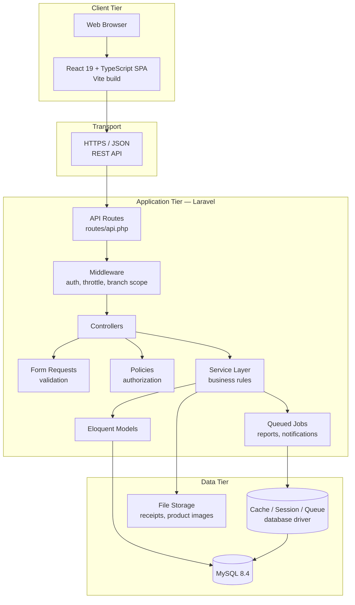

### Layer responsibilities

| Layer | Responsibility |
| :--- | :--- |
| **React SPA** | Rendering, local UI state, input capture. Holds **no** business rules. |
| **REST API** | Stateless JSON contract between client and server. |
| **Middleware** | Authentication, rate limiting, branch scoping, request logging. |
| **Form Requests** | Input validation at the boundary — before a controller runs. |
| **Policies** | Authorization: *may this user perform this action on this record?* |
| **Service Layer** | Business rules and multi-step transactions (e.g. order → stock → payment). |
| **Eloquent Models** | Persistence, relationships, and query scopes. |
| **Queued Jobs** | Long-running work moved off the request cycle. |
| **MySQL** | System of record. |

### Design principles

- **The client is never trusted.** Prices, totals, discounts, and stock levels are recalculated server-side; the client's values are treated as input, not truth.
- **Authorization is enforced server-side, per request.** Hiding a UI button is a usability measure, never a security measure.
- **Multi-step operations are transactional.** An order that fails to decrement stock must not leave a payment recorded.
- **Branch scope is applied at the query level**, so a missing `where` clause cannot leak another branch's data.

---

## Technology Stack

### Verified — currently installed

| Layer | Technology | Version | Status |
| :--- | :--- | :--- | :---: |
| Frontend framework | React | `^19.2` | ✅ |
| Frontend language | TypeScript | `~6.0` | ✅ |
| Frontend build tool | Vite | `^8.2` | ✅ |
| Frontend linter | oxlint | `^1.79` | ✅ |
| Backend framework | Laravel | `^13.17` | ✅ |
| Backend language | PHP | `^8.3` | ✅ |
| Database | MySQL | `8.4` | ✅ |
| Backend testing | PHPUnit | `^12.5` | ✅ |
| Backend code style | Laravel Pint | `^1.27` | ✅ |
| REPL / tooling | Laravel Tinker | `^3.0` | ✅ |

### Planned — not yet installed

| Layer | Technology | Status | Notes |
| :--- | :--- | :---: | :--- |
| Styling | Tailwind CSS | 📋 | Present in the *root* and *backend* `package.json`, **not** in `Frontend/` |
| API authentication | Laravel Sanctum | 📋 | Required before any protected endpoint can ship |
| Client routing | Router library | 💡 | Not yet selected |
| Server state / data fetching | Data-fetching library | 💡 | Not yet selected |
| Frontend testing | Test runner | 💡 | Not yet selected |
| Version control | Git + GitHub | 📋 | Repository not yet initialized |

> **Note on Tailwind CSS.** The stack specifies Tailwind, and `tailwindcss ^4` plus `@tailwindcss/vite` are declared at the repository root and in `backend/package.json` (Laravel's own Vite pipeline). They are **not** dependencies of the React application in `Frontend/`. Installing Tailwind into `Frontend/` is a required setup step — see [Frontend Setup](#frontend-setup).

---

## Project Structure

### Target repository layout

```text
RestaurantOS/
├── Frontend/               # React + TypeScript SPA
├── backend/                # Laravel REST API
├── docs/                   # Technical documentation  📋 not yet created
├── .gitignore              #                          📋 not yet created
└── README.md
```

> **Directory naming.** The frontend directory is `Frontend/` with a capital **F**. Windows and macOS filesystems are case-insensitive by default, but Linux — including most CI runners and production servers — is not. Always reference it as `Frontend/` in scripts, imports, and pipeline configuration.

### Frontend — `Frontend/`

Current contents are the default Vite scaffold. The structure below is the **proposed** organization as features are built.

```text
Frontend/
├── public/                 # ✅ Static assets served as-is
├── src/
│   ├── assets/             # ✅ Images and static imports
│   ├── components/         # 📋 Reusable presentational components
│   ├── features/           # 📋 Feature modules (pos, orders, kitchen, inventory…)
│   ├── layouts/            # 📋 Page shells and navigation frames
│   ├── pages/              # 📋 Route-level screens
│   ├── hooks/              # 📋 Shared React hooks
│   ├── services/           # 📋 API client and endpoint wrappers
│   ├── types/              # 📋 Shared TypeScript types and API contracts
│   ├── utils/              # 📋 Formatting, currency, date helpers
│   ├── App.tsx             # ✅ Root component
│   ├── main.tsx            # ✅ Application entry point
│   └── index.css           # ✅ Global styles
├── index.html              # ✅ HTML entry document
├── tsconfig.json           # ✅ TypeScript project references
└── vite.config.ts          # ✅ Vite configuration
```

| Directory | Purpose |
| :--- | :--- |
| `components/` | Generic, reusable UI with no feature-specific knowledge |
| `features/` | Self-contained modules; a feature owns its components, hooks, and types |
| `services/` | The **only** place HTTP calls are made — no `fetch` inside components |
| `types/` | Shared contracts, especially API request and response shapes |

### Backend — `backend/`

```text
backend/
├── app/
│   ├── Http/
│   │   ├── Controllers/    # ✅ Base Controller only; API controllers 📋
│   │   ├── Middleware/     # 📋 Branch scoping, request logging
│   │   ├── Requests/       # 📋 Form request validation classes
│   │   └── Resources/      # 📋 API response transformers
│   ├── Models/             # ✅ User only; domain models 📋
│   ├── Policies/           # 📋 Authorization policies
│   ├── Services/           # 📋 Business logic layer
│   └── Providers/          # ✅ Service providers
├── config/                 # ✅ Framework and package configuration
├── database/
│   ├── migrations/         # 🟡 Default migrations only, not yet run
│   ├── factories/          # 📋 Model factories for tests and seeding
│   └── seeders/            # 📋 Reference and demo data
├── routes/
│   ├── web.php             # ✅ Web routes
│   ├── console.php         # ✅ Artisan console commands
│   └── api.php             # 📋 Does not exist yet
├── tests/
│   ├── Feature/            # ✅ Harness present; example test only
│   └── Unit/               # ✅ Harness present; example test only
├── .env.example            # ✅ Environment template
├── composer.json           # ✅ PHP dependencies
└── artisan                 # ✅ Laravel CLI entry point
```

| Directory | Purpose |
| :--- | :--- |
| `Http/Controllers/` | Thin HTTP handlers — parse the request, delegate, return a response |
| `Http/Requests/` | Validation rules, kept out of controllers |
| `Http/Resources/` | Consistent JSON shaping so the API contract is explicit |
| `Policies/` | Per-model authorization, registered and enforced on every action |
| `Services/` | Multi-step business operations and database transactions |
| `database/migrations/` | Versioned schema — the single source of truth for structure |

---

## Requirements

### Verified minimum versions

| Requirement | Version | Notes |
| :--- | :--- | :--- |
| **PHP** | `>= 8.3` | Constrained by `composer.json`; `8.5` is in use during development |
| **Composer** | `>= 2.x` | PHP dependency manager |
| **Node.js** | `>= 20.19` | Required by Vite 8 |
| **npm** | `>= 10.x` | Ships with Node.js |
| **MySQL** | `>= 8.0` | `8.4` is in use during development |
| **Git** | `>= 2.x` | Version control |

### Required PHP extensions

Laravel's standard extension set is required. Verify with `php -m`:

```text
ctype  curl  dom  fileinfo  filter  hash  mbstring  openssl
pcre   pdo   pdo_mysql  session  tokenizer  xml
```

`openssl` and `pdo_mysql` are specifically required for TLS-secured MySQL connections.

### Recommended tooling

| Tool | Purpose |
| :--- | :--- |
| VS Code / PhpStorm | Editor with PHP and TypeScript support |
| MySQL Workbench / TablePlus | Database inspection |
| Postman / Insomnia / `curl` | API testing |

---

## Installation

### 1. Clone the repository

```bash
git clone <repository-url>
cd RestaurantOS
```

### 2. Verify prerequisites

```bash
php -v
composer -V
node -v
npm -v
```

### 3. Install the backend

```bash
cd backend
composer install
cp .env.example .env
php artisan key:generate
php artisan migrate
```

> `cp` is a POSIX command. On Windows PowerShell use `Copy-Item .env.example .env`; in Git Bash, `cp` works as written.

### 4. Install the frontend

```bash
cd ../Frontend
npm install
npm run dev
```

### 5. Verify the installation

| Check | Command | Expected result |
| :--- | :--- | :--- |
| Backend dependencies | `php artisan --version` | Laravel version string |
| Database connectivity | `php artisan db:show` | Connection and server details |
| Migration state | `php artisan migrate:status` | List of migrations with `Ran` status |
| Backend test harness | `php artisan test` | Example tests pass |
| Frontend dependencies | `npm run build` *(in `Frontend/`)* | Build completes without errors |

---

## Environment Configuration

Backend configuration lives in `backend/.env`, created by copying `backend/.env.example`.

> ### 🔒 Never commit secrets
>
> **`.env` must never be committed to version control.** It contains database credentials, the application key, and third-party secrets.
>
> - `.env` is already listed in `backend/.gitignore` — do not remove it.
> - Commit changes to **`.env.example` only**, with placeholder values and no real credentials.
> - If a credential is ever committed, treat it as compromised: **rotate it immediately**. Removing the commit does not undo the exposure.
> - Use your platform's secret manager for staging and production values — never a file in the repository.
> - Never paste real credentials into issues, pull requests, chat, or screenshots.

### Core variables

```env
APP_NAME=RestaurantOS
APP_ENV=local
APP_KEY=
APP_DEBUG=true
APP_URL=http://localhost:8000

DB_CONNECTION=mysql
DB_HOST=
DB_PORT=
DB_DATABASE=
DB_USERNAME=
DB_PASSWORD=

SANCTUM_STATEFUL_DOMAINS=
```

`APP_KEY` is left empty in the template and generated locally with `php artisan key:generate`.

### Variable reference

| Variable | Purpose | Local example | Production guidance |
| :--- | :--- | :--- | :--- |
| `APP_NAME` | Display name | `RestaurantOS` | Same |
| `APP_ENV` | Environment identifier | `local` | `production` |
| `APP_KEY` | Encryption key | *(generated)* | Unique per environment; never shared |
| `APP_DEBUG` | Verbose error output | `true` | **`false` — mandatory** |
| `APP_URL` | Canonical backend URL | `http://localhost:8000` | Public HTTPS URL |
| `DB_CONNECTION` | Database driver | `mysql` | `mysql` |
| `DB_HOST` | Database host | `127.0.0.1` | Managed host address |
| `DB_PORT` | Database port | `3306` | As provisioned |
| `DB_DATABASE` | Schema name | `restaurantos` | As provisioned |
| `DB_USERNAME` | Database user | *(local user)* | Least-privilege account |
| `DB_PASSWORD` | Database password | *(local password)* | From a secret manager |
| `SANCTUM_STATEFUL_DOMAINS` | Domains treated as first-party by Sanctum | `localhost:5173` | Frontend domain only |

> **`SANCTUM_STATEFUL_DOMAINS` is currently inert** because Sanctum is not installed. Include it in `.env.example` so the variable is in place when authentication lands — see [Authentication](#authentication).

### Driver defaults

The backend currently uses the **`database` driver** for sessions, cache, and queues:

```env
SESSION_DRIVER=database
CACHE_STORE=database
QUEUE_CONNECTION=database
```

> ⚠️ These drivers require the `sessions`, `cache`, and `jobs` tables to exist. **Migrations must be run before the application will serve a request**, or session and cache writes will fail. See [Database Setup](#database-setup).

### Connecting to a managed MySQL instance

Managed providers typically require TLS. If your provider mandates certificate verification, download its CA certificate and reference it:

```env
MYSQL_ATTR_SSL_CA=/absolute/path/to/ca.pem
```

Keep the certificate outside the repository and reference it by path.

### Frontend configuration

Vite exposes only variables prefixed with `VITE_`. Create `Frontend/.env.local` (git-ignored) when an API base URL is needed:

```env
VITE_API_BASE_URL=http://localhost:8000/api
```

> ⚠️ **Everything prefixed `VITE_` is embedded in the JavaScript bundle and is publicly readable.** Never place secrets, API keys, or credentials in frontend environment variables.

---

## Database Setup

### 1. Create the database

For a local MySQL server:

```sql
CREATE DATABASE restaurantos
  CHARACTER SET utf8mb4
  COLLATE utf8mb4_unicode_ci;
```

```sql
CREATE USER 'restaurantos'@'localhost' IDENTIFIED BY '<choose-a-strong-password>';
GRANT ALL PRIVILEGES ON restaurantos.* TO 'restaurantos'@'localhost';
FLUSH PRIVILEGES;
```

> `utf8mb4` is required — it supports the full Unicode range, including emoji and non-Latin scripts in customer names and product descriptions.

If you are using a managed MySQL instance, the database and user are provisioned by the provider; copy the supplied host, port, name, username, and password into `.env`.

### 2. Configure `.env`

Set `DB_HOST`, `DB_PORT`, `DB_DATABASE`, `DB_USERNAME`, and `DB_PASSWORD` as described in [Environment Configuration](#environment-configuration).

### 3. Verify the connection

```bash
php artisan db:show
```

A successful result reports the server version, database name, host, port, and table count. If it fails, see [Troubleshooting](#troubleshooting).

### 4. Run migrations

```bash
php artisan migrate
```

Confirm the outcome:

```bash
php artisan migrate:status
```

> **Current state:** the three default migrations (`users`, `cache`, `jobs`) exist but **have not been run** — the database is empty and `migrate:status` reports *"Migration table not found."* Running `php artisan migrate` is a required first step for any new environment.

### 5. Run seeders

```bash
php artisan db:seed
```

> 📋 **No seeders are implemented yet.** This command currently has no effect beyond the empty default `DatabaseSeeder`. Seeders for reference data (roles, branches, categories) and demo data are planned.

### 6. Reset development data

> ### 🚨 Destructive — local and development only
>
> `migrate:fresh` **drops every table** and rebuilds the schema. **All data is permanently lost.**
> Never run it against staging or production. Confirm your `.env` points at a local database before proceeding.

```bash
php artisan migrate:fresh
```

```bash
php artisan migrate:fresh --seed
```

For a non-destructive alternative that steps migrations backward and forward:

```bash
php artisan migrate:refresh
```

### Common database commands

| Command | Purpose |
| :--- | :--- |
| `php artisan db:show` | Display connection details and table count |
| `php artisan migrate` | Apply pending migrations |
| `php artisan migrate:status` | List migrations and their state |
| `php artisan migrate:rollback` | Revert the last migration batch |
| `php artisan migrate:fresh` | 🚨 Drop all tables and re-migrate |
| `php artisan db:seed` | Run seeders |
| `php artisan tinker` | Interactive REPL against the application |

---

## Backend Setup

```bash
cd backend
```

### 1. Install PHP dependencies

```bash
composer install
```

### 2. Create the environment file

```bash
cp .env.example .env
```

### 3. Generate the application key

```bash
php artisan key:generate
```

This writes `APP_KEY` into `.env`. Laravel cannot encrypt sessions or cookies without it.

### 4. Configure the database

Set the `DB_*` variables in `.env` — see [Database Setup](#database-setup).

### 5. Run migrations

```bash
php artisan migrate
```

### 6. Start the development server

```bash
php artisan serve
```

The API is served at `http://localhost:8000`, matching the `APP_URL` configured in `.env`.

### Backend commands

| Command | Purpose |
| :--- | :--- |
| `php artisan serve` | Start the development server on port 8000 |
| `php artisan test` | Run the PHPUnit suite |
| `./vendor/bin/pint` | Apply Laravel Pint code style |
| `./vendor/bin/pint --test` | Check style without modifying files |
| `php artisan route:list` | List registered routes |
| `php artisan tinker` | Interactive REPL |
| `php artisan optimize:clear` | Clear all caches (config, route, view) |

> `composer run dev` is defined in `composer.json` and delegates to `php artisan dev`. Use `php artisan serve` unless you specifically need that pipeline.

---

## Frontend Setup

```bash
cd Frontend
```

### 1. Install dependencies

```bash
npm install
```

### 2. Start the development server

```bash
npm run dev
```

Vite prints the local URL on startup. **No port is pinned in `vite.config.ts`**, so Vite uses its default (`5173`) and will fall back to the next free port if it is occupied. Read the actual URL from the terminal output rather than assuming it.

### 3. Install Tailwind CSS — required setup step

📋 **Tailwind CSS is not yet installed in `Frontend/`.** The declarations in the root and `backend/` `package.json` files do not apply to the React application. Install it following the [official Tailwind CSS + Vite guide](https://tailwindcss.com/docs/installation/using-vite), then register the plugin in `vite.config.ts` and import the stylesheet in `src/index.css`.

Confirm the version and configuration against current Tailwind documentation before committing — the v4 setup differs substantially from v3.

### Frontend commands

| Command | Purpose | Status |
| :--- | :--- | :---: |
| `npm run dev` | Start the Vite dev server with HMR | ✅ |
| `npm run build` | Type-check (`tsc -b`) and produce a production build | ✅ |
| `npm run preview` | Serve the production build locally | ✅ |
| `npm run lint` | Run oxlint | ✅ |
| `npm run test` | Run frontend tests | 📋 No test runner selected |

---

## Running the Application

Three processes make up a local environment. Run them in **separate terminals**.

### 1. MySQL

Ensure your MySQL server is running, or that network access to your managed instance is available.

```bash
cd backend
php artisan db:show
```

### 2. Laravel API

```bash
cd backend
php artisan serve
```

Serves on **port 8000**, matching `APP_URL=http://localhost:8000` in `.env`.

### 3. React frontend

```bash
cd Frontend
npm run dev
```

Serves on **Vite's default port (5173)**. This is not pinned in `vite.config.ts`; confirm the URL printed in your terminal.

### Port summary

| Service | Port | Source |
| :--- | :--- | :--- |
| Laravel API | `8000` | `APP_URL` in `.env`; `artisan serve` default |
| React frontend | `5173` | Vite default — **not configured in the project** |
| MySQL | `3306` | MySQL default; managed instances use a provider-assigned port |

> To pin the frontend port, add a `server.port` entry to `Frontend/vite.config.ts`. Until then, treat `5173` as a default rather than a guarantee.

### CORS and cross-origin requests

The frontend (`:5173`) and API (`:8000`) are different origins, so the browser applies CORS. Before the SPA can call the API, the backend must permit the frontend origin, and — once Sanctum is installed — `SANCTUM_STATEFUL_DOMAINS` must list the frontend host. 📋 Neither is configured yet.

---

## API

> ### 📋 The API does not exist yet
>
> **`backend/routes/api.php` has not been created**, and no controllers beyond Laravel's base stub are implemented. Every endpoint below is a **proposed contract** to align contributors during Phases 1–4 of the [Roadmap](#roadmap). None of them respond today, and paths, payloads, and status codes may change before implementation.

### Proposed base URL

```text
http://localhost:8000/api
```

### Proposed endpoints

| Method | Endpoint | Purpose | Auth | Status |
| :--- | :--- | :--- | :---: | :---: |
| `POST` | `/api/login` | Authenticate and issue a token | Public | 📋 |
| `POST` | `/api/logout` | Revoke the current token | Required | 📋 |
| `GET` | `/api/me` | Current user, roles, and branches | Required | 📋 |
| `GET` | `/api/branches` | List branches | Required | 📋 |
| `GET` | `/api/categories` | List product categories | Required | 📋 |
| `GET` | `/api/products` | List products for a branch | Required | 📋 |
| `GET` | `/api/customers` | Search and list customers | Required | 📋 |
| `POST` | `/api/orders` | Create an order | Required | 📋 |
| `GET` | `/api/orders` | List and filter orders | Required | 📋 |
| `POST` | `/api/payments` | Record a payment against an order | Required | 📋 |
| `GET` | `/api/inventory` | Branch stock levels | Required | 📋 |
| `GET` | `/api/reports` | Aggregated reporting data | Required | 📋 |

Standard REST verbs (`GET`, `POST`, `PUT`/`PATCH`, `DELETE`) are intended for each resource; only the primary operations are listed above.

### Proposed conventions

| Concern | Convention |
| :--- | :--- |
| Format | JSON request and response bodies |
| Auth header | `Authorization: Bearer <token>` |
| Accept header | `Accept: application/json` |
| Branch scope | Supplied per request and validated against the user's assignments |
| Pagination | `?page=` and `?per_page=`, with pagination metadata in the response |
| Filtering | Query parameters, e.g. `?branch_id=&status=&from=&to=` |
| Validation errors | `422` with a field-keyed `errors` object |
| Versioning | 💡 Under consideration — `/api/v1/` if adopted |

### Proposed status codes

| Code | Meaning |
| :--- | :--- |
| `200 OK` | Successful read or update |
| `201 Created` | Resource created |
| `204 No Content` | Successful delete |
| `401 Unauthorized` | Missing, invalid, or expired token |
| `403 Forbidden` | Authenticated but not permitted |
| `404 Not Found` | Resource does not exist or is out of the user's branch scope |
| `422 Unprocessable Entity` | Validation failure |
| `429 Too Many Requests` | Rate limit exceeded |
| `500 Internal Server Error` | Unhandled server fault |

### Full API reference

📋 Detailed request and response schemas will be maintained in **`docs/07-api-documentation.md`** *(not yet created — see [Documentation](#documentation))*.

Once routes exist, the live route table is available with:

```bash
php artisan route:list
```

---

## Authentication

> ### 📋 Not implemented — Laravel Sanctum is not installed
>
> `laravel/sanctum` does not appear in `backend/composer.json`. There are no authentication routes, no token issuance, and **no protected endpoints**. This section describes the intended design.
>
> Installing and configuring Sanctum is a **Phase 1 prerequisite** — no protected feature should be merged before it lands.

### Intended approach

RestaurantOS will use **Laravel Sanctum** for API authentication. Sanctum supports both SPA cookie-based sessions and API tokens; the approach chosen here should be confirmed and recorded in `docs/` before implementation begins.

### Proposed flow

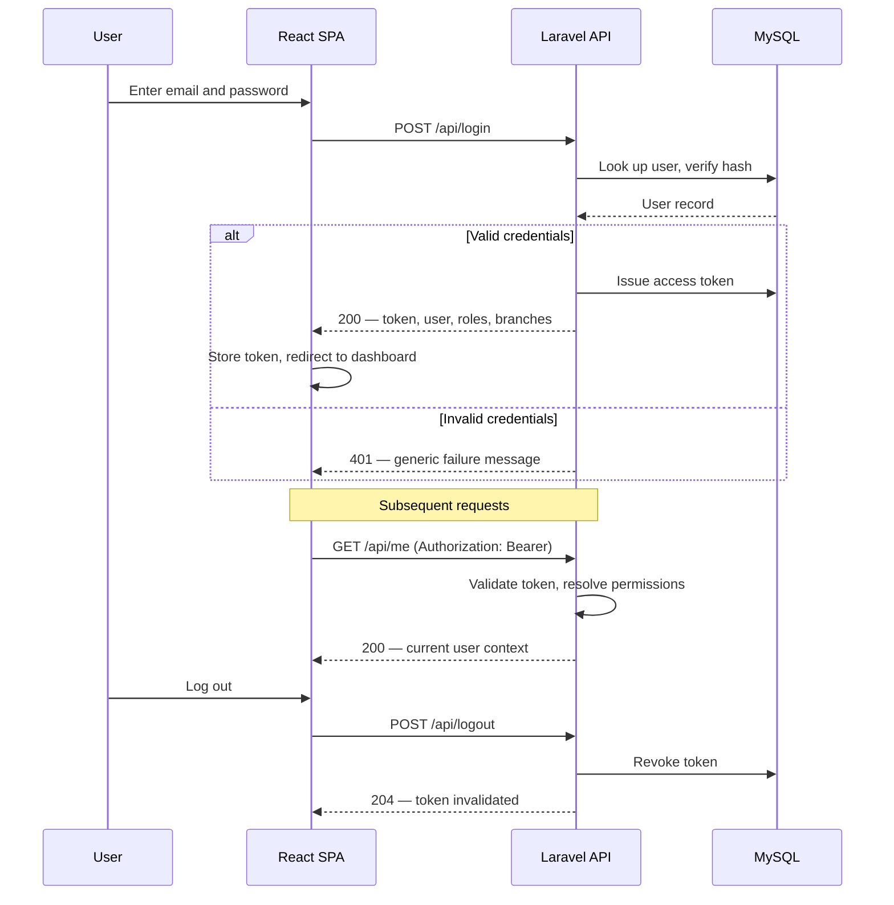

### Security requirements for the implementation

| Requirement | Rationale |
| :--- | :--- |
| Passwords hashed with bcrypt | Laravel default; never store or log plaintext |
| Generic failure messages | *"Invalid credentials"* — never reveal whether the email exists |
| Rate limiting on `/api/login` | Blocks credential stuffing and brute force |
| Token revocation on logout | A logged-out token must stop working immediately |
| Token expiry | Limits the window of a leaked token |
| Enforce HTTPS in production | Bearer tokens over plain HTTP are trivially intercepted |
| Audit log on login, logout, failure | Enables intrusion detection |
| Re-verify permissions server-side | The token proves identity, not authority |

### Token storage on the client

Where the SPA stores its token is a security decision with real trade-offs — `localStorage` is XSS-exposed, while `httpOnly` cookies require CSRF protection. 💡 This decision is **open**; record it in `docs/` with its rationale before writing the login screen.

---

## User Roles and Permissions

> 📋 **Not implemented.** No role or permission tables, models, or policies exist. This section defines the intended model so contributors build against a shared understanding.

### Roles

| Role | Scope | Description |
| :--- | :--- | :--- |
| **Super Admin** | Global | Full system access, including configuration, all branches, and user administration |
| **Admin** | Global | Business-wide management; no destructive system configuration |
| **Manager** | Branch | Full operational control of assigned branches |
| **Cashier** | Branch | POS operation, order creation, payment capture |
| **Kitchen** | Branch | Kitchen display and order status transitions |
| **Staff** | Branch | Limited read access for general duties |

### Permission matrix

Legend: **F** = Full · **W** = Create / Edit · **R** = Read only · **—** = No access

| Module | Super Admin | Admin | Manager | Cashier | Kitchen | Staff |
| :--- | :---: | :---: | :---: | :---: | :---: | :---: |
| System Configuration | F | — | — | — | — | — |
| User Management | F | F | W *(branch)* | — | — | — |
| Roles & Permissions | F | R | — | — | — | — |
| Branch Management | F | F | R *(own)* | — | — | — |
| Products & Categories | F | F | W *(branch)* | R | R | R |
| POS | F | F | F | F | — | — |
| Orders | F | F | F | W | R + status | R |
| Payments | F | F | F | W | — | — |
| Refunds & Voids | F | F | F | — | — | — |
| Kitchen Display | F | F | F | R | F | — |
| Inventory | F | F | F | R | R | R |
| Stock Transfers | F | F | W *(branch)* | — | — | — |
| Customers | F | F | F | W | — | R |
| Loyalty | F | F | F | W | — | — |
| Expenses | F | F | W *(branch)* | — | — | — |
| Reports | F *(all)* | F *(all)* | F *(branch)* | R *(own shift)* | — | — |
| Notifications | F | F | F | R | R | R |
| Audit Logs | F | R | R *(branch)* | — | — | — |

### Enforcement rules

1. **Roles are granted per branch.** A Manager at Branch A holds no authority at Branch B.
2. **Authorization is enforced server-side on every request** via Laravel Policies. Client-side role checks control presentation only.
3. **Branch scope is applied at the query level.** A user must never receive another branch's records, even by guessing an ID.
4. **Deny by default.** New endpoints are inaccessible until a policy explicitly grants access.
5. **Privileged actions are audited** — refunds, voids, price overrides, stock adjustments, and permission changes.

---

## Main Workflows

> 📋 The workflows below are the **intended operational design**. None are implemented yet. They exist so developers build consistently and QA can write test cases against an agreed model.

### POS Order

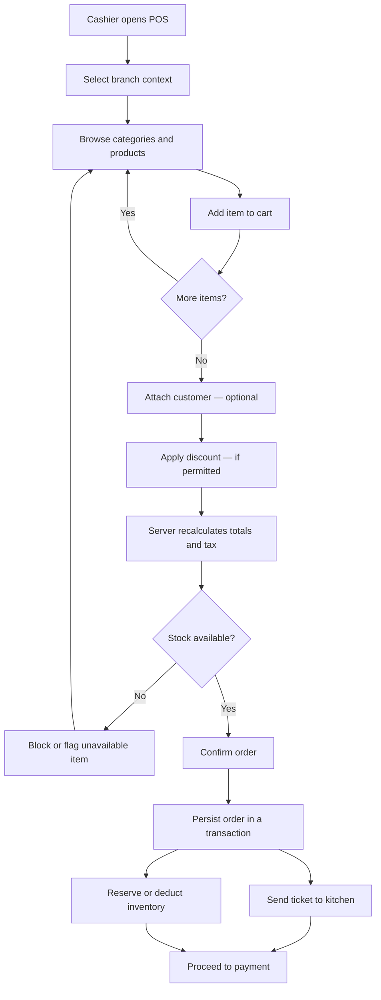

> **Server-side recalculation is mandatory.** Totals, tax, and discounts submitted by the client are inputs to be validated, never values to be trusted.

### Order Lifecycle

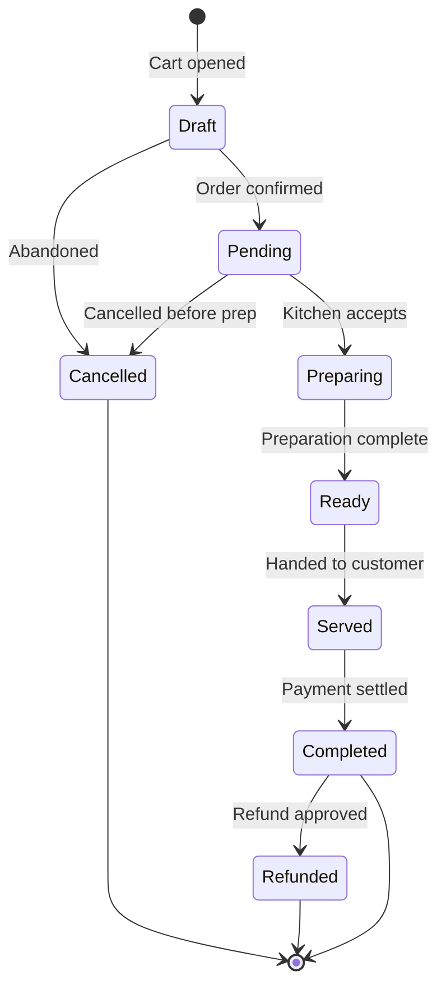

| Status | Meaning | Transition authority |
| :--- | :--- | :--- |
| `Draft` | Cart in progress, not committed | Cashier |
| `Pending` | Confirmed, awaiting kitchen | Cashier |
| `Preparing` | Kitchen has started | Kitchen |
| `Ready` | Ready for collection or service | Kitchen |
| `Served` | Delivered to the customer | Cashier / Staff |
| `Completed` | Fully paid and closed | Cashier |
| `Cancelled` | Terminated before completion | Manager |
| `Refunded` | Payment returned | Manager |

Invalid transitions must be rejected by the server — a `Completed` order cannot return to `Preparing`.

### Payment

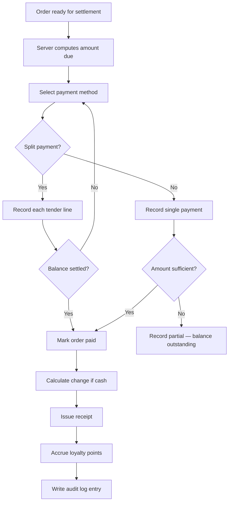

### Kitchen

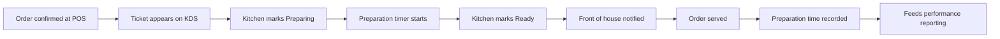

### Inventory

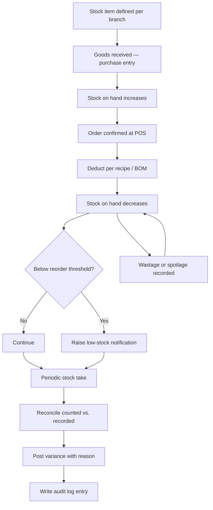

### Stock Transfer

```mermaid
sequenceDiagram
    participant MA as Manager — Branch A
    participant S as System
    participant MB as Manager — Branch B

    MA->>S: Request transfer (item, quantity, destination)
    S->>S: Validate stock available at Branch A
    alt Insufficient stock
        S-->>MA: Reject — insufficient stock
    else Sufficient stock
        S->>S: Mark quantity in transit; deduct from Branch A
        S-->>MB: Notify incoming transfer
        MB->>S: Confirm receipt (quantity received)
        S->>S: Add to Branch B stock
        alt Discrepancy
            S->>S: Flag variance for review
        end
        S->>S: Write audit log entry
        S-->>MA: Transfer complete
    end
```

Stock must never exist in two branches at once, nor vanish in transit — the *in transit* state is what makes the transfer auditable at both ends.

### Customer Loyalty

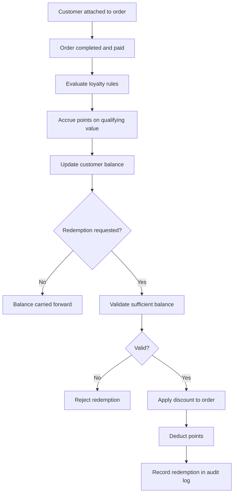

### Reporting

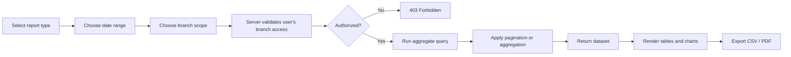

Branch scope on reports is a security boundary, not a filter: a Manager requesting another branch's data must receive `403`, never that branch's numbers.

---

## Testing

### Backend testing — ✅ harness available

The backend uses **PHPUnit `^12.5`**, configured in `backend/phpunit.xml`. Only Laravel's example tests exist today.

```bash
cd backend
php artisan test
```

```bash
php artisan test tests/Feature/ExampleTest.php
```

```bash
php artisan test --filter=testMethodName
```

```bash
composer test
```

> `composer test` clears configuration caches before running the suite — prefer it in CI to avoid stale-config failures.

### Test database configuration

Tests must **never** run against a development or production database — `migrate:fresh` in a test bootstrap will destroy real data.

📋 A dedicated test connection is not yet configured. Before writing feature tests, add a separate test database (or an in-memory SQLite connection) in `phpunit.xml`, and document the choice in `docs/`.

### Frontend testing — 📋 no framework selected

**No test runner is installed in `Frontend/`.** `package.json` defines `dev`, `build`, `lint`, and `preview` only.

Selecting a frontend test stack is a Phase 5 task. Until that decision is recorded, **do not add test commands to this README** — an unrunnable command in documentation is worse than an acknowledged gap.

Available quality checks today:

```bash
cd Frontend
npm run lint
npm run build
```

`npm run build` runs `tsc -b` first, so it fails on type errors — a useful correctness gate even without a test runner.

### API testing — 📋 planned

API endpoints will be covered by Laravel **feature tests**, which exercise the full HTTP stack including middleware, validation, and policies.

Until endpoints exist, use `curl`, Postman, or Insomnia against the running server for exploratory checks.

### Integration testing — 📋 planned

Integration tests should cover the multi-step workflows in [Main Workflows](#main-workflows), especially where a single operation spans several tables:

| Scenario | Why it matters |
| :--- | :--- |
| POS order → kitchen ticket → inventory deduction | Verifies transactional integrity across three modules |
| Payment → order completion → loyalty accrual | Verifies the settlement chain |
| Stock transfer between branches | Verifies stock is conserved and never duplicated |
| Branch-scope enforcement | Verifies a user cannot read another branch's data |
| Role permission boundaries | Verifies every role is confined to its matrix row |

### Testing standards

| Standard | Expectation |
| :--- | :--- |
| Coverage of business rules | Every pricing, stock, and permission rule has a test |
| Test isolation | Tests do not depend on execution order or leftover data |
| Deterministic data | Use factories and seeders, not hand-written fixtures |
| Failure paths | Test rejection cases, not only the happy path |
| Authorization tests | Every protected endpoint has an unauthorized-access test |

---

## QA

This checklist is the acceptance baseline for a release candidate. 📋 It cannot be executed yet — the features it covers are not built. It is published now so QA can prepare test cases alongside development.

### Authentication

- [ ] Valid credentials authenticate successfully
- [ ] Invalid credentials are rejected with a generic message
- [ ] The error message does not reveal whether an email is registered
- [ ] Repeated failed attempts trigger rate limiting
- [ ] Logout revokes the token; the token is rejected on reuse
- [ ] Expired tokens are rejected with `401`
- [ ] Deactivated user accounts cannot authenticate
- [ ] Passwords are stored hashed, never in plaintext or logs

### Authorization

- [ ] Each role can access exactly its permitted modules
- [ ] Direct API calls to unauthorized endpoints return `403`
- [ ] Modifying an ID in a request does not expose another branch's record
- [ ] A Manager cannot access another branch's data
- [ ] Cashiers cannot issue refunds or voids
- [ ] Hidden UI actions are also blocked server-side
- [ ] Permission changes take effect without requiring a redeploy

### POS

- [ ] Products load correctly for the selected branch
- [ ] Cart totals match server-calculated totals exactly
- [ ] Discounts apply correctly and respect permission limits
- [ ] Tax and service charges calculate correctly
- [ ] Out-of-stock items are blocked or clearly flagged
- [ ] Held orders can be resumed without data loss
- [ ] Rapid repeated submission does not create duplicate orders

### Orders

- [ ] Orders persist with correct branch, user, and timestamp
- [ ] Only valid status transitions are accepted
- [ ] Invalid transitions are rejected with a clear error
- [ ] Cancellation requires a reason and appropriate permission
- [ ] Order history is filterable and correctly paginated
- [ ] Concurrent edits to one order do not corrupt state

### Payments

- [ ] Payment amount matches the order total
- [ ] Split payments sum exactly to the amount due
- [ ] Partial payments leave a correct outstanding balance
- [ ] Overpayment calculates correct change
- [ ] Refunds restore stock where applicable
- [ ] Payments cannot be recorded against cancelled orders
- [ ] Every payment writes an audit log entry

### Kitchen

- [ ] New orders appear on the kitchen display promptly
- [ ] Status changes propagate to front of house
- [ ] Preparation timings are recorded accurately
- [ ] Completed tickets clear from the active view
- [ ] Only kitchen-permitted transitions are available

### Inventory

- [ ] Stock decrements correctly on order confirmation
- [ ] Stock restores correctly on cancellation or refund
- [ ] Low-stock alerts fire at the configured threshold
- [ ] Transfers deduct from source and add to destination exactly once
- [ ] Stock never goes negative without explicit authorization
- [ ] Wastage entries require a reason
- [ ] Stock-take variances are recorded, not silently overwritten

### Reports

- [ ] Report totals reconcile against underlying order records
- [ ] Date-range filters include correct boundary days
- [ ] Branch filters respect the user's access scope
- [ ] Cross-branch aggregates match the sum of individual branches
- [ ] Exports contain the same data as the on-screen report
- [ ] Large date ranges complete within acceptable time

### Validation

- [ ] Required fields are enforced server-side, not only in the UI
- [ ] Numeric fields reject negative and non-numeric input
- [ ] Quantities reject zero and negative values
- [ ] Email and phone formats are validated
- [ ] Maximum field lengths are enforced
- [ ] Validation errors return `422` with field-level messages
- [ ] Submitting with JavaScript disabled does not bypass validation

### Error Handling

- [ ] Users see clear, actionable error messages
- [ ] Stack traces are never exposed in production
- [ ] Network failures are handled without data loss
- [ ] Failed transactions roll back completely
- [ ] `404` and `500` pages are styled and informative
- [ ] Errors are logged with enough context to diagnose

### Performance

- [ ] POS product grid loads within acceptable time
- [ ] Order submission responds promptly under normal load
- [ ] List endpoints are paginated, never unbounded
- [ ] No N+1 query patterns in list or report endpoints
- [ ] Reports over large date ranges remain responsive
- [ ] The system remains stable with multiple concurrent cashiers

### Security

- [ ] All production traffic is served over HTTPS
- [ ] `APP_DEBUG=false` in production
- [ ] No credentials or keys are present in the repository
- [ ] SQL injection attempts fail against all inputs
- [ ] XSS payloads in text fields are neutralized on render
- [ ] CSRF protection is active where applicable
- [ ] Mass assignment cannot set protected attributes
- [ ] File uploads validate type and size
- [ ] Rate limiting protects authentication endpoints
- [ ] Audit logs capture all privileged actions
- [ ] Session and token expiry behave as configured

---

## Security

Security requirements apply to **every** contribution. A pull request that violates them should not be merged regardless of feature value.

### Secrets management

- **Never commit secrets.** No passwords, API keys, tokens, certificates, or connection strings in the repository.
- Keep `.env` git-ignored; commit only `.env.example` with placeholders.
- A committed credential is a compromised credential — **rotate it immediately**. Rewriting history does not undo exposure.
- Use a platform secret manager for staging and production.
- Never place secrets in `VITE_`-prefixed variables; they ship in the public bundle.

### Input validation

- Validate **every** input server-side using Form Requests — client-side validation is a convenience, not a control.
- Enforce type, range, length, and format on all fields.
- Validate uploads by type and size; store them outside the web root.
- Never build queries by string concatenation with user input.

### Authorization

- **Deny by default.** New endpoints are inaccessible until a policy grants access.
- Authorize every protected action server-side, on every request.
- Apply branch scope at the query level so an ID cannot be guessed into another branch's data.
- Never rely on a hidden UI element as an access control.

### Sensitive endpoints

- Protect all non-public endpoints with authentication middleware.
- Apply rate limiting to authentication, password reset, and report-generation endpoints.
- Return `404` rather than `403` where existence itself is sensitive.
- Log access to financial and administrative endpoints.

### Passwords and credentials

- Use Laravel's bcrypt hashing — never store, log, or transmit plaintext passwords.
- Enforce password complexity requirements.
- Never include credentials in URLs or query strings.
- Redact sensitive fields from log output.

### Transport security

- **HTTPS is mandatory in production.** Bearer tokens over HTTP are trivially intercepted.
- Redirect HTTP to HTTPS at the web server.
- Set `Secure`, `HttpOnly`, and `SameSite` on cookies.
- Enable HSTS once HTTPS is confirmed stable.

### Rate limiting

| Endpoint class | Guidance |
| :--- | :--- |
| Login / password reset | Strict limits per IP and per account |
| Write endpoints | Moderate limits to prevent abuse |
| Report generation | Limited — these are expensive queries |
| General reads | Generous but bounded |

### Audit logging

Log at minimum: authentication successes and failures, permission changes, refunds and voids, price overrides, stock adjustments, and configuration changes. Each entry should record the actor, timestamp, branch, IP address, and the affected record.

Audit logs must be append-only — no application path should permit editing or deleting them.

### SQL injection

- Use Eloquent and the query builder, which parameterize by default.
- If raw SQL is unavoidable, use bound parameters — never interpolate variables.
- Never pass user input directly into `orderBy`, `whereRaw`, or column-name positions.

### Mass assignment

- Define `$fillable` explicitly on every model — prefer it to `$guarded`.
- Never expose `id`, `role`, `branch_id`, `price`, or status fields to mass assignment from client input.
- Set privileged attributes explicitly in server-side code after authorization.

### Additional practices

- Escape all user-generated content on render to prevent XSS.
- Keep CSRF protection enabled for cookie-authenticated routes.
- Set `APP_DEBUG=false` in production — debug mode leaks configuration and stack traces.
- Keep dependencies patched; review `composer audit` and `npm audit` regularly.
- Grant the database user least privilege — production accounts do not need `DROP`.

### Reporting a vulnerability

📋 A security contact and disclosure process should be established before public release. **Do not report vulnerabilities in public issues.**

---

## Performance

📋 No performance work has been undertaken. These are the intended practices as features are built — most are far cheaper to apply during implementation than to retrofit.

### Database indexes

- Index every foreign key, especially `branch_id`.
- Add composite indexes for common filters — `(branch_id, created_at)` for order lists and reports.
- Index columns used in `WHERE`, `JOIN`, and `ORDER BY` clauses.
- Verify with `EXPLAIN` rather than assuming; avoid speculative indexes, which slow writes.

### Pagination

- **Never return an unbounded collection.** Every list endpoint paginates.
- Set a sensible default page size and enforce a maximum.
- Prefer cursor pagination for very large, frequently appended tables.

### Query optimization

- Eager-load relationships (`with()`) to eliminate N+1 queries — the single most common Laravel performance defect.
- Select only required columns on wide tables.
- Push aggregation into SQL rather than looping in PHP.
- Use `chunk()` or `lazy()` for large batch operations.

### Caching

- Cache slow-changing reference data: categories, branch configuration, permission maps.
- Cache expensive report aggregates with an appropriate TTL.
- Invalidate on write — a stale stock level is worse than a slow one.
- In production, run `config:cache`, `route:cache`, and `view:cache`.

### API response optimization

- Use API Resources to return only the fields the client needs.
- Avoid deeply nested relationship payloads by default; expose them via an `include` parameter.
- Enable gzip or Brotli compression at the web server.
- Return `204` rather than an echoed body where nothing is needed.

### Lazy loading (frontend)

- Code-split by route so the POS bundle does not carry reporting code.
- Lazy-load heavy components such as charts and export dialogs.
- Virtualize long lists — order history, product grids.
- Debounce search inputs to reduce request volume.

### Image optimization

- Compress product images on upload and store a bounded maximum dimension.
- Generate thumbnails for grid views rather than scaling full-size images in the browser.
- Serve modern formats (WebP/AVIF) with fallbacks.
- Lazy-load off-screen images.

### Load testing

📋 No load-testing tooling is configured. Before production release, establish baselines for:

| Scenario | Rationale |
| :--- | :--- |
| Concurrent POS transactions at peak service | The primary real-world load pattern |
| Kitchen display under high ticket volume | Sustained polling or streaming load |
| Report generation over large date ranges | The heaviest query class |
| Multiple branches operating simultaneously | Validates that branch scoping scales |

---

## Deployment

> 📋 **No deployment configuration exists.** No cloud provider, container definition, or CI/CD pipeline has been selected. This section describes production architecture **conceptually**; specific platform steps must be documented once a provider is chosen.

### Conceptual production architecture

```text
Client
 ↓
HTTPS
 ↓
Web Server
 ↓
React Application

API Requests
 ↓
Laravel
 ↓
MySQL
```

### Production topology

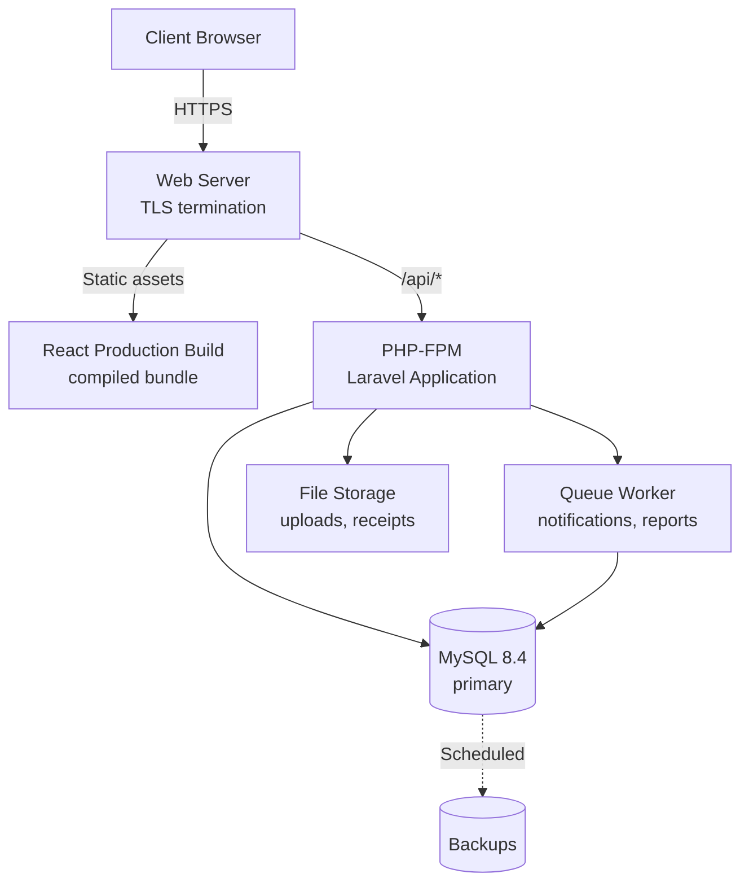

### Build steps

**Frontend** — produces static assets for the web server:

```bash
cd Frontend
npm ci
npm run build
```

**Backend** — install without development dependencies and cache configuration:

```bash
cd backend
composer install --no-dev --optimize-autoloader
php artisan migrate --force
php artisan config:cache
php artisan route:cache
php artisan view:cache
```

> `--force` is required because `migrate` prompts for confirmation in production. Take a database backup before every migration.

### Pre-deployment checklist

- [ ] `APP_ENV=production` and `APP_DEBUG=false`
- [ ] `APP_KEY` set (unique per environment, never reused from development)
- [ ] All secrets sourced from a secret manager, not files in the repository
- [ ] HTTPS enforced; HTTP redirects to HTTPS
- [ ] Database user holds least privilege
- [ ] Automated backups configured **and a restore verified**
- [ ] Migrations tested against a production-like dataset
- [ ] Queue worker running under a process supervisor
- [ ] Scheduler configured if scheduled tasks are used
- [ ] Log rotation and error monitoring in place
- [ ] Web root points at `backend/public` — never at `backend/`
- [ ] Rollback procedure documented and tested

> ⚠️ **Web root misconfiguration is the single most damaging deployment error.** If the server root is set to `backend/` rather than `backend/public`, `.env` becomes downloadable over the public internet, exposing every credential.

### Environment separation

| Environment | Purpose | `APP_DEBUG` | Data |
| :--- | :--- | :---: | :--- |
| Local | Development | `true` | Seeded / synthetic |
| Staging | Pre-release verification | `false` | Anonymized copy |
| Production | Live operations | `false` | Real business data |

Each environment requires its own database, its own `APP_KEY`, and its own credentials. Never point a staging deployment at the production database.

---

## Documentation

> 📋 **The `docs/` directory does not exist yet.** The links below describe the **planned** documentation set. Create `docs/` and add these files as the corresponding functionality is implemented.

| Document | Purpose | Status |
| :--- | :--- | :---: |
| [`docs/INDEX.md`](docs/INDEX.md) | Documentation index and reading order | 📋 |
| [`docs/01-project-overview.md`](docs/01-project-overview.md) | Scope, goals, and business context | 📋 |
| [`docs/02-system-architecture.md`](docs/02-system-architecture.md) | Architecture decisions and component design | 📋 |
| [`docs/03-database-schema.md`](docs/03-database-schema.md) | Entity-relationship model and table reference | 📋 |
| [`docs/04-backend-guide.md`](docs/04-backend-guide.md) | Laravel conventions, service layer, patterns | 📋 |
| [`docs/05-frontend-guide.md`](docs/05-frontend-guide.md) | React structure, state management, styling | 📋 |
| [`docs/06-authentication.md`](docs/06-authentication.md) | Sanctum setup, token handling, session policy | 📋 |
| [`docs/07-api-documentation.md`](docs/07-api-documentation.md) | Full endpoint reference with request/response schemas | 📋 |
| [`docs/08-roles-permissions.md`](docs/08-roles-permissions.md) | Role definitions and policy implementation | 📋 |
| [`docs/09-workflows.md`](docs/09-workflows.md) | Detailed operational workflows | 📋 |
| [`docs/10-testing-guide.md`](docs/10-testing-guide.md) | Test strategy, fixtures, coverage expectations | 📋 |
| [`docs/11-qa-checklist.md`](docs/11-qa-checklist.md) | Expanded QA test cases | 📋 |
| [`docs/12-security.md`](docs/12-security.md) | Security model and threat considerations | 📋 |
| [`docs/13-deployment.md`](docs/13-deployment.md) | Environment-specific deployment procedures | 📋 |
| [`docs/14-troubleshooting.md`](docs/14-troubleshooting.md) | Extended diagnostics | 📋 |

### Documentation principles

- **This README is the entry point, not the manual.** Detailed material belongs in `docs/`.
- **Document decisions, not just mechanics** — record *why* an approach was chosen.
- **Update documentation in the same pull request as the code.** Documentation written later is usually documentation never written.
- **Never document a command that does not work.** An acknowledged gap is more useful than a broken instruction.

---

## Development Workflow

### Standard cycle

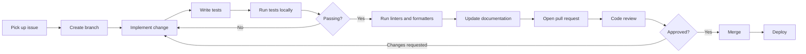

### Local quality gates

Run before opening a pull request:

```bash
cd backend
./vendor/bin/pint
php artisan test
```

```bash
cd Frontend
npm run lint
npm run build
```

### Coding standards

**Backend**

- Follow PSR-12; enforce with Laravel Pint.
- Keep controllers thin — validation in Form Requests, business rules in Services.
- Use Eloquent relationships and scopes over raw queries.
- Wrap multi-step writes in database transactions.
- Define `$fillable` explicitly on every model.

**Frontend**

- Strict TypeScript — avoid `any`; type API responses explicitly.
- Keep components focused; extract shared logic into hooks.
- Confine HTTP calls to `src/services/`.
- Handle loading, empty, and error states for every data-driven view.

### Definition of Done

A change is complete when:

- [ ] The feature works as specified
- [ ] Tests cover the new behaviour, including failure paths
- [ ] All tests pass locally
- [ ] Linters and formatters report clean
- [ ] Authorization is enforced server-side
- [ ] Inputs are validated server-side
- [ ] No secrets are introduced
- [ ] Documentation is updated
- [ ] The status markers in this README are updated if capability changed

> **Keep the status markers honest.** When a 📋 feature ships, promote it to ✅ in the same pull request. A status table that drifts out of date is worse than no status table.

---

## Git Workflow

> 📋 **This project is not yet a Git repository.** Initialize it before any collaborative work begins.

### Initial setup

```bash
cd RestaurantOS
git init
```

> ⚠️ **Create a root `.gitignore` before the first commit.** The repository currently contains `node_modules/` directories and a `backend/.env` file holding live database credentials. Committing them once puts them in history permanently.

At minimum, the root `.gitignore` must exclude:

```gitignore
node_modules/
.env
.env.*
!.env.example
/backend/vendor/
/backend/storage/*.key
/Frontend/dist/
.DS_Store
```

`backend/.gitignore` already covers the backend; the root file protects the repository as a whole.

### Branch strategy

| Branch | Purpose |
| :--- | :--- |
| `main` | Stable, deployable code |
| `develop` | Integration branch for completed features |
| `feature/*` | New functionality |
| `fix/*` | Bug fixes |
| `hotfix/*` | Urgent production fixes |
| `docs/*` | Documentation-only changes |

### Branch naming

```text
feature/pos-order-creation
feature/inventory-stock-transfer
fix/order-total-rounding
hotfix/payment-duplicate-submission
docs/api-endpoint-reference
```

### Commit messages

Follow [Conventional Commits](https://www.conventionalcommits.org/):

```text
<type>(<scope>): <short description>
```

| Type | Use for |
| :--- | :--- |
| `feat` | A new feature |
| `fix` | A bug fix |
| `docs` | Documentation only |
| `refactor` | Code restructuring without behaviour change |
| `test` | Adding or correcting tests |
| `perf` | Performance improvement |
| `chore` | Tooling, dependencies, configuration |

```text
feat(pos): add cart line-item discount support
fix(orders): correct rounding on split payment totals
docs(api): document order status transition rules
test(inventory): cover stock transfer variance handling
```

### Pull requests

Every pull request should state:

- **What** changed and **why**
- Which issue it closes
- How it was tested
- Any migration or configuration steps required
- Screenshots for user-facing changes

**Rules**

1. Never commit directly to `main`.
2. Keep pull requests focused — one concern per PR.
3. All checks must pass before review.
4. At least one approving review before merge.
5. Rebase or merge the target branch before merging to avoid surprise conflicts.

---

## Troubleshooting

### Database connection fails

| Symptom | Likely cause | Resolution |
| :--- | :--- | :--- |
| `SQLSTATE[HY000] [2002] Connection refused` | MySQL not running, or wrong host/port | Start MySQL; verify `DB_HOST` and `DB_PORT` |
| `SQLSTATE[HY000] [1045] Access denied` | Wrong username or password | Verify `DB_USERNAME` and `DB_PASSWORD` |
| `SQLSTATE[HY000] [1049] Unknown database` | Database not created | Create it — see [Database Setup](#database-setup) |
| `could not find driver` | `pdo_mysql` not enabled | Enable the extension; verify with `php -m` |
| SSL / TLS handshake errors | Provider requires certificate verification | Set `MYSQL_ATTR_SSL_CA` to the CA certificate path |
| Timeout to a managed host | Network or IP allowlist | Check firewall rules and the provider's allowlist |

Diagnose with:

```bash
php artisan db:show
```

### "Migration table not found"

Migrations have never been run against this database.

```bash
php artisan migrate
```

### Session or cache errors on first request

`SESSION_DRIVER` and `CACHE_STORE` are set to `database`, which requires the `sessions` and `cache` tables.

```bash
php artisan migrate
```

### `APP_KEY` errors

```bash
php artisan key:generate
```

### Configuration changes have no effect

Laravel may be serving a cached configuration.

```bash
php artisan optimize:clear
```

### CORS errors in the browser

The frontend and API are on different origins. Confirm the backend allows the frontend's origin, and — once Sanctum is installed — that `SANCTUM_STATEFUL_DOMAINS` lists the frontend host. 📋 Neither is configured yet.

### Frontend port is not 5173

Vite's port is not pinned in `vite.config.ts`, so it falls back to the next free port when 5173 is occupied. Read the URL from the terminal output, or add `server.port` to the config to fix it.

### Tailwind classes have no effect

Tailwind is **not installed in `Frontend/`** — see [Frontend Setup](#frontend-setup).

### `npm install` fails

```bash
node -v
```

Vite 8 requires Node.js `>= 20.19`. If the version is correct, clear and reinstall:

```bash
rm -rf node_modules package-lock.json
npm install
```

### Composer install fails

```bash
php -v
```

The project requires PHP `>= 8.3`. Also confirm all required extensions are enabled with `php -m`.

### Permission errors on `storage/` or `bootstrap/cache/`

Laravel requires write access to both directories. On Linux, ensure the web server user owns them; on Windows, confirm the directories are not read-only.

---

## Roadmap

Phases are ordered by dependency — each builds on the previous. **The project is currently at the start of Phase 1.**

### Phase 1 — Foundation 🟡 *in progress*

| Deliverable | Status |
| :--- | :---: |
| Laravel + React project setup | ✅ |
| Database connection | ✅ |
| Run initial migrations | 🟡 |
| Install and configure Laravel Sanctum | 📋 |
| Install Tailwind CSS in `Frontend/` | 📋 |
| Initialize Git repository and root `.gitignore` | 📋 |
| Create `docs/` structure | 📋 |
| Authentication (login, logout, session) | 📋 |
| Roles and permissions model | 📋 |
| Branch management | 📋 |
| Product and category management | 📋 |
| Customer management | 📋 |

### Phase 2 — Sales Operations 📋

| Deliverable | Status |
| :--- | :---: |
| POS interface | 📋 |
| Cart, discounts, and tax calculation | 📋 |
| Order creation and lifecycle | 📋 |
| Payment capture and split payments | 📋 |
| Receipt generation | 📋 |

### Phase 3 — Operations 📋

| Deliverable | Status |
| :--- | :---: |
| Kitchen Display System | 📋 |
| Order status transitions | 📋 |
| Inventory stock tracking | 📋 |
| Automatic stock deduction | 📋 |
| Inter-branch stock transfers | 📋 |
| Low-stock alerts | 📋 |

### Phase 4 — Business Intelligence 📋

| Deliverable | Status |
| :--- | :---: |
| Sales and financial reports | 📋 |
| Inventory reports | 📋 |
| Expense management | 📋 |
| Customer loyalty programme | 📋 |
| Notification system | 📋 |
| Audit logging | 📋 |
| CSV / PDF export | 📋 |

### Phase 5 — Production Readiness 📋

| Deliverable | Status |
| :--- | :---: |
| Comprehensive backend test suite | 📋 |
| Frontend test framework selection and coverage | 📋 |
| Security audit against the [Security](#security) checklist | 📋 |
| Performance profiling and query optimization | 📋 |
| Load testing | 📋 |
| CI/CD pipeline | 📋 |
| Deployment configuration | 📋 |
| Complete `docs/` set | 📋 |

### Under consideration 💡

Offline-capable POS · Multi-currency support · Table and reservation management · Supplier and purchase-order management · Delivery integration · Native mobile applications · Advanced analytics dashboards · Multi-language support

---

## Contributing

Contributions are welcome. Please read this section before opening a pull request.

### Contribution workflow

```text
Create branch
→ Develop feature
→ Write tests
→ Run tests
→ Code review
→ Pull request
→ Merge
```

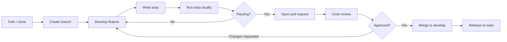

### Step by step

**1. Create a branch**

```bash
git checkout develop
git pull origin develop
git checkout -b feature/your-feature-name
```

**2. Develop the feature**

Follow the conventions in [Development Workflow](#development-workflow). Keep the change focused on one concern.

**3. Write tests**

Cover the new behaviour, including failure and authorization paths. A feature without tests is not complete.

**4. Run tests and quality checks**

```bash
cd backend
./vendor/bin/pint
php artisan test
```

```bash
cd Frontend
npm run lint
npm run build
```

**5. Commit**

```bash
git add .
git commit -m "feat(scope): describe the change"
```

**6. Open a pull request**

```bash
git push origin feature/your-feature-name
```

Target `develop` and complete the pull request description as set out in [Git Workflow](#git-workflow).

**7. Code review**

Address feedback with additional commits — avoid force-pushing during an active review, which makes incremental review difficult.

**8. Merge**

A maintainer merges once approved and all checks pass.

### Contribution standards

| Requirement | Expectation |
| :--- | :--- |
| Scope | One concern per pull request |
| Tests | New behaviour is covered, including failure paths |
| Security | Server-side validation and authorization enforced |
| Secrets | None introduced — verify before committing |
| Documentation | Updated in the same pull request |
| Status accuracy | README status markers updated when capability changes |
| Style | Pint (backend) and oxlint (frontend) report clean |

### Reporting issues

When opening an issue, include: what you expected, what happened, exact reproduction steps, your environment (OS, PHP, Node, MySQL versions), and any relevant error output.

**Never include credentials, tokens, or production data in an issue.**

---

## License

This project is released under the **MIT License**.

📋 A `LICENSE` file has not yet been added to the repository. Add one containing the MIT License text with the appropriate copyright holder and year before publishing.

---

<div align="center">

**RestaurantOS** — Multi-branch restaurant management

Built with Laravel and React

*This project is in early development. See [Implementation Status](#implementation-status) for what currently works.*

</div>
