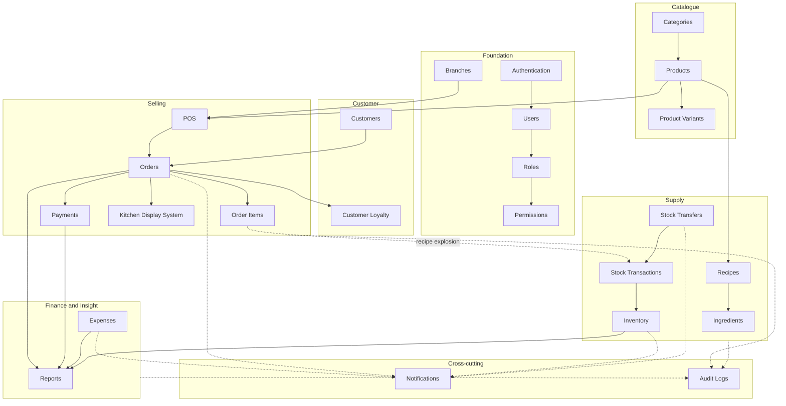

# 01 — Project Overview

> **Document purpose.** Establish what RestaurantOS is, who it serves, what problem it solves, what is
> actually built today versus what is only designed, and the vocabulary every other document depends on.
> Read this document first. Every other document assumes the terminology defined here.

---

## 1. Executive summary

**RestaurantOS** is a multi-branch restaurant management system. It combines a point-of-sale (POS)
terminal, a kitchen display system (KDS), recipe-driven inventory control, customer loyalty, expense
tracking and operational reporting into a single web application backed by one REST API.

The system's defining characteristic is that **selling a menu item consumes raw ingredients**. When a
cashier sells two cappuccinos, the system does not merely decrement a "cappuccino" counter — it explodes
the product's recipe and deducts `0.40 L` of milk and `0.04 kg` of coffee from the selling branch's
inventory, writing an immutable ledger entry for each movement. This single design decision is what makes
food-cost reporting, stock alerts and profit calculation possible, and it is the thread that connects
[10-pos-workflow.md](10-pos-workflow.md), [11-order-workflow.md](11-order-workflow.md),
[14-inventory-workflow.md](14-inventory-workflow.md) and [18-reporting.md](18-reporting.md).

---

## 2. Implementation status — read this before trusting anything

This documentation set was authored **before** the application was implemented. It is a **design
specification**, not a description of running software. The repository was inspected on **2026-09-05**
and contained the following:

| Path | Actual contents on 2026-09-05 |
|---|---|
| `backend/` | Unmodified Laravel 13 skeleton. `laravel/framework ^13.17`, PHP `^8.3`, `laravel/tinker ^3.0`. |
| `backend/database/migrations/` | Only the three framework defaults: `create_users_table`, `create_cache_table`, `create_jobs_table`. |
| `backend/app/Models/` | `User.php` only. |
| `backend/app/Http/Controllers/` | Base `Controller.php` only. |
| `backend/routes/` | `web.php` (default welcome route) and `console.php`. **There is no `routes/api.php`.** |
| Laravel Sanctum | **Not installed.** Absent from `composer.json` and from `config/`. |
| `backend/.env.example` | `DB_CONNECTION=sqlite`. MySQL credentials are present but commented out. |
| `backend/tests/` | `Feature/ExampleTest.php`, `Unit/ExampleTest.php`, `TestCase.php`. PHPUnit `^12.5`, not Pest. |
| `Frontend/` | Unmodified Vite scaffold. React `^19.2.8`, TypeScript `~6.0.2`, Vite `^8.2.2`, oxlint `^1.79.0`. |
| `Frontend/src/` | `App.tsx` (default counter demo), `main.tsx`, CSS and image assets. |
| Tailwind CSS | Declared in the **repository-root** `package.json` only (`tailwindcss ^4.3.3`, `@tailwindcss/vite ^4.3.3`). **Not** wired into `Frontend/`. |
| Version control | **Not a git repository.** No `.git` directory exists at the repository root. |

**Consequence:** every module, table, endpoint, permission and workflow described in this documentation
set is **designed, not implemented**, unless explicitly marked otherwise. Divergence between these
documents and the code is expected until the roadmap in
[31-development-roadmap.md](31-development-roadmap.md) has been executed.

### 2.1 Status legend

Every document uses this legend. Where a heading or table row carries no marker, treat it as `🟡`.

| Marker | Meaning |
|---|---|
| ✅ **Implemented** | Verified present in the repository. |
| 🟡 **MVP — Planned** | In scope for the MVP release. Designed here, not yet built. |
| 🔵 **Post-MVP — Proposed** | Design captured deliberately for later. Out of MVP scope. |
| ⚠️ **Assumption** | A decision made by this documentation in the absence of a stakeholder ruling. Must be confirmed. |

---

## 3. Problem statement

Independent restaurant groups running two to fifteen branches typically operate with a cash-register POS,
a spreadsheet for stock, a messaging group for branch transfers, and no reliable link between them. The
observable failures are:

1. **Food cost is unknown until month-end**, if ever. Nobody can answer "what did that plate cost us?"
2. **Stock discrepancies are discovered too late.** Physical counts diverge from expectation with no
   ledger to explain the gap.
3. **Kitchen coordination is verbal.** Tickets are lost, order status is invisible to the cashier, and
   customers are told "a few more minutes" without evidence.
4. **Inter-branch transfers are untracked.** Stock leaves one branch and may or may not be recorded as
   arriving at another.
5. **Discounts and voids are unaccountable.** There is no record of who authorised a price reduction.
6. **Reporting is retrospective and manual**, assembled from receipts at the end of a period.

RestaurantOS addresses each of these with a transactional system of record: an append-only stock ledger,
an append-only audit log, enforced order and payment state machines, and reports computed from those
ledgers rather than re-keyed by hand.

---

## 4. Scope

### 4.1 In scope — MVP

| # | Capability | Primary document |
|---|---|---|
| 1 | Token authentication, session lifecycle, password policy | [08](08-authentication-authorization.md) |
| 2 | Users, roles, permissions, branch scoping | [04](04-user-roles-permissions.md) |
| 3 | Branch management | [05](05-database-design.md) |
| 4 | Menu: categories, products, product variants | [05](05-database-design.md) |
| 5 | Customers and loyalty (earn / redeem) | [16](16-customer-loyalty.md) |
| 6 | POS terminal and cart | [10](10-pos-workflow.md) |
| 7 | Orders, order items, lifecycle state machine | [11](11-order-workflow.md) |
| 8 | Payments — cash, card, QR, bank transfer; split payments | [12](12-payment-workflow.md) |
| 9 | Kitchen Display System | [13](13-kitchen-workflow.md) |
| 10 | Ingredients, units, recipes | [14](14-inventory-workflow.md) |
| 11 | Inventory levels and the stock transaction ledger | [14](14-inventory-workflow.md) |
| 12 | Inter-branch stock transfers | [15](15-stock-transfer.md) |
| 13 | Expenses with an approval chain | [17](17-expense-management.md) |
| 14 | Operational and financial reports | [18](18-reporting.md) |
| 15 | In-app notifications | [19](19-notifications.md) |
| 16 | Audit logging | [22](22-security.md) |

### 4.2 Out of scope — MVP 🔵

Deliberately excluded from MVP. Rationale and target phase in [31](31-development-roadmap.md).

- Table and floor-plan management, reservations, waitlists
- Online ordering, a customer-facing web or mobile app, delivery-platform integrations
- Purchase orders, supplier management, goods-received notes
- Payroll, rostering, shift scheduling, time clock
- Accounting-package integration (Xero, QuickBooks)
- Real-time payment-gateway capture (MVP *records* payments; it does not authorise cards)
- Multi-currency (MVP is single-currency per branch)
- Offline-first POS operation
- Franchise / multi-tenant isolation (MVP is one organisation, many branches)

### 4.3 Explicit non-goals

RestaurantOS is **not** an accounting system of record. It produces operational financial reports; it does
not maintain a general ledger, a chart of accounts, or double-entry bookkeeping, and it must not be
represented to an auditor as doing so.

---

## 5. Audiences

| Audience | Read first | Then |
|---|---|---|
| Backend developer | [02](02-system-architecture.md), [05](05-database-design.md), [07](07-api-documentation.md) | [09](09-business-rules.md), [20](20-validation-rules.md), [21](21-error-handling.md), [29](29-coding-standards.md) |
| Frontend developer | [02](02-system-architecture.md), [07](07-api-documentation.md), [10](10-pos-workflow.md) | [08](08-authentication-authorization.md), [21](21-error-handling.md) |
| QA engineer | [24](24-qa-test-plan.md), [09](09-business-rules.md), [20](20-validation-rules.md) | [11](11-order-workflow.md)–[17](17-expense-management.md), [25](25-performance-testing.md) |
| DevOps | [26](26-deployment.md), [27](27-environment-configuration.md) | [22](22-security.md), [30](30-troubleshooting.md) |
| Project manager | This document, [03](03-requirements.md), [31](31-development-roadmap.md) | [18](18-reporting.md) |
| Security reviewer | [22](22-security.md), [08](08-authentication-authorization.md) | [04](04-user-roles-permissions.md), [20](20-validation-rules.md) |
| New maintainer | This document, [02](02-system-architecture.md), [06](06-erd.md) | [29](29-coding-standards.md), [30](30-troubleshooting.md) |

---

## 6. Technology stack

| Layer | Technology | Repository status |
|---|---|---|
| SPA framework | React 19.2 | ✅ Installed |
| Language (frontend) | TypeScript 6.0 | ✅ Installed |
| Build tool | Vite 8.2 | ✅ Installed |
| Linter (frontend) | oxlint 1.79 | ✅ Installed |
| Styling | Tailwind CSS 4.3 | ⚠️ Present at repo root only; must be moved into `Frontend/` |
| Routing | React Router | 🟡 Not installed |
| Server state | TanStack Query | 🟡 Not installed |
| HTTP client | Axios or a typed `fetch` wrapper | 🟡 Not installed |
| Backend framework | Laravel 13.17 | ✅ Installed |
| Language (backend) | PHP 8.3+ | ✅ Required by `composer.json` |
| API style | REST / JSON | 🟡 No `routes/api.php` yet |
| Authentication | Laravel Sanctum (token) | 🟡 **Not installed** |
| Database | MySQL 8.0 (InnoDB, `utf8mb4`) | 🟡 `.env.example` currently targets SQLite |
| Cache / queue backing | Redis 7 | 🔵 Config currently defaults to the `database` driver |
| Realtime (KDS) | Polling in MVP; WebSockets afterwards | 🟡 / 🔵 |
| Test runner (backend) | PHPUnit 12.5 | ✅ Installed |
| Formatter (backend) | Laravel Pint | ✅ Installed |
| VCS | Git + GitHub | 🟡 **Repository not initialised** |

Version pinning policy and upgrade rules are in [29-coding-standards.md](29-coding-standards.md).
Environment variables are catalogued in [27-environment-configuration.md](27-environment-configuration.md).

---

## 7. Module map

Fourteen functional modules plus four cross-cutting concerns. Each maps to a set of tables
([05](05-database-design.md)), a permission group ([04](04-user-roles-permissions.md)) and an API
namespace ([07](07-api-documentation.md)).

The dotted edge from **Order Items** to **Stock Transactions** is the recipe explosion described in
[14-inventory-workflow.md](14-inventory-workflow.md) §4. It is the system's most consequential side
effect and the single most important behaviour to test.

---

## 8. Glossary

Terminology is binding. Every document uses these terms with these meanings, and no synonyms.

| Term | Definition |
|---|---|
| **Branch** | A physical restaurant location. The tenancy boundary for orders, inventory, staff and reporting. |
| **Home branch** | The single branch a user is assigned to by default (`users.branch_id`). |
| **Branch scope** | The set of branches a user may act within, derived from role assignments. See [04](04-user-roles-permissions.md) §5. |
| **Category** | A menu grouping (e.g. *Hot Drinks*). May nest one level. |
| **Product** | A sellable menu item (e.g. *Cappuccino*). |
| **Product variant** | A priced variation of a product (e.g. *Large*). |
| **Ingredient** | A raw stock-keeping material (e.g. *Milk*). Never sold directly. |
| **Recipe** | The mapping from one product (or variant) to the ingredient quantities consumed per unit sold. |
| **Recipe explosion** | Converting sold quantities into ingredient deductions using the recipe. |
| **Inventory** | The current on-hand quantity of one ingredient at one branch. A derived balance. |
| **Stock transaction** | One immutable ledger row recording a single inventory movement. The source of truth. |
| **Order** | A customer transaction. Owns order items, has a lifecycle status and a payment status. |
| **Order item** | One line on an order: product, optional variant, quantity, and price/cost snapshots. |
| **Snapshot** | A value copied onto a transactional row at write time so later master-data edits cannot alter history. |
| **Payment** | One tender applied to one order. An order may have several. |
| **Split payment** | Settling one order with two or more payments, possibly of different methods. |
| **Kitchen ticket** | The KDS work unit derived from an order and routed to a kitchen station. |
| **Stock transfer** | A controlled movement of ingredients from one branch to another. |
| **Loyalty point** | A unit of customer reward. Earned on spend, redeemable against future orders. |
| **Void** | Cancelling an order or payment **before** settlement completes. Moves no money. |
| **Refund** | Returning money **after** a payment was captured. |
| **Audit log** | An append-only record of who changed what, when, and from where. |
| **COGS** | Cost of goods sold. Computed from `unit_cost_snapshot` on order items. |
| **Grand total** | The final amount payable. Formula in [09](09-business-rules.md) §4. |
| **Minor units** | The smallest currency denomination (e.g. cents). All money arithmetic is performed in minor units. |

---

## 9. Core assumptions ⚠️

These are decisions this documentation makes in the absence of a stakeholder ruling. Each must be
confirmed before implementation. Changing any of them invalidates parts of the design.

| # | Assumption | Consequence if wrong |
|---|---|---|
| A1 | Single organisation, many branches. No franchise/tenant isolation. | A `tenant_id` would be required on nearly every table. |
| A2 | One currency per branch, no FX conversion. | Money columns would need currency-pair handling and rate tables. |
| A3 | Tax rates, service charge, rounding mode and loyalty rates are **configuration**, never constants in code. Defaults ship empty and must be set per deployment. | Hard-coding any rate makes the system unusable in a second jurisdiction. Enforced by a lint rule — [29](29-coding-standards.md) §9. |
| A4 | Inventory is deducted when an order reaches **Accepted**, not at Completed. Cancellation after Accepted writes a compensating ledger entry. Configurable via `inventory.deduction_point`. | Determines when stock alerts fire and how cancellations behave. See [14](14-inventory-workflow.md) §5. |
| A5 | Inventory is tracked at **ingredient** level, not finished-product level. Products with `track_inventory = false` and no recipe never affect stock. | Retail-style products (bottled drinks) need either a one-line recipe or a separate finished-goods path. |
| A6 | The POS is **online-only** in MVP. Loss of connectivity stops selling. | Offline mode requires local persistence, an outbox and conflict resolution — a major architectural change. |
| A7 | Payments are **recorded**, not authorised. Card and QR terminals are external; the cashier keys in the reference. | Real gateway integration adds webhooks, cross-system idempotency and PCI scope. See [22](22-security.md) §10. |
| A8 | KDS uses HTTP polling in MVP (default 5 s). | WebSocket delivery changes the infrastructure in [26](26-deployment.md). |
| A9 | Money is stored as `DECIMAL` and computed in integer minor units; rounding is half-up at line level. | Any other rounding policy produces different totals and breaks the golden-value tests in [24](24-qa-test-plan.md). |
| A10 | Timestamps are stored in UTC; each branch has a display timezone. Reports use the branch **business day**, not the UTC calendar day. | Day-boundary reporting is a classic source of mismatched totals. See [18](18-reporting.md) §3. |
| A11 | Ingredient costing uses **weighted average cost**, not FIFO or LIFO. | COGS and profit figures change materially under a different costing method. |
| A12 | Branch stock cannot go negative. Sales that would over-consume are blocked or warned per `inventory.allow_negative_stock`. | Determines whether service stops when stock data is stale. |

---

## 10. Quality attributes

Targets, with measurement defined in [25-performance-testing.md](25-performance-testing.md).

| Attribute | Target | Why this number |
|---|---|---|
| POS "add to cart" perceived latency | < 100 ms | Faster than a cashier's next keystroke. |
| `POST /api/orders` p95 | < 400 ms | Order creation runs inside a transaction that also writes the stock ledger. |
| Payment settlement p95 | < 500 ms | The customer is waiting at the counter. |
| KDS poll round trip p95 | < 250 ms | At a 5 s interval, polls must not queue up. |
| Report generation (1 branch, 1 month) | < 3 s | Beyond this, managers stop using reports. |
| Concurrent POS terminals per branch | 10 | Peak service at one branch. |
| Concurrent branches | 15 | Upper bound of the target customer. |
| Availability during service hours | 99.5 % | ≈ 3.6 h/month. The POS is revenue-critical. |
| RPO / RTO | 15 min / 1 h | Backup policy in [26](26-deployment.md) §9. |
| Audit retention | 24 months | Financial dispute window. |

---

## 11. Success criteria

The MVP is complete when a manager can, without leaving the application:

1. Sell a recipe-backed product and see the correct ingredient quantities deducted at the correct branch.
2. Settle an order with a split of two payment methods and reach a zero balance.
3. Watch that order traverse Pending → Accepted → Preparing → Ready → Completed on the KDS.
4. Transfer stock between two branches with approval and receipt, and see both ledgers move.
5. Record and approve an expense.
6. Produce a daily sales report and a profit report whose figures reconcile to the ledgers.
7. Show, for any of the above, who did it and when, from the audit log.
8. Be denied every one of these actions when their role lacks the permission.

---

## 12. Related documents

| Next | Why |
|---|---|
| [02-system-architecture.md](02-system-architecture.md) | How the pieces fit together. |
| [03-requirements.md](03-requirements.md) | Numbered, testable requirements. |
| [31-development-roadmap.md](31-development-roadmap.md) | The order in which this gets built. |
| [INDEX.md](INDEX.md) | Full documentation map and status board. |
