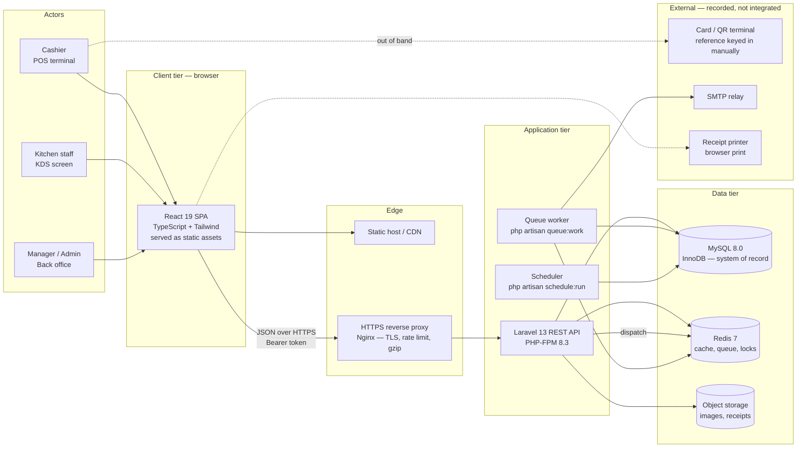
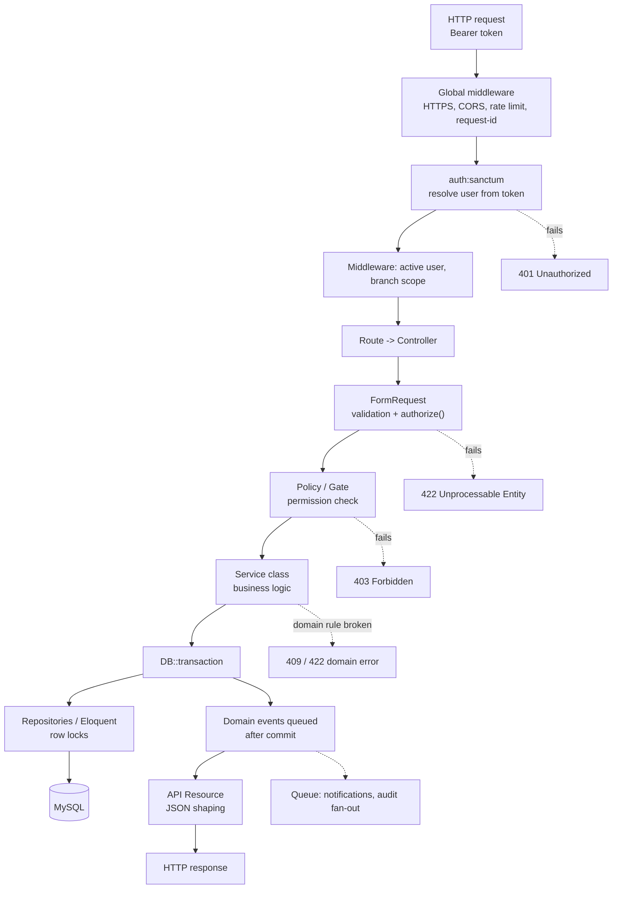
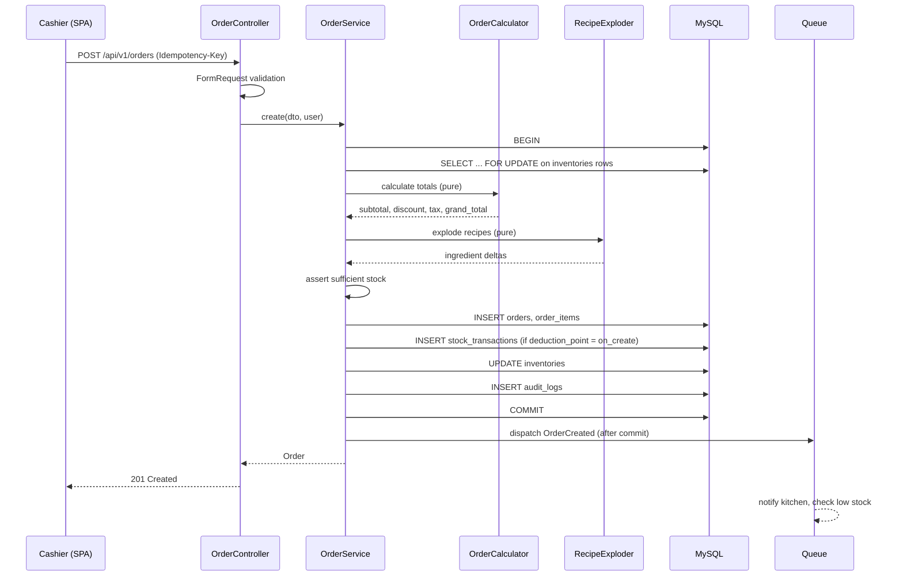
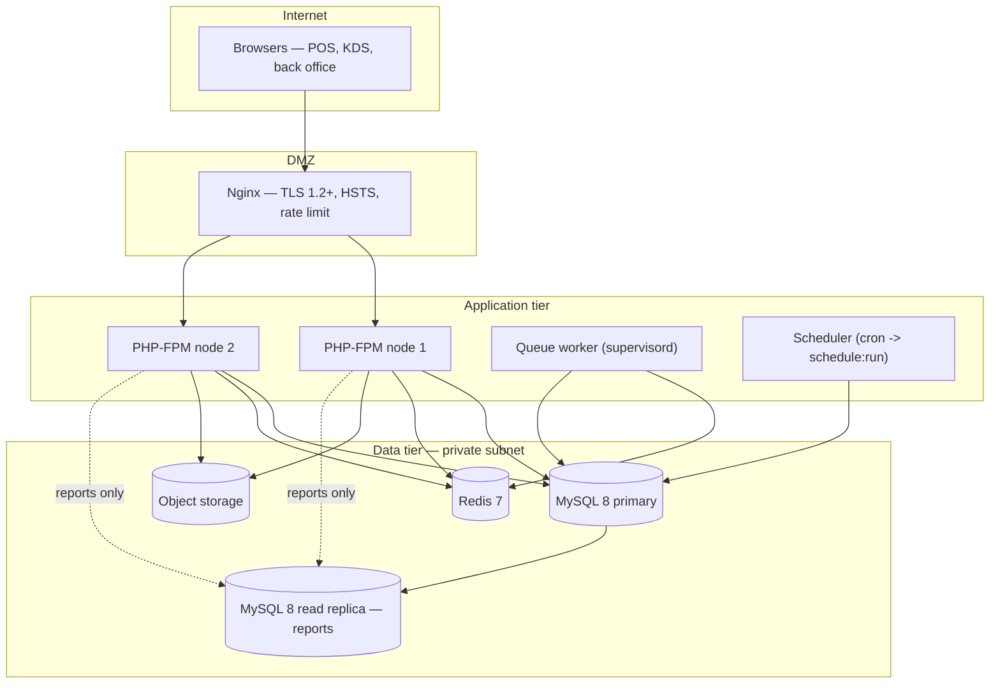

# 02 — System Architecture

> **Document purpose.** Describe the shape of the system: its layers, request lifecycle, backend
> package structure, frontend structure, transaction and concurrency strategy, and the architectural
> rules that must not be broken. This document explains *how the code is organised*; individual
> behaviours live in the workflow documents.

**Prerequisite:** [01-project-overview.md](01-project-overview.md) — especially §2 (implementation
status) and §9 (assumptions).

**Status:** 🟡 MVP — Planned. Nothing described below exists in the repository yet beyond the two
framework scaffolds noted in [01](01-project-overview.md) §2.

---

## 1. Architectural style

RestaurantOS is a **decoupled two-tier application**: a React single-page application talking to a
stateless Laravel REST API over HTTPS, with MySQL as the only durable store.

Key properties:

| Property | Decision | Rationale |
|---|---|---|
| Coupling | Frontend and backend deploy independently | Different release cadences; POS UI changes far more often than the ledger. |
| Session state | **None on the server** | Enables horizontal scaling of the API without sticky sessions. Auth is a bearer token. |
| Source of truth | MySQL | Redis is a cache and a queue, never authoritative. Losing Redis must never lose money. |
| Business logic location | Backend **service layer** only | The POS cannot be trusted for pricing, tax or stock. See §7. |
| Consistency | Strong (single-node MySQL, ACID transactions) | Money and stock require it. No eventual consistency in the sell path. |
| Integration | REST/JSON | Explicit stack requirement. |

### 1.1 Monolith, not microservices — and why

RestaurantOS is a **modular monolith**. The order → payment → inventory → loyalty chain must be atomic;
splitting it across services would require distributed transactions or sagas to keep stock and money
consistent, which is disproportionate complexity for fifteen branches. Modularity is enforced by
directory structure and service boundaries (§4), not by network boundaries. If a module ever needs to
be extracted, the service-layer boundary is the seam.

---

## 2. Context diagram



**Read the dotted lines carefully.** The card terminal is *not* integrated in MVP
([01](01-project-overview.md) §9, A7). The cashier operates it separately and types the approval
reference into RestaurantOS. The system records that a payment happened; it does not make it happen.

---

## 3. Layered request lifecycle

Every write request follows the same path. Layers may only call downwards.



Error contracts for each terminal state are defined in [21-error-handling.md](21-error-handling.md).

### 3.1 Layer responsibilities

| Layer | May do | Must never do |
|---|---|---|
| **Middleware** | Auth, rate limiting, correlation IDs, branch-scope resolution | Business decisions |
| **Controller** | Accept a validated request, call one service, return one resource | Query the database, compute money, contain `if` chains of business logic |
| **FormRequest** | Field-level and cross-field validation, `authorize()` | Touch inventory or pricing |
| **Policy** | Answer "may this user do this to this record?" | Mutate anything |
| **Service** | Orchestrate a use case, open transactions, enforce invariants, emit events | Read the HTTP request or return HTTP responses |
| **Calculator / domain object** | Pure arithmetic (totals, tax, recipe explosion) | Perform I/O |
| **Repository / Eloquent** | Persist and query | Enforce business rules |
| **API Resource** | Shape JSON, hide internal fields | Perform queries (guard against N+1) |
| **Listener / Job** | Side effects after commit: notifications, exports | Anything the caller's correctness depends on |

**Controller size rule:** if a controller method exceeds ~15 lines, logic has leaked out of the service
layer. See [29-coding-standards.md](29-coding-standards.md) §4.

---

## 4. Backend structure

Proposed layout under `backend/app/`. 🟡

```text
app/
├── Console/Commands/
│   ├── CloseBusinessDay.php
│   ├── ExpireLoyaltyPoints.php
│   └── CheckLowStock.php
├── Domain/                        # Framework-free business logic
│   ├── Pricing/
│   │   ├── Money.php              # integer minor units, immutable
│   │   ├── OrderCalculator.php    # subtotal, discount, tax, grand total
│   │   ├── DiscountAllocator.php  # pro-rata order discount -> lines
│   │   └── TaxCalculator.php      # inclusive + exclusive
│   ├── Inventory/
│   │   ├── RecipeExploder.php     # order items -> ingredient deltas
│   │   ├── UnitConverter.php      # kg <-> g, L <-> ml
│   │   └── AverageCostCalculator.php
│   ├── Loyalty/
│   │   ├── PointsEarner.php
│   │   └── PointsRedeemer.php
│   └── Orders/
│       ├── OrderStateMachine.php
│       └── OrderNumberGenerator.php
├── Enums/
│   ├── OrderStatus.php  PaymentStatus.php  PaymentMethod.php
│   ├── OrderType.php    StockTransactionType.php
│   ├── TransferStatus.php  ExpenseStatus.php
├── Events/
│   ├── OrderCreated.php  OrderAccepted.php  OrderReady.php  OrderCompleted.php
│   ├── OrderCancelled.php  PaymentCaptured.php  PaymentRefunded.php
│   ├── StockLevelChanged.php  LowStockDetected.php
│   └── StockTransferRequested.php  ExpenseSubmitted.php
├── Exceptions/
│   ├── DomainException.php            # base, carries an error_code
│   ├── InsufficientStockException.php
│   ├── InvalidStateTransitionException.php
│   ├── OverPaymentException.php
│   └── BranchScopeViolationException.php
├── Http/
│   ├── Controllers/Api/V1/{Auth,Catalog,Pos,Orders,Payments,Kitchen,Inventory,Transfers,Customers,Expenses,Reports,Admin}/
│   ├── Middleware/
│   │   ├── EnsureUserIsActive.php
│   │   ├── ResolveBranchScope.php
│   │   ├── AssignRequestId.php
│   │   └── ForceJsonResponse.php
│   ├── Requests/                      # one FormRequest per write endpoint
│   └── Resources/                     # one API Resource per exposed model
├── Jobs/
│   ├── RecalculateInventoryBalance.php
│   ├── SendLowStockNotification.php
│   └── GenerateDailySalesSnapshot.php
├── Listeners/
│   ├── DeductInventoryForOrder.php
│   ├── RestoreInventoryForCancelledOrder.php
│   ├── AwardLoyaltyPoints.php
│   ├── PushOrderToKitchen.php
│   └── WriteAuditLog.php
├── Models/                            # Eloquent, thin
├── Observers/
│   └── AuditableObserver.php
├── Policies/
├── Services/                          # one per use case family
│   ├── Auth/AuthService.php
│   ├── Pos/CartService.php
│   ├── Orders/{OrderService,OrderStatusService}.php
│   ├── Payments/{PaymentService,RefundService}.php
│   ├── Inventory/{InventoryService,StockTransactionService,StockTransferService}.php
│   ├── Customers/LoyaltyService.php
│   ├── Expenses/ExpenseService.php
│   ├── Reports/ReportService.php
│   └── Audit/AuditService.php
└── Support/
    ├── ApiResponse.php                # single JSON envelope builder
    └── BusinessDay.php                # branch-local day boundaries
```

### 4.1 Why `Domain/` is separate from `Services/`

`Domain/` classes are **pure**: no database, no facades, no HTTP. `OrderCalculator` takes line data and
configuration and returns totals. This makes the money maths testable in milliseconds without a database
and is what makes the calculation test suite in [24-qa-test-plan.md](24-qa-test-plan.md) §7 practical.
`Services/` classes are **impure orchestrators**: they load data, call domain objects, persist, and emit
events.

---

## 5. Frontend structure

Proposed layout under `Frontend/src/`. 🟡

```text
src/
├── app/
│   ├── router.tsx              # route tree + permission guards
│   ├── providers.tsx           # QueryClient, Auth, Branch, Toast
│   └── queryClient.ts
├── features/                   # vertical slices, mirroring backend modules
│   ├── auth/       {api,components,hooks,pages,types}
│   ├── pos/
│   │   ├── components/{CategoryGrid,ProductGrid,Cart,CartLine,DiscountDialog,PaymentDialog,ReceiptPreview}.tsx
│   │   ├── hooks/{useCart,useCartTotals,useOrderSubmit}.ts
│   │   └── pages/PosTerminalPage.tsx
│   ├── orders/  payments/  kitchen/  inventory/  transfers/
│   ├── customers/  expenses/  reports/  admin/
├── shared/
│   ├── api/{client.ts,endpoints.ts,errors.ts}   # single Axios instance + interceptors
│   ├── components/ui/           # Button, Modal, Table, Money, Toast
│   ├── hooks/{usePermission,useBranchScope,useDebounce}.ts
│   ├── lib/{money.ts,format.ts,date.ts}
│   └── types/api.d.ts           # generated from the OpenAPI spec
├── styles/index.css             # Tailwind entry
└── main.tsx
```

### 5.1 Frontend rules

1. **Client-side totals are advisory.** The cart may show a running total for responsiveness, but the
   authoritative figures are those returned by `POST /api/v1/pos/cart/calculate` and by the created
   order. If they differ, the server wins and the UI must re-render from the server response. See
   [09-business-rules.md](09-business-rules.md) §11.
2. **Permissions hide, they do not protect.** `usePermission()` controls what is rendered; the backend
   is the only enforcement point. See [22-security.md](22-security.md) §4.
3. **One HTTP client.** All requests go through `shared/api/client.ts`, which attaches the bearer token,
   the `X-Branch-Id` header, and a request ID, and normalises errors to the shape in
   [21-error-handling.md](21-error-handling.md).
4. **Money never touches `number` in a calculation.** Use the minor-unit helpers in `lib/money.ts`.
   Floats are permitted only for display formatting.
5. **Server state lives in TanStack Query, not in Redux.** Local UI state (the open cart, a dialog) uses
   component state or a small store.

### 5.2 Required setup work ✅→🟡

Two things must be corrected before feature work starts, both flagged in
[01](01-project-overview.md) §2:

- Tailwind is declared in the **repository-root** `package.json`. Move `tailwindcss` and
  `@tailwindcss/vite` into `Frontend/package.json` and register the plugin in `Frontend/vite.config.ts`.
- `Frontend/vite.config.ts` has no dev-server proxy. Add one for `/api` so the SPA and API share an
  origin in development and cookies/CORS behave predictably.

---

## 6. Transaction boundaries

The most important architectural rule in the system: **one use case, one transaction.**

### 6.1 Order creation transaction



### 6.2 Rules

| Rule | Detail |
|---|---|
| **T1** | Anything that must be consistent with an order — items, stock ledger, inventory balance, loyalty ledger, audit row — is written in the **same** transaction. |
| **T2** | Anything that must *not* block the response — notifications, emails, report snapshots — is dispatched **after commit** (`DB::afterCommit`), never inside. |
| **T3** | No HTTP call to an external service inside a transaction. Ever. A slow third party must not hold row locks. |
| **T4** | Lock ordering is fixed to prevent deadlocks: `branches` → `orders` → `order_items` → `inventories` (ordered by `ingredient_id` ascending) → `stock_transactions`. Every service acquires locks in this order. |
| **T5** | Transactions in the sell path target < 100 ms. Long-running work belongs in a job. |
| **T6** | Retry deadlocks (MySQL error 1213) up to 3 times with jittered backoff, then surface `409 Conflict`. |

---

## 7. Concurrency strategy

Restaurant peak service is the worst case: ten terminals, one branch, overlapping stock consumption.

| Contention point | Strategy | Detail |
|---|---|---|
| Inventory quantity | **Pessimistic** — `SELECT ... FOR UPDATE` on `inventories` rows, ordered by `ingredient_id` | Two simultaneous sales of the last portion must not both succeed. |
| Order number sequence | Dedicated `daily_sequences` row locked `FOR UPDATE`, or `INSERT ... ON DUPLICATE KEY UPDATE last_number = last_number + 1` | Guarantees gapless, unique per-branch daily numbers. Never `MAX(id)+1`. |
| Order status transitions | **Optimistic** — a `version` column, plus a guarded `UPDATE ... WHERE status = :expected` | Cashier and kitchen may act on the same order simultaneously; the loser gets `409`. |
| Payment application | Row lock on the order + a server-side re-check that `paid_total + amount <= grand_total` | Prevents double payment from a double-clicked button. |
| Duplicate submissions | `Idempotency-Key` header on `POST /orders`, `/payments`, `/refunds`; stored 24 h | A retried request returns the original response instead of creating a second order. |
| Stock transfer receipt | Row lock on the transfer plus a status guard | Prevents double receiving. |
| Loyalty redemption | Row lock on `customers`, balance re-checked inside the transaction | Prevents spending the same points twice. |

Test scenarios for each row are specified in [24-qa-test-plan.md](24-qa-test-plan.md) §10.

---

## 8. API design conventions

Full endpoint catalogue: [07-api-documentation.md](07-api-documentation.md).

| Convention | Rule |
|---|---|
| Base path | `/api/v1`. The version is in the URL; breaking changes create `/api/v2`. |
| Naming | Plural, kebab-case resources: `/api/v1/stock-transfers`. |
| Verbs | `GET` read, `POST` create, `PATCH` partial update, `PUT` full replace, `DELETE` soft delete. |
| Actions | State transitions are sub-resources, not verbs in a query string: `POST /orders/{id}/accept`. |
| Envelope | Every response uses `{ "data": ..., "meta": ..., "errors": ... }`. |
| Pagination | Cursor-based for high-volume lists (orders, stock transactions), page-based for admin lists. Default page size 25, maximum 100. |
| Filtering | Explicit whitelisted query parameters only. No arbitrary field filtering — it is an injection and an index-abuse risk. |
| Dates | ISO 8601 with offset in responses (`2026-09-05T14:31:00+07:00`). Requests accept ISO 8601 or `Y-m-d`. |
| Money in JSON | Emitted as a **string** decimal (`"12.50"`) plus a minor-unit integer (`1250`). Never a JSON float. |
| Idempotency | `Idempotency-Key` accepted on all financial `POST`s. |
| Correlation | Every response carries `X-Request-Id`, echoed into logs and audit rows. |

---

## 9. Cross-cutting concerns

| Concern | Mechanism | Document |
|---|---|---|
| Authentication | Sanctum personal access tokens, `auth:sanctum` middleware | [08](08-authentication-authorization.md) |
| Authorisation | Policies + Gates over a permission catalogue | [04](04-user-roles-permissions.md) |
| Branch scoping | `ResolveBranchScope` middleware + a global Eloquent scope on branch-owned models | [04](04-user-roles-permissions.md) §5 |
| Validation | FormRequests; rules catalogued centrally | [20](20-validation-rules.md) |
| Error handling | A single exception handler producing one envelope | [21](21-error-handling.md) |
| Audit logging | `AuditableObserver` + explicit `AuditService` calls for domain events | [22](22-security.md) §7 |
| Notifications | Laravel notifications over the `database` channel, dispatched from listeners | [19](19-notifications.md) |
| Logging | Structured JSON to stdout, correlated by request ID | [26](26-deployment.md) §8 |
| Configuration | `config/restaurantos.php` + database-backed `settings` | [27](27-environment-configuration.md) |

---

## 10. Data flow: sell one cappuccino

The canonical end-to-end path, referenced throughout the workflow documents.

```mermaid
sequenceDiagram
    autonumber
    participant U as Cashier
    participant F as React POS
    participant A as API
    participant DB as MySQL
    participant KDS as Kitchen screen

    U->>F: select branch, category, product
    F->>A: GET /pos/products?branch_id=1&category_id=3
    A-->>F: products with effective prices
    U->>F: add Cappuccino x2 to cart
    F->>A: POST /pos/cart/calculate
    A-->>F: authoritative totals
    U->>F: confirm order
    F->>A: POST /orders (Idempotency-Key)
    A->>DB: BEGIN; lock inventories(milk, coffee)
    A->>DB: INSERT order (status = pending)
    A->>DB: INSERT order_items (price + cost snapshots)
    A->>DB: COMMIT
    A-->>F: 201 order #B1-20260905-0042
    F->>A: POST /orders/42/accept
    A->>DB: status -> accepted; explode recipe
    A->>DB: INSERT stock_transactions (milk -0.40 L, coffee -0.04 kg)
    A->>DB: UPDATE inventories balances
    A->>DB: INSERT kitchen_tickets
    A-->>F: 200 accepted
    KDS->>A: GET /kitchen/tickets (poll 5s)
    A-->>KDS: ticket queued
    KDS->>A: POST /kitchen/tickets/9/start -> preparing
    KDS->>A: POST /kitchen/tickets/9/ready -> ready
    U->>F: take payment
    F->>A: POST /orders/42/payments {method: cash, amount, tendered}
    A->>DB: INSERT payment; recompute paid_total; payment_status = paid
    A-->>F: 201 change_due
    F->>A: POST /orders/42/complete
    A->>DB: status -> completed; award loyalty points
    A-->>F: 200 receipt payload
```

Each step is expanded in [10](10-pos-workflow.md), [11](11-order-workflow.md),
[12](12-payment-workflow.md), [13](13-kitchen-workflow.md) and [14](14-inventory-workflow.md).

---

## 11. Deployment topology (summary)

Full detail, including the environment matrix and rollback procedure, is in
[26-deployment.md](26-deployment.md).



⚠️ The read replica is 🔵 Post-MVP. MVP runs a single MySQL instance; reports are throttled and cached
instead (see [18](18-reporting.md) §8).

---

## 12. Architecture decision record (summary)

| ID | Decision | Alternatives rejected | Reason |
|---|---|---|---|
| ADR-01 | Modular monolith | Microservices | Atomic money+stock writes; team size. |
| ADR-02 | Sanctum personal access tokens | JWT; session cookies | Server-side revocation; native Laravel support; SPA on a separate origin. |
| ADR-03 | Append-only stock ledger, `inventories` as a derived cache | Mutable quantity column only | Auditability and the ability to rebuild balances. |
| ADR-04 | Money as `DECIMAL` in MySQL, integers in PHP | `FLOAT`; `int` cents only | Exactness with readable storage. |
| ADR-05 | Price and cost snapshots on `order_items` | Join to current product | Historic orders must not change when the menu is repriced. |
| ADR-06 | Pessimistic locking on inventory | Optimistic retry | Contention on the last portion is common; retries would thrash. |
| ADR-07 | Polling KDS in MVP | WebSockets from day one | Removes a broker from the MVP infrastructure; 5 s latency is acceptable. |
| ADR-08 | Deduct inventory at **Accepted** | At creation; at completion | Matches the moment the kitchen commits ingredients. Configurable — [01](01-project-overview.md) A4. |
| ADR-09 | Config-driven tax and rates | Hard-coded percentages | Explicit requirement; jurisdiction portability. |
| ADR-10 | Weighted average costing | FIFO | Simpler ledger, adequate accuracy for perishables. |

---

## 13. Security architecture summary

Detail in [22-security.md](22-security.md).

- TLS everywhere; HSTS at the proxy; no plaintext HTTP listener beyond a redirect.
- Tokens are hashed at rest (Sanctum default), scoped by ability, and expire.
- Every branch-owned query is constrained by a global scope; the branch ID is **never** trusted from
  the request body alone (see [22](22-security.md) §5, IDOR).
- All mutations write an audit row inside the same transaction.
- Rate limits are tiered: login attempts, POS writes, and report generation each have their own budget.
- Secrets live in the environment, never in the repository ([27](27-environment-configuration.md) §7).

---

## 14. Testing considerations for this document

| Architectural rule | How it is verified |
|---|---|
| Controllers contain no business logic | Static analysis / review checklist; controller method length rule |
| Domain classes perform no I/O | Unit tests run with the database connection disabled |
| One transaction per use case | `DB::transactionLevel()` assertions in service tests |
| No queued job dispatched inside a transaction | `Queue::fake()` plus an `afterCommit` assertion |
| Lock ordering respected | Concurrency tests in [24](24-qa-test-plan.md) §10 |
| Branch scope never bypassed | Cross-branch access tests for every branch-owned endpoint |
| No N+1 in list endpoints | Query-count assertions on index endpoints |

---

## 15. Related documents

[03-requirements.md](03-requirements.md) ·
[05-database-design.md](05-database-design.md) ·
[07-api-documentation.md](07-api-documentation.md) ·
[09-business-rules.md](09-business-rules.md) ·
[22-security.md](22-security.md) ·
[26-deployment.md](26-deployment.md) ·
[29-coding-standards.md](29-coding-standards.md)
