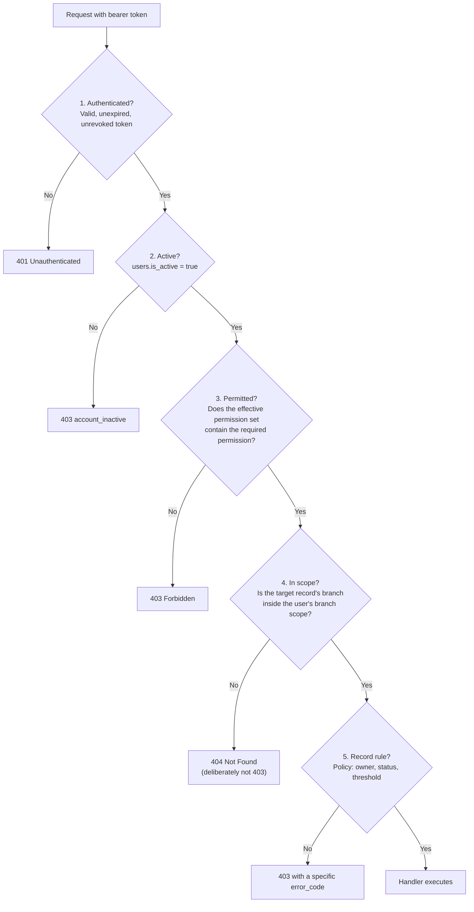
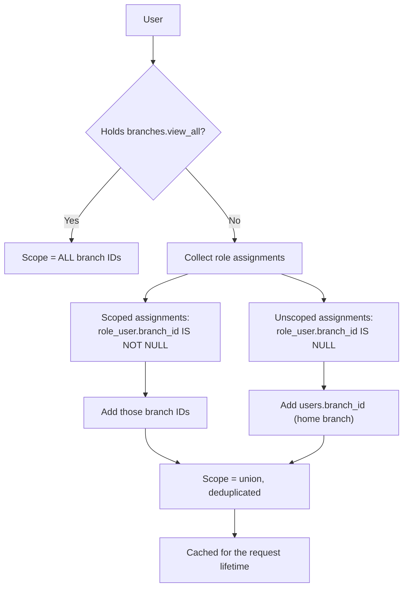
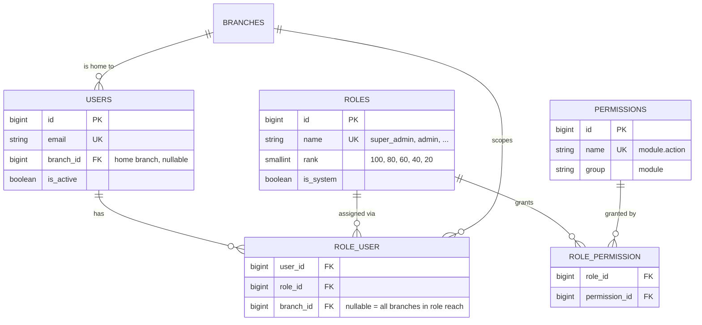

# 04 — User Roles and Permissions

> **Document purpose.** Define the authorisation model: the six roles, the complete permission
> catalogue, the role→permission matrix, branch scoping, and the guard rails that stop privilege
> escalation. This document is the **authoritative source** for permission names. Every endpoint in
> [07-api-documentation.md](07-api-documentation.md) cites a permission defined here.

**Prerequisites:** [01](01-project-overview.md) §8 (glossary), [02](02-system-architecture.md) §3.

**Status:** 🟡 MVP — Planned. No roles, permissions or policies exist in the repository yet.

---

## 1. Model overview

RestaurantOS uses **role-based access control with branch scoping**. Three questions are answered on
every protected request, in this order:



Steps 1–2 are middleware. Step 3 is a Gate. Steps 4–5 are Policies. Step 4 returning `404` rather than
`403` is deliberate — see [22-security.md](22-security.md) §5.

### 1.1 Concepts

| Concept | Definition |
|---|---|
| **Permission** | An atomic capability, named `module.action` (e.g. `orders.void`). The unit of enforcement. |
| **Role** | A named bundle of permissions (e.g. *Cashier*). The unit of assignment. |
| **Role assignment** | A link between a user and a role, optionally scoped to one branch. |
| **Effective permission set** | The union of permissions from all of a user's roles, evaluated in the current branch context. |
| **Branch scope** | The set of branch IDs a user may act within. |
| **Threshold rule** | A permission whose limit is numeric rather than boolean (e.g. maximum discount). Stored in configuration, checked by a policy. |

### 1.2 Design rules

| # | Rule |
|---|---|
| R1 | Permissions are granted to roles, never directly to users. A one-off need is met with a new role, not a user-level override. Simplifies auditing. |
| R2 | Permissions are **additive only**. There are no deny rules; a union of roles can only widen access. Deny rules make effective permissions impossible to reason about. |
| R3 | Every permission name is `module.action`, lower snake-case, singular action verb. |
| R4 | The permission catalogue is seeded from code, not created ad hoc in production. Adding a permission is a migration plus a seeder change. |
| R5 | A protected endpoint declares exactly one required permission. Where two capabilities are genuinely needed, create a composite permission rather than checking two. |
| R6 | Read and write are always separate permissions (`products.view` vs `products.update`). |
| R7 | Financially destructive actions have their own permission, never bundled into `update` (`orders.void`, `payments.refund`, `inventory.adjust`). |

---

## 2. The six roles

| Role | Slug | Branch reach | Intended holder | Typical count |
|---|---|---|---|---|
| **Super Admin** | `super_admin` | All branches | System owner / technical administrator | 1–2 |
| **Admin** | `admin` | All branches | Operations director, head office | 1–3 |
| **Manager** | `manager` | Assigned branches | Branch manager, shift supervisor | 1–2 per branch |
| **Cashier** | `cashier` | Home branch only | Front-counter staff operating the POS | 2–6 per branch |
| **Kitchen** | `kitchen` | Home branch only | Kitchen and bar staff on the KDS | 2–8 per branch |
| **Staff** | `staff` | Home branch only | Waiters, runners, general staff | Variable |

All six are **system roles**: they cannot be renamed or deleted (FR-RBAC-009). Their permission sets are
editable by Super Admin only.

### 2.1 Role charters

**Super Admin** — owns the system, not the business. Holds every permission including system settings,
role editing, audit access and user impersonation. Exists so that exactly one account can recover the
system. The last active Super Admin cannot be deleted, deactivated or demoted (FR-RBAC-008).

**Admin** — owns the business across all branches. Everything operational and financial, including
cross-branch reporting, expense approval and master data. Excluded from system-level settings, role
permission editing and impersonation, so that a compromised Admin cannot rewrite the authorisation model.

**Manager** — owns one or more branches. Full operational control within scope: menu availability,
inventory, stock transfers, expense submission and approval below threshold, staff-level user management,
order voids, high discounts, branch reporting. Cannot create Admins, cannot see other branches.

**Cashier** — sells. POS, order creation, payment capture, low-threshold discounts, own shift report.
Cannot void, cannot refund, cannot adjust stock, cannot see cost prices or profit. **Cost visibility is
deliberately withheld**: margin data is commercially sensitive and cashiers have no operational need for it.

**Kitchen** — prepares. Sees the KDS for their branch and moves tickets through Queued → Preparing →
Ready. Sees item names, quantities and notes. Sees no prices, no customer contact details, no totals.

**Staff** — assists. Read-only menu access plus, optionally, order creation for table service without
payment authority. The narrowest role; the default for a new hire until a manager assigns more.

---

## 3. Permission catalogue

Complete MVP catalogue. Names in this table are binding.

### 3.1 Authentication and profile — `auth.*`, `profile.*`

| Permission | Description |
|---|---|
| `profile.view` | View own profile. |
| `profile.update` | Update own name, phone, avatar. |
| `profile.change_password` | Change own password. |

Login, logout and `GET /auth/me` require authentication but no permission.

### 3.2 Users — `users.*`

| Permission | Description |
|---|---|
| `users.view` | List and view users within branch scope. |
| `users.create` | Create a user. |
| `users.update` | Update a user's details. |
| `users.delete` | Soft-delete a user. |
| `users.activate` | Activate or deactivate a user. |
| `users.assign_role` | Attach or detach roles. Gated additionally by §6.1. |
| `users.reset_password` | Force a password reset for another user. |
| `users.impersonate` | 🔵 Act as another user for support. Super Admin only. |

### 3.3 Roles and permissions — `roles.*`, `permissions.*`

| Permission | Description |
|---|---|
| `roles.view` | List roles and their permissions. |
| `roles.create` | Create a custom (non-system) role. |
| `roles.update` | Edit a role's permission set. |
| `roles.delete` | Delete a custom role. |
| `permissions.view` | List the permission catalogue. |

### 3.4 Branches — `branches.*`

| Permission | Description |
|---|---|
| `branches.view` | View branches within scope. |
| `branches.view_all` | View every branch regardless of scope. |
| `branches.create` · `branches.update` · `branches.delete` | Manage branches. |
| `branches.manage_settings` | Edit branch-level settings (tax rate, service charge, SLA). |

### 3.5 Catalogue — `categories.*`, `products.*`

| Permission | Description |
|---|---|
| `categories.view` · `categories.create` · `categories.update` · `categories.delete` | Manage categories. |
| `products.view` | View products and selling prices. |
| `products.view_cost` | **View cost price and margin.** Separated from `products.view` deliberately. |
| `products.create` · `products.update` · `products.delete` | Manage products. |
| `products.manage_variants` | Create and edit variants. |
| `products.manage_availability` | Toggle availability at branch level. Granted to Manager without full product editing. |
| `products.manage_pricing` | Change base price or branch price overrides. |

### 3.6 Customers and loyalty — `customers.*`, `loyalty.*`

| Permission | Description |
|---|---|
| `customers.view` · `customers.create` · `customers.update` · `customers.delete` | Manage customers. |
| `customers.export` | Export customer personal data (GDPR-style subject access). |
| `customers.anonymise` | Erase personal data while retaining financial totals. |
| `loyalty.view` | View a customer's point balance and ledger. |
| `loyalty.redeem` | Apply points to an order. |
| `loyalty.adjust` | Manually credit or debit points. Requires a reason. |
| `loyalty.manage_rules` | Edit earn/redeem rates and tiers. |

### 3.7 POS and orders — `pos.*`, `orders.*`

| Permission | Description |
|---|---|
| `pos.access` | Open the POS terminal. |
| `orders.view` | View orders within scope. |
| `orders.view_all_users` | View orders created by other users (a Cashier without this sees only their own). |
| `orders.create` | Create an order. |
| `orders.update` | Edit a **Pending** order's items. |
| `orders.edit_after_accept` | Edit an order after acceptance. Elevated. |
| `orders.cancel` | Cancel an order before completion. |
| `orders.void` | Void an order. Elevated; always audited. |
| `orders.accept` · `orders.complete` | Drive lifecycle transitions. |
| `orders.apply_discount` | Apply a discount up to the role threshold (§7). |
| `orders.apply_discount_unlimited` | Apply any discount, ignoring thresholds. |
| `orders.reprint_receipt` | Reprint a receipt. Audited — a common fraud vector. |

### 3.8 Payments — `payments.*`

| Permission | Description |
|---|---|
| `payments.view` | View payments on an order. |
| `payments.create` | Take a payment. |
| `payments.void` | Void an uncaptured/unsettled payment. Elevated. |
| `payments.refund` | Refund a captured payment. Elevated; always audited. |
| `payments.open_drawer` | Open the cash drawer outside a sale. Audited. |
| `payments.manage_shift` | Open and close a cash drawer session. |
| `payments.view_shift_all` | View other users' shift reports. |

### 3.9 Kitchen — `kitchen.*`

| Permission | Description |
|---|---|
| `kitchen.access` | Open the KDS. |
| `kitchen.view_tickets` | View tickets for the branch/station. |
| `kitchen.update_ticket` | Move a ticket Queued → Preparing → Ready. |
| `kitchen.skip_preparing` | Jump Queued → Ready. Elevated. |
| `kitchen.recall_ticket` | Move a Ready ticket back to Preparing. |
| `kitchen.manage_stations` | Create and configure stations. |

### 3.10 Inventory — `ingredients.*`, `recipes.*`, `inventory.*`

| Permission | Description |
|---|---|
| `ingredients.view` · `ingredients.create` · `ingredients.update` · `ingredients.delete` | Manage ingredients. |
| `ingredients.view_cost` | View ingredient cost per unit. |
| `recipes.view` | View recipes. |
| `recipes.create` · `recipes.update` · `recipes.delete` | Manage recipes. Changing a recipe changes future COGS. |
| `inventory.view` | View stock levels within scope. |
| `inventory.view_valuation` | View stock value (quantity × average cost). |
| `inventory.stock_in` | Record incoming stock. |
| `inventory.stock_out` | Record outgoing stock (wastage, staff meals). |
| `inventory.adjust` | Correct a balance. Elevated; reason mandatory. |
| `inventory.count` | Record a physical stock count. |
| `inventory.view_transactions` | Read the stock ledger. |

### 3.11 Stock transfers — `transfers.*`

| Permission | Description |
|---|---|
| `transfers.view` | View transfers involving branches in scope. |
| `transfers.create` | Request a transfer. |
| `transfers.update` | Edit a Draft transfer. |
| `transfers.submit` | Move Draft → Pending. |
| `transfers.approve` | Approve or reject. Must hold authority at the **source** branch. |
| `transfers.dispatch` | Mark In Transit and deduct source stock. |
| `transfers.receive` | Receive and add destination stock. |
| `transfers.cancel` | Cancel before dispatch. |

### 3.12 Expenses — `expenses.*`

| Permission | Description |
|---|---|
| `expenses.view` | View expenses within scope. |
| `expenses.view_all_users` | View expenses submitted by others. |
| `expenses.create` · `expenses.update` · `expenses.delete` | Manage own draft expenses. |
| `expenses.submit` | Submit for approval. |
| `expenses.approve` | Approve or reject. Never valid on one's own expense (§6.3). |
| `expenses.mark_paid` | Record settlement. |
| `expenses.manage_categories` | Manage expense categories. |

### 3.13 Reports — `reports.*`

| Permission | Description |
|---|---|
| `reports.view_sales` | Sales summaries. |
| `reports.view_products` | Product performance (quantity and revenue). |
| `reports.view_profit` | **Profit, COGS and margin.** The most sensitive report permission. |
| `reports.view_inventory` | Stock movement and valuation. |
| `reports.view_expenses` | Expense reports. |
| `reports.view_staff` | Per-user performance and shift reports. |
| `reports.view_all_branches` | Cross-branch consolidated reporting. |
| `reports.export` | Export any permitted report to CSV. |

### 3.14 Notifications — `notifications.*`

| Permission | Description |
|---|---|
| `notifications.view` | View own notifications. |
| `notifications.manage_preferences` | Configure own notification preferences. |

### 3.15 Audit and system — `audit.*`, `system.*`

| Permission | Description |
|---|---|
| `audit.view` | Read the audit log. |
| `audit.export` | Export audit entries. |
| `system.manage_settings` | Edit global settings, including tax rates. |
| `system.view_health` | View health and queue status. |
| `system.manage_backups` | 🔵 Trigger and download backups. |

---

## 4. Role → permission matrix

`●` granted · `○` not granted · `◐` granted with a threshold or record-level condition (§7)

| Permission | Super Admin | Admin | Manager | Cashier | Kitchen | Staff |
|---|:--:|:--:|:--:|:--:|:--:|:--:|
| **Profile** |
| `profile.view` / `profile.update` / `profile.change_password` | ● | ● | ● | ● | ● | ● |
| **Users** |
| `users.view` | ● | ● | ◐ | ○ | ○ | ○ |
| `users.create` | ● | ● | ◐ | ○ | ○ | ○ |
| `users.update` | ● | ● | ◐ | ○ | ○ | ○ |
| `users.delete` | ● | ● | ○ | ○ | ○ | ○ |
| `users.activate` | ● | ● | ◐ | ○ | ○ | ○ |
| `users.assign_role` | ● | ◐ | ◐ | ○ | ○ | ○ |
| `users.reset_password` | ● | ● | ◐ | ○ | ○ | ○ |
| `users.impersonate` | ● | ○ | ○ | ○ | ○ | ○ |
| **Roles** |
| `roles.view` | ● | ● | ● | ○ | ○ | ○ |
| `roles.create` / `roles.update` / `roles.delete` | ● | ○ | ○ | ○ | ○ | ○ |
| `permissions.view` | ● | ● | ○ | ○ | ○ | ○ |
| **Branches** |
| `branches.view` | ● | ● | ● | ● | ● | ● |
| `branches.view_all` | ● | ● | ○ | ○ | ○ | ○ |
| `branches.create` / `branches.delete` | ● | ● | ○ | ○ | ○ | ○ |
| `branches.update` | ● | ● | ◐ | ○ | ○ | ○ |
| `branches.manage_settings` | ● | ● | ◐ | ○ | ○ | ○ |
| **Catalogue** |
| `categories.view` | ● | ● | ● | ● | ● | ● |
| `categories.create` / `.update` / `.delete` | ● | ● | ● | ○ | ○ | ○ |
| `products.view` | ● | ● | ● | ● | ● | ● |
| `products.view_cost` | ● | ● | ● | ○ | ○ | ○ |
| `products.create` / `.update` / `.delete` | ● | ● | ● | ○ | ○ | ○ |
| `products.manage_variants` | ● | ● | ● | ○ | ○ | ○ |
| `products.manage_availability` | ● | ● | ● | ○ | ○ | ○ |
| `products.manage_pricing` | ● | ● | ◐ | ○ | ○ | ○ |
| **Customers and loyalty** |
| `customers.view` | ● | ● | ● | ● | ○ | ● |
| `customers.create` / `customers.update` | ● | ● | ● | ● | ○ | ● |
| `customers.delete` | ● | ● | ● | ○ | ○ | ○ |
| `customers.export` / `customers.anonymise` | ● | ● | ○ | ○ | ○ | ○ |
| `loyalty.view` | ● | ● | ● | ● | ○ | ● |
| `loyalty.redeem` | ● | ● | ● | ● | ○ | ○ |
| `loyalty.adjust` | ● | ● | ● | ○ | ○ | ○ |
| `loyalty.manage_rules` | ● | ● | ○ | ○ | ○ | ○ |
| **POS and orders** |
| `pos.access` | ● | ● | ● | ● | ○ | ◐ |
| `orders.view` | ● | ● | ● | ◐ | ◐ | ◐ |
| `orders.view_all_users` | ● | ● | ● | ○ | ○ | ○ |
| `orders.create` | ● | ● | ● | ● | ○ | ◐ |
| `orders.update` | ● | ● | ● | ● | ○ | ◐ |
| `orders.edit_after_accept` | ● | ● | ● | ○ | ○ | ○ |
| `orders.accept` | ● | ● | ● | ● | ● | ○ |
| `orders.complete` | ● | ● | ● | ● | ○ | ○ |
| `orders.cancel` | ● | ● | ● | ◐ | ○ | ○ |
| `orders.void` | ● | ● | ● | ○ | ○ | ○ |
| `orders.apply_discount` | ● | ● | ◐ | ◐ | ○ | ○ |
| `orders.apply_discount_unlimited` | ● | ● | ○ | ○ | ○ | ○ |
| `orders.reprint_receipt` | ● | ● | ● | ◐ | ○ | ○ |
| **Payments** |
| `payments.view` | ● | ● | ● | ● | ○ | ○ |
| `payments.create` | ● | ● | ● | ● | ○ | ○ |
| `payments.void` | ● | ● | ● | ○ | ○ | ○ |
| `payments.refund` | ● | ● | ● | ○ | ○ | ○ |
| `payments.open_drawer` | ● | ● | ● | ● | ○ | ○ |
| `payments.manage_shift` | ● | ● | ● | ● | ○ | ○ |
| `payments.view_shift_all` | ● | ● | ● | ○ | ○ | ○ |
| **Kitchen** |
| `kitchen.access` / `kitchen.view_tickets` | ● | ● | ● | ● | ● | ● |
| `kitchen.update_ticket` | ● | ● | ● | ○ | ● | ○ |
| `kitchen.skip_preparing` | ● | ● | ● | ○ | ○ | ○ |
| `kitchen.recall_ticket` | ● | ● | ● | ○ | ● | ○ |
| `kitchen.manage_stations` | ● | ● | ● | ○ | ○ | ○ |
| **Inventory** |
| `ingredients.view` | ● | ● | ● | ○ | ◐ | ○ |
| `ingredients.view_cost` | ● | ● | ● | ○ | ○ | ○ |
| `ingredients.create` / `.update` / `.delete` | ● | ● | ● | ○ | ○ | ○ |
| `recipes.view` | ● | ● | ● | ○ | ● | ○ |
| `recipes.create` / `.update` / `.delete` | ● | ● | ● | ○ | ○ | ○ |
| `inventory.view` | ● | ● | ● | ◐ | ● | ○ |
| `inventory.view_valuation` | ● | ● | ● | ○ | ○ | ○ |
| `inventory.stock_in` | ● | ● | ● | ○ | ○ | ○ |
| `inventory.stock_out` | ● | ● | ● | ○ | ● | ○ |
| `inventory.adjust` | ● | ● | ● | ○ | ○ | ○ |
| `inventory.count` | ● | ● | ● | ○ | ● | ○ |
| `inventory.view_transactions` | ● | ● | ● | ○ | ○ | ○ |
| **Transfers** |
| `transfers.view` | ● | ● | ● | ○ | ○ | ○ |
| `transfers.create` / `.update` / `.submit` | ● | ● | ● | ○ | ○ | ○ |
| `transfers.approve` | ● | ● | ◐ | ○ | ○ | ○ |
| `transfers.dispatch` / `transfers.receive` | ● | ● | ● | ○ | ○ | ○ |
| `transfers.cancel` | ● | ● | ● | ○ | ○ | ○ |
| **Expenses** |
| `expenses.view` | ● | ● | ● | ○ | ○ | ○ |
| `expenses.view_all_users` | ● | ● | ● | ○ | ○ | ○ |
| `expenses.create` / `.update` / `.delete` / `.submit` | ● | ● | ● | ○ | ○ | ○ |
| `expenses.approve` | ● | ● | ◐ | ○ | ○ | ○ |
| `expenses.mark_paid` | ● | ● | ○ | ○ | ○ | ○ |
| `expenses.manage_categories` | ● | ● | ○ | ○ | ○ | ○ |
| **Reports** |
| `reports.view_sales` | ● | ● | ● | ◐ | ○ | ○ |
| `reports.view_products` | ● | ● | ● | ○ | ○ | ○ |
| `reports.view_profit` | ● | ● | ● | ○ | ○ | ○ |
| `reports.view_inventory` | ● | ● | ● | ○ | ○ | ○ |
| `reports.view_expenses` | ● | ● | ● | ○ | ○ | ○ |
| `reports.view_staff` | ● | ● | ● | ○ | ○ | ○ |
| `reports.view_all_branches` | ● | ● | ○ | ○ | ○ | ○ |
| `reports.export` | ● | ● | ● | ○ | ○ | ○ |
| **Notifications** |
| `notifications.view` / `.manage_preferences` | ● | ● | ● | ● | ● | ● |
| **Audit and system** |
| `audit.view` / `audit.export` | ● | ● | ○ | ○ | ○ | ○ |
| `system.manage_settings` | ● | ○ | ○ | ○ | ○ | ○ |
| `system.view_health` | ● | ● | ○ | ○ | ○ | ○ |
| `system.manage_backups` | ● | ○ | ○ | ○ | ○ | ○ |

### 4.1 Conditions behind every `◐`

| Permission | Role | Condition |
|---|---|---|
| `users.view` / `.create` / `.update` / `.activate` / `.reset_password` | Manager | Only users whose home branch is in the manager's scope, and only those holding roles at or below Manager (§6.1). |
| `users.assign_role` | Admin | Cannot grant `super_admin`. |
| `users.assign_role` | Manager | May grant only `cashier`, `kitchen`, `staff`. |
| `branches.update` / `branches.manage_settings` | Manager | Only branches in scope; may not change currency or code. |
| `products.manage_pricing` | Manager | Branch price override only; base price requires Admin. |
| `pos.access`, `orders.create`, `orders.update` | Staff | Only when `pos.staff_can_create_orders` is enabled. Never grants payment capability. |
| `orders.view` | Cashier / Kitchen / Staff | Own orders only unless `orders.view_all_users` is held. Kitchen sees a reduced projection (no money). |
| `orders.cancel` | Cashier | Only while the order is **Pending** and has no captured payment. |
| `orders.apply_discount` | Cashier | Up to `discount.max_percent.cashier` (default 10 %). |
| `orders.apply_discount` | Manager | Up to `discount.max_percent.manager` (default 50 %). |
| `orders.reprint_receipt` | Cashier | Limited to `receipt.max_reprints` (default 2) per order; each reprint is audited. |
| `ingredients.view` | Kitchen | Name and stock status only; no cost. |
| `inventory.view` | Cashier | Availability flag only, not quantities — enough to know a product is sellable. |
| `transfers.approve` | Manager | Only when the manager's scope includes the **source** branch (§6.2). |
| `expenses.approve` | Manager | Only up to `expense.approval_threshold`, and never their own (§6.3). |
| `reports.view_sales` | Cashier | Own shift only, current business day. |

---

## 5. Branch scoping

Branch scope is the second axis of authorisation and the most common source of security bugs.

### 5.1 How scope is computed



### 5.2 Enforcement

Three layers, all required:

1. **Middleware** `ResolveBranchScope` computes the scope once per request and puts it on the request
   context. It also validates the optional `X-Branch-Id` header: if the header names a branch outside
   the scope, the request is rejected `403` immediately.
2. **Global Eloquent scope** on every branch-owned model constrains `SELECT` to `branch_id IN (scope)`.
   This is the safety net that catches a forgotten `where` clause.
3. **Policy check** on every single-record read and write re-verifies the record's branch. This catches
   the case where a global scope was deliberately disabled for a legitimate reason.

**Branch-owned models:** `orders`, `order_items`, `payments`, `refunds`, `kitchen_tickets`,
`inventories`, `stock_transactions`, `expenses`, `cash_drawer_sessions`, `daily_sequences`.

**Globally-owned models** (visible to all authenticated users, editable only with permission):
`categories`, `products`, `product_variants`, `ingredients`, `units`, `recipes`, `customers`,
`tax_rates`, `expense_categories`, `loyalty_tiers`.

**Dual-branch model:** `stock_transfers` is visible when **either** `from_branch_id` **or**
`to_branch_id` is in scope. This is the one place the simple rule does not apply, and it must be tested
explicitly.

### 5.3 The active branch

A multi-branch user selects an active branch in the UI, sent as `X-Branch-Id`. Rules:

| Rule | Detail |
|---|---|
| B1 | The header **narrows** scope; it can never widen it. |
| B2 | Omitted header ⇒ the user's home branch. |
| B3 | Writes always use the branch resolved by the server, never a `branch_id` in the request body. A body-supplied `branch_id` that disagrees with the resolved branch is rejected `422`. |
| B4 | Reports may span the full scope when the user holds `reports.view_all_branches`; otherwise they are limited to the active branch. |

> **Security note.** B3 is the single most important rule in this document. Trusting a `branch_id` from
> the request body is how cross-tenant data leaks happen. See [22-security.md](22-security.md) §5.

---

## 6. Escalation guards

Permissions alone are not sufficient; these record-level rules close the remaining holes.

### 6.1 Privilege escalation (FR-RBAC-011)

Role assignment obeys a strict hierarchy:

```text
super_admin (100) > admin (80) > manager (60) > cashier (40) = kitchen (40) = staff (20)
```

| Guard | Rule | Failure |
|---|---|---|
| G1 | A user may never assign a role of rank **greater than or equal to** their own highest rank. | `403 privilege_escalation` |
| G2 | A user may never modify their **own** role assignments. | `403 self_role_modification` |
| G3 | Only Super Admin may grant `super_admin`. | `403 privilege_escalation` |
| G4 | A user may not deactivate or delete a user of higher or equal rank. | `403 insufficient_rank` |
| G5 | The last active Super Admin cannot be deleted, deactivated or demoted. | `422 last_super_admin` |

G1 uses "greater than or equal to" so an Admin cannot mint a second Admin, which would otherwise let a
compromised account create a parallel foothold that survives revocation of the original.

### 6.2 Approval authority

| Guard | Rule |
|---|---|
| G6 | Transfer approval requires authority at the **source** branch. A destination manager cannot approve stock leaving someone else's branch. |
| G7 | A user cannot approve a transfer they requested, unless they hold `transfers.approve` at the source **and** `transfer.allow_self_approval` is enabled (default off). |

### 6.3 Separation of duties

| Guard | Rule | Failure |
|---|---|---|
| G8 | A user cannot approve their own expense. | `403 self_approval_forbidden` |
| G9 | A user cannot approve an expense above `expense.approval_threshold` for their role. | `403 approval_limit_exceeded` |
| G10 | A user cannot void or refund an order they are simultaneously the sole approver for, when `finance.require_dual_control` is enabled. 🔵 | `403 dual_control_required` |

### 6.4 Data visibility guards

| Guard | Rule |
|---|---|
| G11 | Without `products.view_cost`, every API response omits `cost_price`, `unit_cost_snapshot`, `margin` and `cogs`. Omitted, not nulled — a `null` still reveals the field exists. |
| G12 | Without `reports.view_profit`, profit endpoints return `403` and profit columns are absent from all other reports. |
| G13 | The Kitchen role receives a reduced order projection: items, quantities, notes, timestamps. No prices, no totals, no customer phone or email. |
| G14 | Without `orders.view_all_users`, order lists are filtered to `orders.user_id = auth()->id()`. |

---

## 7. Threshold rules

Numeric limits are configuration, not code ([01](01-project-overview.md) A3). Resolution order is
role-specific setting → branch setting → global setting.

| Setting key | Applies to | Default ⚠️ | Enforced by |
|---|---|---|---|
| `discount.max_percent.cashier` | Cashier | `10.00` | `OrderPolicy::applyDiscount` |
| `discount.max_percent.manager` | Manager | `50.00` | `OrderPolicy::applyDiscount` |
| `discount.max_amount.cashier` | Cashier | unset | `OrderPolicy::applyDiscount` |
| `expense.approval_threshold.manager` | Manager | unset | `ExpensePolicy::approve` |
| `receipt.max_reprints` | Cashier | `2` | `OrderPolicy::reprint` |
| `refund.max_days_after_completion` | All | `7` | `RefundPolicy::create` |
| `inventory.adjust.max_percent_without_admin` | Manager | `20.00` | `InventoryPolicy::adjust` |
| `pos.staff_can_create_orders` | Staff | `false` | `OrderPolicy::create` |
| `transfer.allow_self_approval` | All | `false` | `TransferPolicy::approve` |

All defaults marked ⚠️ are placeholders pending the decisions in [03](03-requirements.md) §5.

---

## 8. Database representation

Full column definitions in [05-database-design.md](05-database-design.md) §5.2.



### 8.1 Caching

The effective permission set is computed once per request and cached in Redis under
`perms:user:{id}:v{permissions_version}`, TTL 15 minutes.

**Invalidation:** any write to `role_user`, `role_permission` or `users.is_active` increments a global
`permissions_version` counter, which changes every cache key at once. Version bumping is used instead of
targeted deletion because a role permission change affects an unbounded set of users, and a missed
invalidation is a security hole rather than a stale-data annoyance.

---

## 9. Validation rules

| Field | Rule |
|---|---|
| `roles.name` | required, lower snake-case, `max:50`, unique, immutable for system roles |
| `roles.display_name` | required, `max:100` |
| `roles.rank` | required, integer `1..100`, cannot exceed the assigner's own rank |
| `permissions.name` | required, matches `^[a-z_]+\.[a-z_]+$`, unique |
| `permissions.group` | required, must equal the segment before the dot |
| `role_user.user_id` | required, exists, not soft-deleted |
| `role_user.role_id` | required, exists, rank ≤ assigner's rank − 1 (G1) |
| `role_user.branch_id` | nullable, exists, must be inside the assigner's scope |
| Role assignment array | at least one role per user; a user with zero roles cannot authenticate |

Central catalogue: [20-validation-rules.md](20-validation-rules.md).

---

## 10. Edge cases

| # | Case | Expected behaviour |
|---|---|---|
| E1 | Role permissions change while a user is logged in | Next request after cache invalidation reflects the change. No re-login required. |
| E2 | A user's only role is removed | Authentication succeeds but every protected endpoint returns `403`. The UI shows a "no access assigned" state, not a blank page. |
| E3 | A user's home branch is deactivated | Reads continue; new orders are rejected `422 branch_inactive`. |
| E4 | A user holds Cashier at Branch A and Manager at Branch B | Permissions are evaluated per active branch. At A they cannot void; at B they can. |
| E5 | Conflicting roles (Cashier + Kitchen) | Union applies (R2). Both POS and KDS are available. |
| E6 | Super Admin deletes their own account | Blocked by G5 if they are the last one; otherwise permitted with confirmation. |
| E7 | A permission is renamed in a release | Migration must map old → new for every role. An unmapped rename silently removes access — treat as a breaking change requiring a data migration test. |
| E8 | A token minted before a permission was revoked | Permissions are read from the database per request, never from the token, so revocation is immediate. Token *abilities* (§8 of [08](08-authentication-authorization.md)) are a separate, coarser layer. |
| E9 | Manager tries to view a user from another branch | `404`, not `403`. |
| E10 | A deleted role still referenced by `role_user` | Prevented by an `ON DELETE CASCADE` foreign key; system roles cannot be deleted at all. |
| E11 | Concurrent role edits by two admins | Last write wins on the role's permission set; both writes are audited so the change is reconstructable. |
| E12 | A user is deactivated mid-shift with an open cash drawer | Login is blocked; the drawer session must be closed by a manager via `payments.manage_shift`. |

---

## 11. Security considerations

| # | Consideration | Mitigation |
|---|---|---|
| S1 | Client-side permission checks bypassed | The frontend only hides UI. Every endpoint enforces server-side (FR-RBAC-004). Verified by an automated test that walks every route and asserts a `403` for an unprivileged token. |
| S2 | IDOR across branches | Global scope + policy + `404` responses (§5.2). |
| S3 | Privilege escalation | Rank hierarchy G1–G5. |
| S4 | Permission cache poisoning | Cache keys include a global version counter; the cache stores permission names only, never a boolean "is admin" verdict. |
| S5 | Mass assignment of `role_id` or `branch_id` | Never fillable. Role assignment is a dedicated endpoint with its own permission. |
| S6 | Cost/margin leakage to Cashiers | G11 — fields are omitted from the resource, not filtered in the UI. Tested per endpoint. |
| S7 | Audit gaps on permission changes | FR-RBAC-010; audit rows written in the same transaction as the change. |
| S8 | Orphaned Super Admin (nobody can administer the system) | G5 blocks removal of the last one; a console command can create a recovery Super Admin with server access only. |
| S9 | Impersonation abuse | Super Admin only, time-limited, banner displayed, every action audited with both real and effective user IDs. 🔵 |

---

## 12. Testing considerations

| Area | Test |
|---|---|
| Matrix conformance | Table-driven test: for each of 6 roles × every permission, assert the seeded grant equals §4. A single test guards the whole matrix. |
| Endpoint coverage | Enumerate all registered routes; assert each non-public route declares a permission and returns `403` for a token lacking it. Fails when a developer adds an unprotected endpoint. |
| Branch isolation | For each branch-owned resource: create at Branch A, read as a Branch B user, assert `404`. |
| Dual-branch transfers | Assert visibility from both source and destination, and invisibility from a third branch. |
| Escalation guards | One test per guard G1–G10. |
| Threshold rules | Boundary tests at limit − 0.01, limit, limit + 0.01 for every threshold in §7. |
| Field-level visibility | Assert `cost_price` is **absent** (not null) for a Cashier token on product, order-item and report responses. |
| Cache invalidation | Change a role permission; assert the next request reflects it without re-login. |
| Union of roles | Assign two roles; assert the union, and assert no deny semantics leak in. |
| Last Super Admin | Attempt delete, deactivate and demote; assert `422` on all three. |

Full plan: [24-qa-test-plan.md](24-qa-test-plan.md) §6.

---

## 13. Related documents

[03-requirements.md](03-requirements.md) §2.2 ·
[05-database-design.md](05-database-design.md) §5.2 ·
[07-api-documentation.md](07-api-documentation.md) ·
[08-authentication-authorization.md](08-authentication-authorization.md) ·
[22-security.md](22-security.md) ·
[24-qa-test-plan.md](24-qa-test-plan.md) §6
