# 06 — Entity Relationship Diagrams

> **Document purpose.** Visualise the relationships defined in
> [05-database-design.md](05-database-design.md). This document shows **structure and cardinality**;
> it deliberately does not restate column types, nullability or index definitions — those live in
> [05](05-database-design.md), which remains the single authoritative schema reference.

**Prerequisite:** [05-database-design.md](05-database-design.md).

**Status:** 🟡 MVP — Planned.

---

## 1. How to read these diagrams

### 1.1 Notation

Mermaid crow's-foot notation:

| Symbol | Meaning |
|---|---|
| `\|\|--\|\|` | Exactly one to exactly one |
| `\|\|--o{` | Exactly one to zero or many |
| `\|\|--\|{` | Exactly one to one or many |
| `}o--o{` | Many to many (through a pivot) |
| `PK` | Primary key |
| `FK` | Foreign key |
| `UK` | Unique key |

Attribute types are shown in simplified form (`decimal`, not `DECIMAL(12,2)`) because the Mermaid ER
grammar does not accept parentheses in a type. Precise types are in [05](05-database-design.md) §5.

### 1.2 Diagram set

The full schema is 41 tables — one diagram would be unreadable. It is presented as one high-level map
plus seven module diagrams that overlap where they share a table.

| § | Diagram | Tables |
|---|---|---|
| 2 | High-level map | All modules, no attributes |
| 3 | Identity and access | `users`, `roles`, `permissions`, pivots, `branches` |
| 4 | Catalogue | `categories`, `products`, `product_variants`, `branch_product`, `tax_rates` |
| 5 | Sales | `orders`, `order_items`, `payments`, `refunds`, histories, drawer sessions |
| 6 | Kitchen | `kitchen_stations`, `kitchen_tickets`, `kitchen_ticket_items` |
| 7 | Inventory | `ingredients`, `units`, `recipes`, `inventories`, `stock_transactions` |
| 8 | Stock transfers | `stock_transfers`, `stock_transfer_items` |
| 9 | Customers and loyalty | `customers`, tiers, rules, `loyalty_transactions` |
| 10 | Finance and platform | `expenses`, `notifications`, `audit_logs`, `settings` |

---

## 2. High-level map

Table-level only. Colour is not used; grouping is by subgraph.

```mermaid
flowchart TB
    subgraph IAM["Identity and access"]
        users
        roles
        permissions
        role_user
        role_permission
    end

    subgraph CORE["Core"]
        branches
        settings
        tax_rates
        daily_sequences
    end

    subgraph CATALOG["Catalogue"]
        categories
        products
        product_variants
        branch_product
    end

    subgraph CRM["Customers"]
        customers
        loyalty_tiers
        loyalty_rules
        loyalty_transactions
    end

    subgraph SALES["Sales"]
        orders
        order_items
        order_status_histories
        payments
        refunds
        cash_drawer_sessions
    end

    subgraph KITCHEN["Kitchen"]
        kitchen_stations
        kitchen_tickets
        kitchen_ticket_items
    end

    subgraph INV["Inventory"]
        units
        ingredients
        recipes
        recipe_items
        inventories
        stock_transactions
        stock_transfers
        stock_transfer_items
    end

    subgraph FIN["Finance"]
        expense_categories
        expenses
    end

    subgraph PLAT["Platform"]
        notifications
        audit_logs
    end

    branches --> users
    branches --> orders
    branches --> inventories
    branches --> expenses
    branches --> kitchen_stations
    branches --> cash_drawer_sessions
    branches --> daily_sequences
    branches --> branch_product
    branches --> settings

    users --> role_user --> roles --> role_permission --> permissions
    users --> orders
    users --> cash_drawer_sessions

    categories --> products --> product_variants
    products --> branch_product
    tax_rates --> products
    categories --> kitchen_stations

    customers --> orders
    loyalty_tiers --> customers
    customers --> loyalty_transactions
    orders --> loyalty_transactions
    loyalty_rules -.->|configures| loyalty_transactions

    orders --> order_items
    orders --> order_status_histories
    orders --> payments --> refunds
    orders --> kitchen_tickets --> kitchen_ticket_items
    order_items --> kitchen_ticket_items
    kitchen_stations --> kitchen_tickets
    cash_drawer_sessions --> payments

    products --> order_items
    product_variants --> order_items

    products --> recipes --> recipe_items --> ingredients
    units --> ingredients
    units --> recipe_items
    ingredients --> inventories
    ingredients --> stock_transactions
    orders -.->|recipe explosion| stock_transactions
    stock_transfers --> stock_transfer_items --> ingredients
    stock_transfers -.-> stock_transactions

    expense_categories --> expenses

    users -.-> notifications
    users -.-> audit_logs
```

Dotted edges are **polymorphic or behavioural** links rather than declared foreign keys:

- `orders ⇢ stock_transactions` — the ledger row records `reference_type = Order`, `reference_id`.
- `stock_transfers ⇢ stock_transactions` — same mechanism.
- `loyalty_rules ⇢ loyalty_transactions` — rules are read at calculation time and snapshotted into the
  resulting points, not joined.
- `users ⇢ audit_logs` / `notifications` — polymorphic `auditable` / `notifiable`.

---

## 3. Identity and access

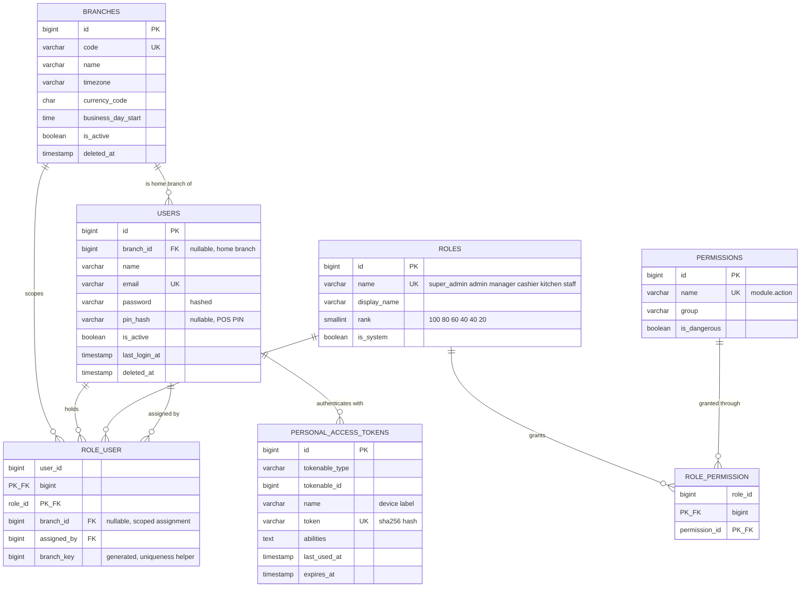

**Cardinality notes**

| Relationship | Rule |
|---|---|
| `users` → `branches` | Optional. Super Admin and Admin have no home branch. |
| `users` ↔ `roles` | Many-to-many. A user **must** hold at least one role to be functional; a user with zero roles authenticates but is denied everywhere ([04](04-user-roles-permissions.md) E2). |
| `role_user.branch_id` | Nullable. `NULL` means the role applies at the home branch or across the role's natural reach. The `branch_key` generated column exists solely so the unique constraint works with `NULL`s ([05](05-database-design.md) §5.2). |
| `role_permission` | Pure pivot, no timestamps. Changes are captured in `audit_logs`. |

---

## 4. Catalogue

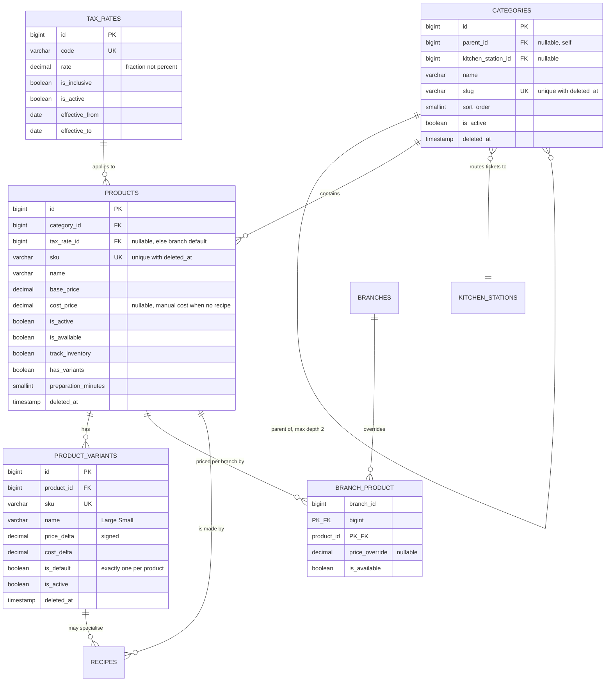

**Effective price** is resolved from three sources — product base price, branch override, variant delta.
The single authoritative formula is in [09-business-rules.md](09-business-rules.md) §3, and the SQL in
[05](05-database-design.md) §9.

**Why `branch_product` is a pivot with payload.** Storing the override on `products` would need one
column per branch. Storing it on a separate `product_prices` table with an effective date range was
considered and rejected as unnecessary for MVP: menu price history is not a requirement, and
`order_items.unit_price` already preserves what was actually charged.

---

## 5. Sales

The core transactional cluster.

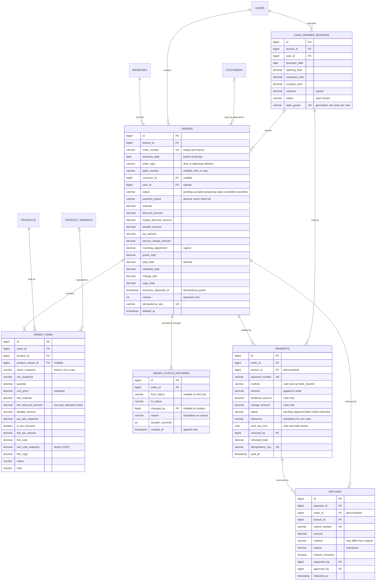

**Cardinality notes**

| Relationship | Notation | Reason |
|---|---|---|
| `orders → order_items` | `\|\|--\|{` one-or-many | An order with no lines is meaningless and is rejected at validation. |
| `orders → order_status_histories` | `\|\|--\|{` one-or-many | Creation itself writes the first history row (`NULL → pending`). |
| `orders → payments` | `\|\|--o{` zero-or-many | Pending orders are unpaid; split tender creates several. |
| `customers → orders` | `\|o--o{` optional both ways | Walk-in sales have no customer; a customer may have no orders. |
| `payments → refunds` | `\|\|--o{` | A refund always names the payment it reverses, so the money path is traceable. |
| `refunds → orders` | `\|\|--o{` | Denormalised order link so order-level refund totals need no join through payments. |

**Why `payments.branch_id` is denormalised.** Every payment query is branch-scoped
([04](04-user-roles-permissions.md) §5.2). Without the column, the global scope would have to join
`orders` on every read, including the high-frequency shift report. The value is copied at insert and
never changes, because an order never moves branch.

---

## 6. Kitchen

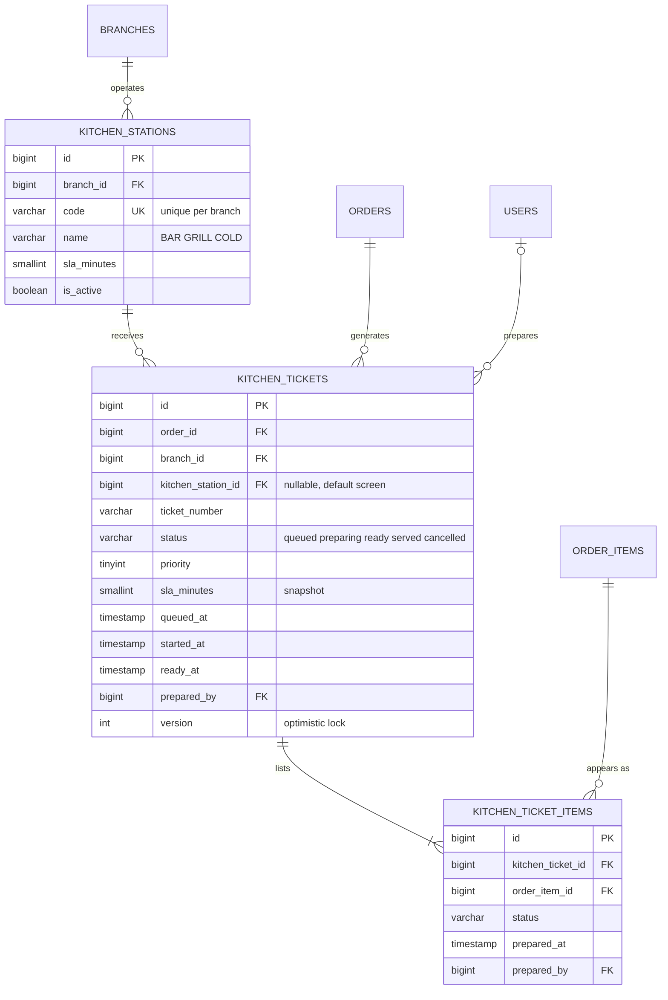

**One ticket per order per station.** An order containing a latte and a burger produces two tickets —
one for `BAR`, one for `GRILL` — each holding only its own lines. This is why
`kitchen_ticket_items` exists rather than the KDS reading `order_items` directly: the same order's lines
are split across screens, and each split needs independent status.

The `uq_kt_order_station (order_id, kitchen_station_id)` constraint means re-running ticket generation
for an order is idempotent.

---

## 7. Inventory

The module with the most demanding integrity requirements.

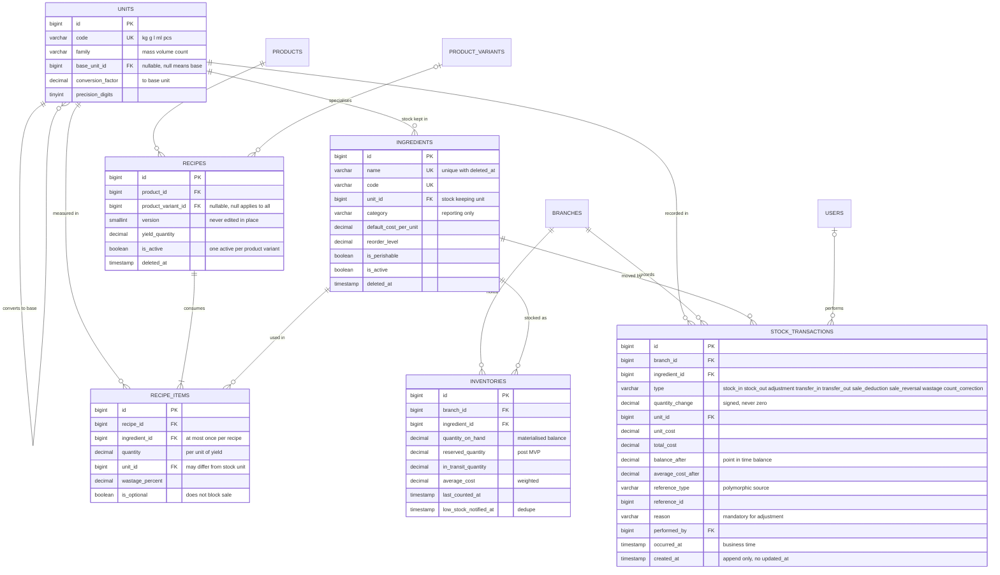

### 7.1 The two most important relationships

**`inventories` is a cache of `stock_transactions`.**

```text
inventories.quantity_on_hand  ==  SUM(stock_transactions.quantity_change)
                                  WHERE branch_id = X AND ingredient_id = Y
```

This invariant (C8) is verified nightly and is the definition of correctness for the whole inventory
module. A discrepancy is a bug, never something to be quietly corrected.

**`recipes` is the bridge between selling and stocking.** It is the only path by which an
`order_item` becomes a `stock_transaction`:

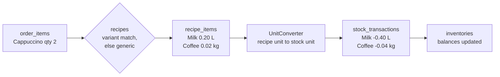

Worked arithmetic, including wastage and unit conversion, is in
[14-inventory-workflow.md](14-inventory-workflow.md) §4.

### 7.2 Self-referencing units

`units.base_unit_id` points at the family's base unit; the base row has `NULL`. Conversion multiplies
by `conversion_factor` to reach the base, then divides by the target's factor. Cross-family conversion
is rejected (FR-INV-003) — the `family` column exists precisely so that "0.5 litres of flour" fails
loudly instead of silently deducting the wrong amount.

---

## 8. Stock transfers

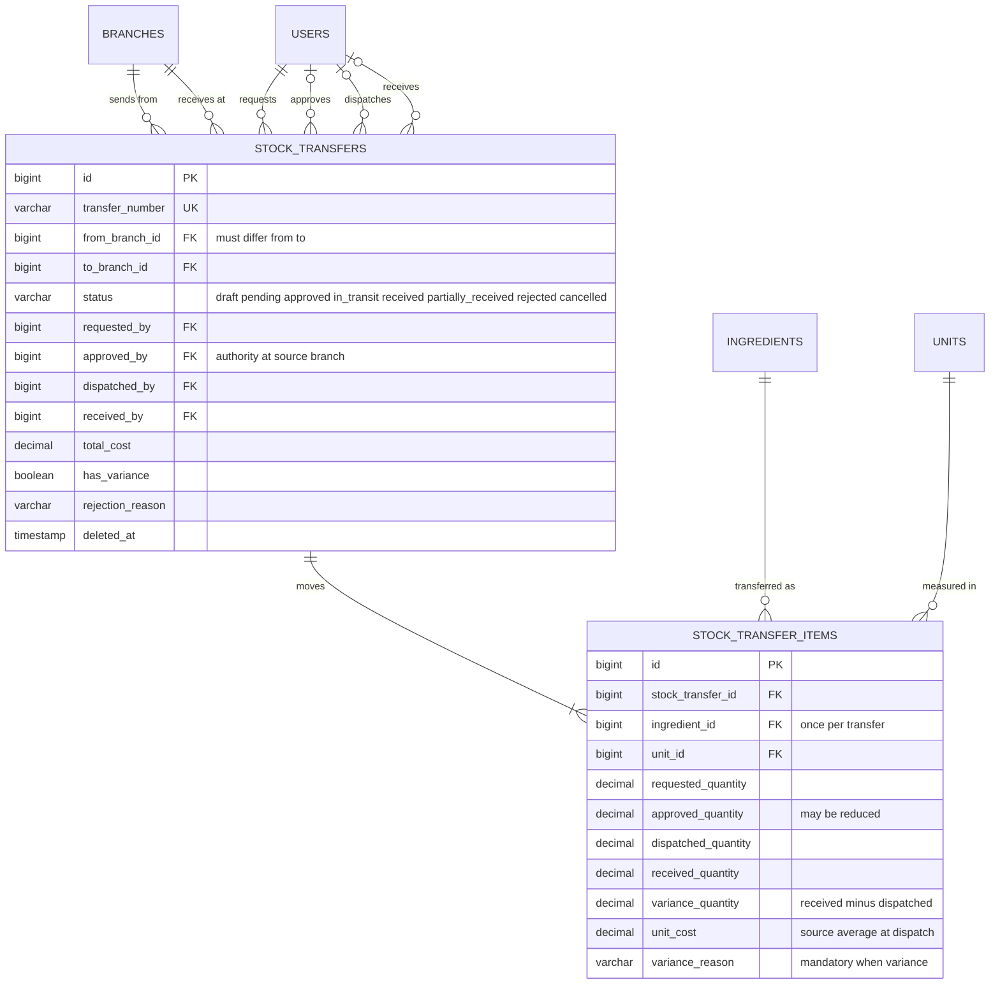

**Two foreign keys to the same table.** `stock_transfers` references `branches` twice. This is the one
place where the branch-scope rule "visible when `branch_id` is in scope" does not apply — a transfer is
visible when **either** endpoint is in scope ([04](04-user-roles-permissions.md) §5.2). It requires its
own tests.

**Four quantity columns, not one.** Requested, approved, dispatched and received are genuinely
different facts and diverge routinely: a branch requests 10 kg, the source approves 8, dispatches 8 and
the destination receives 7.5. Collapsing them would destroy the variance trail that makes shrinkage
detectable.

---

## 9. Customers and loyalty

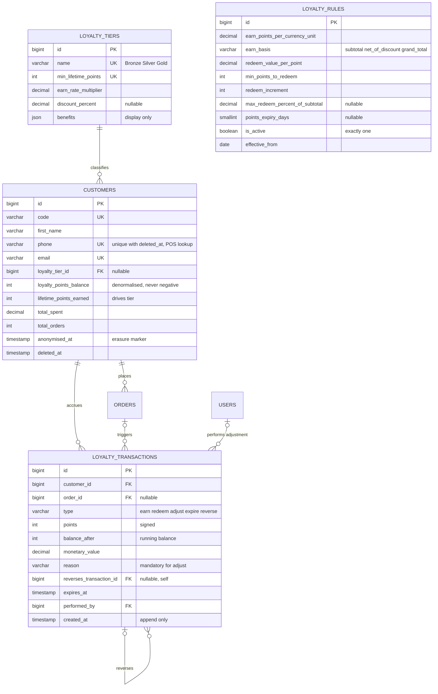

**`loyalty_rules` has no foreign key to anything.** It is configuration read at calculation time. The
resulting points are written to the ledger with the values already applied, so a later rate change
never rewrites history — the same snapshot principle used for prices and tax.

**Self-reference for reversals.** When a completed order is refunded, a `reverse` row is written
pointing at the original `earn` row via `reverses_transaction_id`. The original is never deleted or
edited, which is what makes the balance reconstructable (FR-CUS-006).

---

## 10. Finance and platform

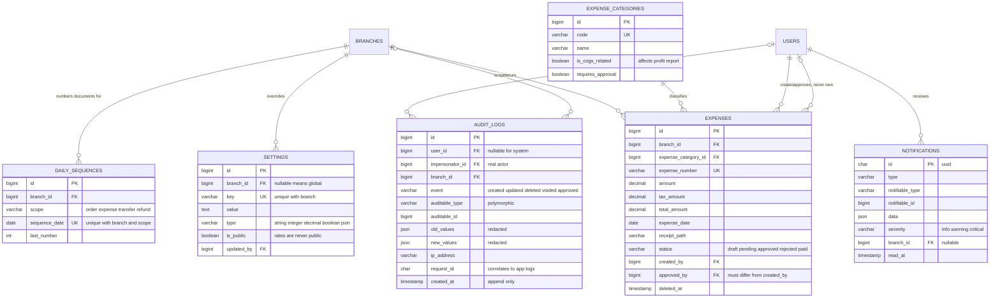

**`audit_logs` has no foreign key to its target.** The `auditable_type` / `auditable_id` pair is
polymorphic and deliberately unconstrained: an audit row must survive the deletion of the thing it
describes. A foreign key would make it impossible to record a hard delete.

**`daily_sequences` looks trivial but is load-bearing.** It is the only thing standing between
concurrent order creation and duplicate order numbers ([02](02-system-architecture.md) §7).

---

## 11. Cross-module integrity map

The invariants that span modules. Each has a reconciliation job in [05](05-database-design.md) §11 and a
test in [24](24-qa-test-plan.md).

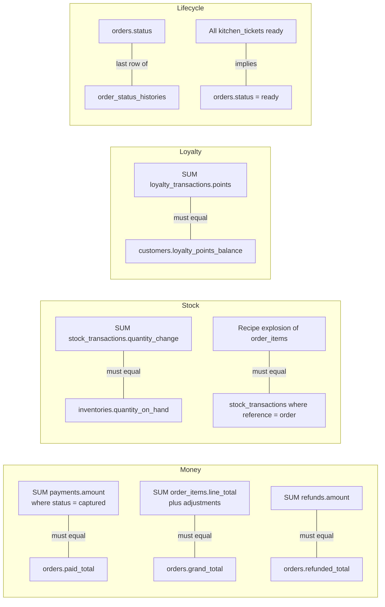

| # | Invariant | Constraint ID | Verified by |
|---|---|---|---|
| 1 | Captured payments equal `paid_total` | C6 | Hourly job + `PaymentService` assertion |
| 2 | Line totals equal `grand_total` | C5 | Nightly job + post-write assertion |
| 3 | Refunds equal `refunded_total` | — | Hourly job |
| 4 | Ledger equals balance | C8 | Nightly job |
| 5 | Order consumption matches its recipe | — | Feature test per product |
| 6 | Loyalty ledger equals balance | C7 | Nightly job |
| 7 | Status equals the latest history row | C9 | State machine + test |
| 8 | All tickets ready implies order ready | — | [13](13-kitchen-workflow.md) §5 |

---

## 12. Deletion impact map

What happens when a record is removed. Derived from the foreign key rules in
[05](05-database-design.md) §1.6.

```mermaid
flowchart TD
    DB["Delete a branch"] --> DB1["Soft delete only"]
    DB1 --> DB2["users.branch_id -> NULL"]
    DB1 --> DB3["orders, payments, inventories: RESTRICT<br/>hard delete impossible"]
    DB1 --> DB4["branch_product, settings, daily_sequences: CASCADE"]

    DP["Delete a product"] --> DP1["Soft delete only"]
    DP1 --> DP2["order_items: RESTRICT<br/>history preserved via snapshots"]
    DP1 --> DP3["product_variants, recipes, branch_product: CASCADE"]

    DO["Delete an order"] --> DO1["Soft delete only"]
    DO1 --> DO2["order_items, histories, kitchen_tickets: CASCADE"]
    DO1 --> DO3["payments: RESTRICT<br/>a paid order cannot be removed"]
    DO1 --> DO4["stock_transactions: untouched<br/>ledger is never deleted"]

    DC["Delete a customer"] --> DC1["Soft delete, or anonymise"]
    DC1 --> DC2["orders.customer_id -> NULL on hard delete"]
    DC1 --> DC3["loyalty_transactions: RESTRICT"]
    DC1 --> DC4["Anonymise preferred: financial totals survive"]

    DI["Delete an ingredient"] --> DI1["Soft delete only"]
    DI1 --> DI2["recipe_items, stock_transactions: RESTRICT"]
    DI1 --> DI3["inventories: CASCADE only if branch removed"]

    DU["Delete a user"] --> DU1["Soft delete only"]
    DU1 --> DU2["orders, payments: RESTRICT"]
    DU1 --> DU3["role_user: CASCADE"]
    DU1 --> DU4["audit_logs.user_id -> NULL"]
```

**Rule of thumb:** anything touching money, stock or history is `RESTRICT` plus a soft delete. Anything
that is purely a child of its parent is `CASCADE`. Anything optional is `SET NULL`.

---

## 13. Testing considerations

| Area | Test |
|---|---|
| Cardinality | For each `\|{` (one-or-many) relationship, assert the parent cannot be persisted without at least one child. |
| Optionality | For each `o` relationship, assert a `NULL` is accepted. |
| Self-reference | Category depth 3 rejected; unit conversion chains resolve; a loyalty reversal cannot reverse itself. |
| Dual FK | Transfer visibility from source, destination and a third branch. |
| Polymorphic | Audit row survives hard deletion of its target; notification resolves its notifiable. |
| Deletion rules | One test per edge in §12. |
| Cross-module invariants | One test per row in §11, run after a randomised 500-operation simulation. |
| Diagram accuracy | A CI check compares the tables named in this document against `SHOW TABLES` and fails on drift. |

> **Keeping the ERD honest.** Diagrams rot faster than prose. The CI check above is the only thing that
> will keep this document trustworthy once implementation begins. It is listed as a task in
> [31-development-roadmap.md](31-development-roadmap.md) Phase 1.

---

## 14. Related documents

[05-database-design.md](05-database-design.md) ·
[09-business-rules.md](09-business-rules.md) ·
[11-order-workflow.md](11-order-workflow.md) ·
[14-inventory-workflow.md](14-inventory-workflow.md) ·
[15-stock-transfer.md](15-stock-transfer.md) ·
[16-customer-loyalty.md](16-customer-loyalty.md)
