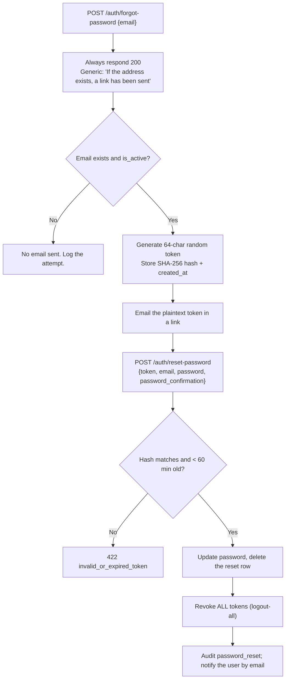
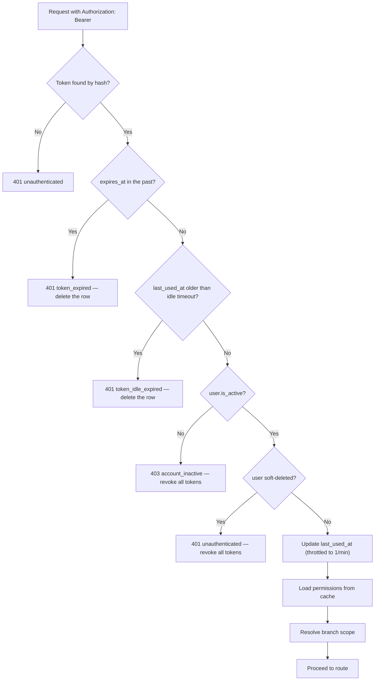
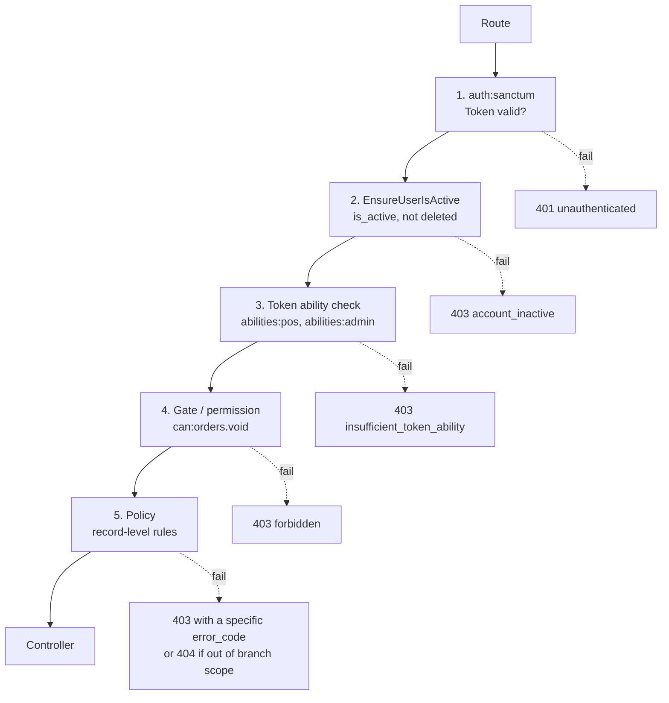

# 08 — Authentication and Authorization

> **Document purpose.** Define how identity is established (authentication) and how permission is
> decided (authorization) at the mechanical level: Sanctum token lifecycle, session policy, password
> and PIN handling, token abilities, and the middleware/policy chain. The **permission catalogue and
> role matrix** live in [04-user-roles-permissions.md](04-user-roles-permissions.md); this document
> covers the machinery that enforces them.

**Status:** 🟡 MVP — Planned. **Laravel Sanctum is not installed** ([01](01-project-overview.md) §2).
Installing and configuring it is the first task of roadmap Phase 1.

---

## 1. Terminology

| Term | Meaning |
|---|---|
| **Authentication** | Proving *who* the caller is. Produces a `User`. |
| **Authorization** | Deciding *whether* that user may perform this action on this record. |
| **Token** | A Sanctum personal access token. The only credential accepted by the API after login. |
| **Ability** | A coarse capability stamped onto a token at issue time (e.g. `pos:*`). A ceiling, not a grant. |
| **Permission** | A fine-grained capability read from the database per request (e.g. `orders.void`). |
| **Guard** | Laravel's authentication driver. RestaurantOS uses `sanctum` for the API. |

> **Abilities and permissions are different layers and both apply.** A request succeeds only if the
> token's abilities allow it **and** the user's permissions allow it. §8 explains why both exist.

---

## 2. Why Sanctum, and in which mode

Sanctum offers two modes. RestaurantOS uses **API token** mode, not SPA cookie mode.

| | API tokens (chosen) | SPA cookie mode (rejected) |
|---|---|---|
| Credential | `Authorization: Bearer <token>` | Encrypted session cookie + CSRF token |
| Origin coupling | None — SPA may be on any host | Requires same top-level domain and `SANCTUM_STATEFUL_DOMAINS` |
| Server state | Stateless; token row in the DB | Session store |
| Revocation | Per-token, immediate | Session invalidation |
| Suits | POS terminals, kitchen tablets, future mobile app | Classic same-domain SPA |

**Decision (ADR-02).** The POS and KDS are long-lived, device-bound clients that may be served from a
CDN on a different origin from the API. Token mode removes the CSRF and cookie-domain coupling
entirely, and gives per-device revocation — a genuine operational need when a kitchen tablet is lost.

**Rejected alternative — stateless JWT.** A JWT cannot be revoked before expiry without a
server-side denylist, which reintroduces the very state JWT was chosen to avoid. Revoking a
compromised cashier's access must be instant.

---

## 3. Installation and configuration 🟡

```bash
composer require laravel/sanctum
php artisan install:api          # publishes config, migration, and creates routes/api.php
php artisan migrate
```

`app/Models/User.php` gains the `HasApiTokens` trait.

### 3.1 Configuration

| Setting | File | Value | Reason |
|---|---|---|---|
| `sanctum.expiration` | `config/sanctum.php` | `SANCTUM_EXPIRATION` minutes | Absolute token lifetime. |
| `sanctum.guard` | | `['web']` → **removed** | Prevents accidental session fallback on the API. |
| Idle timeout | Custom middleware | `AUTH_IDLE_TIMEOUT_MINUTES` | Sanctum has no native idle expiry — §5.2. |
| Token prefix | `sanctum.token_prefix` | `rosat_` | Enables secret scanners to detect leaked tokens. |
| Hashing | `config/hashing.php` | `bcrypt`, rounds ≥ 12 | NFR-SEC-002. |

### 3.2 Token lifetimes by client type ⚠️

| Client | Absolute expiry | Idle timeout | Reason |
|---|---|---|---|
| POS terminal | 12 h | 30 min | Matches a shift; a walk-away terminal locks. |
| Kitchen display | 24 h | none | Unattended screen; must not log out mid-service. Compensated by network isolation and a device-bound token. |
| Back office (web) | 8 h | 60 min | |
| Mobile 🔵 | 30 d | 14 d | Refresh-on-use. |

These are defaults pending confirmation. The KDS exception is a deliberate security trade-off: an
expiring kitchen screen is an operational failure during service.

---

## 4. Authentication flows

### 4.1 Password login

```mermaid
sequenceDiagram
    autonumber
    participant C as Client
    participant R as RateLimiter
    participant A as AuthController
    participant S as AuthService
    participant DB as MySQL

    C->>A: POST /auth/login {email, password, device_name}
    A->>R: check throttle (email + IP)
    alt limit exceeded
        R-->>C: 429 too_many_attempts + Retry-After
    end
    A->>A: validate request
    A->>S: attempt(credentials)
    S->>DB: find user by email (incl. soft-deleted check)
    alt user not found
        S->>S: Hash::check against a dummy hash (constant time)
        S-->>C: 401 invalid_credentials
    end
    alt locked_until in future
        S-->>C: 403 account_locked
    end
    S->>S: Hash::check(password)
    alt mismatch
        S->>DB: increment failed_login_attempts; maybe set locked_until
        S->>DB: audit login_failed
        S-->>C: 401 invalid_credentials
    end
    alt is_active = false
        S->>DB: audit login_blocked_inactive
        S-->>C: 403 account_inactive
    end
    S->>DB: reset failed_login_attempts, set last_login_at / ip
    S->>DB: create token with abilities from roles
    S->>DB: audit login_success
    S-->>C: 201 {token, user, permissions, branch_scope}
```

**Note step 8.** When the email does not exist, a hash comparison is still performed against a fixed
dummy hash. Without it, the response for an unknown email returns measurably faster than for a wrong
password, which enumerates valid accounts.

### 4.2 PIN login for shared terminals 🟡

Restaurant reality: one POS terminal, six cashiers, an eight-hour shift. Typing a full password at every
handover does not happen — staff share a login instead, which destroys per-user attribution.

**Design:**

```text
POST /api/v1/auth/login-pin
{ "branch_id": 1, "employee_code": "C-014", "pin": "4821", "device_name": "pos-terminal-1" }
```

| Control | Rule |
|---|---|
| PIN length | 4–6 digits, configurable; never fewer than 4 |
| Storage | Hashed with the same algorithm as passwords. Never plaintext, never reversible. |
| Uniqueness | PINs need **not** be unique; the `employee_code` identifies the user, the PIN authenticates. Requiring uniqueness would leak which PINs are taken. |
| Scope | Only valid on a device already registered to a branch (§4.3). |
| Throttle | 3 attempts per employee code per 10 min, then the account locks and a manager is notified. |
| Abilities | POS abilities only — never admin, reports or user management. |
| Lifetime | 12 h absolute, 30 min idle. |
| Trivial PINs | `0000`, `1234`, `1111` and repeated digits are rejected at set time. |

A PIN is a **convenience credential with a reduced blast radius**, not a password equivalent. A PIN
token can never reach an endpoint requiring `users.*`, `system.*` or `reports.*`, regardless of the
user's roles.

### 4.3 Device registration 🔵

Post-MVP. A terminal is registered once by a manager, receiving a long-lived device token stored in
local storage. PIN login then requires a valid device token, binding sessions to physical hardware.

### 4.4 Logout

| Endpoint | Effect |
|---|---|
| `POST /auth/logout` | Deletes the current token row. Immediate. |
| `POST /auth/logout-all` | Deletes every token for the user. Used on password change and on suspicion of compromise. |
| `DELETE /auth/tokens/{id}` | Deletes one named device token. |

There is no "log out everywhere except here" convenience path in MVP; `logout-all` followed by a fresh
login is simpler and less error-prone.

### 4.5 Password reset



| Control | Rule |
|---|---|
| Response uniformity | Always `200` with a generic message. Never reveals registration status. |
| Token storage | Hashed. A database leak must not yield usable reset links. |
| Single use | Row deleted on success. |
| Expiry | 60 min. |
| Throttle | 3 requests per email per hour. |
| Post-reset | All tokens revoked — a reset is the standard response to compromise. |

### 4.6 Password change

Requires the current password (FR-AUTH-007). On success, all **other** tokens are revoked; the current
session survives so the user is not logged out of the device they are using.

---

## 5. Session lifecycle

### 5.1 Token validation on each request



**`last_used_at` write throttling.** Updating it on every request would add a write to every single
API call, including the KDS poll every 5 s per screen. It is updated at most once per minute per token.
The idle window is therefore accurate to within a minute, which is sufficient.

### 5.2 Idle expiry middleware

Sanctum enforces absolute expiry only. Idle expiry is a custom middleware:

```text
if (token.last_used_at !== null
    && token.last_used_at < now() - idleTimeoutFor(token.name))
{
    token.delete();
    abort(401, 'token_idle_expired');
}
```

The timeout is selected per client type from §3.2, keyed on the token name set at login.

### 5.3 Revocation triggers

Access is revoked **immediately** — not at next expiry — on any of:

| Trigger | Scope of revocation |
|---|---|
| Explicit logout | Current token |
| `logout-all` | All tokens |
| Password change | All other tokens |
| Password reset | All tokens |
| User deactivated | All tokens |
| User soft-deleted | All tokens |
| Role or permission change | **No revocation** — permissions are read per request, so the change takes effect on the next call (E8 in [04](04-user-roles-permissions.md)) |
| Suspected compromise | All tokens, by an Admin |

---

## 6. Password policy

| Rule | Value | Rationale |
|---|---|---|
| Minimum length | 12 characters | Length beats composition rules. |
| Composition | None enforced | Forced symbols produce `Password1!` and a sticky note. |
| Breach check | Rejected if found in a known-breach corpus (Laravel's `Password::uncompromised()`) | Catches the passwords that are actually attacked. |
| Maximum length | 128 | Prevents a bcrypt DoS via very long inputs. |
| Reuse | Last 3 hashes stored and compared 🔵 | Post-MVP. |
| Rotation | **Not enforced** | Forced rotation demonstrably worsens password quality. |
| Hashing | bcrypt, cost ≥ 12 | NFR-SEC-002. Cost tuned so hashing takes ≈ 250 ms on production hardware. |
| Transmission | HTTPS only | NFR-SEC-001. |
| Storage in logs | Never | Redacted by the log formatter and by the audit redaction list. |

### 6.1 Account lockout

| Rule | Value |
|---|---|
| Threshold | 5 consecutive failures |
| Window | 15 minutes |
| Lock duration | 15 minutes, doubling to a maximum of 4 h on repeated lockouts |
| Counter reset | On successful login |
| Notification | The user and their branch manager are notified on lockout |
| Unlock | Automatic on expiry, or manually by a user with `users.reset_password` |

Lockout is **per account and per IP**, tracked separately, so a single attacker cannot lock out an
entire branch by cycling emails from one address, and a distributed attack against one account still
trips the per-account counter.

---

## 7. Authorization chain

Five gates, in order. Each is a separate layer with a separate failure mode.



### 7.1 Route declaration

```text
Route::middleware(['auth:sanctum', 'active', 'abilities:orders'])->group(function () {
    Route::post('/orders', [OrderController::class, 'store'])
         ->middleware('can:orders.create');

    Route::post('/orders/{order}/void', [OrderController::class, 'void'])
         ->middleware('can:void,order');   // policy method, receives the record
});
```

Simple permission checks use `can:<permission>`. Record-level decisions use `can:<method>,<model>`,
which invokes the policy and gives it the record.

### 7.2 Policy responsibilities

A policy answers questions a permission cannot, because they depend on the record:

| Question | Example |
|---|---|
| Is the record in the user's branch scope? | `OrderPolicy::view` |
| Is the record in a state that allows this? | `OrderPolicy::update` — Pending only |
| Does the user own it? | `OrderPolicy::view` without `orders.view_all_users` |
| Is a numeric threshold respected? | `OrderPolicy::applyDiscount` |
| Does separation of duties hold? | `ExpensePolicy::approve` — approver ≠ creator |
| Does the actor hold authority at the *other* branch? | `TransferPolicy::approve` — source branch |

Policies **must not** mutate anything and **must not** perform expensive queries; they run on every
request to the resource.

---

## 8. Token abilities

### 8.1 Why abilities exist alongside permissions

Permissions answer "what may this **person** do?" Abilities answer "what may this **credential** do?"
They differ in three situations that matter:

1. **A PIN token** belongs to a Manager but must not reach admin endpoints, because the credential is
   weak (4 digits, typed in public) even though the person is trusted.
2. **A KDS token** on an unattended tablet must not be able to void an order, even if a manager logged
   the screen in.
3. **A future integration token** must be scoped to exactly the endpoints an integration needs.

An ability is a **ceiling**; a permission is a **grant**. The effective capability is the intersection.

### 8.2 Ability catalogue

| Ability | Grants access to | Issued to |
|---|---|---|
| `*` | Everything the user's permissions allow | Back-office password login |
| `pos:*` | `/pos/*`, `/orders/*`, `/payments/*`, `/customers/*` | POS password and PIN login |
| `pos:read` | `/pos/*` read-only | Menu display 🔵 |
| `kitchen:*` | `/kitchen/*`, read-only `/orders/{id}` | KDS login |
| `reports:read` | `/reports/*` | Reporting integrations 🔵 |
| `admin:*` | `/admin/*` | Back-office password login for Admin/Super Admin |

### 8.3 Ability assignment at login

```text
if (login_method === 'pin')                    -> ['pos:*']
elseif (device_name starts with 'kds-')        -> ['kitchen:*']
elseif (user has admin or super_admin role)    -> ['*']
elseif (user has manager role)                 -> ['pos:*', 'reports:read', 'admin:*']
else                                           -> ['pos:*']
```

**Abilities never widen access.** A Cashier logging in from a back-office browser receives `pos:*` and
still cannot void an order, because the *permission* is missing. Conversely, a Super Admin on a PIN
token receives `pos:*` and cannot reach `/admin/*` even though every permission is held.

---

## 9. Branch scope resolution

The `ResolveBranchScope` middleware runs after authentication and before authorization.

```text
1. scope = branch IDs from the user's role assignments (see [04] §5.1)
2. if user has branches.view_all: scope = all active branch IDs
3. if header X-Branch-Id is present:
       if header value not in scope: abort 403 branch_out_of_scope
       activeBranch = header value
   else:
       activeBranch = users.branch_id, or the single element of scope, or null
4. attach {scope, activeBranch} to the request context
5. apply the global Eloquent scope for branch-owned models
```

Rules restated from [04](04-user-roles-permissions.md) §5.3, because they are enforced here:

- The header **narrows**; it can never widen.
- A `branch_id` in a request **body** is validated against the resolved scope and, on any disagreement
  with the active branch, rejected `422`. It is never used to select the branch.

---

## 10. Validation rules

| Endpoint | Field | Rule |
|---|---|---|
| `POST /auth/login` | `email` | required, email, max 190 |
| | `password` | required, string, min 8, max 128 |
| | `device_name` | required, string, max 100, matches `^[a-zA-Z0-9\-_ ]+$` |
| `POST /auth/login-pin` | `branch_id` | required, exists, active |
| | `employee_code` | required, exists |
| | `pin` | required, digits only, 4–6 |
| `POST /auth/change-password` | `current_password` | required, must match |
| | `password` | required, min 12, confirmed, uncompromised, different from current |
| `POST /auth/forgot-password` | `email` | required, email |
| `POST /auth/reset-password` | `token` | required, 64 characters |
| | `password` | required, min 12, confirmed, uncompromised |
| Set PIN | `pin` | required, digits, 4–6, not in the trivial list, not equal to any part of the employee code |

Central catalogue: [20-validation-rules.md](20-validation-rules.md) §3.

---

## 11. Business rules

| # | Rule |
|---|---|
| BR-AUTH-01 | A user with zero roles authenticates successfully but is denied by every protected endpoint. Authentication and authorization are separate failures and must be reported separately. |
| BR-AUTH-02 | A deactivated user's tokens are deleted at deactivation, not merely rejected. |
| BR-AUTH-03 | Permissions are read from the database on every request, never cached inside the token. |
| BR-AUTH-04 | A PIN token can never exceed `pos:*` abilities regardless of the holder's role. |
| BR-AUTH-05 | Password change revokes other tokens; password reset revokes all tokens. |
| BR-AUTH-06 | The last active Super Admin cannot be deactivated ([04](04-user-roles-permissions.md) G5) — an authentication-layer restatement of an authorization guard. |
| BR-AUTH-07 | Login, logout, failed login, lockout, password change and password reset are all audited. |
| BR-AUTH-08 | A token is bound to the user, not to a branch. Branch scope is resolved per request, so a multi-branch manager switches branches without re-authenticating. |

---

## 12. Edge cases

| # | Case | Expected behaviour |
|---|---|---|
| E1 | Token used after the user is deleted | `401`. The token row is cascade-deleted with the user; the fallback check catches any stragglers. |
| E2 | Token used after the user is deactivated | `403 account_inactive`, and remaining tokens are revoked. |
| E3 | Two devices, same user, one logs out | The other continues. Tokens are independent. |
| E4 | Clock skew between app servers | Expiry uses database `NOW()`, not PHP time, so all nodes agree. |
| E5 | Password changed on device A while device B is mid-request | B's in-flight request completes; B's next request returns `401`. |
| E6 | User locked out during service | A manager with `users.reset_password` unlocks. Documented in [30](30-troubleshooting.md) §3. |
| E7 | KDS token expires overnight | Absolute 24 h expiry lands outside service hours by design; the screen shows a re-login prompt, not a blank page. |
| E8 | Login while already holding 20 tokens | Oldest tokens beyond `AUTH_MAX_TOKENS_PER_USER` (default 10) are pruned at login. |
| E9 | `X-Branch-Id` names a deleted branch | `403 branch_out_of_scope` — a deleted branch is in nobody's scope. |
| E10 | User's only role is removed mid-session | Authentication persists; every protected call returns `403`. |
| E11 | Reset token used twice | Second attempt returns `422 invalid_or_expired_token`. |
| E12 | Concurrent logins with the same PIN by two people | Both succeed and produce distinct tokens. Attribution is by `employee_code`, so this is a policy problem, not a technical one; it is why PIN sharing must be a disciplinary matter. |
| E13 | Token replayed from a different IP | Accepted in MVP. IP pinning is 🔵 — mobile networks change IP mid-session and would cause constant false logouts. |
| E14 | User has `is_active = true` but their branch is deactivated | Login succeeds; POS writes fail `422 branch_inactive`. Reporting still works. |

---

## 13. Security considerations

| # | Consideration | Mitigation |
|---|---|---|
| S1 | Token theft via XSS | Tokens are stored in memory where possible; `localStorage` is used only for the device token. The SPA sets a strict CSP; no `eval`, no inline scripts. [22](22-security.md) §6. |
| S2 | Token theft in transit | TLS 1.2+ only, HSTS. |
| S3 | Token leakage in logs or URLs | Tokens are never accepted as query parameters. `Authorization` is redacted in logs. The `rosat_` prefix lets secret scanners flag leaks in commits. |
| S4 | Database leak yields tokens | Only SHA-256 hashes are stored. |
| S5 | Brute force | Per-account and per-IP throttling, lockout, breach-checked passwords. |
| S6 | Account enumeration | Uniform responses and timing on login and password reset. |
| S7 | Weak PINs | Trivial-PIN blocklist, tight throttle, reduced abilities, branch-bound. |
| S8 | Session fixation | Not applicable — no server session; a new token is minted per login. |
| S9 | CSRF | Not applicable in token mode — no cookie is used for authentication. |
| S10 | Privilege escalation via a stale token | Permissions are read per request, so a demotion is effective immediately. |
| S11 | Insider abuse of shared terminals | PIN login gives per-user attribution; every order records `user_id`; reprints and voids are audited. |
| S12 | Reset-link interception | Short expiry, single use, hashed at rest, and all sessions revoked on use. |

---

## 14. Testing considerations

| Area | Test |
|---|---|
| Login success | Valid credentials return `201` with a token that authenticates a subsequent request. |
| Login failure parity | Unknown email and wrong password return byte-identical bodies; timing difference under a set threshold. |
| Lockout | 5 failures then a correct password returns `429`/`403`, not `201`. |
| Inactive user | Valid token + `is_active = false` returns `403 account_inactive` and the token is gone afterwards. |
| Absolute expiry | Time-travel past `expires_at`; assert `401 token_expired`. |
| Idle expiry | Time-travel past the idle window; assert `401 token_idle_expired`. |
| Revocation | Logout, then reuse the token; assert `401`. |
| Password change | Other tokens die, the current one survives. |
| Password reset | Token single-use, expires at 60 min, revokes all sessions. |
| Abilities | A PIN token calling `/admin/users` returns `403 insufficient_token_ability` even for a Super Admin. |
| Abilities vs permissions | A `*`-ability Cashier still cannot void an order. |
| Branch header | Out-of-scope `X-Branch-Id` returns `403`; body `branch_id` disagreeing with the active branch returns `422`. |
| Permission freshness | Revoke a permission; the next request is denied with no re-login. |
| Token pruning | The 11th login prunes the oldest token. |
| Audit | Each of login success, failure, lockout, change and reset writes exactly one audit row. |
| Concurrency | Two simultaneous logins produce two distinct valid tokens. |

Full plan: [24-qa-test-plan.md](24-qa-test-plan.md) §5.

---

## 15. Related documents

[04-user-roles-permissions.md](04-user-roles-permissions.md) ·
[07-api-documentation.md](07-api-documentation.md) §2 ·
[20-validation-rules.md](20-validation-rules.md) ·
[21-error-handling.md](21-error-handling.md) ·
[22-security.md](22-security.md) ·
[27-environment-configuration.md](27-environment-configuration.md)
