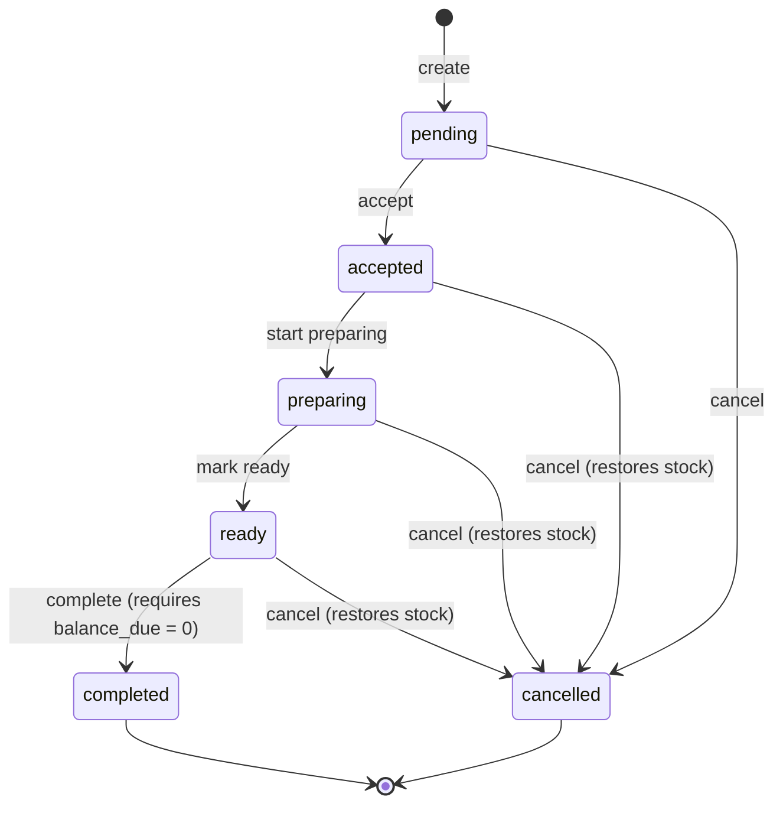

# 09 — Business Rules and Calculations

> **Document purpose.** Define every calculation the system performs and every rule that governs it:
> money arithmetic, price resolution, discounts, tax, service charge, rounding, loyalty, costing and
> profit. This document is the **authoritative source for all formulas**. Any other document that shows
> a calculation is quoting this one.

**Prerequisites:** [01](01-project-overview.md) §9 (assumptions A3, A9, A11),
[05](05-database-design.md) §1.3 (data types).

**Status:** 🟡 MVP — Planned.

---

## 1. The prime directive: no hard-coded financial values

> **Rule BR-000.** No tax rate, service charge rate, loyalty rate, discount limit, rounding increment
> or threshold may appear as a literal in application code. Every such value is read from
> configuration ([05](05-database-design.md) §5.3 `settings`, `tax_rates`, `loyalty_rules`).

This is a stakeholder constraint (CON-007) and assumption A3, and it is enforced mechanically:

| Enforcement | Detail |
|---|---|
| Lint rule | A CI check greps the domain layer for decimal literals matching a rate pattern (`0.07`, `7.0`, `1.07`) outside of tests, and fails the build. [29](29-coding-standards.md) §9. |
| No defaults shipped | The seeder does **not** create tax rates or loyalty rates ([05](05-database-design.md) §10.3). |
| Fail loud | A missing required rate raises `ConfigurationMissingException` → `500` with `error_code = configuration_missing`, naming the setting key. It never silently defaults to zero — a silent zero would under-charge tax and be discovered by an auditor, not by a test. |
| Snapshot | Every rate actually applied is written onto the transaction row, so history is explicable even after the configuration changes. |

**Example of what this forbids:**

```php
// FORBIDDEN — a literal rate
$tax = $taxable * 0.07;

// FORBIDDEN — a "sensible default"
$rate = $branch->taxRate?->rate ?? 0.07;

// CORRECT
$rate = $this->taxRateResolver->resolveFor($product, $branch);   // throws if unresolvable
$tax  = $this->money->multiply($taxable, $rate);
```

---

## 2. Money arithmetic

### 2.1 Representation

| Layer | Representation |
|---|---|
| MySQL | `DECIMAL(12,2)` for money, `DECIMAL(12,4)` for unit costs |
| PHP (in calculation) | Integer **minor units** inside a `Money` value object |
| PHP (rates) | `BCMath` string decimals — never `float` |
| JSON | `{ "amount": "12.50", "minor": 1250, "currency": "THB" }` |
| JavaScript | Integer minor units for arithmetic; `Intl.NumberFormat` for display |

**Never `float`.** `0.1 + 0.2 !== 0.3` in IEEE-754, and a restaurant that sells ten thousand items a
month will surface that difference in a bank reconciliation.

### 2.2 Rounding policy

| Rule | Value |
|---|---|
| Mode | **Half-up** (`ROUND_HALF_UP`): `0.125 → 0.13` |
| Precision | 2 decimal places for money; the currency's actual minor-unit exponent where it differs |
| **Where rounding happens** | At each **line** after multiplication, and once more on each order-level aggregate |
| Where it does not happen | Never inside an intermediate sum. Sum exact values, then round once. |

**Why half-up rather than banker's rounding.** Half-up matches what a cashier computes by hand and what
a customer expects on a receipt. Banker's rounding is statistically fairer over large volumes but
produces receipts that look wrong to a human, which generates disputes. Consistency with the printed
receipt is worth more here than distributional fairness.

### 2.3 The rounding order problem

Line-level and total-level rounding give different answers. The order is fixed and must not vary:

```text
For each line:
    line_subtotal   = ROUND(unit_price × quantity, 2)
    line_discount   = ROUND(discount computation, 2)
    taxable_amount  = line_subtotal − line_discount          (exact, both already rounded)
    line_tax        = ROUND(taxable_amount × tax_rate, 2)
    line_total      = taxable_amount + line_tax              (exact)

Then, at order level:
    subtotal        = Σ line_subtotal                        (exact sum of rounded values)
    discount_amount = Σ line_discount                        (exact sum)
    taxable_amount  = Σ taxable_amount                       (exact sum)
    tax_amount      = Σ line_tax                             (exact sum — NOT recomputed from the total)
    grand_total     = subtotal − discount_amount + tax_amount + service_charge + rounding_adjustment
```

> **Critical:** `tax_amount` is the **sum of line taxes**, never `taxable_amount × rate`. The two differ
> by up to one minor unit per line. The sum-of-lines figure is the one that reconciles against the
> printed receipt, so it is the one stored. A test asserts the two are within tolerance and that the
> stored value is the sum.

### 2.4 Golden example

Reused throughout the documentation and implemented as a fixture in
[24-qa-test-plan.md](24-qa-test-plan.md) §7.1.

**Configuration:** tax rate `0.0700` exclusive · no service charge · no cash rounding · currency `THB`

**Cart:** Cappuccino (Large) × 2 at 5.50 · Croissant × 1 at 4.00 · order discount 10 %

| Step | Calculation | Result |
|---|---|---|
| Line 1 subtotal | `ROUND(5.50 × 2, 2)` | `11.00` |
| Line 2 subtotal | `ROUND(4.00 × 1, 2)` | `4.00` |
| Subtotal | `11.00 + 4.00` | `15.00` |
| Order discount | `ROUND(15.00 × 0.10, 2)` | `1.50` |
| Allocation to line 1 | `ROUND(1.50 × 11.00 / 15.00, 2)` | `1.10` |
| Allocation to line 2 | `1.50 − 1.10` (remainder to the last line) | `0.40` |
| Line 1 taxable | `11.00 − 1.10` | `9.90` |
| Line 2 taxable | `4.00 − 0.40` | `3.60` |
| Line 1 tax | `ROUND(9.90 × 0.07, 2)` = `ROUND(0.693, 2)` | `0.69` |
| Line 2 tax | `ROUND(3.60 × 0.07, 2)` = `ROUND(0.252, 2)` | `0.25` |
| Taxable amount | `9.90 + 3.60` | `13.50` |
| Tax amount | `0.69 + 0.25` | `0.94` |
| **Grand total** | `15.00 − 1.50 + 0.94` | **`14.44`** |

> Note `13.50 × 0.07 = 0.945 → 0.95`, which differs from the stored `0.94`. This is precisely the
> discrepancy §2.3 warns about. The receipt shows `0.94` because that is the sum of what each line was
> charged.

---

## 3. Price resolution

**Rule BR-PRICE-01.** The effective unit price of a line is resolved in this exact order:

```text
base            = branch_product.price_override  ?? products.base_price
effective_price = base + (product_variants.price_delta ?? 0)
```

| Precedence | Source | Notes |
|---|---|---|
| 1 | `branch_product.price_override` | Per-branch price for this product. `NULL` falls through. |
| 2 | `products.base_price` | Global default. |
| + | `product_variants.price_delta` | **Signed**, added after the base is resolved. |

**Rules**

| # | Rule |
|---|---|
| BR-PRICE-02 | The effective price must be `>= 0`. A variant delta that would drive it negative is rejected `422 negative_effective_price`. |
| BR-PRICE-03 | The effective price is **snapshotted** to `order_items.unit_price` at order creation. Later price changes never alter an existing order (FR-CAT-007). |
| BR-PRICE-04 | Prices supplied by the client are ignored entirely. The server always resolves from the database. |
| BR-PRICE-05 | A product with `has_variants = true` requires a variant; omitting it is `422 variant_required`. |
| BR-PRICE-06 | A product unavailable at the branch (`branch_product.is_available = false`, or `products.is_available = false`) cannot be sold: `422 product_unavailable`. |

**Worked example**

| Product | Base | Branch override | Variant | Delta | Effective |
|---|---|---|---|---|---|
| Cappuccino | 4.50 | — | Regular | 0.00 | 4.50 |
| Cappuccino | 4.50 | — | Large | +1.00 | 5.50 |
| Cappuccino | 4.50 | 5.00 (Airport branch) | Large | +1.00 | 6.00 |
| Espresso | 3.00 | — | Single | −0.50 | 2.50 |

---

## 4. Order totals

### 4.1 The canonical formulas

```text
line_subtotal        = ROUND(unit_price × quantity, 2)

Subtotal             = Σ line_subtotal

Discounted Amount    = Subtotal − Discount

taxable_amount       = Σ (line_subtotal − line_discount_amount)   [taxable lines only]

Tax                  = Σ ROUND(line_taxable × line_tax_rate, 2)

Service Charge       = ROUND(service_charge_base × service_charge_rate, 2)

Grand Total          = Subtotal − Discount + Tax + Service Charge + Rounding Adjustment

Balance Due          = Grand Total − paid_total + refunded_total

Change Due           = tendered_amount − amount_applied
```

### 4.2 Component definitions

| Component | Definition | Column |
|---|---|---|
| **Subtotal** | Sum of line subtotals, before any discount, before tax. | `orders.subtotal` |
| **Discount** | Total money reduction: order-level discount + line-level discounts + loyalty redemption. | `orders.discount_amount` + `orders.loyalty_discount_amount` |
| **Discounted Amount** | `Subtotal − Discount`. Not stored — it is `taxable_amount` when every line is taxable. Kept as a named concept because it appears on receipts. | derived |
| **Taxable amount** | Sum over **taxable lines** of `(line_subtotal − line_discount_amount)`. Excludes zero-rated products. | `orders.taxable_amount` |
| **Tax** | Sum of per-line tax. | `orders.tax_amount` |
| **Service charge** | Optional percentage; base is configurable (§7). | `orders.service_charge_amount` |
| **Rounding adjustment** | Signed correction for cash rounding (§8). | `orders.rounding_adjustment` |
| **Grand total** | Amount payable. | `orders.grand_total` |
| **Balance due** | What remains to collect. Not stored — always computed, so it cannot drift. | derived |

### 4.3 Ordering rule

**BR-TOTAL-01.** Discount is applied **before** tax. Tax is calculated on the discounted amount.

This is the near-universal convention: a customer pays tax on what they actually paid. The alternative
— taxing the pre-discount amount — over-collects tax and is incorrect in most jurisdictions.

⚠️ Should a jurisdiction require otherwise, `tax.apply_before_discount` exists as a configuration flag,
defaulting to `false`. It is documented but not exercised in MVP.

**BR-TOTAL-02.** `grand_total` can never be negative. If discounts and redemptions exceed the subtotal
plus tax, the total is clamped to `0.00` and `422 discount_exceeds_total` is returned instead of
producing a negative sale.

**BR-TOTAL-03.** An order must have at least one non-voided line. An empty order is `422 empty_order`.

---

## 5. Discounts

### 5.1 Types

| Type | Input | Computation |
|---|---|---|
| `none` | — | `0.00` |
| `percentage` | `discount_value` = percent (`10.00` = 10 %) | `ROUND(base × discount_value / 100, 2)` |
| `fixed` | `discount_value` = money amount | `MIN(discount_value, base)` |

> `discount_value` for a percentage is stored as a **percentage number**, not a fraction — the one
> deliberate exception to [05](05-database-design.md) §1.3, because it is a direct user input and
> cashiers type "10", not "0.1". Tax rates, which are never typed by a cashier, remain fractions.

### 5.2 Scope

| Scope | Base | Applied |
|---|---|---|
| **Line discount** | That line's `line_subtotal` | Directly to the line |
| **Order discount** | `Subtotal` (after line discounts) | Allocated pro-rata across lines (§5.3) |
| **Loyalty redemption** | Monetary value of redeemed points | Allocated pro-rata, tracked separately |
| **Tier discount** | `Subtotal` | Applied as an order discount; combinable per BR-DISC-05 |

### 5.3 Pro-rata allocation

An order-level discount must be pushed down to lines, because tax is per-line and per-line tax rates
may differ.

```text
For lines 1..n−1:
    line_allocation[i] = ROUND(order_discount × line_subtotal[i] / subtotal, 2)

For the final line n (largest-remainder correction):
    line_allocation[n] = order_discount − Σ line_allocation[1..n−1]
```

**BR-DISC-01.** The remainder is assigned to the **last line by subtotal descending**, not the last by
position. Assigning to the largest line minimises the relative distortion and makes the result
deterministic regardless of the order in which the cashier added items — which matters, because
otherwise the same cart produces different tax depending on click order.

**Worked example** — 1.50 discount over three lines of 11.00, 4.00 and 0.01 (subtotal 15.01):

| Line | Subtotal | Raw share | Rounded | Assigned |
|---|---|---|---|---|
| A | 11.00 | 1.0993 | 1.10 | 1.10 |
| B | 4.00 | 0.3997 | 0.40 | 0.40 |
| C | 0.01 | 0.0010 | 0.00 | 0.00 |
| **Remainder** | | | | `1.50 − 1.50 = 0.00` → nothing to reassign |

Second example — 1.00 over two equal lines of 3.33 and 3.34 (subtotal 6.67):

| Line | Raw share | Rounded |
|---|---|---|
| A (3.34, largest) | 0.5007 | 0.50 |
| B (3.33) | 0.4993 | 0.50 |
| Sum | | 1.00 ✓ |

Third example, where the remainder bites — 0.10 over three lines of 1.00 each:

| Line | Raw share | Rounded | |
|---|---|---|---|
| A | 0.0333 | 0.03 | |
| B | 0.0333 | 0.03 | |
| C (largest by tie-break on id) | 0.0333 | 0.03 | |
| Sum of first n−1 | | 0.06 | |
| Final line gets | `0.10 − 0.06` | **0.04** | |

### 5.4 Discount rules

| # | Rule |
|---|---|
| BR-DISC-02 | Total discount on a line cannot exceed that line's subtotal. Enforced by a `CHECK` and by validation. |
| BR-DISC-03 | Total discount on an order cannot exceed the subtotal. |
| BR-DISC-04 | A percentage discount cannot exceed 100 %. |
| BR-DISC-05 | Discounts **stack additively, not multiplicatively**. A 10 % tier discount plus a 10 % manual discount is 20 % of subtotal, not 19 %. Additive stacking is what staff and customers expect; multiplicative stacking generates disputes. |
| BR-DISC-06 | A discount above `discount.max_percent.<role>` requires a user holding the higher threshold; the approver is recorded in `orders.discount_approved_by` ([04](04-user-roles-permissions.md) §7). |
| BR-DISC-07 | A discount above `discount.require_reason_above` requires `discount_reason`. |
| BR-DISC-08 | Discounts cannot be applied after any payment is captured: `422 order_already_paid`. Changing the total after money has changed hands invalidates the tender. |
| BR-DISC-09 | Every discount application and change is audited with before/after values. |
| BR-DISC-10 | Loyalty redemption is **not** a discount for threshold purposes — it is customer-funded, so it bypasses `discount.max_percent` but obeys its own cap (§9.4). |

---

## 6. Tax

### 6.1 Rate resolution

**BR-TAX-01.** The rate for a line is resolved in this order, and a failure to resolve is an error, not
a zero:

```text
1. products.tax_rate_id            -> that rate
2. branch setting 'tax.default_rate_id'  -> that rate
3. global setting 'tax.default_rate_id'  -> that rate
4. none resolvable                 -> ConfigurationMissingException
```

A product may be explicitly zero-rated by pointing at a `tax_rates` row with `rate = 0.0000`. That is
different from "no rate configured", and the distinction matters: zero-rated is a business decision,
unresolved is a misconfiguration.

### 6.2 Exclusive tax (added to the price)

```text
line_tax   = ROUND(line_taxable × rate, 2)
line_total = line_taxable + line_tax
```

Example: `9.90 × 0.07 = 0.693 → 0.69`; line total `10.59`.

### 6.3 Inclusive tax (already in the price)

```text
line_tax     = ROUND(line_taxable − (line_taxable / (1 + rate)), 2)
line_total   = line_taxable                       (unchanged — tax was always inside)
net_of_tax   = line_taxable − line_tax
```

Example at 7 % inclusive on `10.59`:

```text
10.59 / 1.07      = 9.897196...
10.59 − 9.897196  = 0.692804  → ROUND → 0.69
net of tax        = 9.90
```

The same money, decomposed differently. `orders.taxable_amount` for inclusive lines stores the
**gross** amount; the receipt shows "includes tax 0.69".

### 6.4 Tax rules

| # | Rule |
|---|---|
| BR-TAX-02 | The rate is snapshotted to `order_items.tax_rate_snapshot`, and its inclusive flag to `is_tax_inclusive`. A later rate change never alters a historic order. |
| BR-TAX-03 | Mixed inclusive and exclusive lines on one order are supported. Each line is computed by its own snapshot. |
| BR-TAX-04 | Tax is computed **after** discount (BR-TOTAL-01). |
| BR-TAX-05 | `orders.tax_amount` is the sum of line taxes, never a recomputation (§2.3). |
| BR-TAX-06 | An expired `tax_rates` row (past `effective_to`) cannot be applied to a new order: `422 tax_rate_expired`. |
| BR-TAX-07 | Service charge is taxable or not per `tax.service_charge_is_taxable`, default `false` ⚠️. |
| BR-TAX-08 | Refunds reverse tax proportionally to the refunded amount. |

---

## 7. Service charge

Disabled by default; enabled per branch.

```text
service_charge_base = per configuration:
      'subtotal'            -> Subtotal
      'net_of_discount'     -> Subtotal − Discount        (default ⚠️)
      'grand_total_pre_sc'  -> Subtotal − Discount + Tax

service_charge_amount = ROUND(service_charge_base × service_charge_rate, 2)
```

| # | Rule |
|---|---|
| BR-SC-01 | The rate comes from `service_charge.rate`; the base from `service_charge.base`. Neither has a shipped default. |
| BR-SC-02 | The rate is snapshotted to `orders.service_charge_rate`. |
| BR-SC-03 | Applicability may be limited by order type (`service_charge.applies_to = ["dine_in"]`). Takeaway typically has none. |
| BR-SC-04 | Service charge is **not** discountable and is excluded from loyalty earning by default. |
| BR-SC-05 | If `tax.service_charge_is_taxable` is true, the charge is added to `taxable_amount` before tax is computed, which changes the ordering: SC is then calculated before tax. |

---

## 8. Rounding adjustment

Some jurisdictions and cash operations round the payable total to the nearest denomination (0.05, 0.25,
1.00) because smaller coins are not in circulation.

```text
if rounding.enabled and payment method is cash:
    rounded      = ROUND_TO_NEAREST(grand_total_before_rounding, rounding.increment)
    adjustment   = rounded − grand_total_before_rounding      (signed, may be negative)
    grand_total  = rounded
```

| # | Rule |
|---|---|
| BR-ROUND-01 | Disabled by default. `rounding.increment` has no shipped value. |
| BR-ROUND-02 | Applies to the **grand total only**, never to lines, tax or the subtotal. Tax must remain the true sum of line taxes for reporting. |
| BR-ROUND-03 | The adjustment is stored signed in `orders.rounding_adjustment` and reported as a separate line so the books balance. |
| BR-ROUND-04 | Applies to cash tender only when `rounding.cash_only` is true (the usual configuration) — electronic payments settle exact amounts. |
| BR-ROUND-05 | On a split payment involving cash, rounding is applied once, at the point the order total is finalised, not per payment. |

**Example** — increment `0.25`, total `14.44` → rounded `14.50`, adjustment `+0.06`.
Increment `0.25`, total `14.36` → rounded `14.25`, adjustment `−0.11`.

---

## 9. Loyalty

All rates from `loyalty_rules` ([05](05-database-design.md) §5.5). No shipped defaults.

### 9.1 Earning

```text
earn_base = per loyalty_rules.earn_basis:
      'subtotal'        -> Subtotal
      'net_of_discount' -> Subtotal − Discount        (default ⚠️)
      'grand_total'     -> Grand Total

points_earned = FLOOR(earn_base
                      × loyalty_rules.earn_points_per_currency_unit
                      × loyalty_tiers.earn_rate_multiplier)
```

| # | Rule |
|---|---|
| BR-LOY-01 | Points are **floored**, never rounded up. Awarding a point that was not earned costs real money at redemption. |
| BR-LOY-02 | Points are awarded **only** when an order reaches `completed` (FR-CUS-003). Never at creation, acceptance or payment — an order that is cancelled after payment must not leave points behind. |
| BR-LOY-03 | Tax, service charge and rounding are excluded from `earn_base` under the default basis. |
| BR-LOY-04 | An order with no customer earns nothing. Points cannot be attached retroactively after completion. |
| BR-LOY-05 | The tier multiplier is read at completion time and applied once. |

**Example** — earn rate `1.0` point per 1.00, Gold multiplier `1.5`, `net_of_discount` = `13.50`:
`FLOOR(13.50 × 1.0 × 1.5) = FLOOR(20.25) = 20 points`.

### 9.2 Redemption

```text
discount_value = points_to_redeem × loyalty_rules.redeem_value_per_point
cap            = ROUND(Subtotal × loyalty_rules.max_redeem_percent_of_subtotal / 100, 2)
applied        = MIN(ROUND(discount_value, 2), cap)
```

| # | Rule |
|---|---|
| BR-LOY-06 | `points_to_redeem ≤ customer.loyalty_points_balance`, else `422 insufficient_points`. |
| BR-LOY-07 | `points_to_redeem ≥ min_points_to_redeem`, else `422 below_minimum_redemption`. |
| BR-LOY-08 | `points_to_redeem` must be a multiple of `redeem_increment`, else `422 invalid_redeem_increment`. |
| BR-LOY-09 | Redemption cannot exceed the cap: `422 redemption_cap_exceeded`. The request is **rejected**, not silently trimmed — silently redeeming fewer points than the customer asked for is worse than an error. |
| BR-LOY-10 | Redemption is not permitted after any payment is captured. |
| BR-LOY-11 | Points are debited when redemption is applied to the order, not at completion — the customer has committed them. If the order is then cancelled, the points are returned by a `reverse` entry. |

**Example** — 200 points at `0.01` per point = `2.00`; cap 50 % of `15.00` subtotal = `7.50`;
applied `2.00`.

### 9.3 Expiry 🔵

```text
expires_at = earn_transaction.created_at + loyalty_rules.points_expiry_days
```

A daily job writes `expire` rows for lapsed earn batches, oldest first (FIFO consumption). Redemption
consumes the oldest non-expired points first, so a customer never loses points they could have spent.

### 9.4 Reversal

| Event | Effect |
|---|---|
| Completed order cancelled | `reverse` row for the full earned amount |
| Partial refund | `reverse` row for `FLOOR(earned × refund_amount / grand_total)` |
| Full refund | `reverse` row for the full earned amount; any redeemed points are returned |

**BR-LOY-12.** A reversal may drive the balance below what the customer currently holds if they have
already spent the points. The balance is clamped at `0` and the shortfall recorded in the ledger reason,
because `customers.loyalty_points_balance` has a `>= 0` check. This is a real operational case: reward,
spend, then refund.

---

## 10. Inventory costing

### 10.1 Weighted average cost

Applied on every `stock_in` and `transfer_in` (A11).

```text
new_average_cost = (existing_quantity × existing_average_cost + incoming_quantity × incoming_unit_cost)
                   ÷ (existing_quantity + incoming_quantity)
```

| # | Rule |
|---|---|
| BR-COST-01 | Computed to 4 decimal places. |
| BR-COST-02 | Consumption (`sale_deduction`, `stock_out`, `transfer_out`, `wastage`) does **not** change the average cost, only the quantity. |
| BR-COST-03 | When existing quantity is `0`, the new average is simply the incoming unit cost. |
| BR-COST-04 | When existing quantity is negative (only possible if negative stock is permitted), the average is reset to the incoming cost and a warning is logged — a weighted average over a negative quantity is meaningless. |
| BR-COST-05 | The resulting average is written to `stock_transactions.average_cost_after`, so historic valuation is reconstructable. |

**Worked example**

| Event | Qty | Unit cost | Balance | Average cost |
|---|---|---|---|---|
| Opening | — | — | `0.0000` | `0.0000` |
| Stock in 10 L @ 1.20 | +10 | 1.2000 | `10.0000` | `1.2000` |
| Stock in 5 L @ 1.50 | +5 | 1.5000 | `15.0000` | `(10×1.20 + 5×1.50) / 15 = 1.3000` |
| Sale −0.4 L | −0.4 | — | `14.6000` | `1.3000` (unchanged) |
| Stock in 10 L @ 1.10 | +10 | 1.1000 | `24.6000` | `(14.6×1.30 + 10×1.10) / 24.6 = 1.2187` |

### 10.2 Product cost

```text
For a recipe-backed product:
    unit_cost = Σ over recipe_items of
                    (recipe_item.quantity
                     × (1 + wastage_percent / 100)
                     × converted to the ingredient's stock unit
                     × inventories.average_cost at the selling branch)
                ÷ recipe.yield_quantity

For a product without a recipe:
    unit_cost = products.cost_price
```

| # | Rule |
|---|---|
| BR-COST-06 | Cost is resolved at the **selling branch**, because average cost differs per branch. |
| BR-COST-07 | The result is snapshotted to `order_items.unit_cost_snapshot`. COGS never changes retroactively. |
| BR-COST-08 | When a branch has no movement history for an ingredient, `ingredients.default_cost_per_unit` is used and the line is flagged in the cost-quality report. |
| BR-COST-09 | Variant cost is `base recipe cost + product_variants.cost_delta`, unless a variant-specific recipe exists, in which case that recipe is used in full. |

**Worked example** — Cappuccino at a branch where milk averages `1.30`/L and coffee `18.00`/kg:

| Ingredient | Recipe qty | Wastage | Effective qty | Avg cost | Line cost |
|---|---|---|---|---|---|
| Milk | 0.20 L | 5 % | 0.2100 L | 1.3000 | 0.2730 |
| Coffee | 0.02 kg | 0 % | 0.0200 kg | 18.0000 | 0.3600 |
| **Unit cost** | | | | | **0.6330** |

---

## 11. Profit

```text
Revenue        = Σ orders.grand_total  −  Σ orders.tax_amount  −  Σ refunds.amount
                 for completed orders in the period

COGS           = Σ order_items.line_cogs  for those orders
                 + Σ expenses.total_amount where expense_category.is_cogs_related = true

Gross Profit   = Revenue − COGS

Operating Expenses = Σ expenses.total_amount
                     where status = 'approved' or 'paid'
                       and is_cogs_related = false

Net Profit     = Gross Profit − Operating Expenses

Gross Margin % = Gross Profit / Revenue × 100      (0 when Revenue = 0)
Food Cost %    = COGS / Revenue × 100
```

| # | Rule |
|---|---|
| BR-PROFIT-01 | **Tax is excluded from revenue.** Tax collected is owed to the authority, not earned. Including it inflates profit and is the single most common error in restaurant reporting. |
| BR-PROFIT-02 | Only `completed` orders count. Pending, cancelled and voided orders are excluded. |
| BR-PROFIT-03 | Refunds reduce revenue in the period the **refund** occurred, not the period of the original sale. |
| BR-PROFIT-04 | Only `approved` and `paid` expenses count. Draft, pending and rejected are excluded. |
| BR-PROFIT-05 | Expenses are attributed by `expense_date`, not by approval date. |
| BR-PROFIT-06 | Service charge counts as revenue; whether it is distributed to staff is outside the system. |
| BR-PROFIT-07 | Division by zero yields `0`, never `NULL` or an error. |

**Worked example — one branch, one day**

| Item | Amount |
|---|---|
| Grand total of completed orders | `18 424.87` |
| Less tax collected | `−1 205.37` |
| Less refunds | `−145.00` |
| **Revenue** | **`17 074.50`** |
| COGS from `line_cogs` | `5 460.00` |
| COGS-related expenses (produce delivery) | `1 337.50` |
| **Total COGS** | **`6 797.50`** |
| **Gross profit** | **`10 277.00`** (60.2 % margin) |
| Operating expenses (rent, utilities, wages) | `4 200.00` |
| **Net profit** | **`6 077.00`** |
| Food cost % | `39.8 %` |

---

## 12. Order state machine

Full narrative in [11-order-workflow.md](11-order-workflow.md); the rule table is authoritative here.



| # | Rule |
|---|---|
| BR-STATE-01 | Only the transitions shown are legal. Any other returns `422 invalid_state_transition`. |
| BR-STATE-02 | `completed` and `cancelled` are terminal. Nothing leaves them. |
| BR-STATE-03 | `completed` requires `balance_due = 0`, else `422 order_not_settled`. |
| BR-STATE-04 | Cancelling after `inventory_deducted_at` writes compensating `sale_reversal` ledger rows for the **exact deducted quantities**, read from the ledger — never recomputed from the current recipe. |
| BR-STATE-05 | Every transition writes an `order_status_histories` row and bumps `orders.version`. |
| BR-STATE-06 | Transitions are guarded by `UPDATE ... WHERE status = :expected AND version = :expected`; a zero-row result is `409`. |
| BR-STATE-07 | `preparing` may be skipped only with `kitchen.skip_preparing`. |
| BR-STATE-08 | A void is a cancel with `orders.void` permission, a mandatory reason and elevated audit weight. |

---

## 13. Payment rules

| # | Rule |
|---|---|
| BR-PAY-01 | `paid_total = Σ payments.amount WHERE status = 'captured'`. Recomputed after every payment change; never incremented in place. |
| BR-PAY-02 | `payment_status` is derived, never assigned by a client: `unpaid` when `paid_total = 0`; `partially_paid` when `0 < paid_total < grand_total`; `paid` when `paid_total >= grand_total`; `partially_refunded` / `refunded` per refund totals. |
| BR-PAY-03 | `Σ payments.amount` may never exceed `grand_total`: `422 overpayment`. Cash overpayment is expressed as `tendered_amount > amount`, with the difference as change — not as a larger `amount`. |
| BR-PAY-04 | `change_due = tendered_amount − amount`, never negative. |
| BR-PAY-05 | Non-cash payments require a `reference`. |
| BR-PAY-06 | A payment on a cancelled order is `422 order_cancelled`. |
| BR-PAY-07 | Voiding a payment sets `status = voided` and recomputes `paid_total`. The row is retained. |
| BR-PAY-08 | Refunds may not exceed `payment.amount − payment.refunded_total`. |
| BR-PAY-09 | Every financial write is idempotent by `Idempotency-Key`. |

---

## 14. Inventory rules

Detail in [14-inventory-workflow.md](14-inventory-workflow.md).

| # | Rule |
|---|---|
| BR-INV-01 | Deduction occurs at the point configured by `inventory.deduction_point`, default `on_accept` (A4). |
| BR-INV-02 | Deduction is idempotent, guarded by `orders.inventory_deducted_at`. |
| BR-INV-03 | Products with `track_inventory = false` or no active recipe never move stock. |
| BR-INV-04 | Stock may not go negative unless `inventory.allow_negative_stock` is true (A12). |
| BR-INV-05 | Optional recipe items (`is_optional = true`) do not block a sale when short; they still deduct what is available and log a shortfall. |
| BR-INV-06 | Every movement writes exactly one `stock_transactions` row and updates `inventories` in the same transaction. |
| BR-INV-07 | `Σ quantity_change = inventories.quantity_on_hand` at all times (constraint C8). |
| BR-INV-08 | Unit conversion is only valid within a family; cross-family is `422 unit_family_mismatch`. |

---

## 15. Configuration reference

Every value referenced above. None has a shipped default except where stated.

| Key | Type | Default | Used by |
|---|---|---|---|
| `tax.default_rate_id` | integer | — | BR-TAX-01 |
| `tax.apply_before_discount` | boolean | `false` | BR-TOTAL-01 |
| `tax.service_charge_is_taxable` | boolean | `false` ⚠️ | BR-TAX-07 |
| `service_charge.enabled` | boolean | `false` | §7 |
| `service_charge.rate` | decimal | — | §7 |
| `service_charge.base` | string | `net_of_discount` ⚠️ | §7 |
| `service_charge.applies_to` | json | `["dine_in"]` ⚠️ | BR-SC-03 |
| `rounding.enabled` | boolean | `false` | §8 |
| `rounding.increment` | decimal | — | §8 |
| `rounding.cash_only` | boolean | `true` | BR-ROUND-04 |
| `discount.max_percent.cashier` | decimal | `10.00` ⚠️ | BR-DISC-06 |
| `discount.max_percent.manager` | decimal | `50.00` ⚠️ | BR-DISC-06 |
| `discount.require_reason_above` | decimal | `0.00` ⚠️ | BR-DISC-07 |
| `loyalty.earn_points_per_currency_unit` | decimal | — | BR-LOY-01 |
| `loyalty.earn_basis` | string | `net_of_discount` ⚠️ | §9.1 |
| `loyalty.redeem_value_per_point` | decimal | — | §9.2 |
| `loyalty.min_points_to_redeem` | integer | — | BR-LOY-07 |
| `loyalty.redeem_increment` | integer | `1` | BR-LOY-08 |
| `loyalty.max_redeem_percent_of_subtotal` | decimal | — | BR-LOY-09 |
| `loyalty.points_expiry_days` | integer | `null` | §9.3 |
| `inventory.deduction_point` | string | `on_accept` | BR-INV-01 |
| `inventory.allow_negative_stock` | boolean | `false` | BR-INV-04 |
| `inventory.adjust.max_percent_without_admin` | decimal | `20.00` ⚠️ | [04](04-user-roles-permissions.md) §7 |
| `money.rounding_mode` | string | `half_up` | §2.2 |

---

## 16. Edge cases

| # | Case | Expected behaviour |
|---|---|---|
| E1 | Discount exactly equals subtotal | Grand total = tax only (exclusive) or `0.00` (inclusive). Permitted. |
| E2 | Discount exceeds subtotal | `422 discount_exceeds_total`. Never a negative sale. |
| E3 | Quantity `0.001` at price `0.01` | `line_subtotal = ROUND(0.00001, 2) = 0.00`. Permitted; produces a zero-value line, which is legitimate for a sampled item. |
| E4 | 200-line order, 10 % discount | Allocation loop must sum exactly to the discount. Tested with a fixture of 200 lines. |
| E5 | Tax rate changes mid-shift | Orders created before the change keep the old snapshot. |
| E6 | Product price changed while in a cart | The cart's calculate call returns the new price; the cashier sees the change before confirming. |
| E7 | Loyalty redemption then order cancelled | Points are returned by a `reverse` entry. |
| E8 | Customer attached after items are added | Tier discount applies from that point; totals are recalculated. |
| E9 | Order with only zero-rated products | `tax_amount = 0.00`, `taxable_amount = 0.00`. Not an error. |
| E10 | Ingredient average cost is `0` (never received) | `default_cost_per_unit` is used; the line is flagged in the cost-quality report. |
| E11 | Refund of an order whose recipe has since changed | Reversal uses the ledger, not the recipe (BR-STATE-04). |
| E12 | Split payment where the second tender is cash and rounding is enabled | Rounding is applied once when the total is finalised (BR-ROUND-05); the second tender settles the rounded balance. |
| E13 | Currency with zero minor units (e.g. JPY) | Precision comes from the currency, not a hard-coded `2`. Documented as a 🔵 gap: MVP assumes 2 decimals. |
| E14 | Negative service charge configured | Rejected at configuration write time: rate must be `>= 0`. |
| E15 | Order completed at 23:59, payment refunded at 00:05 next day | Revenue in day 1, refund in day 2 (BR-PROFIT-03). Reports for day 1 must not retroactively change. |

---

## 17. Testing considerations

| Area | Test |
|---|---|
| Golden values | §2.4 as a fixture, asserted to the minor unit. Any change to it requires a documented decision. |
| Rounding order | Assert `tax_amount` is the sum of line taxes and *differs* from `taxable × rate` in the crafted case. |
| Allocation | Property test: for any cart and any discount, `Σ line_discount == order_discount` exactly. |
| Allocation determinism | Same cart added in different orders produces identical line allocations. |
| Inclusive vs exclusive | Same gross amount computed both ways; assert the decomposition. |
| No hard-coded rates | CI grep over `app/Domain` for rate-like literals. |
| Missing configuration | Unset `tax.default_rate_id`; assert `configuration_missing`, not a zero tax. |
| Negative totals | Every path that could produce one is asserted to raise instead. |
| Weighted average | The §10.1 table replayed as a test, asserting the average after each step. |
| Loyalty floor | `13.50 × 1.5` earns 20, not 21. |
| Loyalty cap | Redemption above the cap is rejected, not trimmed. |
| Profit | The §11 worked example as an integration test built from real orders and expenses. |
| Tax excluded from revenue | Assert revenue ≠ Σ grand_total when tax is non-zero. |
| State machine | Every illegal transition returns `422`; every legal one writes exactly one history row. |
| Concurrency | Two payments racing to settle the last balance: one succeeds, one gets `422 overpayment`. |
| Precision | 10 000 randomised orders; assert `Σ line_total` reconciles to `grand_total` with zero drift. |

---

## 18. Related documents

[05-database-design.md](05-database-design.md) ·
[10-pos-workflow.md](10-pos-workflow.md) ·
[11-order-workflow.md](11-order-workflow.md) ·
[12-payment-workflow.md](12-payment-workflow.md) ·
[14-inventory-workflow.md](14-inventory-workflow.md) ·
[16-customer-loyalty.md](16-customer-loyalty.md) ·
[18-reporting.md](18-reporting.md) ·
[24-qa-test-plan.md](24-qa-test-plan.md) §7
