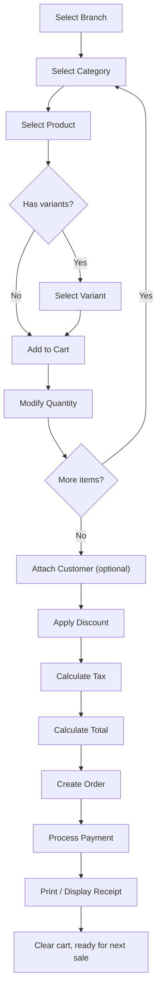
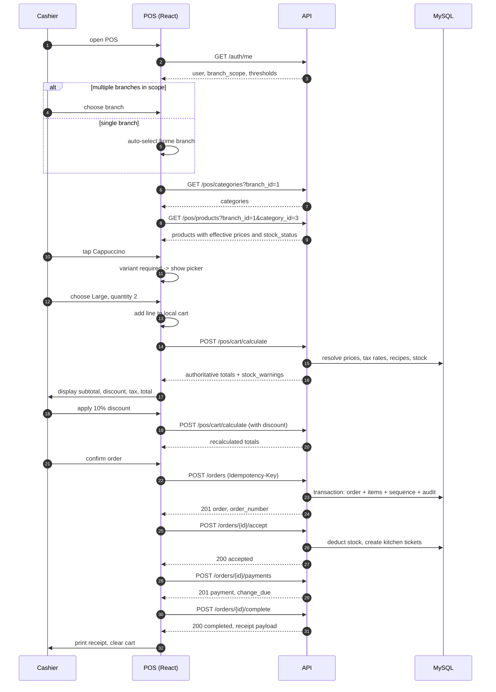

# 10 — POS Workflow

> **Document purpose.** Describe the point-of-sale selling flow end to end, from branch selection to
> receipt, including every alternative and failure path. This is the workflow a cashier performs
> hundreds of times a day; it is the most performance- and usability-sensitive part of the system.

**Prerequisites:** [09-business-rules.md](09-business-rules.md) (all calculations),
[07-api-documentation.md](07-api-documentation.md) §3 (POS endpoints).

**Status:** 🟡 MVP — Planned.

---

## 1. Scope

This document covers the **cashier's** journey up to and including receipt. It stops where other
documents begin:

| Boundary | Continues in |
|---|---|
| Order lifecycle after creation | [11-order-workflow.md](11-order-workflow.md) |
| Payment mechanics and split tender | [12-payment-workflow.md](12-payment-workflow.md) |
| Kitchen preparation | [13-kitchen-workflow.md](13-kitchen-workflow.md) |
| Ingredient deduction | [14-inventory-workflow.md](14-inventory-workflow.md) |
| Loyalty earn and redeem | [16-customer-loyalty.md](16-customer-loyalty.md) |

---

## 2. The canonical flow

Steps G, H and I are a **single server call** (`POST /pos/cart/calculate`), not three. They are drawn
separately because they are three distinct concepts to a cashier, but the client never computes them.

### 2.1 Sequence with the API

> **Note on step ordering.** Acceptance is shown immediately after creation because a counter-service
> restaurant sends food to the kitchen before the customer pays. A table-service restaurant would
> accept immediately and pay at the end; a quick-service one might pay first. The order of *accept* and
> *pay* is a business choice, not a technical constraint — the state machine permits either
> ([11](11-order-workflow.md) §3). Only *complete* is constrained: it requires a zero balance.

---

## 3. Step-by-step

### 3.1 Select branch

| Aspect | Detail |
|---|---|
| **UI** | Shown only when `branch_scope` has more than one entry. A single-branch cashier never sees the selector. |
| **Default** | `users.branch_id` (home branch). |
| **Effect** | Sets the `X-Branch-Id` header for every subsequent request. |
| **Validation** | The branch must be in scope and `is_active = true`. |
| **Failure** | Out-of-scope branch → `403 branch_out_of_scope`. Inactive branch → the selector shows it greyed out and order creation returns `422 branch_inactive`. |
| **Persistence** | Stored in local storage so the terminal reopens on the same branch. |

**Why this comes first.** Prices, availability, stock and tax all depend on the branch. Choosing it
later would mean re-resolving every line.

### 3.2 Select category

`GET /pos/categories?branch_id=1` returns active categories ordered by `sort_order`, optionally nested
one level. Categories with no available products at the branch are still shown but marked empty —
hiding them makes the grid layout shift between branches, which slows cashiers who work by muscle
memory.

### 3.3 Select product

| Aspect | Detail |
|---|---|
| **Sources** | Category grid, or search by name/SKU (min 2 characters, FULLTEXT). |
| **Displayed** | Name, image, effective price, `stock_status` badge. |
| **Not displayed** | `cost_price` — never sent to a Cashier ([04](04-user-roles-permissions.md) G11). |
| **Unavailable products** | Shown greyed with the reason: *86'd*, *out of stock*, *not sold at this branch*. Hiding them entirely causes the cashier to keep searching for something that is not there. |
| **Performance** | Response cached 5 min per (branch, category); invalidated on any product write. Target < 250 ms (NFR-PERF-001). |

### 3.4 Select variant

Required when `products.has_variants = true`. The default variant is pre-selected. Omitting a variant
for such a product is `422 variant_required`.

### 3.5 Add to cart

The cart is **client-side state** until the order is created. It holds product ID, variant ID,
quantity and note. It does **not** hold prices — those come from the server on every calculate call, so
a price change mid-cart is picked up rather than silently honoured at the stale figure.

| Rule | Detail |
|---|---|
| Duplicate lines | Adding the same product+variant+note merges into the existing line and increments quantity. Different notes stay separate — "no ice" and "extra ice" are not the same line. |
| Maximum lines | 200 per order (`422` above). |
| Persistence | Written to local storage on every change; restored on reload with a fresh calculate call (FR-POS-010). |

### 3.6 Modify quantity

| Rule | Detail |
|---|---|
| Increment | `+`/`−` buttons, or direct numeric entry. |
| Fractional | Permitted to 3 decimals for weighed items. |
| Zero | Setting quantity to 0 **removes** the line (FR-POS-003). |
| Maximum | 9 999 per line. |
| Recalculation | Every change triggers a debounced (250 ms) calculate call. |

### 3.7 Attach customer

Optional. Searched by phone, name or membership code. Attaching a customer:

- enables loyalty earn and redeem;
- applies any tier discount;
- triggers a recalculation.

A customer may be attached or detached at any point before completion (FR-CUS-002).

### 3.8 Apply discount

| Aspect | Detail |
|---|---|
| **Scope** | Line-level or order-level. |
| **Type** | Percentage or fixed amount. |
| **Threshold** | Above `discount.max_percent.<role>`, the cashier is prompted for manager authorisation ([04](04-user-roles-permissions.md) §7). |
| **Authorisation** | A manager enters their PIN in a modal; the API is called with the manager's token and records `discount_approved_by`. |
| **Reason** | Required above `discount.require_reason_above`. |
| **Calculation** | [09](09-business-rules.md) §5. Pro-rata allocation to lines. |
| **Failure** | Above threshold without authorisation → `403 discount_limit_exceeded`. Above 100 % → `422`. Exceeding subtotal → `422 discount_exceeds_total`. |

### 3.9 Calculate tax and total

One call, `POST /pos/cart/calculate`, returning the authoritative figures defined in
[09](09-business-rules.md) §4. The client displays exactly what the server returned.

**The client never computes a total it then sends back.** It may show an optimistic running subtotal
for responsiveness, but the displayed grand total is always server-derived.

**`stock_warnings`** in the response let the cashier see a shortfall before the customer commits. At
this stage it is advisory; the hard block is at order creation.

### 3.10 Create order

`POST /orders` with `Idempotency-Key`. Detailed in [07](07-api-documentation.md) §4.1. The server
recalculates everything from scratch — client figures are input, never authority.

### 3.11 Process payment

Detailed in [12-payment-workflow.md](12-payment-workflow.md). From the POS perspective: choose a
method, enter the amount (defaulted to the balance due), enter the tendered amount for cash, and see
the change.

### 3.12 Receipt

| Aspect | Detail |
|---|---|
| **Trigger** | Automatic on completion; reprintable with `orders.reprint_receipt`. |
| **Delivery** | Browser print to a thermal printer via a print stylesheet; optionally displayed as a QR code linking to a signed, time-limited receipt URL. |
| **Contents** | Branch name, address, tax registration number; order number; business date and time; cashier name; lines with quantity, unit price and line total; subtotal; each discount separately; tax with rate; service charge; rounding adjustment; grand total; each tender with method and reference; change; loyalty points earned and balance; footer. |
| **Reprints** | Capped at `receipt.max_reprints` (default 2) and each one audited — reprinting is a known fraud vector for skimming cash sales. |

---

## 4. Happy path

**Scenario.** Cashier Ana, Riverside branch, sells 2 large cappuccinos and 1 croissant to a loyalty
customer with a 10 % staff discount, settled in cash.

| # | Action | System response |
|---|---|---|
| 1 | Ana logs in | Token issued with `pos:*` abilities; branch auto-selected (single-branch user) |
| 2 | Taps *Hot Drinks* | Product grid renders in 180 ms from cache |
| 3 | Taps *Cappuccino* | Variant picker opens, *Regular* pre-selected |
| 4 | Chooses *Large*, quantity 2 | Line added; calculate returns subtotal `11.00` |
| 5 | Taps *Croissant* | Line added; subtotal `15.00` |
| 6 | Scans customer QR | Customer attached; balance 240 points shown |
| 7 | Applies 10 % discount, reason "Staff meal" | Within the 10 % cashier cap; totals recalculated |
| 8 | Reviews total | Subtotal `15.00`, discount `1.50`, tax `0.94`, **total `14.44`** |
| 9 | Confirms order | `201` — order `B1-20260905-0042`, status `pending` |
| 10 | Order auto-accepted | Stock deducted: milk `−0.40 L`, coffee `−0.04 kg`; 2 kitchen tickets created |
| 11 | Takes 20.00 cash | Payment `14.44` recorded, change `5.56` displayed |
| 12 | Completes order | Status `completed`; 20 loyalty points awarded |
| 13 | Receipt prints | Cart clears; terminal ready |

Total elapsed: under 30 seconds (NFR-USE-002). Figures follow the golden example in
[09](09-business-rules.md) §2.4.

---

## 5. Alternative paths

| # | Scenario | Behaviour |
|---|---|---|
| A1 | **No customer** | Walk-in sale. No loyalty earn or redeem. `orders.customer_id` is `NULL`. |
| A2 | **Takeaway instead of dine-in** | `order_type = takeaway`; `table_number` must be absent; service charge may not apply (BR-SC-03). |
| A3 | **Customer added after items** | Permitted any time before completion. Tier discount applies from that point and totals recalculate. |
| A4 | **Discount above the cashier cap** | Manager PIN modal. On approval, `discount_approved_by` is set and an audit row records both actors. |
| A5 | **Loyalty redemption** | Points converted to a discount ([16](16-customer-loyalty.md) §4). Bypasses the discount threshold (BR-DISC-10) but obeys the redemption cap. |
| A6 | **Split payment** | Repeat `POST /payments` until `balance_due = 0` ([12](12-payment-workflow.md) §5). |
| A7 | **Pay before kitchen** | Payment taken while the order is still Pending, then accept. Legal — the state machine does not couple payment to lifecycle except at completion. |
| A8 | **Line note** | Free text up to 255 characters, printed on the kitchen ticket, not on the receipt total lines. |
| A9 | **Product with no recipe** | `track_inventory = false`; no stock movement, cost from `products.cost_price`. |
| A10 | **Zero-rated product** | Tax rate `0.0000`; line tax `0.00`. Not an error. |
| A11 | **Cart restored after reload** | Local storage restores lines; a fresh calculate call re-prices. If a price changed, the new price is shown with a visual highlight. |
| A12 | **Order edited before acceptance** | `PATCH /orders/{id}` with `orders.update`, while Pending only. Full recalculation; audit records the before/after. |
| A13 | **Multi-branch cashier switches branch mid-shift** | Cart must be empty; switching with a non-empty cart prompts to discard. The cart is branch-specific because prices and stock are. |

---

## 6. Failure paths

| # | Failure | Detection | Response | Cashier sees | Recovery |
|---|---|---|---|---|---|
| F1 | **Insufficient stock** | Order creation | `422 insufficient_stock` with per-ingredient shortfalls | "Not enough Milk: need 0.40 L, have 0.30 L" | Reduce quantity, remove the line, or a manager records a stock-in |
| F2 | **Product became unavailable** | Calculate or create | `422 product_unavailable` | Line highlighted red, marked unavailable | Remove the line |
| F3 | **Price changed mid-cart** | Calculate | `200` with new figures | Changed line highlighted; total updates | Continue or cancel |
| F4 | **Discount above cap** | Create | `403 discount_limit_exceeded` | Manager authorisation modal | Manager PIN, or reduce the discount |
| F5 | **Network loss during create** | Timeout | none | "Connection lost — retrying" | Automatic retry with the **same** `Idempotency-Key`; at most one order results |
| F6 | **Double-tap on Confirm** | Server | Second call returns the original `201` with `Idempotency-Replayed: true` | Nothing — the same order | None needed |
| F7 | **Branch deactivated mid-shift** | Create | `422 branch_inactive` | "This branch is no longer active" | Contact a manager; existing orders can still be completed |
| F8 | **Token expired mid-sale** | Any call | `401 token_expired` | Login modal **preserving the cart** | Re-authenticate; cart survives |
| F9 | **Concurrent stock exhaustion** | Create, under lock | `422 insufficient_stock` | Same as F1 | The other terminal won the last portion |
| F10 | **Server error** | Create | `500` with `request_id` | "Something went wrong. Reference: 9f1c…" | Retry; escalate with the reference ([30](30-troubleshooting.md)) |
| F11 | **Empty cart confirmed** | Client and server | `422 empty_order` | Confirm button disabled | Add an item |
| F12 | **Rate limit hit** | Any | `429` with `Retry-After` | "Too many requests, retrying in 5 s" | Automatic backoff |
| F13 | **Missing tax configuration** | Calculate | `500 configuration_missing` naming the key | "System not configured — contact support" | Admin sets `tax.default_rate_id` ([27](27-environment-configuration.md)) |
| F14 | **Printer offline** | Client | — | "Receipt could not print" with a Retry button | Order is unaffected; reprint later |

> **F5 is the reason `Idempotency-Key` is mandatory.** A cashier whose tablet drops Wi-Fi mid-order will
> tap Confirm again. Without idempotency the customer is charged twice and the kitchen makes two
> coffees.

---

## 7. Validation summary

Full catalogue: [20-validation-rules.md](20-validation-rules.md) §5.

| Field | Rule | Failure |
|---|---|---|
| `branch_id` | required, exists, in scope, active | `403` / `422 branch_inactive` |
| `order_type` | required, in `dine_in,takeaway,delivery` | `422` |
| `table_number` | required if dine-in and configured; forbidden otherwise | `422` |
| `customer_id` | optional, exists, active, not anonymised | `422` |
| `items` | required, array, 1–200 | `422 empty_order` |
| `items.*.product_id` | required, exists, active, available at branch | `422 product_unavailable` |
| `items.*.product_variant_id` | required if `has_variants`; must belong to the product | `422 variant_required` |
| `items.*.quantity` | required, `> 0`, ≤ 9999, ≤ 3 decimals | `422` |
| `items.*.note` | optional, ≤ 255 | `422` |
| `discount_type` | in `none,percentage,fixed` | `422` |
| `discount_value` | `>= 0`; ≤ 100 if percentage; ≤ subtotal if fixed; ≤ role threshold | `422` / `403` |
| `discount_reason` | required above the configured amount | `422` |
| `loyalty_points_to_redeem` | integer, ≥ min, multiple of increment, ≤ balance, ≤ cap | `422` |
| `Idempotency-Key` | required header, UUID v4 | `400` |

---

## 8. Permissions

| Action | Permission | Notes |
|---|---|---|
| Open the POS | `pos.access` | Staff only when `pos.staff_can_create_orders` is enabled |
| Browse products | `products.view` | Implied by `pos.access` |
| See cost or margin | `products.view_cost` | **Not granted to Cashier** |
| Search customers | `customers.view` | |
| Create a customer at POS | `customers.create` | |
| Add to cart / calculate | `pos.access` | |
| Create an order | `orders.create` | |
| Apply a discount within cap | `orders.apply_discount` | Cap per role |
| Apply a discount above cap | `orders.apply_discount` at a higher rank, or `orders.apply_discount_unlimited` | Manager authorisation |
| Redeem loyalty points | `loyalty.redeem` | |
| Take payment | `payments.create` | |
| Print a receipt | `orders.view` | |
| Reprint a receipt | `orders.reprint_receipt` | Capped and audited |
| Edit a pending order | `orders.update` | |
| Cancel | `orders.cancel` | Cashier: Pending and unpaid only |

---

## 9. Database changes

Nothing is written until **Create Order**. Browsing, adding to the cart and calculating totals are
entirely read-only.

| Step | Table | Operation |
|---|---|---|
| Select branch | — | none |
| Browse, add to cart | — | none (client state only) |
| Calculate | — | none |
| **Create order** | `daily_sequences` | `INSERT ... ON DUPLICATE KEY UPDATE last_number = last_number + 1` |
| | `orders` | `INSERT` — status `pending`, all totals, snapshots, `idempotency_key` |
| | `order_items` | `INSERT` one per line, with price/cost/tax snapshots |
| | `order_status_histories` | `INSERT` — `NULL → pending` |
| | `audit_logs` | `INSERT` — `order.created` |
| **Redeem loyalty** | `loyalty_transactions` | `INSERT` — `redeem`, negative points |
| | `customers` | `UPDATE loyalty_points_balance` |
| | `orders` | `UPDATE loyalty_points_redeemed, loyalty_discount_amount, grand_total` |
| **Accept** | see [11](11-order-workflow.md) §7 and [14](14-inventory-workflow.md) §5 | |
| **Payment** | see [12](12-payment-workflow.md) §8 | |
| **Complete** | `orders`, `order_status_histories`, `loyalty_transactions`, `customers`, `audit_logs` | |
| **Reprint** | `audit_logs` | `INSERT` — `order.receipt_reprinted` |

All writes for one step occur in **one transaction** ([02](02-system-architecture.md) §6).

---

## 10. Audit log requirements

| Event | `event` | Captured |
|---|---|---|
| Order created | `order.created` | Order ID, number, branch, cashier, totals, item count, customer |
| Order edited | `order.updated` | Before/after items and totals |
| Discount applied | `order.discount_applied` | Type, value, amount, reason, **approver if elevated** |
| Discount above threshold | `order.discount_override` | Cashier, approving manager, requested vs cap |
| Customer attached | `order.customer_attached` | Customer ID |
| Loyalty redeemed | `loyalty.redeemed` | Points, monetary value, resulting balance |
| Order created after retry | `order.idempotent_replay` | Original order ID, key |
| Receipt printed | `order.receipt_printed` | First print only |
| Receipt reprinted | `order.receipt_reprinted` | Reprint count, actor — **always audited** |
| Cart abandoned with a discount override | `pos.override_unused` | Manager authorised but the sale did not complete |
| Branch switched | `pos.branch_switched` | From, to |

**Common to every row:** actor `user_id`, `branch_id`, `ip_address`, `user_agent`, `request_id`,
UTC `created_at`. Written **inside** the same transaction as the change (FR-AUD-006).

**Why reprints are audited so carefully.** The classic POS fraud is: sell for cash, print a receipt,
void the order, keep the money, hand over the printed receipt. Auditing every reprint and every void,
with the actor, makes the pattern visible in the staff report ([18](18-reporting.md) §7).

---

## 11. Edge cases

| # | Case | Expected behaviour |
|---|---|---|
| E1 | Two cashiers sell the last portion simultaneously | Row lock on `inventories`; one succeeds, the other gets `422 insufficient_stock`. |
| E2 | Cart open across a business-day boundary | The order takes the business date at **creation**, not at cart start. |
| E3 | Cashier's shift ends mid-cart | The cart survives in local storage; the next cashier logging into that terminal sees a "cart from a previous session" prompt and must explicitly keep or discard it. |
| E4 | Product deleted while in a cart | Calculate returns `422 product_unavailable`; the line is flagged. |
| E5 | Variant deleted while in a cart | Same, `422 variant_unavailable`. |
| E6 | Customer merged or anonymised mid-sale | Attachment cleared with a notice; the sale continues as a walk-in. |
| E7 | Quantity entered as `0.0001` | Rejected — more than 3 decimals. |
| E8 | Discount `100 %` | Permitted with authorisation; grand total is tax only (exclusive tax) or `0.00` (inclusive). Payment step is skipped and completion is immediate. |
| E9 | Order total `0.00` | Completion allowed with no payment. `payment_status` goes straight to `paid`. |
| E10 | Manager authorises a discount, then the cashier removes the item | The authorisation is re-evaluated on the next calculate. A stale authorisation never carries to a different cart. |
| E11 | Local storage full or disabled | Cart persistence degrades silently; selling still works. |
| E12 | Clock skew on the terminal | All timestamps come from the server; the terminal clock is display-only. |
| E13 | 200-line order | Permitted. The calculate response may exceed 100 kB; the UI virtualises the list. |
| E14 | Same product added with different notes | Two separate lines, correctly. |
| E15 | Cashier logs out with an unpaid Pending order | The order remains Pending and appears in the branch's open-orders list. It is not lost. |

---

## 12. Security considerations

| # | Consideration | Mitigation |
|---|---|---|
| S1 | Client-supplied prices | Ignored. Server always resolves from the database (BR-PRICE-04). |
| S2 | Client-supplied totals | Ignored. Server recalculates. |
| S3 | Discount cap bypass by calling the API directly | Enforced in `OrderPolicy`, not in the UI. |
| S4 | Cross-branch selling | Branch resolved server-side; body `branch_id` disagreeing with scope is rejected. |
| S5 | Cost data leakage | `cost_price` omitted from every POS response for Cashiers. |
| S6 | Shared terminal attribution | PIN login per cashier ([08](08-authentication-authorization.md) §4.2); every order records `user_id`. |
| S7 | Receipt fraud | Reprints capped and audited; voids require elevated permission and a reason. |
| S8 | Unattended terminal | 30-minute idle token expiry; a screen lock requiring the PIN. |
| S9 | Duplicate charging | Mandatory idempotency keys. |
| S10 | Customer PII on screen | Only name and points are shown at POS. Full contact details require `customers.view` and a deliberate action. |
| S11 | Local-storage cart tampering | The cart holds only product IDs and quantities. Prices are never read from it. Tampering can at most change what is ordered, which the server then prices correctly. |

---

## 13. Performance considerations

| Operation | Target | Technique |
|---|---|---|
| Product grid | < 250 ms | Redis cache per (branch, category), 5 min TTL, invalidated on write |
| Search | < 300 ms | MySQL FULLTEXT; client debounce 250 ms |
| Add to cart | < 100 ms perceived | Optimistic local update; calculate runs in the background |
| Calculate | < 200 ms | Single query per concern; recipes and rates cached per request |
| Create order | < 400 ms | One transaction, ordered locks |
| Full sale | < 30 s human time | Minimal taps: category → product → variant → confirm |

**Debouncing rule.** Quantity changes debounce at 250 ms so holding the `+` button does not fire twenty
calculate calls. The final call always wins; earlier in-flight responses are discarded by request
sequence number.

---

## 14. Testing considerations

| Area | Test |
|---|---|
| Happy path | End-to-end §4 with exact golden figures. |
| Every alternative | One test per row of §5. |
| Every failure | One test per row of §6, asserting the `error_code`. |
| Idempotency | Same key twice ⇒ one order; different payload ⇒ `410`. |
| Concurrency | 10 parallel orders for the last portion ⇒ exactly one succeeds. |
| Server authority | Send a manipulated price and total; assert the server's figures are used. |
| Discount threshold | Boundary tests at cap − 0.01, cap, cap + 0.01. |
| Cart persistence | Reload mid-cart; assert restoration and re-pricing. |
| Token expiry mid-sale | Assert the cart survives re-authentication. |
| Cost omission | Assert `cost_price` is **absent** from every POS response for a Cashier token. |
| Performance | k6 scenario, 10 terminals, 150 orders/hour ([25](25-performance-testing.md) §5.2). |
| Accessibility | Full sale completable by touch only; targets ≥ 44 px. |

---

## 15. Related documents

[07-api-documentation.md](07-api-documentation.md) §3–§4 ·
[09-business-rules.md](09-business-rules.md) ·
[11-order-workflow.md](11-order-workflow.md) ·
[12-payment-workflow.md](12-payment-workflow.md) ·
[14-inventory-workflow.md](14-inventory-workflow.md) ·
[16-customer-loyalty.md](16-customer-loyalty.md) ·
[24-qa-test-plan.md](24-qa-test-plan.md) §4.1
