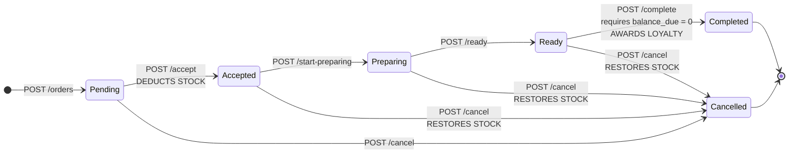
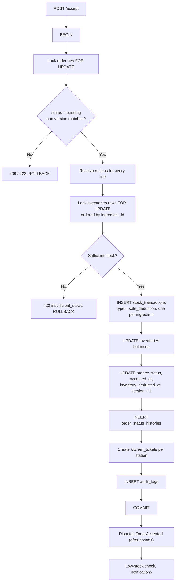

# 11 — Order Workflow

> **Document purpose.** Define the order lifecycle state machine: every state, every legal transition,
> what each transition does to the database, who may perform it, and what happens when it fails. The
> order is the spine of the system — inventory, payment, kitchen and loyalty all hang off its status.

**Prerequisites:** [09-business-rules.md](09-business-rules.md) §12 (state machine rules),
[10-pos-workflow.md](10-pos-workflow.md) (how orders are created).

**Status:** 🟡 MVP — Planned.

---

## 1. The lifecycle

```text
Pending → Accepted → Preparing → Ready → Completed
```

Plus one terminal escape: **Cancelled**, reachable from any non-terminal state.



### 1.1 State definitions

| State | Meaning | Stock | Money | Kitchen |
|---|---|---|---|---|
| **Pending** | Created, not yet confirmed. Editable. | Not deducted | May be paid | Not visible |
| **Accepted** | Confirmed. Ingredients committed. | **Deducted** | May be paid | Ticket queued |
| **Preparing** | Kitchen is working on it. | Deducted | May be paid | In progress |
| **Ready** | Prepared, awaiting handover. | Deducted | May be paid | Done |
| **Completed** | Handed over and fully settled. Terminal. | Deducted | **Fully paid** | Closed |
| **Cancelled** | Abandoned. Terminal. | **Restored** if it had been deducted | Refunded if paid | Removed |

### 1.2 What is *not* a state

`payment_status` is a **separate, orthogonal axis** (`unpaid`, `partially_paid`, `paid`,
`partially_refunded`, `refunded`). An order can be Preparing and paid, or Ready and unpaid. The only
coupling is at completion, which requires a zero balance.

Conflating the two into one status field is a common design error. It produces states like
"Ready-Unpaid-Partially-Refunded" and makes the state machine unmanageable.

---

## 2. Order creation

Covered operationally in [10-pos-workflow.md](10-pos-workflow.md) §3.10 and as an API contract in
[07-api-documentation.md](07-api-documentation.md) §4.1. The essentials:

| Aspect | Detail |
|---|---|
| Entry state | `pending` |
| Number | Allocated atomically from `daily_sequences`, format `{branch_code}-{YYYYMMDD}-{NNNN}` |
| Business date | Branch-local, per `branches.business_day_start` |
| Snapshots | Name, SKU, unit price, tax rate, inclusive flag, unit cost — all copied to each line |
| Stock | **Not** moved (default `inventory.deduction_point = on_accept`) |
| Stock check | Sufficiency **is** verified at creation, so the cashier is not told "yes" and then "no" a second later |
| Idempotency | Mandatory `Idempotency-Key` |

### 2.1 Order number format

```text
B1-20260905-0042
│  │        └── 4-digit sequence, resets each business day, per branch
│  └─────────── business date, branch-local
└────────────── branch code
```

| Rule | Detail |
|---|---|
| Gapless | Allocated by `daily_sequences`, so a failed transaction still consumes a number — a gap is possible on rollback and is accepted. **Uniqueness is guaranteed; strict gaplessness is not.** |
| Uniqueness | `uq_orders_branch_number (branch_id, order_number)` |
| Reset | Per business day, per branch |
| Overflow | Above 9 999 orders in one branch-day the sequence extends to 5 digits rather than wrapping |

> If a jurisdiction requires strictly gapless numbering for tax purposes, numbers must be allocated at
> commit rather than at insert, and voided numbers must be recorded. Flagged as ⚠️ open question Q7 in
> [03](03-requirements.md) §5.

---

## 3. Transitions

Each transition takes `{ "version": n }` and returns the updated order. All are guarded by
`UPDATE ... WHERE id = ? AND status = ? AND version = ?`; zero affected rows means `409`.

### 3.1 Accept — Pending → Accepted

**The most consequential transition in the system.** It commits ingredients.

| Aspect | Detail |
|---|---|
| Endpoint | `POST /orders/{id}/accept` |
| Permission | `orders.accept` |
| Preconditions | Status `pending`; branch active; version matches; stock sufficient |
| Idempotency guard | `orders.inventory_deducted_at` must be `NULL` |

**Effects, all in one transaction:**



**Deadlock avoidance:** `inventories` rows are locked in ascending `ingredient_id` order by every
service that touches them ([02](02-system-architecture.md) §6, rule T4).

### 3.2 Start preparing — Accepted → Preparing

| Aspect | Detail |
|---|---|
| Endpoint | `POST /orders/{id}/start-preparing`, or automatically when the first kitchen ticket starts |
| Permission | `kitchen.update_ticket` or `orders.accept` |
| Effects | `status`, `preparing_at`, version bump, history row, audit row |
| Stock | No change |

Usually driven by the kitchen, not the cashier ([13](13-kitchen-workflow.md) §4).

### 3.3 Ready — Preparing → Ready

| Aspect | Detail |
|---|---|
| Trigger | The last kitchen ticket for the order is marked ready |
| Permission | `kitchen.update_ticket` |
| Effects | `status`, `ready_at`, version bump, history, audit; notification to the cashier |
| Skip | `Accepted → Ready` directly requires `kitchen.skip_preparing` |

**Aggregation rule.** An order with tickets at two stations becomes Ready only when **all** tickets are
Ready. Partial readiness leaves the order in Preparing ([13](13-kitchen-workflow.md) §5).

### 3.4 Complete — Ready → Completed

| Aspect | Detail |
|---|---|
| Endpoint | `POST /orders/{id}/complete` |
| Permission | `orders.complete` |
| **Hard precondition** | `balance_due = 0`, else `422 order_not_settled` |
| Effects | `status`, `completed_at`, version bump, history, audit; **loyalty points awarded**; customer totals updated; kitchen tickets marked served |

Completion is the only transition that awards loyalty (BR-LOY-02). Awarding earlier would leave points
behind on an order that was later cancelled.

**Direct completion.** `orders.complete_direct` ⚠️ permits Accepted → Completed for counter service
where nothing is prepared (a bottled drink). Configurable via `orders.allow_direct_completion`, default
`false`.

### 3.5 Cancel — any non-terminal → Cancelled

| Aspect | Detail |
|---|---|
| Endpoint | `POST /orders/{id}/cancel` |
| Permission | `orders.cancel`; Cashier restricted to Pending and unpaid |
| Required | `reason`, 3–255 characters |
| Blocked | From `completed` or `cancelled` |
| Payments | If any payment is captured, `payments.refund` is also required |

**Stock restoration** is the critical part:

```text
if orders.inventory_deducted_at IS NOT NULL:
    read the stock_transactions rows where
        reference_type = 'Order' AND reference_id = order.id AND type = 'sale_deduction'
    for each, INSERT a compensating row:
        type            = 'sale_reversal'
        quantity_change = −(original quantity_change)      # i.e. positive
        unit_cost       = original unit_cost
        reason          = 'Order cancelled: ' + reason
    UPDATE inventories balances
```

**BR-STATE-04 restated, because it matters:** restoration reads the **ledger**, never the recipe. If the
recipe changed between acceptance and cancellation, recomputing from the recipe would restore the wrong
quantities and silently corrupt stock. The ledger records what was actually taken.

### 3.6 Void

A void is a cancel with:

- permission `orders.void` (never granted to Cashier);
- a mandatory reason;
- `audit_logs.event = 'order.voided'` with elevated severity;
- inclusion in the staff void report ([18](18-reporting.md) §7).

Functionally identical to cancel; operationally it is the flag that surfaces in fraud monitoring.

---

## 4. Transition matrix

Rows are the current state, columns the target. `✔` legal, `—` illegal.

| From \ To | Pending | Accepted | Preparing | Ready | Completed | Cancelled |
|---|:--:|:--:|:--:|:--:|:--:|:--:|
| **Pending** | — | ✔ | — | — | — | ✔ |
| **Accepted** | — | — | ✔ | ✔¹ | ✔² | ✔ |
| **Preparing** | — | — | — | ✔ | — | ✔ |
| **Ready** | — | — | ✔³ | — | ✔ | ✔ |
| **Completed** | — | — | — | — | — | — |
| **Cancelled** | — | — | — | — | — | — |

¹ Requires `kitchen.skip_preparing`.
² Requires `orders.allow_direct_completion` and a zero balance.
³ Kitchen recall (`kitchen.recall_ticket`) — the food was returned.

Every `—` returns `422 invalid_state_transition` with both states named in the message.

**No backward transitions to Pending.** Once accepted, stock has moved; going back to Pending would
imply un-committing ingredients without a ledger entry. Cancel and re-create instead.

---

## 5. Happy path

**Scenario.** Order `B1-20260905-0042`, dine-in, 2 large cappuccinos + 1 croissant, 14.44 total, cash.

| # | Event | Status | Payment status | Stock | Kitchen |
|---|---|---|---|---|---|
| 1 | Cashier confirms the cart | `pending` | `unpaid` | untouched | — |
| 2 | Cashier accepts | `accepted` | `unpaid` | **milk −0.40 L, coffee −0.04 kg** | 2 tickets queued |
| 3 | Barista starts the bar ticket | `preparing` | `unpaid` | — | bar preparing |
| 4 | Bar ticket ready | `preparing` | `unpaid` | — | bar ready, grill preparing |
| 5 | Grill ticket ready | `ready` | `unpaid` | — | all ready |
| 6 | Cashier takes 20.00 cash | `ready` | `paid` | — | — |
| 7 | Cashier completes | `completed` | `paid` | — | served |
| 8 | — | — | — | — | **20 loyalty points awarded** |

Note at step 4: the order stays `preparing` because one ticket is outstanding. Only when the last
ticket is ready does the order become `ready`.

---

## 6. Alternative paths

| # | Scenario | Path |
|---|---|---|
| A1 | **Pay first, then prepare** | Pending → payment → Accepted → Preparing → Ready → Completed. Legal; common in quick service. |
| A2 | **Auto-accept at creation** | `auto_accept: true` on `POST /orders` performs create + accept in one transaction. Saves a round trip for counter service. |
| A3 | **No kitchen involvement** | Bottled drink only. Accepted → Completed with `orders.allow_direct_completion`. |
| A4 | **Skip preparing** | Accepted → Ready with `kitchen.skip_preparing`, for pre-made items. |
| A5 | **Kitchen recall** | Ready → Preparing when the customer returns the dish. Requires `kitchen.recall_ticket`; audited. |
| A6 | **Edit while Pending** | `PATCH /orders/{id}` adds, removes or re-quantifies lines. Full recalculation. Not permitted after Accepted without `orders.edit_after_accept`. |
| A7 | **Edit after Accept** | With `orders.edit_after_accept`: the stock delta is computed (old explosion vs new explosion) and applied as an adjustment pair, never as a full reverse-and-rededuct. |
| A8 | **Split tender** | Multiple payments; `payment_status` moves `unpaid → partially_paid → paid`. |
| A9 | **Customer attached late** | Any time before completion. |
| A10 | **Cancelled before acceptance** | No stock movement to reverse. Simplest case. |
| A11 | **Cancelled after payment** | Requires `payments.refund`. Refund is created, stock restored, loyalty reversed. |
| A12 | **Order spans midnight** | `business_date` is fixed at creation. An order created at 23:58 and completed at 00:12 belongs to the earlier business day. |

---

## 7. Failure paths

| # | Failure | Where | Response | Recovery |
|---|---|---|---|---|
| F1 | Illegal transition | Any | `422 invalid_state_transition`, naming both states | Refresh; the order moved |
| F2 | Version mismatch | Any | `409 version_mismatch` with the current version | Reload and retry |
| F3 | Insufficient stock at accept | Accept | `422 insufficient_stock` with shortfalls | Reduce, remove, or stock in |
| F4 | Double accept (race) | Accept | Second call: `422 already_deducted` | None — the first won |
| F5 | Complete with a balance | Complete | `422 order_not_settled` with `balance_due` | Take payment |
| F6 | Cancel a completed order | Cancel | `422 invalid_state_transition` | Refund instead |
| F7 | Cancel without a reason | Cancel | `422 validation_failed` | Supply a reason |
| F8 | Cashier cancels a paid order | Cancel | `403 payment_captured_cancel_forbidden` | Manager with `payments.refund` |
| F9 | Deadlock on inventory | Accept | Retried 3× with jitter, then `409 concurrency_conflict` | Retry |
| F10 | Branch deactivated between create and accept | Accept | `422 branch_inactive` | Manager reactivates, or cancel |
| F11 | Recipe deleted between create and accept | Accept | `422 recipe_unavailable` naming the product | Restore the recipe, or remove the line |
| F12 | Kitchen ticket creation fails | Accept | Whole transaction rolls back; **no stock is deducted** | Retry |
| F13 | Loyalty award fails at completion | Complete | Whole transaction rolls back; order stays Ready | Retry; investigate via `request_id` |
| F14 | Stock reversal on cancel finds no ledger rows though `inventory_deducted_at` is set | Cancel | `500 data_integrity_error`, transaction rolled back, critical alert | Manual investigation — this indicates a real corruption |

> **F12 and F13 are the reason everything is in one transaction.** A partial success — stock deducted
> but no kitchen ticket — is far worse than a clean failure the cashier can retry.

---

## 8. Validation

| Transition | Rule |
|---|---|
| All | `version` required, integer, matches `orders.version` |
| All | Order in branch scope, else `404` |
| All | Current status permits the target (§4) |
| Accept | Stock sufficient for every non-optional recipe item |
| Accept | `inventory_deducted_at IS NULL` |
| Accept | Branch `is_active` |
| Complete | `grand_total − paid_total + refunded_total = 0` |
| Cancel | `reason` required, 3–255 |
| Cancel | No captured payment, unless `payments.refund` is held |
| Void | `reason` required; `orders.void` held |
| Edit | Status `pending`, or `orders.edit_after_accept` held |
| Edit | Resulting order still has ≥ 1 line |

Full catalogue: [20-validation-rules.md](20-validation-rules.md) §6.

---

## 9. Permissions

| Transition | Permission | Additional condition |
|---|---|---|
| Create | `orders.create` | |
| Accept | `orders.accept` | |
| Start preparing | `kitchen.update_ticket` or `orders.accept` | |
| Ready | `kitchen.update_ticket` | |
| Skip preparing | `kitchen.skip_preparing` | |
| Recall | `kitchen.recall_ticket` | |
| Complete | `orders.complete` | Balance zero |
| Cancel | `orders.cancel` | Cashier: Pending, unpaid only |
| Void | `orders.void` | Never Cashier |
| Edit (Pending) | `orders.update` | |
| Edit (Accepted+) | `orders.edit_after_accept` | |
| View | `orders.view` | Own orders only without `orders.view_all_users` |

---

## 10. Database changes per transition

| Transition | Table | Operation |
|---|---|---|
| **Create** | `daily_sequences` | atomic increment |
| | `orders` | `INSERT` (`pending`, totals, snapshots, `idempotency_key`) |
| | `order_items` | `INSERT` × n |
| | `order_status_histories` | `INSERT` (`NULL → pending`) |
| | `audit_logs` | `INSERT` |
| **Accept** | `inventories` | `SELECT ... FOR UPDATE`, then `UPDATE quantity_on_hand`, `last_movement_at` |
| | `stock_transactions` | `INSERT` × ingredients (`sale_deduction`) |
| | `orders` | `UPDATE status, accepted_at, inventory_deducted_at, cogs_total, version` |
| | `order_status_histories` | `INSERT` |
| | `kitchen_tickets` | `INSERT` × stations |
| | `kitchen_ticket_items` | `INSERT` × lines |
| | `audit_logs` | `INSERT` |
| **Preparing** | `orders`, `order_status_histories`, `kitchen_tickets`, `audit_logs` | `UPDATE` / `INSERT` |
| **Ready** | `orders` (`status`, `ready_at`, `version`), `order_status_histories`, `audit_logs` | |
| **Complete** | `orders` (`status`, `completed_at`, `version`) | |
| | `order_status_histories`, `audit_logs` | `INSERT` |
| | `loyalty_transactions` | `INSERT` (`earn`) if a customer is attached |
| | `customers` | `UPDATE loyalty_points_balance, lifetime_points_earned, total_spent, total_orders, last_order_at` |
| | `kitchen_tickets` | `UPDATE status = served` |
| **Cancel** | `orders` (`status`, `cancelled_at`, `cancelled_by`, `cancel_reason`, `version`) | |
| | `stock_transactions` | `INSERT` × ingredients (`sale_reversal`) — only if previously deducted |
| | `inventories` | `UPDATE` restore |
| | `loyalty_transactions` | `INSERT` (`reverse`) if points were awarded or redeemed |
| | `kitchen_tickets` | `UPDATE status = cancelled` |
| | `order_status_histories`, `audit_logs` | `INSERT` |

Every row above for a given transition happens in **one** transaction.

---

## 11. Audit log requirements

| Event | `event` | Captured |
|---|---|---|
| Created | `order.created` | Number, branch, cashier, totals, item count, customer |
| Accepted | `order.accepted` | Actor, stock movements summary, tickets created |
| Preparing | `order.preparing` | Actor, station |
| Ready | `order.ready` | Actor, elapsed time from accept |
| Completed | `order.completed` | Actor, totals, points awarded, elapsed lifecycle time |
| Cancelled | `order.cancelled` | Actor, reason, state at cancellation, stock restored, refunds |
| Voided | `order.voided` | Actor, reason, amount — **elevated severity** |
| Edited | `order.updated` | Before/after items and totals |
| Edited after accept | `order.edited_after_accept` | Before/after, stock delta — **elevated severity** |
| Recalled from Ready | `order.recalled` | Actor, reason |
| Illegal transition attempt | `order.transition_denied` | Attempted from/to, actor — a signal of UI bugs or probing |

**Retention:** 24 months minimum (NFR-CMP-002); financial records 7 years (NFR-CMP-001).

**Why failed transitions are audited.** A burst of `transition_denied` events from one terminal usually
means a stale UI; from one user across many orders it may mean probing. Neither is visible if only
successes are recorded.

---

## 12. Edge cases

| # | Case | Expected behaviour |
|---|---|---|
| E1 | Accept a fully paid order, then cancel | Stock restored and a refund is required. Cancel is blocked until the refund is processed or the actor holds `payments.refund`. |
| E2 | Two staff accept simultaneously | Row lock + version guard: one `200`, one `409`. Exactly one deduction. |
| E3 | Cancel between deduction and commit | Impossible — both are in the same transaction. |
| E4 | Order accepted, recipe then changed, order cancelled | Reversal uses the ledger (BR-STATE-04); the new recipe is irrelevant. |
| E5 | Order with only `track_inventory = false` products | Accept moves no stock. `inventory_deducted_at` is still set, so a later cancel finds no rows to reverse and correctly does nothing. |
| E6 | All lines voided individually | The order has zero active lines: `422 empty_order` on the next transition. Cancel the order instead. |
| E7 | Complete with `grand_total = 0.00` | Allowed with no payment; `payment_status` is `paid` from the start. |
| E8 | Complete an over-refunded order | Impossible — refunds cannot exceed captured payments. |
| E9 | Order stuck in Preparing overnight | A scheduled job flags orders older than `orders.stale_after_hours` and notifies the manager. It does **not** auto-cancel — auto-cancelling a real order that the kitchen simply forgot to update would destroy stock accuracy. |
| E10 | Business date vs completion date differ | Reports use `business_date` (creation). A day's sales do not change retroactively when a late order completes. |
| E11 | Branch soft-deleted with open orders | Existing orders complete normally; new ones are rejected. |
| E12 | Customer deleted after order creation | `orders.customer_id` is set to `NULL`; loyalty already awarded is retained in the ledger. |
| E13 | Concurrent accept and cancel | Both lock the order row; whichever commits first wins, the other gets `422 invalid_state_transition`. |
| E14 | Order edited after accept, reducing quantity | Stock delta is positive (returned); a `sale_reversal` row for the difference only. |
| E15 | 200-line order accepted | Recipe explosion aggregates by ingredient first, so 200 lines may produce only 20 ledger rows. Locks are taken once per ingredient, not per line. |

---

## 13. Security considerations

| # | Consideration | Mitigation |
|---|---|---|
| S1 | Status manipulation via the API | `status` is never mass-assignable; transitions only via dedicated endpoints. |
| S2 | Skipping payment | Completion requires a zero balance, checked server-side inside the transaction. |
| S3 | Cancel-after-cash fraud | Cancel requires a reason; cancels of paid orders require refund permission; every void is audited and reported. |
| S4 | Cross-branch transitions | Branch scope enforced; out-of-scope returns `404`. |
| S5 | Replay of a transition request | Version guard makes a replay a no-op returning `409`. |
| S6 | Stock manipulation via repeated accept | `inventory_deducted_at` guard. |
| S7 | Loyalty farming via create/cancel loops | Points award only at completion; cancellation reverses them; repeated cycles are visible in the audit log. |
| S8 | Silent order deletion | Orders are soft-deleted only, and only by Admin; `payments` FK is `RESTRICT`. |

---

## 14. Testing considerations

| Area | Test |
|---|---|
| State machine | Table-driven: all 36 (from, to) pairs; assert legal ones succeed and illegal ones return `422`. |
| Version guard | Stale version returns `409` and changes nothing. |
| Accept atomicity | Force a kitchen-ticket failure; assert no stock moved and no status change. |
| Stock reversal | Accept, change the recipe, cancel; assert restoration matches the **original** quantities. |
| Double accept | Two concurrent calls; exactly one deduction, one `422 already_deducted`. |
| Complete gate | Every partial-payment amount from 0 to total − 0.01 returns `422 order_not_settled`. |
| Loyalty timing | Points appear only at completion; assert none at accept or payment. |
| History completeness | Every transition writes exactly one history row; the last row always matches `orders.status`. |
| Audit completeness | Every transition writes exactly one audit row inside the transaction; rollback leaves none. |
| Business date | Order created at 23:58 stays on the earlier business day after completing at 00:12. |
| Edit after accept | Stock delta is applied as a difference, not reverse-and-rededuct. |
| Idempotent replay | Creation retried with the same key returns the original order. |
| Concurrency | 20 parallel transitions across 5 orders; assert no lost updates and no deadlock escapes. |

Full plan: [24-qa-test-plan.md](24-qa-test-plan.md) §4.2.

---

## 15. Related documents

[07-api-documentation.md](07-api-documentation.md) §4 ·
[09-business-rules.md](09-business-rules.md) §12 ·
[10-pos-workflow.md](10-pos-workflow.md) ·
[12-payment-workflow.md](12-payment-workflow.md) ·
[13-kitchen-workflow.md](13-kitchen-workflow.md) ·
[14-inventory-workflow.md](14-inventory-workflow.md) ·
[16-customer-loyalty.md](16-customer-loyalty.md)
