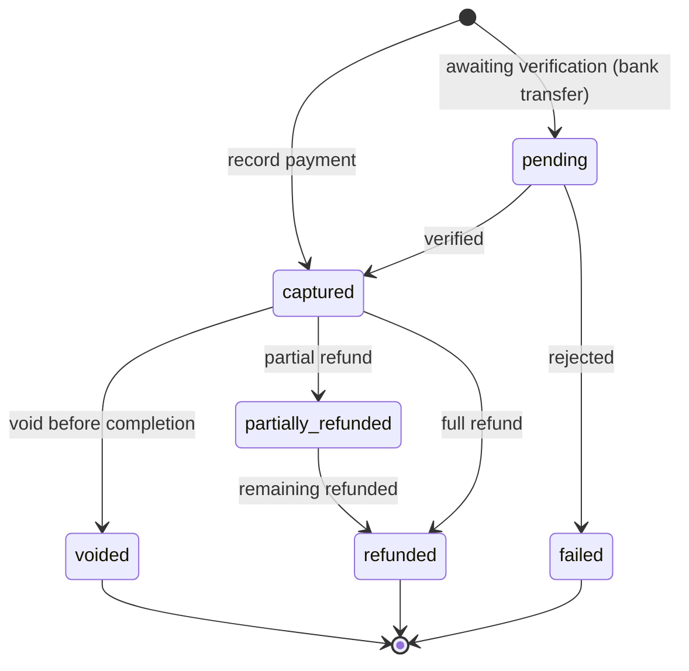
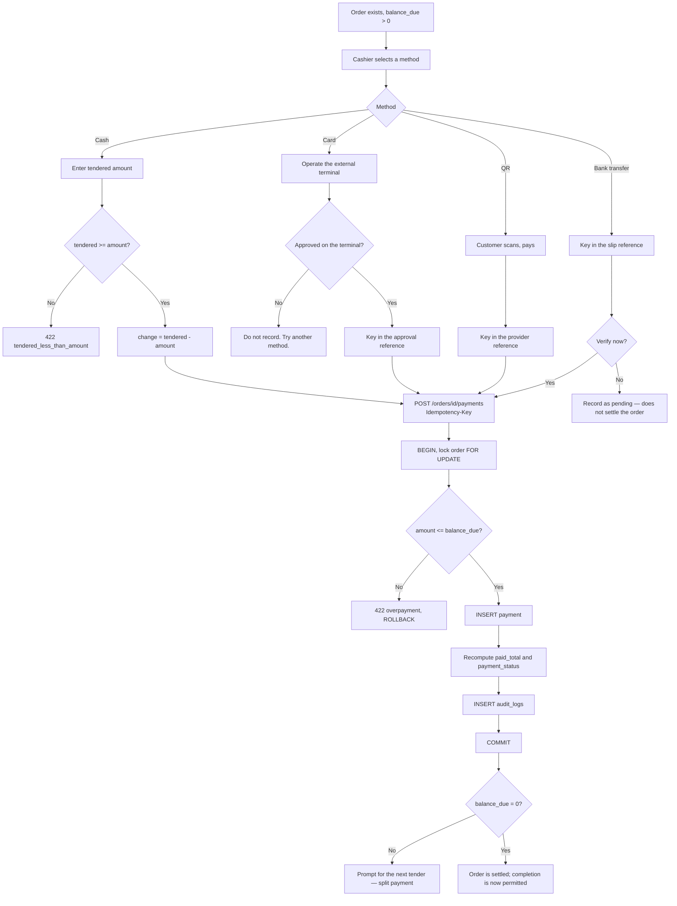
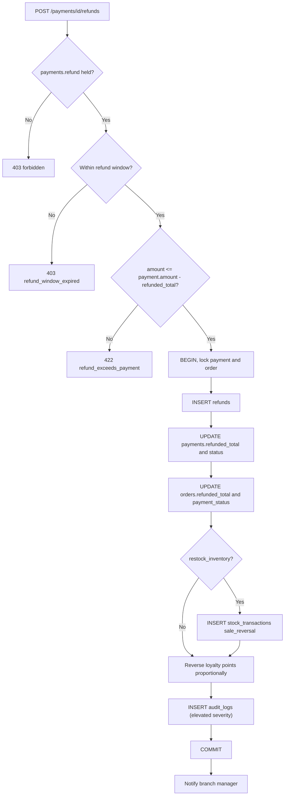
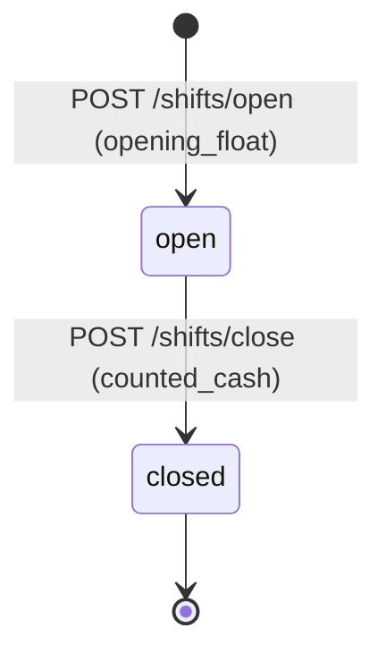

# 12 — Payment Workflow

> **Document purpose.** Define how money is recorded against orders: the four payment methods, split
> tender, change calculation, voids, refunds and cash-drawer reconciliation. Money handling is the
> part of the system where a bug is immediately expensive and immediately visible, so the rules here
> are deliberately strict.

**Prerequisites:** [09-business-rules.md](09-business-rules.md) §13 (payment rules),
[11-order-workflow.md](11-order-workflow.md) (order lifecycle).

**Status:** 🟡 MVP — Planned.

---

## 1. Scope and the recording-versus-processing distinction

> **RestaurantOS records payments. It does not process them** ([01](01-project-overview.md) A7).

| RestaurantOS does | RestaurantOS does not |
|---|---|
| Record that a tender of a given method and amount was applied | Authorise a card |
| Store an approval reference keyed in by the cashier | Talk to an acquirer or gateway |
| Compute change for cash | Hold card data beyond the last four digits |
| Derive `payment_status` from captured payments | Settle funds |
| Reconcile a cash drawer | Reconcile a merchant account |

The card terminal is a separate physical device operated by the cashier. This keeps the system out of
PCI-DSS scope for cardholder data ([22](22-security.md) §10). Gateway integration is 🔵 Post-MVP and
would materially change this document.

---

## 2. Payment methods

| Method | `payments.method` | Reference required | Tendered/change | Notes |
|---|---|---|---|---|
| **Cash** | `cash` | No | **Yes** | The only method with change. Requires an open drawer session when configured. |
| **Card** | `card` | **Yes** — approval code | No | `card_last_four` and `card_brand` optional. |
| **QR** | `qr` | **Yes** — provider reference | No | Wallet or bank QR. |
| **Bank Transfer** | `bank_transfer` | **Yes** — slip or transaction ID | No | Often verified later; see §7 on pending settlement. |

### 2.1 Payment record states



| State | Counts toward `paid_total` |
|---|---|
| `pending` | **No** |
| `captured` | **Yes** |
| `failed` | No |
| `voided` | No |
| `partially_refunded` | Yes, at the full original amount — refunds are tracked separately in `refunded_total` |
| `refunded` | Yes, offset by `refunded_total` |

**BR-PAY-01 restated:** `paid_total = Σ payments.amount WHERE status IN ('captured','partially_refunded','refunded')`.
It is always **recomputed**, never incremented, so a void or refund cannot leave it stale.

---

## 3. The payment flow



### 3.1 Why the order row is locked

Two cashiers, or one cashier double-tapping, can submit two payments for the same remaining balance
simultaneously. Without the lock both read `balance_due = 14.44`, both pass the overpayment check, and
the order is paid twice. The lock plus a re-read of `paid_total` **inside** the transaction is what
prevents it ([02](02-system-architecture.md) §7).

---

## 4. Change calculation

```text
change_due = tendered_amount − amount
```

| # | Rule |
|---|---|
| BR-PAY-04 | `change_due >= 0` always. `tendered < amount` is `422 tendered_less_than_amount`. |
| BR-CHG-01 | `amount` is what is **applied to the order**. Overpayment is expressed as a larger `tendered_amount`, never as a larger `amount`. |
| BR-CHG-02 | Change applies to cash only. Sending `tendered_amount` with a non-cash method is `422`. |
| BR-CHG-03 | `orders.change_due` accumulates change across all cash tenders on the order, for the receipt. |
| BR-CHG-04 | When cash rounding is enabled, rounding is applied to the order total **before** change is computed (BR-ROUND-05). |

**Worked examples**

| Balance due | Method | Amount | Tendered | Change | Result |
|---|---|---|---|---|---|
| 14.44 | cash | 14.44 | 20.00 | 5.56 | Settled |
| 14.44 | cash | 14.44 | 14.44 | 0.00 | Settled, exact |
| 14.44 | cash | 14.44 | 10.00 | — | `422 tendered_less_than_amount` |
| 14.44 | cash | 20.00 | 20.00 | — | `422 overpayment` — `amount` exceeds the balance |
| 14.44 | card | 14.44 | — | — | Settled |
| 14.44 | card | 20.00 | — | — | `422 overpayment` — a card cannot give change |

The fourth row is the one cashiers get wrong: handing over a 20 for a 14.44 bill means
`amount = 14.44, tendered = 20.00`, not `amount = 20.00`.

---

## 5. Split payment

An order may be settled by any number of payments, of any mix of methods.

```mermaid
sequenceDiagram
    participant C as Cashier
    participant A as API
    participant DB as MySQL

    Note over C: Total 14.44 — customer pays 10.00 by card, rest in cash

    C->>A: POST /payments {card, 10.00, ref APPROVAL-1}
    A->>DB: lock order; paid_total 0 + 10.00 <= 14.44 OK
    A->>DB: INSERT payment; paid_total = 10.00
    A-->>C: 201 partially_paid, balance_due 4.44

    C->>A: POST /payments {cash, 4.44, tendered 5.00}
    A->>DB: lock order; 10.00 + 4.44 <= 14.44 OK
    A->>DB: INSERT payment; paid_total = 14.44
    A-->>C: 201 paid, balance_due 0.00, change 0.56

    C->>A: POST /payments {cash, 1.00}
    A-->>C: 422 order_already_paid
```

| # | Rule |
|---|---|
| BR-SPLIT-01 | No limit on the number of payments per order, beyond `payments.max_per_order` (default 10) as an abuse guard. |
| BR-SPLIT-02 | Each payment is validated against the **remaining** balance, re-read under lock. |
| BR-SPLIT-03 | Methods may be mixed freely. |
| BR-SPLIT-04 | `payment_status` is recomputed after each: `unpaid → partially_paid → paid`. |
| BR-SPLIT-05 | Cash rounding is applied once at total finalisation, not per tender. |
| BR-SPLIT-06 | Each payment gets its own `payment_number` and its own audit row. |

---

## 6. Void

Voiding reverses a payment that should not have been recorded — a mis-keyed amount, a wrong method, a
terminal that declined after the cashier had already recorded it.

| Aspect | Detail |
|---|---|
| Endpoint | `POST /payments/{id}/void` |
| Permission | `payments.void` — never Cashier |
| Preconditions | Payment `status = captured`; parent order **not** `completed`; within `payment.void_window_minutes` (default 120) |
| Required | `reason`, 3–255 |
| Effect | `payments.status = voided`, `voided_at`, `voided_by`, `void_reason`; `orders.paid_total` and `payment_status` recomputed |
| Not done | The row is **never deleted** |

**Void versus refund**

| | Void | Refund |
|---|---|---|
| When | Before order completion | After capture, typically after completion |
| Money | Never left the drawer / was never captured | Physically returned |
| Record | `payments.status = voided` | New `refunds` row |
| Permission | `payments.void` | `payments.refund` |
| Loyalty | No effect (points not yet awarded) | Points reversed proportionally |
| Stock | No effect | Restored only if `restock_inventory = true` |

Using a void where a refund is correct hides that money moved. The window and the completion
precondition exist to make that hard.

---

## 7. Refund



| # | Rule |
|---|---|
| BR-REF-01 | A refund always names the `payment_id` it reverses, so the money path is traceable end to end. |
| BR-REF-02 | `Σ refunds.amount ≤ payment.amount` per payment (DB `CHECK`). |
| BR-REF-03 | Partial refunds are permitted and may be repeated up to the full amount. |
| BR-REF-04 | The refund method may differ from the original (a card sale refunded in cash) — recorded explicitly, and reported as a distinct category because it is a fraud pattern worth watching. |
| BR-REF-05 | `reason` is mandatory. |
| BR-REF-06 | Loyalty reversal is `FLOOR(points_earned × refund_amount / grand_total)` (BR-LOY-12). |
| BR-REF-07 | Stock is restored only when `restock_inventory = true`. Default `false` — prepared food does not return to inventory. |
| BR-REF-08 | Refunds beyond `refund.max_days_after_completion` (default 7) require Admin. |
| BR-REF-09 | Refunds are reported in the period the refund occurred, not the period of the sale (BR-PROFIT-03). |

---

## 8. Cash drawer sessions

Without drawer reconciliation, cash shrinkage is undetectable.



### 8.1 Opening

| Aspect | Detail |
|---|---|
| Endpoint | `POST /shifts/open` |
| Permission | `payments.manage_shift` |
| Input | `branch_id`, `opening_float` |
| Constraint | At most one `open` session per user per branch, enforced by a generated-column unique index ([05](05-database-design.md) §5.6) |
| Effect | `cash_drawer_sessions` row; subsequent orders and cash payments by that user are linked to it |

### 8.2 Closing

```text
expected_cash = opening_float
              + Σ cash payments captured in the session
              − Σ cash refunds paid out in the session
              − Σ cash change given                       (already netted, see note)

variance      = counted_cash − expected_cash
```

> **Note on change.** `payments.amount` is what was applied to the order, not what was in the cashier's
> hand. Change is money returned from the drawer, but it is exactly `tendered − amount`, and `tendered`
> is not added to the drawer as a separate credit. Summing `amount` therefore already nets out change.
> Adding change as a further deduction would double-count it — a classic reconciliation bug.

| Aspect | Detail |
|---|---|
| Endpoint | `POST /shifts/{id}/close` |
| Input | `counted_cash`, optional `notes` |
| Required | `notes` when `ABS(variance) > cash.variance_tolerance` |
| Effect | `expected_cash`, `counted_cash`, `variance`, `status = closed`, `closed_at`, `closed_by` |
| Notification | Manager notified when variance exceeds tolerance |
| Blocked | Closing an already-closed session is `422 shift_already_closed` |

### 8.3 Rules

| # | Rule |
|---|---|
| BR-SHIFT-01 | Cash payments require an open session when `payments.require_shift` is enabled; otherwise `403 shift_not_open`. |
| BR-SHIFT-02 | A session belongs to one user and one branch. |
| BR-SHIFT-03 | A manager may close another user's session (`closed_by` differs from `user_id`) — necessary when a cashier leaves without closing. |
| BR-SHIFT-04 | Sessions open beyond 24 h are flagged by a scheduled job and the manager notified. They are never auto-closed: an auto-closed session with no physical count produces a meaningless variance. |
| BR-SHIFT-05 | Variance is reported per cashier over time ([18](18-reporting.md) §7). One large variance is an accident; a consistent negative pattern is not. |

---

## 9. Happy path

**Scenario.** Order `B1-20260905-0042`, total 14.44, single cash tender of 20.00.

| # | Action | State |
|---|---|---|
| 1 | Ana opened a drawer session with a 200.00 float at shift start | Session `open` |
| 2 | Order is Ready, `balance_due` 14.44, `payment_status` `unpaid` | |
| 3 | Ana selects Cash, amount pre-filled at 14.44 | |
| 4 | Ana enters tendered 20.00 | UI shows change 5.56 |
| 5 | `POST /payments` with an idempotency key | `201` |
| 6 | Server: lock order, `0 + 14.44 ≤ 14.44` ✔ | |
| 7 | `payments` row: `captured`, amount 14.44, tendered 20.00, change 5.56 | |
| 8 | `orders.paid_total = 14.44`, `payment_status = paid`, `balance_due = 0` | |
| 9 | Ana hands over 5.56 change | |
| 10 | Ana completes the order | `completed`; loyalty awarded |
| 11 | At shift end: expected 200.00 + 14.44 = 214.44; counted 214.44 | Variance `0.00` |

---

## 10. Alternative paths

| # | Scenario | Behaviour |
|---|---|---|
| A1 | Exact cash | `tendered = amount`, change `0.00`. |
| A2 | Card only | No tendered, reference required. |
| A3 | QR | Reference is the wallet transaction ID. |
| A4 | Bank transfer, verified later | Recorded `pending`; does **not** settle. A manager marks it captured once the bank confirms. |
| A5 | Split card + cash | §5. |
| A6 | Three-way split | Permitted up to `payments.max_per_order`. |
| A7 | Pay before preparation | Legal at any lifecycle state except Completed and Cancelled. |
| A8 | Zero-total order | `payment_status` is `paid` at creation; the payment step is skipped. |
| A9 | Loyalty covers the whole order | Redemption reduces the total to `0.00`; no tender required. |
| A10 | Overpayment in cash | Expressed as tendered > amount, returned as change. Never as `amount` > balance. |
| A11 | Tip 🔵 | Not in MVP. A tip would be a separate non-revenue line, not an inflated `amount`. |
| A12 | Refund to a different method | Permitted; recorded and reported separately. |

---

## 11. Failure paths

| # | Failure | Response | Recovery |
|---|---|---|---|
| F1 | Amount exceeds balance | `422 overpayment` with `balance_due` | Correct the amount |
| F2 | Tendered less than amount | `422 tendered_less_than_amount` | Re-enter |
| F3 | Non-cash without a reference | `422 reference_required` | Enter the approval code |
| F4 | Cash without an open drawer | `403 shift_not_open` | Open a session |
| F5 | Payment on a cancelled order | `422 order_cancelled` | None |
| F6 | Payment on a completed order | `422 order_already_paid` | Refund instead |
| F7 | Double submission | Idempotent: original response replayed | None |
| F8 | Two cashiers settle the same balance | Second gets `422 overpayment` | Refresh |
| F9 | Void outside the window | `403 void_window_expired` | Refund instead |
| F10 | Void by a Cashier | `403 forbidden` | Manager |
| F11 | Refund exceeding remaining | `422 refund_exceeds_payment` | Reduce |
| F12 | Refund past the window | `403 refund_window_expired` | Admin override |
| F13 | Closing an already-closed session | `422 shift_already_closed` | None |
| F14 | Closing with a variance and no note | `422 variance_note_required` | Add an explanation |
| F15 | Network loss after the terminal approved but before recording | — | The reference is on the terminal slip; the cashier records the payment manually. **The idempotency key must be new**, because the earlier request never reached the server. Reconciliation catches any duplicate. |

> **F15 is the hardest real-world case.** The money moved on a device RestaurantOS cannot see. The
> mitigation is procedural — reconcile the terminal batch against `payments` where
> `method = 'card'` daily — not technical. It is a direct consequence of A7 and would be solved by
> gateway integration.

---

## 12. Validation

| Field | Rule | Failure |
|---|---|---|
| `Idempotency-Key` | required header, UUID v4 | `400` |
| `method` | required, in `cash,card,qr,bank_transfer` | `422` |
| `amount` | required, decimal `> 0`, ≤ `balance_due`, 2 decimals | `422 overpayment` |
| `tendered_amount` | required if cash, `>= amount`; forbidden otherwise | `422` |
| `reference` | required if not cash, ≤ 100 | `422 reference_required` |
| `card_last_four` | optional, exactly 4 digits, card only | `422` |
| `card_brand` | optional, ≤ 30 | `422` |
| Order status | not `cancelled`, not `completed` | `422` |
| Drawer | open session required for cash when configured | `403` |
| **Void** `reason` | required, 3–255 | `422` |
| **Refund** `amount` | required, `> 0`, ≤ remaining | `422` |
| **Refund** `reason` | required, 3–255 | `422` |
| **Shift** `opening_float` | required, `>= 0` | `422` |
| **Shift** `counted_cash` | required, `>= 0` | `422` |
| **Shift** `notes` | required when variance exceeds tolerance | `422` |

Full catalogue: [20-validation-rules.md](20-validation-rules.md) §7.

---

## 13. Permissions

| Action | Permission | Condition |
|---|---|---|
| View payments | `payments.view` | Branch scope |
| Take a payment | `payments.create` | |
| Void a payment | `payments.void` | Not Cashier; within window; order not completed |
| Refund | `payments.refund` | Not Cashier; within window |
| Refund past the window | `payments.refund` + Admin | |
| Open the drawer outside a sale | `payments.open_drawer` | Audited |
| Open/close a shift | `payments.manage_shift` | Own session |
| Close another's shift | `payments.manage_shift` + `payments.view_shift_all` | |
| View another's shift report | `payments.view_shift_all` | |

---

## 14. Database changes

| Action | Table | Operation |
|---|---|---|
| **Take payment** | `orders` | `SELECT ... FOR UPDATE` |
| | `daily_sequences` | atomic increment (`payment` scope) |
| | `payments` | `INSERT` — `captured`, amount, tendered, change, reference, session |
| | `orders` | `UPDATE paid_total, payment_status, change_due` |
| | `audit_logs` | `INSERT` |
| **Void** | `payments` | `UPDATE status = voided, voided_at, voided_by, void_reason` |
| | `orders` | `UPDATE paid_total, payment_status` |
| | `audit_logs` | `INSERT` (elevated) |
| **Refund** | `refunds` | `INSERT` |
| | `payments` | `UPDATE refunded_total, status` |
| | `orders` | `UPDATE refunded_total, payment_status` |
| | `stock_transactions` | `INSERT` only if `restock_inventory` |
| | `loyalty_transactions` | `INSERT` (`reverse`) |
| | `customers` | `UPDATE loyalty_points_balance` |
| | `audit_logs` | `INSERT` (elevated) |
| **Open shift** | `cash_drawer_sessions` | `INSERT` — `open` |
| **Close shift** | `cash_drawer_sessions` | `UPDATE expected_cash, counted_cash, variance, status, closed_at, closed_by` |
| | `audit_logs` | `INSERT` |

Each action is one transaction.

---

## 15. Audit log requirements

| Event | `event` | Severity | Captured |
|---|---|---|---|
| Payment recorded | `payment.created` | info | Order, method, amount, tendered, change, reference, actor, session |
| Payment voided | `payment.voided` | **warning** | Payment, amount, reason, actor, original actor |
| Refund issued | `refund.created` | **warning** | Payment, order, amount, method, reason, actor, approver |
| Refund past window | `refund.window_override` | **critical** | Days elapsed, approver |
| Refund to a different method | `refund.method_changed` | **warning** | Original and refund methods |
| Drawer opened outside a sale | `drawer.opened` | **warning** | Actor, reason |
| Shift opened | `shift.opened` | info | Float, actor |
| Shift closed | `shift.closed` | info | Expected, counted, variance |
| Shift variance beyond tolerance | `shift.variance_exceeded` | **critical** | Variance, notes, actor |
| Overpayment attempt | `payment.overpayment_rejected` | info | Attempted amount, balance |
| Payment on a closed order attempt | `payment.rejected` | info | Reason |

**Why rejected attempts are audited.** A cashier repeatedly attempting overpayment is usually confused
UI. A cashier repeatedly attempting to pay a cancelled order may be testing the system's limits. Only
recording successes hides both.

---

## 16. Edge cases

| # | Case | Expected behaviour |
|---|---|---|
| E1 | Payment exactly equal to the balance | Settled, `paid`, change `0.00`. |
| E2 | Payment of `0.01` on a `0.01` balance | Valid. |
| E3 | Payment of `0.00` | `422` — amount must be `> 0`. |
| E4 | Order total reduced by a discount after a partial payment | Blocked (BR-DISC-08). Changing a total after money changed hands invalidates the tender. |
| E5 | Refund making `paid_total` exceed the grand total | Impossible; refunds reduce `refunded_total`, they do not touch `paid_total`. |
| E6 | Void the only payment on a Ready order | `payment_status` returns to `unpaid`; completion is blocked again. |
| E7 | Two refunds racing on the same payment | Payment row locked; the second sees the updated `refunded_total` and may be rejected. |
| E8 | Cash rounding with a split where cash is second | Rounding applied once at finalisation; the cash tender settles the rounded balance. |
| E9 | Drawer closed while an order is unpaid | Permitted — the unpaid order simply is not in the cash total. It remains open and appears in the branch's open-order list. |
| E10 | Cashier's session closed by a manager mid-shift | Subsequent cash payments fail `403 shift_not_open` until a new session is opened. |
| E11 | Bank transfer stays `pending` for days | Does not settle the order; the order cannot complete. Appears in an unverified-payments report. |
| E12 | Payment with a duplicate reference | Permitted — terminals reuse references across days. Duplicate detection is a report, not a hard block, because a false block stops a real sale. |
| E13 | Refund on an order whose customer was deleted | Loyalty reversal is skipped; the refund proceeds and the skip is logged. |
| E14 | Negative variance every shift for one cashier | Not blocked by the system; surfaced in the staff report as a pattern. |
| E15 | Order completed, then all payments voided | Impossible — voids are blocked once the order is completed. Refund is the only path. |

---

## 17. Security considerations

| # | Consideration | Mitigation |
|---|---|---|
| S1 | Cardholder data storage | Only `card_last_four` and `card_brand`. No PAN, no CVV, no expiry, no track data. Validation rejects any 13–19 digit sequence in `reference`. |
| S2 | `payment_status` manipulation | Derived server-side; never mass-assignable. |
| S3 | Overpayment / negative balance | Checked under lock inside the transaction. |
| S4 | Double charging | Mandatory idempotency keys. |
| S5 | Void-after-cash fraud | Void requires elevated permission, a window, a reason, and is audited and reported. |
| S6 | Refund fraud | Elevated permission, mandatory reason, window, notification to the manager, cross-method refunds flagged. |
| S7 | Drawer skimming | Session reconciliation, variance tracking per cashier, `drawer.opened` audited. |
| S8 | Cross-branch payment | `payments.branch_id` is copied from the order, never from the request. |
| S9 | Refund to an unrelated payment | `payment_id` must belong to the named order. |
| S10 | Reference field injection | Validated against a strict character allow-list, length-capped, escaped on output. |
| S11 | Privilege escalation via shift close | Closing another's session requires an additional permission and is audited. |

---

## 18. Testing considerations

| Area | Test |
|---|---|
| Exact settlement | Amount = balance ⇒ `paid`, balance `0.00`. |
| Overpayment | Every method: amount = balance + 0.01 ⇒ `422 overpayment`. |
| Change | Table of tendered/amount pairs including equality and the classic `amount = 20.00` mistake. |
| Split | Two and three-way splits reaching exactly zero; one more ⇒ `422`. |
| Split rounding | Rounding applied once, not per tender. |
| Idempotency | Same key ⇒ one payment; different payload ⇒ `410`. |
| Concurrency | Two payments racing the last balance ⇒ one `201`, one `422`. |
| Void | Recomputes `paid_total`; row retained; blocked after completion; blocked outside the window. |
| Refund | Partial, repeated partial, full; over-refund rejected; loyalty reversed proportionally. |
| Refund stock | `restock_inventory` true and false; assert ledger rows appear only when true. |
| `paid_total` integrity | After a randomised sequence of payments, voids and refunds, assert `paid_total` equals the recomputed sum. |
| Drawer reconciliation | Float + payments − refunds vs counted; assert change is not double-counted. |
| Shift uniqueness | Second open session for the same user/branch ⇒ `422`. |
| Card data | Assert a 16-digit sequence in `reference` is rejected. |
| Audit | Every action, including rejections, writes the expected row. |

Full plan: [24-qa-test-plan.md](24-qa-test-plan.md) §7.2.

---

## 19. Related documents

[07-api-documentation.md](07-api-documentation.md) §5 ·
[09-business-rules.md](09-business-rules.md) §13 ·
[11-order-workflow.md](11-order-workflow.md) ·
[16-customer-loyalty.md](16-customer-loyalty.md) ·
[18-reporting.md](18-reporting.md) §7 ·
[22-security.md](22-security.md) §10
