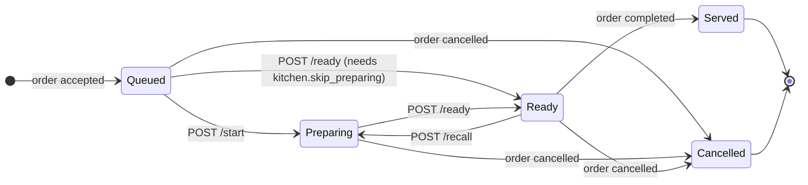
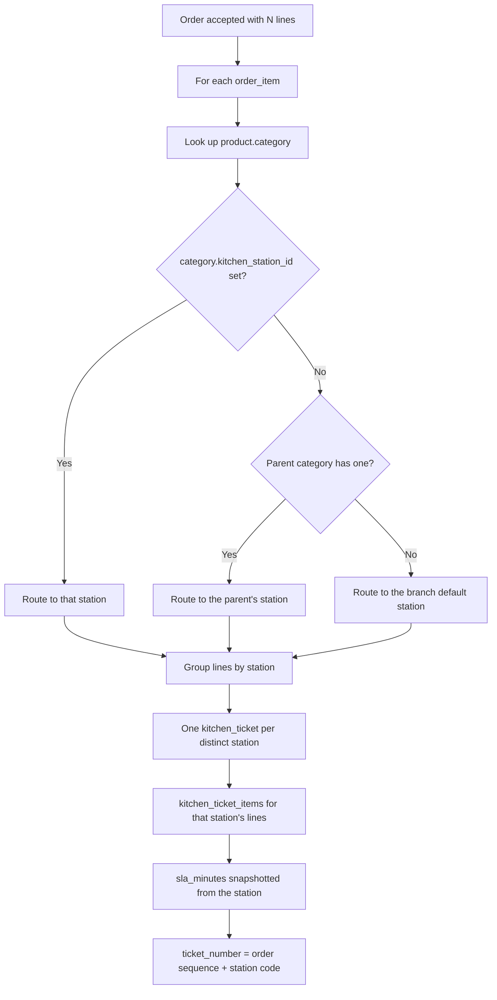
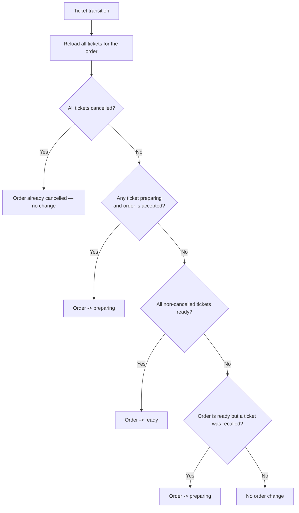

# 13 — Kitchen Workflow (Kitchen Display System)

> **Document purpose.** Define how accepted orders reach the kitchen, how tickets are routed to
> stations, how kitchen staff drive them to completion, and how ticket status aggregates back into
> order status. The KDS is the only screen in the system used by people wearing gloves, at arm's
> length, under time pressure — its constraints are as much physical as technical.

**Prerequisites:** [11-order-workflow.md](11-order-workflow.md) (order lifecycle),
[05-database-design.md](05-database-design.md) §5.7 (kitchen tables).

**Status:** 🟡 MVP — Planned.

---

## 1. Concepts

| Concept | Definition |
|---|---|
| **Station** | A physical preparation point at a branch: `BAR`, `GRILL`, `COLD`, `PASS`. |
| **Ticket** | The unit of work on a screen. One ticket = one order's lines for **one** station. |
| **Ticket item** | One order line on a ticket. |
| **Routing** | Deciding which station a line goes to, via `categories.kitchen_station_id`. |
| **SLA** | The station's target preparation time. Exceeding it flags the ticket as late. |
| **Bump** | Kitchen jargon for marking a ticket complete. Here: `POST /kitchen/tickets/{id}/ready`. |
| **Recall** | Bringing a bumped ticket back — the dish was wrong or returned. |

### 1.1 Why tickets exist rather than reading orders directly

An order containing a latte and a burger must appear on two screens, and each screen must track its own
progress independently. Reading `order_items` directly would mean every screen filtering the same rows
and no place to record "the bar finished but the grill has not". `kitchen_tickets` +
`kitchen_ticket_items` gives each station its own work unit with its own state
([06](06-erd.md) §6).

---

## 2. Ticket lifecycle



| State | Meaning | Screen appearance |
|---|---|---|
| `queued` | Waiting to be started | Full colour, position by priority then `queued_at` |
| `preparing` | Being made | Highlighted, timer running |
| `ready` | Finished, awaiting handover | Moved to a "ready" column |
| `served` | Handed to the customer | Removed from the active view |
| `cancelled` | Order cancelled | Removed within one poll interval, with a visual alert |

---

## 3. Ticket creation and routing

Tickets are created **when the order is accepted**, inside the same transaction that deducts stock
([11](11-order-workflow.md) §3.1). If ticket creation fails, the whole acceptance rolls back — stock is
never deducted for food the kitchen never sees.

### 3.1 Routing algorithm



| # | Rule |
|---|---|
| BR-KDS-01 | One ticket per (order, station). Enforced by `uq_kt_order_station`, which makes re-running generation idempotent. |
| BR-KDS-02 | A branch with no configured stations gets a single default ticket carrying every line. Stations are an enhancement, not a prerequisite. |
| BR-KDS-03 | Lines for products with `preparation_minutes = 0` and no station still produce a ticket, so nothing is silently un-tracked. |
| BR-KDS-04 | `sla_minutes` is snapshotted from the station at creation. Changing a station's SLA does not retroactively make old tickets late. |
| BR-KDS-05 | Ticket ordering on screen is `priority DESC, queued_at ASC` — first in, first out, with manual escalation. |

**Worked example.** Order with 2 large cappuccinos (category *Hot Drinks* → `BAR`) and 1 croissant
(category *Pastries*, no station → parent *Bakery* → `COLD`):

| Ticket | Station | Items | SLA |
|---|---|---|---|
| `T-0042-BAR` | BAR | Cappuccino (Large) × 2 | 10 min |
| `T-0042-COLD` | COLD | Croissant × 1 | 5 min |

---

## 4. The kitchen screen

### 4.1 Polling

MVP uses HTTP polling ([01](01-project-overview.md) A8).

| Aspect | Detail |
|---|---|
| Endpoint | `GET /kitchen/tickets?branch_id=1&station_id=2&since=...` |
| Interval | 5 s default, from `meta.poll_interval_seconds` so the server can slow clients down under load |
| Payload | Active tickets only (`queued`, `preparing`), plus `ready` for the last 10 min |
| Delta | `since` returns only tickets changed after that instant, keeping the steady-state payload small |
| Clock | `meta.server_time` is authoritative; elapsed time is computed from it, never from the tablet clock |
| Failure | Three consecutive failures show an "offline" banner; polling continues with backoff. The last known state stays on screen — a blank kitchen screen mid-service is worse than a slightly stale one. |

**Why not WebSockets in MVP.** A broker is an extra piece of infrastructure to deploy, monitor and
recover. Five seconds of latency is acceptable for food preparation, and polling degrades gracefully
where a dropped socket does not. WebSockets are 🔵 Phase 4.

### 4.2 Display requirements

| Requirement | Rationale |
|---|---|
| Touch targets ≥ 44 px | Gloved hands, no stylus |
| Readable at 1.5 m | Screens are mounted, not held |
| One tap for the primary action | Start and Ready must not require a confirmation dialog |
| Colour **plus** shape/text for lateness | Colour alone fails for colour-blind staff (NFR-USE-004) |
| No horizontal scrolling | Everything for a ticket visible at once |
| Elapsed timer per ticket | Counting up, visible from across the kitchen |
| No prices, no totals, no customer contact | [04](04-user-roles-permissions.md) G13 |

### 4.3 What the kitchen sees

```json
{
  "ticket_number": "T-0042-BAR",
  "order_number": "B1-20260905-0042",
  "order_type": "dine_in",
  "table_number": "12",
  "status": "queued",
  "elapsed_seconds": 184,
  "sla_minutes": 10,
  "is_late": false,
  "items": [
    { "name": "Cappuccino (Large)", "quantity": "2.000", "note": "extra hot", "status": "queued" }
  ]
}
```

Deliberately absent: `unit_price`, `line_total`, `grand_total`, customer phone and email. The kitchen
needs to know *what to make*, not what it cost.

---

## 5. Status aggregation

Ticket status drives order status. This is the only place where a subordinate entity changes its
parent's state, so the rule must be exact.



| # | Rule |
|---|---|
| BR-KDS-06 | The order becomes `preparing` when the **first** ticket starts. |
| BR-KDS-07 | The order becomes `ready` only when **every** non-cancelled ticket is `ready`. |
| BR-KDS-08 | Recalling a ticket from an order already `ready` moves the order back to `preparing`. This is the single legal backward order transition ([11](11-order-workflow.md) §4). |
| BR-KDS-09 | Cancelled tickets are excluded from the aggregation. An order whose only remaining ticket is ready becomes ready even if another was cancelled. |
| BR-KDS-10 | Aggregation runs inside the same transaction as the ticket transition, so ticket and order status can never disagree. |

**Worked example** — two tickets:

| Event | BAR | COLD | Order |
|---|---|---|---|
| Accepted | queued | queued | accepted |
| Barista starts | **preparing** | queued | **preparing** |
| Barista bumps | **ready** | queued | preparing (COLD outstanding) |
| Pastry starts | ready | **preparing** | preparing |
| Pastry bumps | ready | **ready** | **ready** |
| Cashier completes | **served** | **served** | **completed** |

---

## 6. Happy path

**Scenario.** Order `B1-20260905-0042` accepted at 14:32:10.

| Time | Actor | Action | Result |
|---|---|---|---|
| 14:32:10 | System | Order accepted | 2 tickets created, `queued` |
| 14:32:14 | BAR screen | Poll | `T-0042-BAR` appears, timer starts |
| 14:32:15 | COLD screen | Poll | `T-0042-COLD` appears |
| 14:32:40 | Barista | Taps Start | BAR `preparing`; **order → preparing** |
| 14:33:05 | Pastry chef | Taps Start | COLD `preparing` |
| 14:34:50 | Pastry chef | Taps Ready | COLD `ready` (1 m 45 s, within 5 min SLA) |
| 14:36:20 | Barista | Taps Ready | BAR `ready` (3 m 40 s, within 10 min SLA); **order → ready** |
| 14:36:21 | POS | Notification | "Order 0042 is ready" |
| 14:38:00 | Cashier | Completes | Both tickets `served`; order `completed` |

Full lifecycle: 5 m 50 s from acceptance to handover.

---

## 7. Alternative paths

| # | Scenario | Behaviour |
|---|---|---|
| A1 | **Single station** | One ticket. Aggregation is trivial: ticket ready ⇒ order ready. |
| A2 | **No stations configured** | Default ticket per BR-KDS-02. |
| A3 | **Skip preparing** | Queued → Ready directly with `kitchen.skip_preparing`, for pre-made items. |
| A4 | **Item-level completion** | `POST /kitchen/tickets/{id}/items/{itemId}/ready`. The ticket auto-completes when the last item is ready (FR-KDS-009). |
| A5 | **Priority bump** | `PATCH /kitchen/tickets/{id}/priority` moves a ticket to the top. Audited — it delays someone else's food. |
| A6 | **Recall** | Ready → Preparing. Order returns to preparing. Requires `kitchen.recall_ticket`; reason recorded. |
| A7 | **Order cancelled mid-preparation** | Tickets → `cancelled`; screens show a prominent alert (removing food silently means it still gets made). Stock is restored by the order cancel path. |
| A8 | **Order edited after acceptance** | Existing tickets are updated: new lines added, removed lines cancelled. A ticket left with zero active items is cancelled. |
| A9 | **Manager drives from the POS** | `POST /orders/{id}/start-preparing` and `/ready` set all tickets accordingly — for branches with no kitchen screen. |
| A10 | **Two screens at one station** | Both poll the same tickets. Optimistic locking means the second bump gets `409`; the UI treats it as success (someone else did it) and refreshes. |
| A11 | **Late ticket** | Flagged visually; appears in the kitchen-performance report. No automatic action — automatically escalating a late ticket during a rush makes the rush worse. |

---

## 8. Failure paths

| # | Failure | Response | Recovery |
|---|---|---|---|
| F1 | Illegal ticket transition | `422 invalid_state_transition` | Refresh |
| F2 | Version mismatch (two screens) | `409 version_mismatch` | UI refreshes silently and shows current state |
| F3 | Skip preparing without permission | `422 skip_preparing_forbidden` | Use Start first |
| F4 | Recall without permission | `403 forbidden` | Ask a manager |
| F5 | Ticket for an out-of-scope branch | `404` | — |
| F6 | Poll fails (network) | Client shows offline banner, backs off | Last state retained on screen |
| F7 | Ticket creation fails during accept | Whole acceptance rolls back | Retry accept |
| F8 | Order cancelled while a ticket is being bumped | Bump returns `422 order_cancelled` | Screen refreshes and removes the ticket |
| F9 | Station deleted with active tickets | Deletion is blocked while active tickets exist (`422 station_has_active_tickets`) | Reassign or wait |
| F10 | Clock drift on the tablet | Elapsed time uses `server_time`; drift has no effect | — |
| F11 | Screen left on an old branch after a staff move | Branch scope returns `404`/`403`; the UI forces re-selection | Re-select branch |

---

## 9. Validation

| Field | Rule |
|---|---|
| `branch_id` | required, exists, in scope |
| `station_id` | optional, exists, belongs to the branch |
| `status` filter | optional, comma list of valid statuses |
| `since` | optional, ISO 8601, not in the future |
| `version` (transitions) | required, integer, must match |
| Ticket status | must permit the target transition |
| `priority` | integer 0–9 |
| Recall `reason` | required, 3–255 |
| Station `code` | required, ≤ 30, unique per branch, uppercase alphanumeric |
| Station `sla_minutes` | required, integer 1–240 |

---

## 10. Permissions

| Action | Permission | Notes |
|---|---|---|
| Open the KDS | `kitchen.access` | |
| View tickets | `kitchen.view_tickets` | Branch-scoped, reduced projection |
| Start / Ready | `kitchen.update_ticket` | Kitchen, Manager, Admin |
| Skip preparing | `kitchen.skip_preparing` | Manager and above |
| Recall | `kitchen.recall_ticket` | Kitchen and above |
| Change priority | `kitchen.update_ticket` | Audited |
| Manage stations | `kitchen.manage_stations` | Manager and above |
| See prices on a ticket | **No permission grants this** | Kitchen projection never includes money |

---

## 11. Database changes

| Action | Table | Operation |
|---|---|---|
| **Order accepted** | `kitchen_tickets` | `INSERT` × distinct stations |
| | `kitchen_ticket_items` | `INSERT` × lines |
| **Start** | `kitchen_tickets` | `UPDATE status = preparing, started_at, version + 1` |
| | `orders` | `UPDATE status = preparing, preparing_at` (if first) |
| | `order_status_histories` | `INSERT` (if the order changed) |
| | `audit_logs` | `INSERT` |
| **Ready** | `kitchen_tickets` | `UPDATE status = ready, ready_at, prepared_by, version + 1` |
| | `kitchen_ticket_items` | `UPDATE status = ready` for any outstanding |
| | `orders` | `UPDATE status = ready, ready_at` (if all tickets ready) |
| | `order_status_histories`, `audit_logs` | `INSERT` |
| **Item ready** | `kitchen_ticket_items` | `UPDATE status, prepared_at, prepared_by` |
| | `kitchen_tickets` | `UPDATE` if it was the last item |
| **Recall** | `kitchen_tickets` | `UPDATE status = preparing, ready_at = NULL, version + 1` |
| | `orders` | `UPDATE status = preparing` |
| | `order_status_histories`, `audit_logs` | `INSERT` |
| **Order completed** | `kitchen_tickets` | `UPDATE status = served, served_at` |
| **Order cancelled** | `kitchen_tickets` | `UPDATE status = cancelled` |
| **Poll** | — | Read-only |

The poll endpoint performs **no writes**. At 5 s intervals across every screen in every branch it is
the highest-frequency query in the system; adding a write would multiply database load for no benefit.

---

## 12. Audit log requirements

| Event | `event` | Captured |
|---|---|---|
| Tickets created | `kitchen.tickets_created` | Order, station list, item counts |
| Started | `kitchen.ticket_started` | Ticket, station, actor, queue wait |
| Ready | `kitchen.ticket_ready` | Ticket, actor, preparation duration, SLA breach flag |
| Item ready | `kitchen.item_ready` | Item, actor |
| Recalled | `kitchen.ticket_recalled` | Ticket, actor, reason, prior duration — **warning severity** |
| Priority changed | `kitchen.priority_changed` | Ticket, old, new, actor |
| Skipped preparing | `kitchen.preparing_skipped` | Ticket, actor — **warning severity** |
| Cancelled by order cancel | `kitchen.ticket_cancelled` | Ticket, order reason |
| Station created/updated/deleted | `kitchen.station_*` | Before/after |

Polls are **not** audited. Auditing a read that happens every five seconds per screen would produce
millions of meaningless rows and bury the events that matter.

---

## 13. Edge cases

| # | Case | Expected behaviour |
|---|---|---|
| E1 | Order with all lines routed to one station | One ticket; aggregation trivial. |
| E2 | Order with lines to three stations | Three tickets; order ready only when all three are. |
| E3 | One ticket cancelled, another ready | Order becomes ready (BR-KDS-09). |
| E4 | All tickets cancelled but the order is not | Cannot occur — tickets are only cancelled by order cancellation. A data-integrity check flags it if it ever does. |
| E5 | Two screens bump simultaneously | One `200`, one `409`; the UI shows success for both because the outcome is the same. |
| E6 | Ticket bumped, then the order is edited to add a line | A new ticket item is added to the existing station ticket, which returns to `preparing`. |
| E7 | Ticket for a product whose category changed station after acceptance | The ticket keeps its original station. Routing is decided once, at acceptance. |
| E8 | Elapsed time crosses the SLA while on screen | The flag updates on the next poll; no server action. |
| E9 | Order accepted at 23:59, prepared at 00:05 | Kitchen performance is attributed to the order's `business_date`. |
| E10 | Kitchen tablet offline for 10 minutes | On reconnect the delta poll returns everything changed; nothing is missed. |
| E11 | A ticket with zero items after edits | Automatically cancelled. |
| E12 | Product with `preparation_minutes` null | Ticket SLA comes from the station only. |
| E13 | Station SLA changed mid-service | Existing tickets keep the snapshot; new tickets take the new value. |
| E14 | Recall after the order is completed | `422 invalid_state_transition` — completed is terminal. Handle as a refund. |

---

## 14. Security considerations

| # | Consideration | Mitigation |
|---|---|---|
| S1 | Financial data exposure on an open screen | The kitchen projection contains no money fields at all, enforced by a dedicated API Resource — not by hiding in the UI. |
| S2 | Customer PII on an open screen | Name only when needed for a takeaway call-out; never phone or email. |
| S3 | Unattended tablet | KDS tokens carry `kitchen:*` abilities only, so a stolen tablet cannot void orders or read reports ([08](08-authentication-authorization.md) §8). |
| S4 | Long-lived KDS token | 24 h absolute expiry, no idle timeout — a deliberate trade-off documented in [08](08-authentication-authorization.md) §3.2. Compensated by narrow abilities. |
| S5 | Cross-branch ticket visibility | Branch scope enforced; a KDS token pinned to its branch. |
| S6 | Poll endpoint as a DoS vector | Rate-limited per token; the server can raise `poll_interval_seconds` under load. |
| S7 | Ticket manipulation to hide slow service | Every transition records the actor and duration; recalls and skips are warnings in the audit log and appear in the performance report. |

---

## 15. Performance considerations

| Aspect | Target | Technique |
|---|---|---|
| Poll response | p95 < 250 ms | `idx_kt_branch_status_queued` covers the query |
| Poll payload | < 20 kB steady state | Delta via `since`; active tickets only |
| Screens per branch | 4 | 4 screens × 12 polls/min = 48 req/min/branch |
| Total poll load | 15 branches × 48 = 720 req/min | Well within the read budget |
| Ticket creation | Adds < 50 ms to acceptance | Batch insert, one statement per table |

**Load arithmetic matters here.** At 5 s intervals the KDS alone generates more requests than the POS.
Any write on the poll path, or any N+1 in it, multiplies by 720 per minute.

---

## 16. Testing considerations

| Area | Test |
|---|---|
| Routing | Category with a station, without one (parent fallback), and with neither (branch default). |
| Ticket count | An order across 3 stations produces exactly 3 tickets; re-running generation produces no duplicates. |
| Aggregation | Every combination of ticket states maps to the correct order state — table-driven over §5. |
| Partial readiness | Order stays `preparing` while any ticket is outstanding. |
| Recall | Order returns to `preparing`; the history row records the backward transition. |
| Cancelled exclusion | One cancelled + one ready ⇒ order ready. |
| Concurrency | Two simultaneous bumps ⇒ one `200`, one `409`, one final state. |
| Projection | Assert no money or contact field appears anywhere in the KDS response — automated key scan. |
| Delta polling | `since` returns only changed tickets; nothing is missed after an offline gap. |
| Clock independence | Elapsed time correct with the client clock set an hour wrong. |
| SLA snapshot | Changing a station SLA does not alter existing tickets. |
| Performance | 4 screens × 15 branches polling for 10 min; p95 < 250 ms ([25](25-performance-testing.md) §5.4). |
| Accessibility | Late state distinguishable in greyscale; targets ≥ 44 px. |

Full plan: [24-qa-test-plan.md](24-qa-test-plan.md) §4.3.

---

## 17. Related documents

[07-api-documentation.md](07-api-documentation.md) §6 ·
[11-order-workflow.md](11-order-workflow.md) ·
[18-reporting.md](18-reporting.md) §7 ·
[19-notifications.md](19-notifications.md) ·
[25-performance-testing.md](25-performance-testing.md) §5.4
