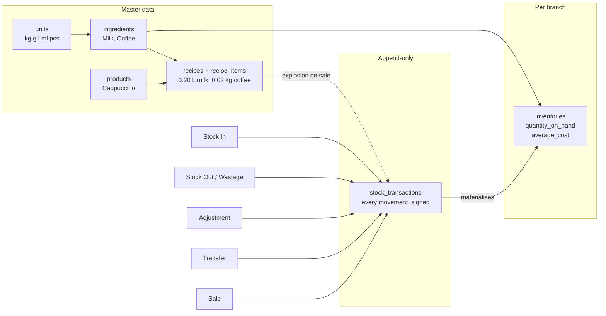
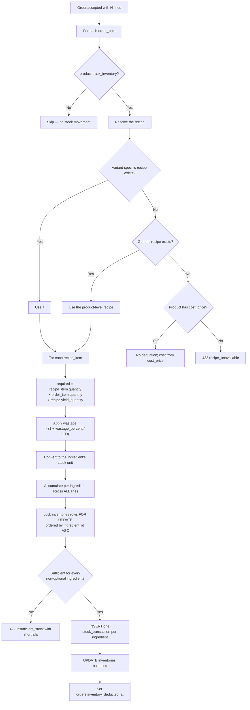
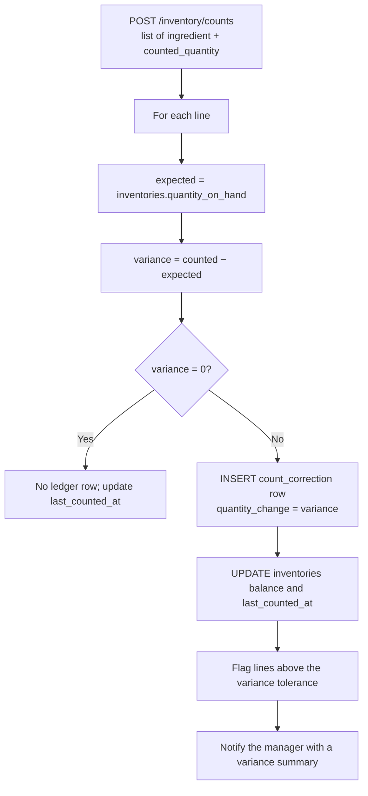
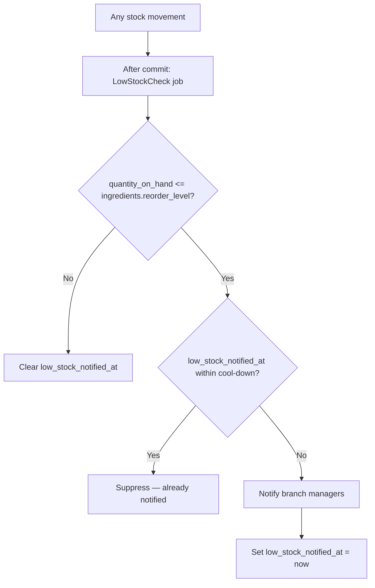

# 14 — Inventory Workflow

> **Document purpose.** Define how ingredients are tracked, how recipes convert a sale into ingredient
> consumption, how the append-only stock ledger works, and how balances, costs and low-stock alerts are
> maintained. This is the module that makes food-cost reporting possible and the one where a bug
> silently corrupts data for months before anyone notices.

**Prerequisites:** [05-database-design.md](05-database-design.md) §5.8,
[09-business-rules.md](09-business-rules.md) §10 and §14.

**Status:** 🟡 MVP — Planned.

---

## 1. The model in one picture



**Two invariants govern everything below:**

| # | Invariant |
|---|---|
| **INV-1** | `inventories.quantity_on_hand` **always** equals `SUM(stock_transactions.quantity_change)` for that (branch, ingredient). Constraint C8. |
| **INV-2** | `stock_transactions` rows are **never** updated or deleted. Corrections are new, compensating rows. |

If either is violated, every inventory number in the system is untrustworthy. Both are verified nightly
([05](05-database-design.md) §11) and enforced at the database grant level.

---

## 2. Units and conversion

### 2.1 Unit families

| Family | Base unit | Members |
|---|---|---|
| `mass` | `kg` | `kg` (1), `g` (0.001) |
| `volume` | `l` | `l` (1), `ml` (0.001) |
| `count` | `pcs` | `pcs` (1) |

### 2.2 Conversion

```text
quantity_in_target = quantity_in_source
                     × source.conversion_factor
                     ÷ target.conversion_factor
```

Both units must share a `family`. Cross-family conversion is rejected `422 unit_family_mismatch`
(FR-INV-003).

**Examples**

| From | To | Calculation | Result |
|---|---|---|---|
| 200 g | kg | `200 × 0.001 ÷ 1` | `0.2 kg` |
| 0.02 kg | g | `0.02 × 1 ÷ 0.001` | `20 g` |
| 250 ml | l | `250 × 0.001 ÷ 1` | `0.25 l` |
| 0.5 l | kg | — | `422 unit_family_mismatch` |

**Why the family check matters.** Recipes are written by chefs in whatever unit is natural — "20 g
coffee" — while stock is held in whatever unit it is purchased in — "kg". Without the family guard,
a typo of `l` for `kg` would silently deduct 1000× the wrong amount and nobody would notice until the
monthly count.

### 2.3 Where conversion happens

| Point | Conversion |
|---|---|
| Recipe definition | Stored in the chef's unit (`recipe_items.unit_id`) |
| Explosion | Converted to the ingredient's **stock unit** before any deduction |
| Ledger | Always written in the **stock unit** — one unit per ingredient, always |
| Display | Converted back for readability |

**The ledger is always in the stock unit.** Mixing units within one ingredient's ledger would make
`SUM(quantity_change)` meaningless.

---

## 3. The stock ledger

### 3.1 Transaction types

The requirements name four business-level movement types. The ledger stores finer-grained types so
reporting can distinguish a sale from manual wastage.

| Business type | Ledger `type` | Sign | Source |
|---|---|---|---|
| **Stock In** | `stock_in` | `+` | Manual receipt of goods |
| | `transfer_in` | `+` | Receipt from another branch |
| | `sale_reversal` | `+` | Order cancelled or refunded with restock |
| | `count_correction` | `±` | Physical count above expected |
| **Stock Out** | `stock_out` | `−` | Manual issue (staff meals, samples) |
| | `wastage` | `−` | Spoilage, breakage |
| | `sale_deduction` | `−` | Recipe explosion on order acceptance |
| | `transfer_out` | `−` | Dispatch to another branch |
| **Adjustment** | `adjustment` | `±` | Manual correction with a mandatory reason |
| | `count_correction` | `±` | Result of a physical count |
| **Transfer** | `transfer_in` / `transfer_out` | `±` | [15](15-stock-transfer.md) |

### 3.2 Anatomy of a ledger row

Every row records not only the movement but the **state after it**, so any point-in-time balance is a
single row read rather than an aggregate:

| Column | Purpose |
|---|---|
| `quantity_change` | Signed, in the stock unit, never zero |
| `unit_cost` | Cost per unit for **this** movement |
| `total_cost` | `ABS(quantity_change) × unit_cost` |
| `balance_after` | Resulting `quantity_on_hand` |
| `average_cost_after` | Resulting weighted average |
| `reference_type` / `reference_id` | What caused it (`Order`, `StockTransfer`, `Refund`) |
| `reason` | Mandatory for `adjustment`, `wastage`, `count_correction` |
| `performed_by` | Actor, or `NULL` for system-generated |
| `occurred_at` | Business time (may be backdated); `created_at` is the write time |

### 3.3 Immutability enforcement

Three independent layers, because a single layer eventually gets bypassed:

1. **Application** — no service or model path issues `UPDATE`/`DELETE` on the table.
2. **Database grant** — the application user has `SELECT, INSERT` only on `stock_transactions`.
3. **Trigger** — `BEFORE UPDATE` and `BEFORE DELETE` triggers raise `SIGNAL SQLSTATE '45000'`.

---

## 4. Recipe explosion — the core algorithm

This is the mechanism the requirements describe: *selling a product deducts ingredients according to
its recipe*.

### 4.1 The algorithm



**Aggregation before deduction (step N) is essential.** An order with three drinks each using milk
produces **one** milk ledger row, not three. This keeps the ledger readable, reduces lock contention,
and means a 200-line order may only touch 20 ingredient rows.

### 4.2 Recipe resolution precedence

| Priority | Match | Example |
|---|---|---|
| 1 | `product_id` **and** `product_variant_id` exact | A large cappuccino has its own recipe with more milk |
| 2 | `product_id` with `product_variant_id IS NULL` | Generic cappuccino recipe applies to all sizes |
| 3 | No recipe, `cost_price` set | Bottled water — costed but not exploded |
| 4 | No recipe, no `cost_price`, `track_inventory = true` | `422 recipe_unavailable` |

Only recipes with `is_active = true` and `deleted_at IS NULL` are considered. Exactly one active version
per (product, variant) — constraint C2.

### 4.3 The worked example

**Selling Cappuccino × 2.**

Recipe for Cappuccino (`yield_quantity = 1`):

| Ingredient | Recipe quantity | Recipe unit | Wastage | Ingredient stock unit |
|---|---|---|---|---|
| Milk | `0.20` | `l` | 0 % | `l` |
| Coffee | `0.02` | `kg` | 0 % | `kg` |

Calculation:

```text
Milk:
    0.20 L per unit × 2 units ÷ 1 yield  = 0.40 L
    wastage 0%                            = 0.40 L
    already in stock unit (l)             = 0.4000

Coffee:
    0.02 kg per unit × 2 units ÷ 1 yield = 0.04 kg
    wastage 0%                            = 0.04 kg
    already in stock unit (kg)            = 0.0400
```

Resulting ledger rows at the selling branch:

| `ingredient` | `type` | `quantity_change` | `unit_cost` | `balance_after` | `reference` |
|---|---|---|---|---|---|
| Milk | `sale_deduction` | `-0.4000` | `1.3000` | `11.6000` | `Order:4213` |
| Coffee | `sale_deduction` | `-0.0400` | `18.0000` | `4.9600` | `Order:4213` |

COGS for the line: `(0.40 × 1.30) + (0.04 × 18.00) = 0.52 + 0.72 = 1.2600`, i.e. `0.6300` per
cappuccino, snapshotted to `order_items.unit_cost_snapshot`.

### 4.4 A more complex example — wastage, conversion and yield

**Product:** *Espresso Tonic*, sold as a variant *Double*.
**Recipe** (variant-specific), `yield_quantity = 1`:

| Ingredient | Recipe qty | Recipe unit | Wastage | Stock unit |
|---|---|---|---|---|
| Coffee beans | `18` | `g` | 5 % | `kg` |
| Tonic water | `150` | `ml` | 0 % | `l` |
| Lemon | `1` | `pcs` | 10 % | `pcs` |

**Selling 3 units:**

```text
Coffee beans:
    18 g × 3 ÷ 1                 = 54 g
    × (1 + 5/100)                = 56.7 g
    convert g -> kg: × 0.001 ÷ 1 = 0.0567 kg

Tonic water:
    150 ml × 3 ÷ 1               = 450 ml
    × (1 + 0/100)                = 450 ml
    convert ml -> l              = 0.4500 l

Lemon:
    1 pcs × 3 ÷ 1                = 3 pcs
    × (1 + 10/100)               = 3.3 pcs
    no conversion needed         = 3.3000 pcs
```

> **Note the fractional lemon.** Wastage on a countable item produces a fraction. This is intentional:
> over a hundred sales, 10 % wastage on lemons is 10 real lemons. Rounding each sale up to a whole
> lemon would overstate consumption by up to 100 %. The stock quantity column is
> `DECIMAL(14,4)` precisely so this works.

### 4.5 Yield greater than one

A recipe that produces a batch — *Tomato Sauce*, `yield_quantity = 10` portions from 2 kg tomatoes:

```text
Selling 3 portions:
    2 kg × 3 ÷ 10 = 0.6 kg tomatoes
```

`yield_quantity` exists so a chef can write the recipe the way they cook it, in batches, rather than
computing per-portion fractions by hand.

---

## 5. Deduction timing

**Default: `inventory.deduction_point = on_accept`** ([01](01-project-overview.md) A4).

| Option | When | Argument for | Argument against |
|---|---|---|---|
| `on_create` | Order created | Earliest possible stock accuracy | Deducts for orders that may never be confirmed |
| **`on_accept`** ✅ | Order accepted | Matches the moment the kitchen commits ingredients | A pending order does not reserve stock |
| `on_complete` | Order completed | Deducts only what was actually delivered | Stock looks available while it is already being cooked; oversells during a rush |

**Rules**

| # | Rule |
|---|---|
| BR-DED-01 | Stock **sufficiency** is checked at order creation regardless of the deduction point, so a cashier is never told "yes" and then "no" a moment later. |
| BR-DED-02 | Deduction is idempotent, guarded by `orders.inventory_deducted_at`. A second attempt is `422 already_deducted`. |
| BR-DED-03 | Deduction and the order status change are in the **same transaction**. Neither can happen without the other. |
| BR-DED-04 | Reversal on cancellation reads the ledger, never the recipe (BR-STATE-04). |
| BR-DED-05 | Products with `track_inventory = false` never move stock, even with a recipe. |
| BR-DED-06 | Optional recipe items (`is_optional = true`) never block a sale. If short, they deduct what is available down to zero and log a shortfall. |

### 5.1 Reversal on cancellation

```text
SELECT * FROM stock_transactions
WHERE reference_type = 'Order' AND reference_id = :order_id
  AND type = 'sale_deduction'

for each row:
    INSERT stock_transactions (
        type            = 'sale_reversal',
        quantity_change = −row.quantity_change,      -- positive
        unit_cost       = row.unit_cost,             -- original cost, not current
        reason          = 'Order cancelled: ' + cancel_reason,
        reference       = same order
    )
```

**The original cost is reused, not the current average.** Restoring at today's average would create a
phantom cost gain or loss on a purely administrative action.

---

## 6. Stock in

Recording receipt of goods. The only operation that changes average cost.

| Aspect | Detail |
|---|---|
| Endpoint | `POST /inventory/stock-in` |
| Permission | `inventory.stock_in` |
| Input | `branch_id`, `ingredient_id`, `quantity`, `unit_id`, `unit_cost`, optional `reference`, `occurred_at`, `note` |
| Effect | One `stock_in` ledger row; `inventories.quantity_on_hand` and `average_cost` updated |

**Average cost recalculation** ([09](09-business-rules.md) §10.1):

```text
new_average = (old_qty × old_average + in_qty × in_unit_cost) ÷ (old_qty + in_qty)
```

| Event | Qty | Unit cost | Balance | Average |
|---|---|---|---|---|
| Opening | — | — | `0.0000` | `0.0000` |
| Stock in 10 L @ 1.20 | `+10` | `1.2000` | `10.0000` | `1.2000` |
| Stock in 5 L @ 1.50 | `+5` | `1.5000` | `15.0000` | `1.3000` |
| Sale −0.4 L | `−0.4` | `1.3000` | `14.6000` | `1.3000` (unchanged) |
| Stock in 10 L @ 1.10 | `+10` | `1.1000` | `24.6000` | `1.2187` |

---

## 7. Stock out and wastage

| Type | Use | Reason required |
|---|---|---|
| `stock_out` | Staff meals, samples, transfers to a non-tracked use | Yes |
| `wastage` | Spoilage, breakage, expiry | Yes |

Both reduce quantity at the current average cost and leave the average unchanged. Wastage is reported
separately because it is a cost-control metric, not just a stock movement.

---

## 8. Adjustments and physical counts

### 8.1 Adjustment

The most sensitive inventory operation — it changes stock with no corresponding business event.

| Control | Rule |
|---|---|
| Permission | `inventory.adjust` — Manager and above |
| Reason | Mandatory, 10–255 characters |
| Magnitude guard | Above `inventory.adjust.max_percent_without_admin` (default 20 %) requires Admin |
| Backdating | Limited to `inventory.max_backdate_days` |
| Audit | Always, at warning severity |
| Notification | Branch manager notified on every adjustment above the threshold |

Three input modes:

| `adjustment_type` | Meaning | `quantity_change` |
|---|---|---|
| `set` | "The balance is actually X" | `X − current_balance` |
| `increase` | "Add X" | `+X` |
| `decrease` | "Remove X" | `−X` |

`set` is the mode used after a physical count and is the one most likely to be large.

### 8.2 Physical count



| # | Rule |
|---|---|
| BR-CNT-01 | A count produces `count_correction` rows, never a direct balance overwrite. The variance must be visible in the ledger. |
| BR-CNT-02 | Zero-variance lines write no ledger row but do update `last_counted_at` — evidence the count happened. |
| BR-CNT-03 | A count is submitted as one batch in one transaction; a partial count is not applied. |
| BR-CNT-04 | Variance above `inventory.count.variance_tolerance_percent` requires a per-line reason. |
| BR-CNT-05 | Counts should be taken outside service hours; a count taken mid-service races with sales. The API does not block it but the response warns when orders were accepted during the count window. |

---

## 9. Low stock alerts



| # | Rule |
|---|---|
| BR-LOW-01 | Evaluated after every movement, asynchronously, so it never slows the sell path. |
| BR-LOW-02 | De-duplicated by `low_stock_notified_at` and `notifications.low_stock_cooldown_hours` (default 6). Fifty sales that each keep milk below the threshold produce one notification, not fifty. |
| BR-LOW-03 | The marker is cleared when the balance rises above the level, so the next dip notifies again. |
| BR-LOW-04 | Recipients: users with `inventory.view` at that branch. |
| BR-LOW-05 | A separate scheduled sweep every 15 minutes catches ingredients that crossed the threshold through a path that skipped the event. |

---

## 10. Happy path

**Scenario.** Riverside branch, morning of 2026-09-05.

| # | Event | Ledger | Balance |
|---|---|---|---|
| 1 | Delivery: 12 L milk @ 1.30 | `stock_in +12.0000` | `12.0000 l`, avg `1.3000` |
| 2 | Delivery: 5 kg coffee @ 18.00 | `stock_in +5.0000` | `5.0000 kg`, avg `18.0000` |
| 3 | Order 0042 accepted: Cappuccino × 2 | `sale_deduction −0.4000` (milk), `−0.0400` (coffee) | `11.6000 l`, `4.9600 kg` |
| 4 | Order 0043 accepted: Cappuccino × 4 | `sale_deduction −0.8000`, `−0.0800` | `10.8000 l`, `4.8800 kg` |
| 5 | 0.5 L milk spilled | `wastage −0.5000`, reason "Spilled during service" | `10.3000 l` |
| 6 | Order 0043 cancelled | `sale_reversal +0.8000`, `+0.0800` | `11.1000 l`, `4.9600 kg` |
| 7 | Evening count: milk 11.0 | `count_correction −0.1000`, reason "Daily count" | `11.0000 l` |

Ledger sum check: `12.0 − 0.4 − 0.8 − 0.5 + 0.8 − 0.1 = 11.0` ✔ equals `quantity_on_hand`.

---

## 11. Alternative paths

| # | Scenario | Behaviour |
|---|---|---|
| A1 | Product with no recipe but a `cost_price` | No deduction; COGS from `cost_price`. |
| A2 | Product with `track_inventory = false` | No deduction, no cost tracking. |
| A3 | Variant-specific recipe | Takes precedence over the generic one. |
| A4 | Recipe with a batch yield | Divided by `yield_quantity`. |
| A5 | Recipe item marked optional and out of stock | Sale proceeds; available quantity deducted; shortfall logged. |
| A6 | Negative stock permitted | With `allow_negative_stock = true`, the sale proceeds and the balance goes negative; a critical notification is raised. |
| A7 | Backdated stock-in | `occurred_at` in the past within the allowed window. `balance_after` reflects the **current** balance, not a rewritten history — the ledger is chronological by `created_at`. |
| A8 | Ingredient used by many products | Aggregated per ingredient before locking. |
| A9 | Transfer in / out | [15-stock-transfer.md](15-stock-transfer.md). |
| A10 | Refund with restock | `sale_reversal` rows written only when `restock_inventory = true`. |
| A11 | Recipe changed after sales | Existing orders keep their snapshot cost; new sales use the new recipe. Old ledger rows are untouched. |

---

## 12. Failure paths

| # | Failure | Response | Recovery |
|---|---|---|---|
| F1 | Insufficient stock at accept | `422 insufficient_stock` listing every shortfall | Reduce, remove, or stock in |
| F2 | No recipe and no cost price | `422 recipe_unavailable` naming the product | Create a recipe or set a cost |
| F3 | Recipe unit incompatible with stock unit | `422 unit_family_mismatch` | Fix the recipe |
| F4 | Double deduction attempt | `422 already_deducted` | None — the first won |
| F5 | Adjustment without a reason | `422 validation_failed` | Supply a reason |
| F6 | Adjustment above the magnitude guard | `403 adjustment_exceeds_limit` | Admin performs it |
| F7 | Backdated beyond the window | `422 backdate_too_old` | Use an adjustment with an explanation |
| F8 | Deadlock between two accepts | Retried 3× with jitter, then `409` | Retry |
| F9 | Reversal finds no ledger rows though `inventory_deducted_at` is set | `500 data_integrity_error`, rollback, critical alert | Manual investigation — real corruption |
| F10 | Nightly reconciliation finds drift | Job logs and notifies; **does not auto-correct** | Investigate the cause before correcting |
| F11 | Count submitted for an ingredient not stocked at the branch | `422` — no `inventories` row | Stock in first, or exclude |
| F12 | Concurrent count and sale | Count locks the rows; the sale waits, then applies to the corrected balance | Prefer counting outside service |

> **F10 deserves emphasis.** The reconciliation job never silently repairs drift. A silent repair
> destroys the evidence of the bug that caused it, and the drift returns next week. It notifies and
> leaves the data alone.

---

## 13. Validation

| Operation | Field | Rule |
|---|---|---|
| Stock in | `quantity` | required, `> 0`, ≤ 4 decimals |
| | `unit_cost` | required, `>= 0`, ≤ 4 decimals |
| | `unit_id` | required, same family as the ingredient's stock unit |
| | `occurred_at` | not future, within backdate window |
| Stock out / wastage | `quantity` | required, `> 0`; ≤ available unless negatives allowed |
| | `reason` | required, 10–255 |
| Adjustment | `adjustment_type` | required, in `set,increase,decrease` |
| | `quantity` | required; `>= 0` for `set`, `> 0` otherwise |
| | `reason` | required, 10–255 |
| Count | `items` | required, min 1 |
| | `items.*.counted_quantity` | required, `>= 0` |
| | `items.*.reason` | required when variance exceeds tolerance |
| Ingredient | `name` | required, unique among live rows, ≤ 120 |
| | `unit_id` | required; **immutable once movements exist** |
| | `reorder_level` | `>= 0` |
| Recipe | `items` | required, min 1 |
| | `items.*.ingredient_id` | required, unique within the recipe |
| | `items.*.quantity` | required, `> 0` |
| | `items.*.wastage_percent` | `>= 0`, `< 100` |
| | `yield_quantity` | required, `> 0` |

> **`ingredients.unit_id` is immutable once movements exist.** Changing the stock unit would
> reinterpret every historical ledger row — 10 kg would become 10 g. Changing it requires creating a
> new ingredient and migrating deliberately.

Full catalogue: [20-validation-rules.md](20-validation-rules.md) §8.

---

## 14. Permissions

| Action | Permission |
|---|---|
| View stock levels | `inventory.view` |
| View valuation | `inventory.view_valuation` |
| View ledger | `inventory.view_transactions` |
| Stock in | `inventory.stock_in` |
| Stock out / wastage | `inventory.stock_out` |
| Adjust | `inventory.adjust` |
| Physical count | `inventory.count` |
| Manage ingredients | `ingredients.create/update/delete` |
| View ingredient cost | `ingredients.view_cost` |
| View recipes | `recipes.view` |
| Manage recipes | `recipes.create/update/delete` |

Cashiers hold **none** of these except a reduced `inventory.view` returning availability flags only,
never quantities or costs ([04](04-user-roles-permissions.md) §4.1).

---

## 15. Database changes

| Operation | Table | Change |
|---|---|---|
| **Sale deduction** | `inventories` | `SELECT ... FOR UPDATE` ordered by `ingredient_id`; then `UPDATE quantity_on_hand, last_movement_at` |
| | `stock_transactions` | `INSERT` one per ingredient (`sale_deduction`) |
| | `orders` | `UPDATE inventory_deducted_at, cogs_total` |
| | `audit_logs` | `INSERT` |
| **Sale reversal** | `stock_transactions` | `INSERT` (`sale_reversal`) |
| | `inventories` | `UPDATE` |
| **Stock in** | `stock_transactions` | `INSERT` (`stock_in`) |
| | `inventories` | `UPDATE quantity_on_hand, average_cost` |
| **Stock out / wastage** | `stock_transactions`, `inventories` | `INSERT` / `UPDATE` |
| **Adjustment** | `stock_transactions` (`adjustment`), `inventories` | |
| **Count** | `stock_transactions` (`count_correction`) × varying lines, `inventories` (`last_counted_at`) | |
| **Recipe change** | `recipes` new version row, old `is_active = false`; `recipe_items` for the new version | Old rows untouched |
| **Low stock** | `inventories` | `UPDATE low_stock_notified_at` |
| | `notifications` | `INSERT` |

---

## 16. Audit log requirements

| Event | `event` | Severity | Captured |
|---|---|---|---|
| Sale deduction | `inventory.sale_deducted` | info | Order, ingredient list, quantities, balances after |
| Sale reversal | `inventory.sale_reversed` | info | Order, quantities restored, reason |
| Stock in | `inventory.stock_in` | info | Ingredient, quantity, unit cost, new average, reference |
| Stock out | `inventory.stock_out` | info | Ingredient, quantity, reason |
| Wastage | `inventory.wastage` | **warning** | Ingredient, quantity, cost value, reason |
| Adjustment | `inventory.adjusted` | **warning** | Before, after, delta, reason, actor |
| Large adjustment | `inventory.large_adjustment` | **critical** | Percentage change, approver |
| Count submitted | `inventory.count_submitted` | info | Line count, total variance, value of variance |
| Count variance beyond tolerance | `inventory.count_variance` | **warning** | Per-ingredient variance |
| Recipe created / new version | `recipe.versioned` | info | Product, version, ingredient diff |
| Recipe deleted | `recipe.deleted` | **warning** | Product, version |
| Ingredient unit change attempt | `ingredient.unit_change_denied` | **warning** | Ingredient, attempted unit |
| Negative stock reached | `inventory.negative_balance` | **critical** | Ingredient, balance, triggering order |
| Reconciliation drift | `inventory.reconciliation_drift` | **critical** | Ingredient, ledger sum, stored balance, difference |

**Wastage and adjustments carry warning severity deliberately.** They are the two paths by which stock
can leave without a sale, and therefore the two paths worth watching.

---

## 17. Edge cases

| # | Case | Expected behaviour |
|---|---|---|
| E1 | Two orders consume the last portion simultaneously | Row lock; one succeeds, one `422 insufficient_stock`. |
| E2 | Recipe with the same ingredient twice | Prevented by `uq_recipe_items`. |
| E3 | Recipe quantity smaller than the stock precision | `0.00001 kg` rounds to `0.0000` at 4 decimals and deducts nothing. Flagged at recipe save time as a warning — the chef should express it in grams. |
| E4 | Ingredient deleted while used in a recipe | `RESTRICT` prevents it. Deactivate instead. |
| E5 | Ingredient with no `inventories` row at a branch | Treated as zero on hand; the row is created on first movement. |
| E6 | Order accepted, recipe changed, order cancelled | Reversal uses the ledger. |
| E7 | Wastage exceeding the balance | Rejected unless negatives are allowed. |
| E8 | Backdated stock-in before an earlier sale | Accepted; `balance_after` is the current balance at write time. Historical point-in-time reports use `occurred_at` ordering and may show a transient negative. Documented limitation — full retro-active rebalancing is 🔵. |
| E9 | Unit conversion producing many decimals | Stored at 4 decimals; the rounding difference accumulates in the ledger and is caught by reconciliation. Recipe units should be chosen to keep conversions clean. |
| E10 | Product sold at a branch that stocks none of its ingredients | `422 insufficient_stock` for every ingredient, with the full list. |
| E11 | Recipe with only optional items, all out of stock | Sale proceeds; nothing deducted; shortfall logged. |
| E12 | 200-line order, all the same product | One aggregated ledger row per ingredient. |
| E13 | Count during service | Permitted with a warning; the variance includes sales made during the count. |
| E14 | `average_cost` when balance is zero | Next stock-in sets the average to the incoming cost outright (BR-COST-03). |
| E15 | Negative balance then stock-in | Average cost is reset to the incoming cost with a logged warning (BR-COST-04). |

---

## 18. Security considerations

| # | Consideration | Mitigation |
|---|---|---|
| S1 | Stock theft masked as wastage | Wastage requires a reason, is audited at warning level, and is reported per user per period. |
| S2 | Adjustment abuse | Magnitude guard, Admin escalation, mandatory reason, manager notification. |
| S3 | Ledger tampering | Append-only at three layers (§3.3). |
| S4 | Cost data leakage | `ingredients.view_cost` and `inventory.view_valuation` are separate permissions; cost fields are omitted, not nulled. |
| S5 | Cross-branch stock manipulation | `branch_id` resolved server-side; scope enforced. |
| S6 | Recipe manipulation to under-report consumption | Recipe changes are versioned and audited; the diff is captured. |
| S7 | Deduction bypass via direct order-status writes | Status changes only via endpoints that run the deduction inside the same transaction. |
| S8 | Backdating to hide a shortfall | Window-limited, audited, and `created_at` always records the real write time alongside `occurred_at`. |

---

## 19. Testing considerations

| Area | Test |
|---|---|
| Golden explosion | Cappuccino × 2 ⇒ exactly `−0.4000 l` milk and `−0.0400 kg` coffee. |
| Wastage | 5 % on `0.20 L` ⇒ `0.2100`. |
| Conversion | Every pair in §2.2, including the rejected cross-family case. |
| Yield | Batch recipe of 10 selling 3 ⇒ 0.3 of the batch. |
| Aggregation | 3 lines using milk ⇒ one ledger row with the summed quantity. |
| Variant precedence | Variant recipe wins over generic; falls back correctly when absent. |
| Idempotency | Double accept ⇒ one deduction. |
| Reversal fidelity | Accept, change the recipe, cancel ⇒ original quantities restored. |
| INV-1 | After 1 000 randomised movements, ledger sum equals `quantity_on_hand` for every ingredient. |
| INV-2 | `UPDATE` and `DELETE` on `stock_transactions` both fail. |
| Insufficient stock | Shortfall response lists every short ingredient with required and available. |
| Optional items | Out-of-stock optional item does not block the sale. |
| Average cost | The §6 table replayed step by step. |
| Zero and negative balance | BR-COST-03 and BR-COST-04 paths. |
| Low stock dedupe | 50 consecutive sales below threshold ⇒ one notification. |
| Count | Zero variance writes no ledger row; non-zero writes exactly one. |
| Concurrency | 10 parallel accepts on the last portion ⇒ one success. |
| Lock ordering | Two orders with overlapping ingredients in opposite input order ⇒ no deadlock. |
| Immutable unit | Changing `ingredients.unit_id` after a movement is rejected. |

Full plan: [24-qa-test-plan.md](24-qa-test-plan.md) §8.

---

## 20. Related documents

[05-database-design.md](05-database-design.md) §5.8 ·
[09-business-rules.md](09-business-rules.md) §10, §14 ·
[11-order-workflow.md](11-order-workflow.md) ·
[15-stock-transfer.md](15-stock-transfer.md) ·
[18-reporting.md](18-reporting.md) §5 ·
[19-notifications.md](19-notifications.md)
