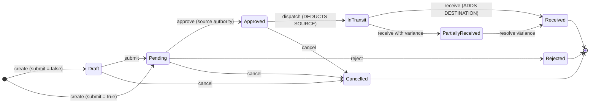

# 15 — Stock Transfer Workflow

> **Document purpose.** Define how ingredients move between branches under control: the request →
> approval → dispatch → receipt chain, variance handling, cost transfer, and the in-transit state that
> prevents stock being counted twice.

**Prerequisites:** [14-inventory-workflow.md](14-inventory-workflow.md),
[05-database-design.md](05-database-design.md) §5.8.

**Status:** 🟡 MVP — Planned.

---

## 1. Why transfers need a workflow

An untracked transfer is a hole in the inventory system. Stock leaves branch A and arrives at branch B
some hours later; in between, it belongs to neither. Without a controlled process:

- both branches count it, or neither does;
- shrinkage in transit is invisible;
- one branch's manager can drain another branch's stock without consent;
- COGS at the receiving branch is wrong because the cost did not travel with the goods.

The five-state workflow below exists to close each of those.

---

## 2. Lifecycle



| State | Source stock | Destination stock | In transit |
|---|---|---|---|
| `draft` | unchanged | unchanged | 0 |
| `pending` | unchanged | unchanged | 0 |
| `approved` | unchanged | unchanged | 0 |
| `in_transit` | **deducted** | unchanged | **tracked at destination** |
| `partially_received` | deducted | partially added | remainder |
| `received` | deducted | **added** | 0 |
| `rejected` / `cancelled` | unchanged (or restored) | unchanged | 0 |

**The in-transit rule (FR-TRF-006).** Between dispatch and receipt the quantity is in
`inventories.in_transit_quantity` at the **destination** and is deducted from `quantity_on_hand` at the
**source**. It is therefore available at neither. Counting it as available at the destination would
let the destination sell food that is still on a van.

---

## 3. The four quantities

`stock_transfer_items` carries four separate quantity columns. They routinely differ, and collapsing
them would destroy the audit trail.

| Column | Set at | Meaning |
|---|---|---|
| `requested_quantity` | Request | What the destination asked for |
| `approved_quantity` | Approval | What the source agreed to send — may be less |
| `dispatched_quantity` | Dispatch | What actually left |
| `received_quantity` | Receipt | What actually arrived |
| `variance_quantity` | Receipt | `received − dispatched`, signed |

**Worked example**

| Ingredient | Requested | Approved | Dispatched | Received | Variance |
|---|---|---|---|---|---|
| Milk | `20.0000 l` | `15.0000 l` | `15.0000 l` | `14.5000 l` | `−0.5000` |
| Coffee | `5.0000 kg` | `5.0000 kg` | `5.0000 kg` | `5.0000 kg` | `0.0000` |

The milk shortfall of 0.5 L is real loss. It is recorded, attributed to the transfer, and reported —
not quietly absorbed into the destination's balance.

---

## 4. Transitions

### 4.1 Create and submit

| Aspect | Detail |
|---|---|
| Endpoint | `POST /stock-transfers` |
| Permission | `transfers.create` |
| Who | Typically the **destination** manager, who needs the stock |
| Validation | `from_branch_id ≠ to_branch_id`; destination in the requester's scope; ≥ 1 item; ingredient unique per transfer; unit family matches |
| `submit: true` | Goes straight to `pending` |
| Response | Includes `source_available` per item, so the requester sees immediately whether the source can fulfil |

### 4.2 Approve or reject

| Aspect | Detail |
|---|---|
| Endpoint | `POST /stock-transfers/{id}/approve` \| `/reject` |
| Permission | `transfers.approve` **at the source branch** (guard G6) |
| Why source | The stock belongs to the source. A destination manager approving their own request would be self-service from someone else's inventory. |
| Self-approval | Blocked unless `transfer.allow_self_approval` is enabled (default off, guard G7) |
| Adjustment | The approver may reduce `approved_quantity` per line, never increase it above requested |
| Reject | `rejection_reason` mandatory |

### 4.3 Dispatch — the source deduction

| Aspect | Detail |
|---|---|
| Endpoint | `POST /stock-transfers/{id}/dispatch` |
| Permission | `transfers.dispatch` at the source |
| Precondition | Status `approved`; sufficient source stock |
| Effect | `transfer_out` ledger row per ingredient at the source; source `quantity_on_hand` reduced; destination `in_transit_quantity` increased; status → `in_transit` |
| Cost | `unit_cost` snapshotted from the **source's** `average_cost` at dispatch |
| Failure | `422 insufficient_source_stock` with shortfalls |

```text
For each item:
    dispatched_quantity = approved_quantity   (or a lower value entered at dispatch)
    unit_cost           = source inventories.average_cost

    INSERT stock_transactions AT SOURCE:
        type            = 'transfer_out'
        quantity_change = −dispatched_quantity
        unit_cost       = unit_cost
        reference       = StockTransfer:{id}

    UPDATE source inventories:  quantity_on_hand −= dispatched_quantity
    UPDATE destination inventories: in_transit_quantity += dispatched_quantity
```

### 4.4 Receive — the destination addition

| Aspect | Detail |
|---|---|
| Endpoint | `POST /stock-transfers/{id}/receive` |
| Permission | `transfers.receive` at the destination |
| Input | `received_quantity` per line, plus `variance_reason` where it differs |
| Effect | `transfer_in` ledger row at the destination; destination balance and **average cost** updated; `in_transit_quantity` cleared; status → `received` or `partially_received` |

```text
For each item:
    variance_quantity = received_quantity − dispatched_quantity

    INSERT stock_transactions AT DESTINATION:
        type            = 'transfer_in'
        quantity_change = +received_quantity
        unit_cost       = item.unit_cost          -- travelled from the source
        reference       = StockTransfer:{id}

    UPDATE destination inventories:
        quantity_on_hand    += received_quantity
        in_transit_quantity −= dispatched_quantity
        average_cost         = weighted average with the incoming cost

    if variance_quantity <> 0:
        set has_variance = true
        require variance_reason
        notify both branch managers
```

**Cost travels with the goods (BR-TRF-07).** The destination recalculates its weighted average using
the **source's** cost, not its own or a default. Otherwise a branch could import stock at an invented
cost and distort its margin.

**The variance is loss, not an adjustment.** The 0.5 L that did not arrive is simply never added at the
destination and was already removed from the source. The ledgers balance; the loss is visible as the
difference between `transfer_out` and `transfer_in` for that transfer.

### 4.5 Cancel

Permitted from `draft`, `pending` and `approved` — that is, **before dispatch**. After dispatch the
stock has physically moved and cancellation is meaningless; the correct action is to receive what
arrived and record the variance, or to create a return transfer.

---

## 5. Sequence

```mermaid
sequenceDiagram
    autonumber
    participant D as Destination manager
    participant S as Source manager
    participant A as API
    participant DB as MySQL

    D->>A: POST /stock-transfers (from B2, to B1, milk 20 L)
    A->>DB: INSERT transfer + items, status pending
    A-->>D: 201 TRF-20260905-0007
    A-->>S: notification "Transfer request from Riverside"

    S->>A: POST /approve (milk reduced to 15 L)
    A->>DB: status approved, approved_quantity 15
    A-->>D: notification "Approved, 15 L"

    S->>A: POST /dispatch
    A->>DB: BEGIN; lock source inventories
    A->>DB: INSERT transfer_out −15 L at B2
    A->>DB: source quantity_on_hand −15
    A->>DB: destination in_transit_quantity +15
    A->>DB: status in_transit; COMMIT
    A-->>D: notification "Dispatched, expected 09:00"

    Note over D: van arrives, 14.5 L usable

    D->>A: POST /receive (received 14.5, reason "Spillage in transit")
    A->>DB: BEGIN; lock destination inventories
    A->>DB: INSERT transfer_in +14.5 L at B1
    A->>DB: destination quantity_on_hand +14.5, average_cost recalculated
    A->>DB: in_transit_quantity −15
    A->>DB: variance −0.5, has_variance = true
    A->>DB: status received; COMMIT
    A-->>S: notification "Received with 0.5 L variance"
```

---

## 6. Happy path

| # | Actor | Action | State | Source milk | Dest milk | In transit |
|---|---|---|---|---|---|---|
| 1 | Riverside mgr | Requests 20 L from Uptown | `pending` | `45.0` | `2.0` | `0` |
| 2 | Uptown mgr | Approves 15 L | `approved` | `45.0` | `2.0` | `0` |
| 3 | Uptown mgr | Dispatches 15 L | `in_transit` | **`30.0`** | `2.0` | **`15.0`** |
| 4 | Riverside mgr | Receives 15 L | `received` | `30.0` | **`17.0`** | `0` |

Destination average cost after step 4, given 2.0 L at 1.40 and 15.0 L at 1.30:
`(2.0 × 1.40 + 15.0 × 1.30) ÷ 17.0 = 1.3118`.

---

## 7. Alternative paths

| # | Scenario | Behaviour |
|---|---|---|
| A1 | Draft first | Created without `submit`, edited, then submitted. |
| A2 | Partial approval | `approved_quantity < requested_quantity`; the requester is notified of the reduction. |
| A3 | Rejection | `rejection_reason` mandatory; terminal state; the destination may create a new request. |
| A4 | Partial dispatch | `dispatched_quantity < approved_quantity`; only what left is deducted. |
| A5 | Over-receipt | `received > dispatched` — positive variance. Accepted with a reason; usually a miscount at dispatch. |
| A6 | Multi-ingredient transfer | One transfer, many items; one ledger row per ingredient per side. |
| A7 | Same-day round trip | Two independent transfers. There is no "return" type; a return is a transfer in the other direction. |
| A8 | Source and destination managed by the same person | Permitted only with `transfer.allow_self_approval`; audited at warning severity. |
| A9 | Transfer of an ingredient the destination has never stocked | An `inventories` row is created on receipt with the incoming cost as its average. |
| A10 | Cancel after approval, before dispatch | Permitted; no stock moved, nothing to restore. |

---

## 8. Failure paths

| # | Failure | Response | Recovery |
|---|---|---|---|
| F1 | Same source and destination | `422 same_branch_transfer` | Choose another branch |
| F2 | Duplicate ingredient in one transfer | `422 duplicate_ingredient` | Merge the lines |
| F3 | Unit family mismatch | `422 unit_family_mismatch` | Fix the unit |
| F4 | Approver lacks source authority | `403 not_source_branch_authority` | Route to a source manager |
| F5 | Self-approval when disabled | `403 self_approval_forbidden` | Another approver |
| F6 | Approved quantity above requested | `422 approved_exceeds_requested` | Create a new request |
| F7 | Insufficient source stock at dispatch | `422 insufficient_source_stock` with shortfalls | Reduce, or stock in at source |
| F8 | Dispatch from a non-approved state | `422 invalid_state_transition` | Approve first |
| F9 | Receive twice | `422 invalid_state_transition` | Already received |
| F10 | Variance with no reason | `422 variance_reason_required` | Supply a reason |
| F11 | Cancel after dispatch | `422 cannot_cancel_dispatched` | Receive with variance, or create a return |
| F12 | Concurrent receive from two devices | Row lock + version; one `200`, one `409` | Refresh |
| F13 | Source branch deactivated mid-transfer | Dispatch blocked `422 branch_inactive`; an already-dispatched transfer may still be received | Reactivate, or cancel |
| F14 | Transfer stuck in transit beyond expected arrival | Scheduled job flags it and notifies both managers; never auto-received | Investigate physically |

---

## 9. Validation

| Stage | Field | Rule |
|---|---|---|
| Create | `from_branch_id` | required, exists, active, **≠ `to_branch_id`** |
| | `to_branch_id` | required, exists, active, in requester's scope |
| | `items` | required, min 1, max 100 |
| | `items.*.ingredient_id` | required, exists, active, unique within the transfer |
| | `items.*.requested_quantity` | required, `> 0`, ≤ 4 decimals |
| | `items.*.unit_id` | required, same family as the ingredient's stock unit |
| | `expected_arrival_at` | optional, not in the past |
| Approve | `items.*.approved_quantity` | `> 0`, ≤ `requested_quantity` |
| Reject | `rejection_reason` | required, 3–255 |
| Dispatch | `items.*.dispatched_quantity` | `> 0`, ≤ `approved_quantity`, ≤ source available |
| Receive | `items.*.received_quantity` | required, `>= 0` |
| | `items.*.variance_reason` | required when `received ≠ dispatched`, 3–255 |
| All transitions | `version` | required, must match |

Full catalogue: [20-validation-rules.md](20-validation-rules.md) §9.

---

## 10. Permissions

| Action | Permission | Branch authority |
|---|---|---|
| View | `transfers.view` | **Either** endpoint in scope ([04](04-user-roles-permissions.md) §5.2) |
| Create / edit draft / submit | `transfers.create`, `.update`, `.submit` | Destination |
| Approve / reject | `transfers.approve` | **Source** (G6) |
| Dispatch | `transfers.dispatch` | Source |
| Receive | `transfers.receive` | Destination |
| Cancel | `transfers.cancel` | Either, before dispatch |

**The dual-branch visibility rule is the one exception** to "visible when `branch_id` is in scope". It
must be tested explicitly from source, destination and a third branch.

---

## 11. Database changes

| Transition | Table | Change |
|---|---|---|
| Create | `daily_sequences` | atomic increment (`transfer` scope) |
| | `stock_transfers` | `INSERT` |
| | `stock_transfer_items` | `INSERT` × n |
| | `audit_logs` | `INSERT` |
| Submit | `stock_transfers` | `UPDATE status, submitted_at, version` |
| Approve | `stock_transfers` | `UPDATE status, approved_by, approved_at, version` |
| | `stock_transfer_items` | `UPDATE approved_quantity` |
| Reject | `stock_transfers` | `UPDATE status, rejection_reason, version` |
| **Dispatch** | source `inventories` | `SELECT ... FOR UPDATE`, `UPDATE quantity_on_hand` |
| | `stock_transactions` | `INSERT` (`transfer_out`) × items, at source |
| | destination `inventories` | `UPDATE in_transit_quantity` |
| | `stock_transfer_items` | `UPDATE dispatched_quantity, unit_cost` |
| | `stock_transfers` | `UPDATE status, dispatched_by, dispatched_at, total_cost, version` |
| **Receive** | destination `inventories` | `SELECT ... FOR UPDATE`, `UPDATE quantity_on_hand, average_cost, in_transit_quantity` |
| | `stock_transactions` | `INSERT` (`transfer_in`) × items, at destination |
| | `stock_transfer_items` | `UPDATE received_quantity, variance_quantity, variance_reason` |
| | `stock_transfers` | `UPDATE status, received_by, received_at, has_variance, version` |
| | `notifications` | `INSERT` on variance |
| Cancel | `stock_transfers` | `UPDATE status, cancelled_by, cancelled_at` |

Dispatch and receive each run in **one** transaction spanning two branches' inventory rows. Lock
ordering is by `ingredient_id` ascending, consistent with every other inventory operation
([02](02-system-architecture.md) §6, T4).

---

## 12. Audit log requirements

| Event | `event` | Severity | Captured |
|---|---|---|---|
| Created | `transfer.created` | info | Number, branches, items, quantities |
| Submitted | `transfer.submitted` | info | Actor |
| Approved | `transfer.approved` | info | Actor, per-line requested vs approved |
| Approved with reduction | `transfer.quantity_reduced` | info | Per-line deltas |
| Rejected | `transfer.rejected` | **warning** | Actor, reason |
| Self-approved | `transfer.self_approved` | **warning** | Actor — separation of duties bypassed |
| Dispatched | `transfer.dispatched` | info | Actor, quantities, unit costs, source balances after |
| Received | `transfer.received` | info | Actor, quantities, destination balances after |
| Variance recorded | `transfer.variance` | **warning** | Per-line variance, value, reason |
| Large variance | `transfer.large_variance` | **critical** | Above `transfer.variance_alert_percent` |
| Cancelled | `transfer.cancelled` | info | Actor, state at cancellation |
| Stuck in transit | `transfer.overdue` | **warning** | Days elapsed |

---

## 13. Edge cases

| # | Case | Expected behaviour |
|---|---|---|
| E1 | Zero received on one line | Valid. `received_quantity = 0`, variance = full dispatched quantity, reason mandatory. |
| E2 | All lines received as zero | Status `received` with `has_variance`; the destination gains nothing and the source has lost the stock. Escalated as a critical variance. |
| E3 | Over-receipt | Positive variance; accepted with a reason. Usually a dispatch miscount. |
| E4 | Source stock consumed between approval and dispatch | Dispatch fails `422 insufficient_source_stock`. Approval does **not** reserve stock in MVP — reservation is 🔵. |
| E5 | Destination has no `inventories` row | Created on receipt with the incoming cost as its average. |
| E6 | Ingredient deactivated mid-transfer | Receipt still permitted — the goods physically exist. Creating a new transfer for it is blocked. |
| E7 | Two receives race | Row lock and version guard; one wins. |
| E8 | Transfer between branches with different currencies | Cost is a quantity-times-unit-cost figure in the **source's** currency. ⚠️ Multi-currency is out of scope (A2); a transfer across currencies is blocked `422 currency_mismatch`. |
| E9 | Reversing a completed transfer | Not supported. Create a transfer in the opposite direction. |
| E10 | Partial receipt then the remainder never arrives | Stays `partially_received`; flagged as overdue; resolved by receiving zero for the remainder with a reason. |
| E11 | Same ingredient transferred in both directions same day | Two independent transfers; both ledgers reflect both movements. |
| E12 | Transfer created for 0 quantity | `422` — quantity must be `> 0`. |

---

## 14. Security considerations

| # | Consideration | Mitigation |
|---|---|---|
| S1 | Draining another branch's stock | Approval requires **source** authority (G6). |
| S2 | Self-dealing | Self-approval blocked by default; audited at warning level when enabled. |
| S3 | Theft masked as transit variance | Variance requires a reason, notifies both managers, and is reported per branch pair over time. A recurring one-way variance is a pattern, not an accident. |
| S4 | Cost manipulation | `unit_cost` is snapshotted from the source's ledger-derived average, never entered by a user. |
| S5 | Double counting | In-transit quantity belongs to neither branch's available balance. |
| S6 | Cross-branch data leakage | Dual-endpoint visibility rule, tested explicitly. |
| S7 | Dispatch without approval | State machine enforced under lock. |
| S8 | Retroactive quantity edits | Only the column for the current stage is writable; earlier stages' quantities are immutable. |

---

## 15. Testing considerations

| Area | Test |
|---|---|
| Full lifecycle | Request → approve → dispatch → receive with exact balances at each step. |
| Ledger symmetry | `transfer_out` at source and `transfer_in` at destination reference the same transfer and differ only by the variance. |
| In-transit | Between dispatch and receipt, neither branch's available quantity includes it. |
| Cost travel | Destination average recalculates using the source's cost, verified numerically. |
| Variance | Negative, positive and zero; reason enforcement; notification fired. |
| Partial approval and dispatch | Quantities cascade correctly and cannot increase. |
| Source authority | Destination manager approving ⇒ `403`. |
| Dual visibility | Visible from source and destination, `404` from a third branch. |
| Insufficient source | Dispatch blocked with shortfall detail. |
| Concurrency | Two receives, two dispatches ⇒ one success each. |
| State machine | All illegal transitions ⇒ `422`. |
| Cancel boundary | Permitted before dispatch, rejected after. |
| INV-1 | After a transfer, both branches' ledger sums equal their balances. |

Full plan: [24-qa-test-plan.md](24-qa-test-plan.md) §8.4.

---

## 16. Related documents

[07-api-documentation.md](07-api-documentation.md) §8 ·
[14-inventory-workflow.md](14-inventory-workflow.md) ·
[18-reporting.md](18-reporting.md) §5 ·
[19-notifications.md](19-notifications.md) ·
[04-user-roles-permissions.md](04-user-roles-permissions.md) §6.2
