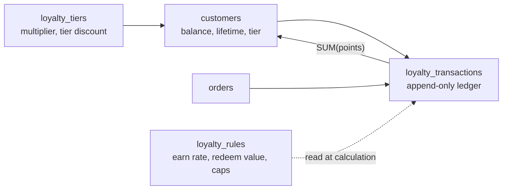
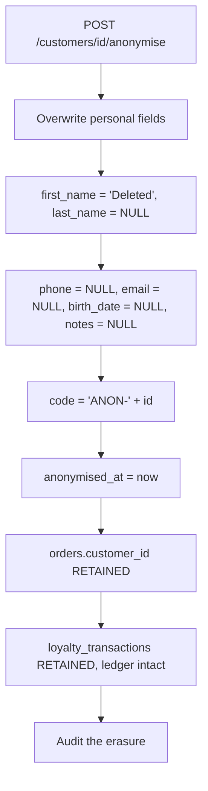

# 16 — Customers and Loyalty

> **Document purpose.** Define customer records, the loyalty point ledger, earning and redemption
> rules, tiers, reversals, expiry, and the personal-data obligations that come with holding customer
> information.

**Prerequisites:** [09-business-rules.md](09-business-rules.md) §9 (loyalty formulas),
[05-database-design.md](05-database-design.md) §5.5.

**Status:** 🟡 MVP — Planned. Point expiry is 🔵 Post-MVP.

---

## 1. The model



**The governing invariant (C7):**

```text
SUM(loyalty_transactions.points) WHERE customer_id = X   ==   customers.loyalty_points_balance
```

`customers.loyalty_points_balance` is a materialised cache of the ledger, reconciled nightly. As with
inventory, the ledger is the truth and the balance is the convenience.

---

## 2. Customer records

| Aspect | Detail |
|---|---|
| Identity | `code` (membership number, unique), `phone` (unique among live rows, the primary POS lookup), `email` (unique among live rows) |
| Required | `first_name` only. A customer can be created at the counter in three seconds with a name and a phone number. |
| Optional | Last name, email, birth date, notes (allergies, preferences) |
| Scope | **Global, not branch-scoped.** A customer earns at one branch and redeems at another. |
| Deletion | Soft delete; anonymisation preferred (§8) |

### 2.1 Lookup at POS

| Method | Endpoint | Notes |
|---|---|---|
| Phone | `GET /pos/customers/search?q=0812345678` | Exact and prefix match |
| Membership code | Same | Exact match, typically scanned |
| Name | Same | Fuzzy, minimum 2 characters |

The POS response is deliberately minimal: id, name, tier, point balance. Full contact details require a
separate call with `customers.view`, so a screen visible to the queue does not display other customers'
phone numbers.

### 2.2 Denormalised aggregates

`total_spent`, `total_orders`, `lifetime_points_earned` and `last_order_at` are maintained at order
completion. They exist so a customer list can be sorted and segmented without aggregating over
millions of orders. They are reconciled nightly like every other denormalisation.

---

## 3. Earning points

```text
earn_base     = per loyalty_rules.earn_basis
                  'subtotal'        -> Subtotal
                  'net_of_discount' -> Subtotal − Discount     (default ⚠️)
                  'grand_total'     -> Grand Total

points_earned = FLOOR(earn_base
                      × loyalty_rules.earn_points_per_currency_unit
                      × loyalty_tiers.earn_rate_multiplier)
```

| # | Rule |
|---|---|
| BR-LOY-01 | Points are **floored**. Rounding up gives away money at redemption. |
| BR-LOY-02 | Awarded **only** at order completion. Not at creation, acceptance or payment. |
| BR-LOY-03 | Tax, service charge and rounding are excluded under the default basis — the customer is rewarded for what the business earned, not for what it collected on behalf of the tax authority. |
| BR-LOY-04 | No customer ⇒ no points. Points cannot be added retroactively after completion. |
| BR-LOY-05 | The tier multiplier is read at completion and applied once. |
| BR-LOY-13 | Redeemed value does **not** earn. A customer cannot farm points by redeeming and re-earning on the same money. Under the default `net_of_discount` basis, `loyalty_discount_amount` is part of the discount, so this holds automatically. |

**Worked examples** — earn rate `1.0` point per `1.00`, basis `net_of_discount`:

| Subtotal | Discount | Tier | Multiplier | Base | Points |
|---|---|---|---|---|---|
| `15.00` | `1.50` | none | `1.000` | `13.50` | `FLOOR(13.50)` = **13** |
| `15.00` | `1.50` | Gold | `1.500` | `13.50` | `FLOOR(20.25)` = **20** |
| `15.00` | `0.00` | Silver | `1.250` | `15.00` | `FLOOR(18.75)` = **18** |
| `0.99` | `0.00` | none | `1.000` | `0.99` | `FLOOR(0.99)` = **0** |

The last row is intentional: a sub-unit purchase earns nothing. Customers understand "1 point per
unit spent" better than fractional points.

---

## 4. Redeeming points

```text
requested_value = points_to_redeem × loyalty_rules.redeem_value_per_point
cap             = ROUND(Subtotal × max_redeem_percent_of_subtotal / 100, 2)
applied         = ROUND(requested_value, 2)      -- rejected if > cap
```

| # | Rule | Failure |
|---|---|---|
| BR-LOY-06 | `points ≤ customer.loyalty_points_balance` | `422 insufficient_points` |
| BR-LOY-07 | `points ≥ min_points_to_redeem` | `422 below_minimum_redemption` |
| BR-LOY-08 | `points` is a multiple of `redeem_increment` | `422 invalid_redeem_increment` |
| BR-LOY-09 | Resulting discount ≤ cap. **Rejected, not silently trimmed.** | `422 redemption_cap_exceeded` |
| BR-LOY-10 | Not permitted once any payment is captured | `422 order_already_paid` |
| BR-LOY-11 | Points are debited **when applied to the order**, not at completion | — |
| BR-DISC-10 | Redemption bypasses `discount.max_percent` thresholds — it is customer-funded, not a giveaway — but obeys its own cap | — |

**Why BR-LOY-09 rejects rather than trims.** A customer who asks to redeem 500 points and silently gets
200 redeemed will notice at the receipt and dispute it. An error the cashier can explain before the
transaction completes is better service.

**Why BR-LOY-11 debits early.** Once the discount is on the order, the customer has committed the
points. If the order is later cancelled, a `reverse` entry returns them. Debiting at completion would
allow the same points to be applied to two open orders simultaneously.

**Worked example** — `redeem_value_per_point = 0.01`, `min = 100`, `increment = 50`, cap 50 %:

| Balance | Requested | Value | Subtotal | Cap | Result |
|---|---|---|---|---|---|
| 240 | 200 | `2.00` | `15.00` | `7.50` | ✔ applied `2.00`, balance 40 |
| 240 | 300 | — | — | — | `422 insufficient_points` |
| 240 | 50 | — | — | — | `422 below_minimum_redemption` |
| 240 | 125 | — | — | — | `422 invalid_redeem_increment` |
| 2000 | 1000 | `10.00` | `15.00` | `7.50` | `422 redemption_cap_exceeded` |

---

## 5. Tiers

| Aspect | Detail |
|---|---|
| Assignment | Automatic, by `lifetime_points_earned` against `loyalty_tiers.min_lifetime_points` |
| Evaluated | At order completion, after points are awarded |
| Direction | **Promotion only in MVP.** Demotion on inactivity is 🔵 |
| Effects | `earn_rate_multiplier` on future earning; optional automatic `discount_percent` on every order |
| Lifetime basis | `lifetime_points_earned` never decreases, even on reversal — so a refund does not demote a customer mid-visit |

**Example ladder**

| Tier | Min lifetime points | Multiplier | Tier discount |
|---|---|---|---|
| Bronze | `0` | `1.000` | — |
| Silver | `1 000` | `1.250` | — |
| Gold | `5 000` | `1.500` | `5.00 %` |
| Platinum | `20 000` | `2.000` | `10.00 %` |

**Tier discount stacks additively** with a manual discount (BR-DISC-05). A Gold customer with a 10 %
staff discount receives 15 % of subtotal, not 14.5 %.

---

## 6. Reversal

| Event | Points effect |
|---|---|
| Completed order cancelled | `reverse` for the full earned amount; any redeemed points returned |
| Full refund | Same |
| Partial refund | `reverse` for `FLOOR(earned × refund_amount / grand_total)` |
| Payment voided before completion | No effect — points were never awarded |
| Redemption on an order later cancelled | Redeemed points returned by a `reverse` entry |

**BR-LOY-12 — the negative-balance case.** A customer earns 20 points, spends them, then the original
order is refunded. The reversal would take the balance to −20, but
`customers.loyalty_points_balance >= 0` is a database check. Behaviour:

```text
reversal_points = min(points_to_reverse, current_balance)
shortfall       = points_to_reverse − reversal_points

INSERT loyalty_transactions (type = 'reverse', points = −reversal_points, ...)
if shortfall > 0:
    record the shortfall in the transaction reason
    raise a notification to the branch manager
```

The balance clamps at zero and the shortfall is recorded rather than silently forgiven or forced
negative. This is a real operational case and needs a deliberate answer.

---

## 7. Expiry 🔵

Post-MVP, designed now so the schema does not change later.

```text
earn rows carry expires_at = created_at + loyalty_rules.points_expiry_days
A daily job writes 'expire' rows for lapsed batches
Redemption consumes oldest non-expired points first (FIFO)
```

FIFO consumption matters: a customer should never lose points they could have spent, so the oldest
batch is always used first.

---

## 8. Personal data obligations

Holding customer names, phone numbers and purchase history creates obligations regardless of
jurisdiction (NFR-CMP-003).

### 8.1 Export

`POST /customers/{id}/export` with `customers.export` produces a machine-readable file containing the
customer record, order history summary and loyalty ledger. Delivered as a signed, time-limited URL,
never as an email attachment.

### 8.2 Erasure — anonymise, do not delete



| # | Rule |
|---|---|
| BR-PII-01 | Erasure **anonymises**; it does not delete. Deleting the customer would orphan financial records that must be retained for 7 years (NFR-CMP-001). |
| BR-PII-02 | `orders.customer_id` is retained so revenue and COGS figures do not change when a customer exercises their rights. |
| BR-PII-03 | An anonymised customer cannot be attached to a new order. |
| BR-PII-04 | The loyalty balance is zeroed with an `adjust` entry reasoned "Account anonymised". |
| BR-PII-05 | Anonymisation is irreversible and requires `customers.anonymise` (Admin only). |

**The tension being resolved:** the right to erasure and the obligation to retain financial records
conflict. Anonymisation satisfies both — the person becomes unidentifiable, the money stays auditable.

---

## 9. Happy path

**Scenario.** Somchai, Gold tier, 240 points, buys the golden-example order.

| # | Event | Points ledger | Balance |
|---|---|---|---|
| 1 | Cashier scans membership QR | — | 240 |
| 2 | Customer attached; Gold 5 % tier discount applied | — | 240 |
| 3 | Customer asks to redeem 200 points | `redeem −200`, value `2.00` | **40** |
| 4 | Order total reduced by `2.00` | — | 40 |
| 5 | Payment taken, order completed | `earn +20` (Gold 1.5× on `13.50`) | **60** |
| 6 | `lifetime_points_earned` +20; tier re-evaluated | — | still Gold |
| 7 | Receipt shows "Earned 20 · Balance 60" | — | 60 |

Ledger check: previous ledger sum 240, then −200, then +20 = 60 ✔.

---

## 10. Alternative paths

| # | Scenario | Behaviour |
|---|---|---|
| A1 | Walk-in, no customer | No earn, no redeem. |
| A2 | New customer created at the counter | Name + phone; `code` auto-generated; tier Bronze. |
| A3 | Customer attached after items are added | Tier discount applies; totals recalculated. |
| A4 | Customer detached before completion | Any redemption is reversed; tier discount removed. |
| A5 | Redemption covering the whole order | Total reaches `0.00`; no tender required; the order still completes and still earns on a zero base (i.e. nothing). |
| A6 | Customer reaches a new tier | Promotion applied after the awarding entry; the higher multiplier takes effect on the **next** order. |
| A7 | Manual point adjustment | `loyalty.adjust` with a mandatory reason — goodwill gestures, correcting an operational error. |
| A8 | Customer with two phone numbers | One is the unique key; the other goes in `notes`. Multiple contact rows are 🔵. |
| A9 | Duplicate customers merged | 🔵 Post-MVP. Until then, anonymise the duplicate after transferring points by adjustment. |

---

## 11. Failure paths

| # | Failure | Response |
|---|---|---|
| F1 | Duplicate phone | `422 validation_failed` naming the existing customer's code |
| F2 | Redeem more than the balance | `422 insufficient_points` with the balance |
| F3 | Redeem below the minimum | `422 below_minimum_redemption` |
| F4 | Redeem off-increment | `422 invalid_redeem_increment` |
| F5 | Redeem above the cap | `422 redemption_cap_exceeded` with the cap |
| F6 | Redeem after payment | `422 order_already_paid` |
| F7 | Redeem with no customer attached | `422 no_customer_attached` |
| F8 | Attach an anonymised customer | `422 customer_anonymised` |
| F9 | Attach an inactive customer | `422 customer_inactive` |
| F10 | Two terminals redeem the same points concurrently | Customer row locked; the second sees the reduced balance and gets `422 insufficient_points` |
| F11 | No active loyalty rule configured | Earning and redemption are silently disabled; the UI hides loyalty controls. **This is the one place a missing configuration does not raise an error** — a restaurant may legitimately run without a loyalty programme. |
| F12 | Nightly reconciliation finds a balance mismatch | Logged, manager notified, **not auto-corrected** |
| F13 | Adjustment without a reason | `422 validation_failed` |

> **F11 differs deliberately from tax configuration.** A missing tax rate is always a misconfiguration;
> a missing loyalty rule is a valid business choice.

---

## 12. Validation

| Field | Rule |
|---|---|
| `first_name` | required, 1–80 |
| `last_name` | optional, ≤ 80 |
| `phone` | optional, ≤ 30, digits/`+`/spaces/hyphens, unique among live rows |
| `email` | optional, valid, ≤ 190, unique among live rows |
| `birth_date` | optional, a valid past date, age ≥ `customers.min_age` if configured |
| `notes` | optional, ≤ 65 535 |
| `loyalty_tier_id` | optional, exists; **not directly settable** — assigned by the system |
| `points` (redeem) | required, integer `> 0`, ≤ balance, ≥ min, multiple of increment |
| `points` (adjust) | required, non-zero integer; negative may not exceed the balance |
| `reason` (adjust) | required, 10–255 |
| Tier `min_lifetime_points` | required, `>= 0`, unique |
| Tier `earn_rate_multiplier` | required, `> 0`, ≤ 10 |
| Rule `earn_points_per_currency_unit` | required, `>= 0` |
| Rule `redeem_value_per_point` | required, `>= 0` |
| Rule `max_redeem_percent_of_subtotal` | optional, 0–100 |

Full catalogue: [20-validation-rules.md](20-validation-rules.md) §10.

---

## 13. Permissions

| Action | Permission |
|---|---|
| View customers | `customers.view` |
| Create / update | `customers.create`, `customers.update` |
| Delete | `customers.delete` |
| Export personal data | `customers.export` |
| Anonymise | `customers.anonymise` |
| View point balance and ledger | `loyalty.view` |
| Redeem points | `loyalty.redeem` |
| Manual adjustment | `loyalty.adjust` |
| Manage tiers and rules | `loyalty.manage_rules` |

The Kitchen role holds **none** of these — the kitchen never sees customer data
([04](04-user-roles-permissions.md) G13).

---

## 14. Database changes

| Action | Table | Change |
|---|---|---|
| Create customer | `customers` | `INSERT` |
| Attach to order | `orders` | `UPDATE customer_id`; recalculate totals if a tier discount applies |
| Redeem | `customers` | `SELECT ... FOR UPDATE`, `UPDATE loyalty_points_balance` |
| | `loyalty_transactions` | `INSERT` (`redeem`, negative) |
| | `orders` | `UPDATE loyalty_points_redeemed, loyalty_discount_amount, grand_total` |
| Complete order | `loyalty_transactions` | `INSERT` (`earn`) |
| | `customers` | `UPDATE loyalty_points_balance, lifetime_points_earned, total_spent, total_orders, last_order_at, loyalty_tier_id` |
| Cancel / refund | `loyalty_transactions` | `INSERT` (`reverse`) |
| | `customers` | `UPDATE loyalty_points_balance` |
| Adjust | `loyalty_transactions` (`adjust`), `customers` | |
| Expire 🔵 | `loyalty_transactions` (`expire`), `customers` | |
| Anonymise | `customers` | `UPDATE` personal fields, `anonymised_at` |
| | `loyalty_transactions` | `INSERT` (`adjust`) zeroing the balance |

The customer row is locked for the duration of any point movement, which is what prevents the same
points being spent twice.

---

## 15. Audit log requirements

| Event | `event` | Severity | Captured |
|---|---|---|---|
| Customer created | `customer.created` | info | Actor, branch, identifying fields |
| Customer updated | `customer.updated` | info | Before/after (phone and email changes matter) |
| Attached to order | `order.customer_attached` | info | Order, customer |
| Points earned | `loyalty.earned` | info | Order, base, rate, multiplier, points, balance after |
| Points redeemed | `loyalty.redeemed` | info | Order, points, value, balance after |
| Points reversed | `loyalty.reversed` | **warning** | Original transaction, points, reason, shortfall if clamped |
| Manual adjustment | `loyalty.adjusted` | **warning** | Points, reason, actor, balance after |
| Tier changed | `loyalty.tier_changed` | info | From, to, lifetime points |
| Rules changed | `loyalty.rules_updated` | **warning** | Before/after rates — changes the value of every outstanding point |
| Data exported | `customer.exported` | **warning** | Actor, customer — a bulk-export pattern is worth seeing |
| Anonymised | `customer.anonymised` | **critical** | Actor, customer id, retained order count |
| Balance reconciliation drift | `loyalty.reconciliation_drift` | **critical** | Ledger sum, stored balance, difference |

---

## 16. Edge cases

| # | Case | Expected behaviour |
|---|---|---|
| E1 | Order completes with `earn_base = 0` | Zero points; an `earn` row with `points = 0` is **not** written — empty ledger rows add noise. |
| E2 | Customer at exactly a tier threshold | Promoted (`>=` comparison). |
| E3 | Reversal that would go negative | Clamped at zero, shortfall recorded (BR-LOY-12). |
| E4 | Redemption then cancellation | Points returned in full. |
| E5 | Partial refund of an order that earned 13 points, 50 % refunded | `FLOOR(13 × 0.5)` = 6 reversed. |
| E6 | Two orders open for one customer, both redeeming | Customer row locked per redemption; the second sees the reduced balance. |
| E7 | Loyalty rate changed between earning and redemption | Points already earned keep their count; their **value** changes with the new redeem rate. This is inherent to a points system and must be communicated to customers, not solved technically. |
| E8 | Customer deleted after earning | Ledger retained; anonymisation preferred over deletion. |
| E9 | Duplicate phone after a soft delete | Permitted — uniqueness is among live rows only ([05](05-database-design.md) §1.5). |
| E10 | Customer attached to a completed order | `422` — attachment is not permitted after completion (FR-CUS-002). |
| E11 | Tier discount plus redemption plus manual discount | All three stack additively; the combined total may not exceed the subtotal (BR-DISC-03). |
| E12 | Anonymised customer's points | Zeroed by an `adjust` entry; the ledger history remains for reconciliation. |

---

## 17. Security considerations

| # | Consideration | Mitigation |
|---|---|---|
| S1 | PII exposure at POS | Search returns name, tier and balance only. Full details require a deliberate second call. |
| S2 | PII on the kitchen screen | Kitchen projection contains no customer contact data at all. |
| S3 | Customer enumeration via search | Rate-limited; minimum 2 characters; results capped at 10; partial phone matches require ≥ 6 digits. |
| S4 | Point theft by staff | Redemption requires `loyalty.redeem`; adjustments require `loyalty.adjust` (Manager+), a reason, and are audited at warning level. |
| S5 | Point farming via create/cancel loops | Points award only at completion and reverse on cancellation; the audit log makes the pattern visible. |
| S6 | Bulk data export | `customers.export` is Admin-only and every export is audited. |
| S7 | Rate manipulation | `loyalty.manage_rules` is Admin-only; changes are audited with before/after. |
| S8 | Balance tampering via mass assignment | `loyalty_points_balance` is never fillable; it changes only through the ledger service. |
| S9 | Cross-branch customer data | Customers are global by design. Access still requires `customers.view`; the audit log records which branch viewed which customer. |

---

## 18. Testing considerations

| Area | Test |
|---|---|
| Earn formula | The §3 table, exact integers. |
| Floor behaviour | `13.50 × 1.5 = 20.25` earns 20, never 21. |
| Earn timing | No points at create, accept or payment; exactly one `earn` row at completion. |
| Redemption validation | One test per row of the §4 example table. |
| Cap rejection | Assert `422`, and assert the points were **not** partially redeemed. |
| Reversal proportionality | Partial refunds across several fractions. |
| Negative clamp | Earn, spend, refund; assert balance 0 and the shortfall recorded. |
| C7 invariant | 1 000 randomised movements; ledger sum equals the balance. |
| Concurrency | Two redemptions racing the same balance ⇒ one succeeds. |
| Tier promotion | At threshold − 1, threshold, threshold + 1. |
| Tier multiplier timing | Promotion applies to the **next** order, not the one that triggered it. |
| Stacking | Tier + manual + redemption sum additively and cannot exceed subtotal. |
| Anonymisation | Personal fields cleared, `orders.customer_id` retained, revenue reports unchanged. |
| No loyalty rule | Loyalty silently disabled; no error; POS hides the controls. |
| Audit | Every point movement writes exactly one audit row. |

Full plan: [24-qa-test-plan.md](24-qa-test-plan.md) §7.4.

---

## 19. Related documents

[07-api-documentation.md](07-api-documentation.md) §9 ·
[09-business-rules.md](09-business-rules.md) §9 ·
[10-pos-workflow.md](10-pos-workflow.md) ·
[12-payment-workflow.md](12-payment-workflow.md) §7 ·
[22-security.md](22-security.md) §11
