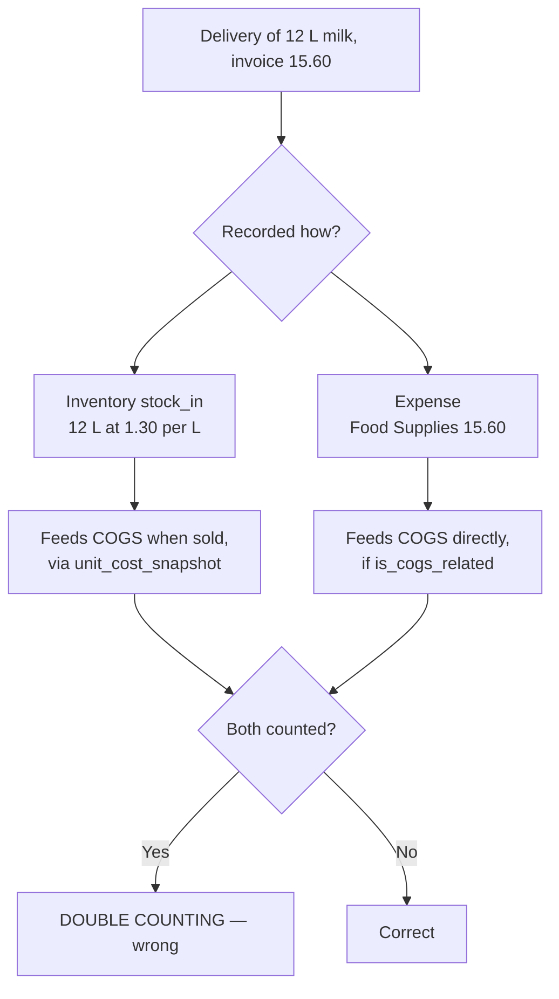
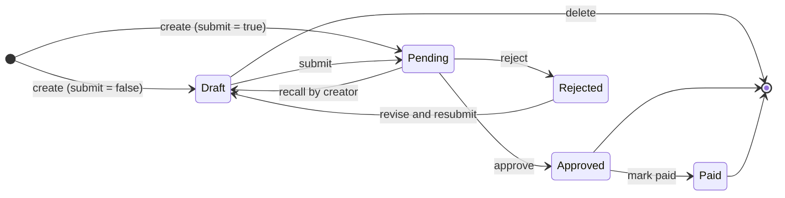
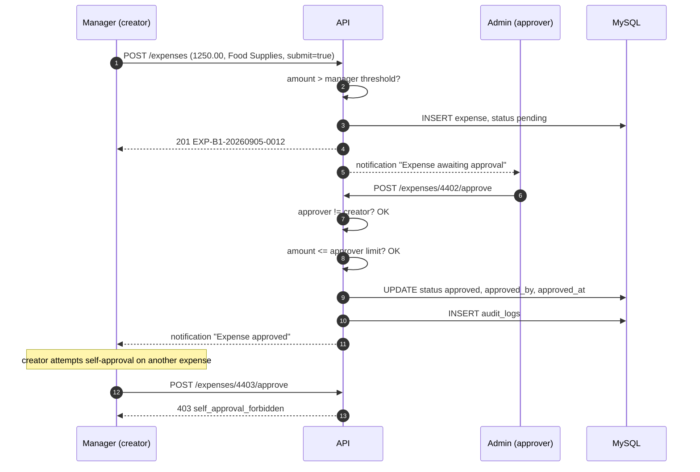

# 17 — Expense Management

> **Document purpose.** Define how branch costs are recorded, approved and settled, how they flow into
> profit reporting, and how separation of duties is enforced so that the person spending the money is
> never the person approving it.

**Prerequisites:** [09-business-rules.md](09-business-rules.md) §11 (profit formulas),
[05-database-design.md](05-database-design.md) §5.9.

**Status:** 🟡 MVP — Planned.

---

## 1. Why expenses are in scope

Without expenses, RestaurantOS can report revenue and COGS but not profit. The formula
`Profit = Revenue − COGS − Expenses` ([09](09-business-rules.md) §11) requires the third term, and a
spreadsheet kept separately will not reconcile against the ledgers.

Expenses are **not** a general ledger ([01](01-project-overview.md) §4.3). They record operational
spend attributable to a branch and a period, at enough fidelity to compute margin.

---

## 2. Expense categories

| Field | Purpose |
|---|---|
| `code`, `name` | Identity |
| `is_cogs_related` | **The most important flag.** Determines whether the expense reduces gross profit (COGS) or net profit (operating expense). |
| `requires_approval` | Whether expenses in this category always need approval regardless of amount |

**Typical set**

| Category | `is_cogs_related` | Rationale |
|---|---|---|
| Food Supplies | ✔ | Directly consumed in producing sales |
| Beverage Supplies | ✔ | Same |
| Packaging | ✔ | Consumed per sale |
| Rent | ✘ | Fixed, not per-sale |
| Utilities | ✘ | Overhead |
| Wages | ✘ | Overhead in this model |
| Equipment Repair | ✘ | Overhead |
| Marketing | ✘ | Overhead |
| Cleaning Supplies | ✘ | Overhead |

⚠️ Whether wages belong in COGS is an accounting-policy question that varies by operator. The flag
exists so the decision is configuration, not code.

### 2.1 The relationship between expenses and inventory

They overlap and must not double-count.

**BR-EXP-COGS.** For an ingredient that is tracked in inventory, the cost reaches COGS through
`order_items.unit_cost_snapshot` when it is **sold**, not when it is **bought**. Recording the same
delivery as a COGS-related expense double-counts it.

Two consistent policies, and the deployment must pick one:

| Policy | Stock-in | Expense record | COGS source |
|---|---|---|---|
| **A — Inventory-led** (default ⚠️) | Yes, with unit cost | Optional, category flagged `is_cogs_related = false` (e.g. "Purchases — non-COGS") or omitted | `order_items.line_cogs` only |
| **B — Expense-led** | Yes, for quantity tracking only | Yes, `is_cogs_related = true` | Expenses only; product costing used for margin analysis but not for the profit report |

Policy A is the default because it attributes cost to the period the food was **sold**, which is what
makes daily margin meaningful. The profit report states which policy is active, so a reader cannot
misinterpret the figure.

---

## 3. Lifecycle

| State | Editable | Counts toward profit |
|---|---|---|
| `draft` | Yes, by the creator | No |
| `pending` | No | No |
| `approved` | **No** (BR-EXP-07) | **Yes** |
| `rejected` | Returns to draft for revision | No |
| `paid` | No | Yes |

**BR-EXP-07 — approved expenses are locked.** Once approved, an expense affects reported profit.
Editing it would silently change a figure a manager has already acted on. Corrections require a
reversing entry, not an edit.

---

## 4. Approval

### 4.1 Rules

| # | Rule | Failure |
|---|---|---|
| BR-EXP-01 | An expense above `expense.approval_threshold` requires approval | — |
| BR-EXP-02 | Below the threshold, auto-approval is permitted when `expense.auto_approve_below_threshold` is enabled | — |
| BR-EXP-03 | A category with `requires_approval = true` always needs approval regardless of amount | — |
| **BR-EXP-04** | **A user may never approve their own expense** (guard G8) | `403 self_approval_forbidden` |
| BR-EXP-05 | A Manager may approve only up to `expense.approval_threshold.manager`; above that, Admin | `403 approval_limit_exceeded` |
| BR-EXP-06 | The approver must have authority at the expense's branch | `404` (out of scope) |
| BR-EXP-08 | Rejection requires a reason | `422` |

**G8 is the single most important control in this module.** Without it, a manager can record and
approve arbitrary spend against their own branch. It is enforced in `ExpensePolicy::approve` by
comparing `approved_by` to `created_by`, and there is a dedicated test.

### 4.2 Approval flow

---

## 5. Receipt attachments

| Control | Rule |
|---|---|
| Formats | `pdf`, `jpg`, `jpeg`, `png` only |
| Size | ≤ `expense.receipt_max_mb` (default 5 MB) |
| MIME | Verified from **file content**, not the extension or the client-supplied header |
| Storage | Object storage, outside the web root, with a random key — never the original filename |
| Access | Short-lived signed URLs, generated per request; never a permanent public URL |
| Execution | The storage bucket serves with `Content-Disposition: attachment` and a restrictive `Content-Type`; no execution is possible |
| Requirement | `expense.receipt_required_above` may mandate a receipt above an amount |

**Why content-sniffing matters.** A file named `receipt.jpg` containing PHP is the classic upload
attack. Checking the extension proves nothing; checking the magic bytes and re-encoding images where
practical is what actually helps ([22](22-security.md) §9).

---

## 6. Happy path

**Scenario.** Riverside branch, weekly dairy delivery, 1 250.00 net + 87.50 tax.

| # | Actor | Action | State |
|---|---|---|---|
| 1 | Branch manager | Records expense: Food Supplies, 1 250.00, tax 87.50, vendor "Riverside Dairy Co.", date 2026-09-04, receipt photo attached | `draft` |
| 2 | Branch manager | Submits | `pending` |
| 3 | System | Notifies users with `expenses.approve` at that branch and above the threshold | — |
| 4 | Operations director | Reviews the receipt, approves | `approved` |
| 5 | System | Notifies the creator | — |
| 6 | Finance | Records settlement | `paid` |
| 7 | Reporting | 1 337.50 appears in the profit report for business date 2026-09-04 | — |

The expense is attributed to **2026-09-04** (the `expense_date`), not to the approval date
(BR-PROFIT-05). Approving late does not move the cost into a later period.

---

## 7. Alternative paths

| # | Scenario | Behaviour |
|---|---|---|
| A1 | Small expense below threshold | Auto-approved at submission when enabled; `approved_by` is `NULL` and the audit records `auto_approved`. |
| A2 | Draft saved and completed later | Editable while `draft`. |
| A3 | Rejected then revised | Returns to `draft`; the creator edits and resubmits. The rejection reason is retained in the audit trail. |
| A4 | Recalled by the creator | `pending → draft` while nobody has acted on it. |
| A5 | No receipt | Permitted below `expense.receipt_required_above`. |
| A6 | Cash expense | `payment_method = cash`. ⚠️ It does **not** automatically affect a cash drawer session — petty cash and till cash are separate in MVP. Noted as a gap. |
| A7 | Expense on behalf of another branch | Not permitted. The branch must be in the creator's scope. |
| A8 | Backdated expense | Permitted within `expense.max_backdate_days`. |
| A9 | Correcting an approved expense | Not editable. Create a negative-amount reversing expense referencing the original, or 🔵 a dedicated credit-note type. |
| A10 | Recurring expenses (rent) | 🔵 Post-MVP. Recorded manually each period in MVP. |

---

## 8. Failure paths

| # | Failure | Response |
|---|---|---|
| F1 | Self-approval | `403 self_approval_forbidden` |
| F2 | Approval above the approver's limit | `403 approval_limit_exceeded` |
| F3 | Approving an expense at an out-of-scope branch | `404` |
| F4 | Editing an approved expense | `422 expense_locked` |
| F5 | Deleting a non-draft expense | `422 expense_not_deletable` |
| F6 | Amount above `expense.max_amount` | `422 amount_exceeds_limit` |
| F7 | Future-dated beyond tolerance | `422 expense_date_out_of_range` |
| F8 | Backdated beyond the window | `422 expense_date_out_of_range` |
| F9 | Wrong file type | `422 invalid_file_type` |
| F10 | File too large | `413 file_too_large` |
| F11 | Receipt required but absent | `422 receipt_required` |
| F12 | Rejection without a reason | `422 validation_failed` |
| F13 | Two approvers act simultaneously | Row lock + version; one `200`, one `409` |
| F14 | Marking an unapproved expense paid | `422 invalid_state_transition` |
| F15 | `total_amount ≠ amount + tax_amount` | `422 validation_failed` — the check constraint also blocks it at the database |

---

## 9. Validation

| Field | Rule |
|---|---|
| `branch_id` | required, exists, active, in scope |
| `expense_category_id` | required, exists, active |
| `amount` | required, decimal `> 0`, ≤ `expense.max_amount`, 2 decimals |
| `tax_amount` | optional, `>= 0`, ≤ `amount` |
| `total_amount` | computed, must equal `amount + tax_amount` |
| `expense_date` | required, valid date, within the backdate and future windows |
| `vendor_name` | optional, ≤ 150 |
| `vendor_tax_id` | optional, ≤ 50 |
| `description` | **required**, 3–500 |
| `payment_method` | optional, in `cash,card,bank_transfer,other` |
| `receipt` | optional file; type and size per §5; content-sniffed |
| `submit` | boolean |
| Approve: `expense_id` | must be `pending` |
| Reject: `reason` | required, 3–255 |

Full catalogue: [20-validation-rules.md](20-validation-rules.md) §11.

---

## 10. Permissions

| Action | Permission | Condition |
|---|---|---|
| View own expenses | `expenses.view` | Branch scope |
| View others' expenses | `expenses.view_all_users` | |
| Create / edit draft / delete draft | `expenses.create`, `.update`, `.delete` | Own drafts only |
| Submit | `expenses.submit` | Own |
| Approve / reject | `expenses.approve` | **Never own** (G8); within limit; branch in scope |
| Mark paid | `expenses.mark_paid` | Admin |
| Manage categories | `expenses.manage_categories` | Admin |
| See expenses in profit reports | `reports.view_profit` | |

Cashiers and Kitchen staff hold none of these.

---

## 11. Database changes

| Action | Table | Change |
|---|---|---|
| Create | `daily_sequences` | atomic increment (`expense` scope) |
| | `expenses` | `INSERT` — `draft` or `pending` |
| | `audit_logs` | `INSERT` |
| Attach receipt | object storage | `PUT` |
| | `expenses` | `UPDATE receipt_path` |
| Submit | `expenses` | `UPDATE status, submitted_at` |
| | `notifications` | `INSERT` × approvers |
| Approve | `expenses` | `UPDATE status, approved_by, approved_at` |
| | `notifications`, `audit_logs` | `INSERT` |
| Reject | `expenses` | `UPDATE status, rejected_by, rejected_at, rejection_reason` |
| Mark paid | `expenses` | `UPDATE status, paid_at, paid_by` |
| Delete draft | `expenses` | `UPDATE deleted_at` (soft delete) |

---

## 12. Audit log requirements

| Event | `event` | Severity | Captured |
|---|---|---|---|
| Created | `expense.created` | info | Number, branch, category, amount, date, vendor, creator |
| Updated | `expense.updated` | info | Before/after |
| Submitted | `expense.submitted` | info | Actor |
| Approved | `expense.approved` | info | Actor, amount, creator — both parties recorded |
| Auto-approved | `expense.auto_approved` | info | Threshold applied |
| Rejected | `expense.rejected` | **warning** | Actor, reason |
| Self-approval attempt | `expense.self_approval_denied` | **warning** | Actor, expense — a repeated pattern is worth seeing |
| Approval limit exceeded attempt | `expense.limit_exceeded_denied` | **warning** | Actor, amount, limit |
| Marked paid | `expense.paid` | info | Actor, method |
| Deleted | `expense.deleted` | **warning** | Actor, state at deletion |
| Receipt uploaded | `expense.receipt_uploaded` | info | Filename hash, size, MIME |
| Receipt downloaded | `expense.receipt_accessed` | info | Actor |
| Category `is_cogs_related` changed | `expense_category.cogs_flag_changed` | **critical** | Before/after — this retroactively changes every profit report |

**The last row deserves attention.** Flipping `is_cogs_related` on a category silently moves historical
expenses between gross and net profit. It is audited at critical severity and the profit report shows
the flag's current state so a reader can tell why last month's figure changed.

---

## 13. Edge cases

| # | Case | Expected behaviour |
|---|---|---|
| E1 | Expense dated before the branch existed | Rejected — `expense_date` must be on or after `branches.created_at`. |
| E2 | Expense in a closed reporting period | Permitted, but the profit report for that period changes. A period-locking mechanism is 🔵. |
| E3 | Approver is deactivated after approving | The approval stands; `approved_by` is retained. |
| E4 | Creator is deleted | `created_by` is `RESTRICT` — the user is soft-deleted and the reference survives. |
| E5 | Category deleted with expenses | `RESTRICT`. Deactivate instead. |
| E6 | Zero-amount expense | `422` — amount must be `> 0`. |
| E7 | Tax exceeding the net amount | `422` — `tax_amount ≤ amount`. |
| E8 | Two approvers simultaneously | One `200`, one `409`. |
| E9 | Expense at a deactivated branch | Creation blocked; existing expenses remain reportable. |
| E10 | Reversing entry | A negative amount is **not** permitted (`amount > 0`). A reversal is a separate expense in a "Corrections" category with a description referencing the original, or 🔵 a credit-note type. |
| E11 | Receipt file deleted from storage | The expense remains valid; the download returns `404` and the gap is logged. |
| E12 | Expense created and approved in the same second by two people | Both actions audited; timestamps distinguish them. |

> **E10 is a real limitation.** The `amount > 0` constraint means corrections are awkward in MVP.
> Recorded here rather than hidden, and scheduled as a credit-note feature in
> [31](31-development-roadmap.md).

---

## 14. Security considerations

| # | Consideration | Mitigation |
|---|---|---|
| S1 | Fraudulent self-approved spend | G8, enforced in the policy with a dedicated test. |
| S2 | Approval limit bypass | Limit checked server-side against the approver's role. |
| S3 | Cross-branch expense recording | Branch resolved from scope; body value validated. |
| S4 | Malicious file upload | Content-sniffed MIME, size cap, random storage key, no execution, signed URLs. |
| S5 | Receipt URL sharing | Signed URLs expire in minutes; every access is audited. |
| S6 | Retroactive edits to hide spend | Approved expenses are locked; every change is audited with before/after. |
| S7 | Profit manipulation via the COGS flag | Audited at critical severity; the report states the flag's state. |
| S8 | Amount tampering | Server recomputes `total_amount`; a database check enforces it. |
| S9 | Expense data leakage to junior staff | `expenses.view` is Manager and above; Cashiers cannot see branch costs. |

---

## 15. Testing considerations

| Area | Test |
|---|---|
| Self-approval | Creator approving own expense ⇒ `403`. The single most important test in this module. |
| Approval limits | Boundary at limit − 0.01, limit, limit + 0.01. |
| Auto-approval | Below threshold with the flag on and off. |
| Lock after approval | Every mutating endpoint on an approved expense ⇒ `422 expense_locked`. |
| State machine | All illegal transitions ⇒ `422`. |
| `total_amount` | Server computes it; a client-supplied wrong value is ignored or rejected. |
| Date windows | Future and backdate boundaries. |
| File upload | Correct type accepted; a PHP file renamed `.jpg` rejected; oversize rejected. |
| Profit integration | An approved COGS-related expense changes gross profit; a non-COGS one changes only net profit. |
| Double counting | Under Policy A, a stock-in plus a non-COGS expense does not double-count. |
| Period attribution | Expense dated in a prior period appears there, not in the approval period. |
| Branch scope | Out-of-scope expense ⇒ `404`. |
| Concurrency | Two approvals ⇒ one `200`, one `409`. |
| Audit | Denied self-approval writes a warning row. |

Full plan: [24-qa-test-plan.md](24-qa-test-plan.md) §4.5.

---

## 16. Related documents

[07-api-documentation.md](07-api-documentation.md) §10 ·
[09-business-rules.md](09-business-rules.md) §11 ·
[14-inventory-workflow.md](14-inventory-workflow.md) §6 ·
[18-reporting.md](18-reporting.md) §6 ·
[22-security.md](22-security.md) §9
