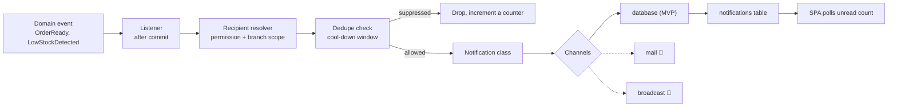
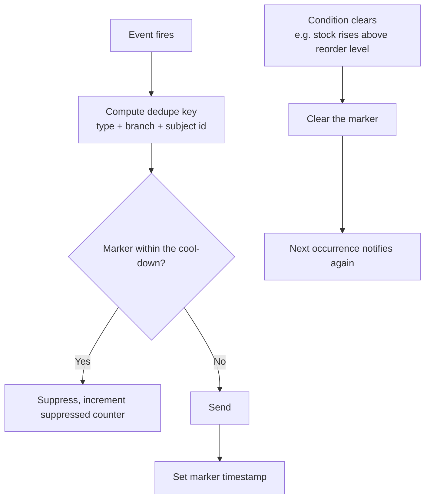

# 19 — Notifications

> **Document purpose.** Define what events produce notifications, who receives them, how duplicates are
> suppressed, and how the channel abstraction is designed so that email and push can be added later
> without rewriting every event.

**Prerequisites:** [05-database-design.md](05-database-design.md) §5.10.

**Status:** 🟡 MVP — Planned. In-app (database channel) only; email and push are 🔵.

---

## 1. Design principles

| # | Principle |
|---|---|
| N1 | A notification is a **signal to act**, not a log. Anything that requires no action belongs in the audit log or a report. |
| N2 | Notifications are targeted by **permission**, not by role name. A Cashier who is also granted `inventory.view` should get low-stock alerts; hard-coding "Managers only" would prevent that. |
| N3 | Notifications are **branch-scoped**. A manager at Riverside never sees Uptown's alerts unless their scope includes it. |
| N4 | Repeated identical signals are **deduplicated**. Fifty sales that each keep milk below the reorder level produce one notification. |
| N5 | Notifications are dispatched **after commit**, never inside a transaction ([02](02-system-architecture.md) §6, T2). A notification for a rolled-back event would be a lie. |
| N6 | Notification content respects field-level permissions. A payload never carries cost data to a recipient without `products.view_cost`. |
| N7 | Delivery failure never fails the business operation that triggered it. |

---

## 2. Architecture



### 2.1 Why the recipient resolver is a separate component

Recipient logic is the part that gets wrong most often — sending an expense approval to the person who
submitted it, or a low-stock alert to every branch. Isolating it in one class means one place to test:

```text
resolveRecipients(permission, branchId, exclude = []):
    users
      where is_active = true
      and branchId is within the user's branch scope
      and the user holds `permission`
      and user_id not in exclude          -- e.g. never notify the actor about their own action
```

---

## 3. Notification catalogue

### 3.1 Inventory

| Event | Notification | Recipients | Severity | Cool-down |
|---|---|---|---|---|
| Balance ≤ reorder level | `LowStockDetected` | `inventory.view` at branch | warning | 6 h per (branch, ingredient) |
| Balance ≤ 0 | `OutOfStock` | `inventory.view` at branch | critical | 1 h |
| Balance negative | `NegativeStock` | `inventory.view` + Admin | critical | none — always notify |
| Adjustment above threshold | `LargeAdjustment` | `inventory.adjust` at branch, excluding the actor | warning | none |
| Count variance beyond tolerance | `CountVariance` | `inventory.view` at branch | warning | none |
| Reconciliation drift | `InventoryDrift` | Admin | critical | 24 h |

### 3.2 Stock transfers

| Event | Notification | Recipients | Severity |
|---|---|---|---|
| Transfer submitted | `TransferRequested` | `transfers.approve` at the **source** | info |
| Approved | `TransferApproved` | Requester + `transfers.dispatch` at source | info |
| Rejected | `TransferRejected` | Requester | warning |
| Dispatched | `TransferDispatched` | `transfers.receive` at destination | info |
| Received | `TransferReceived` | Requester + source manager | info |
| Variance recorded | `TransferVariance` | Managers at **both** branches | warning |
| Overdue in transit | `TransferOverdue` | Managers at both branches | warning |

### 3.3 Orders and kitchen

| Event | Notification | Recipients | Severity |
|---|---|---|---|
| Order ready | `OrderReady` | Order creator, `pos.access` at branch | info |
| Order cancelled after acceptance | `OrderCancelled` | Kitchen staff at branch | warning |
| Order voided | `OrderVoided` | `orders.void` at branch, excluding the actor | warning |
| Ticket exceeds SLA | `TicketLate` | `kitchen.view_tickets` at branch | warning |
| Order stale (open beyond threshold) | `StaleOrder` | Branch manager | warning |

**`OrderReady` is deliberately not sent to the customer.** Customer-facing notification requires a
messaging integration and consent handling, both out of MVP scope.

### 3.4 Expenses

| Event | Notification | Recipients | Severity |
|---|---|---|---|
| Submitted | `ExpenseSubmitted` | `expenses.approve` at branch, **excluding the creator** | info |
| Approved | `ExpenseApproved` | Creator | info |
| Rejected | `ExpenseRejected` | Creator | warning |
| Marked paid | `ExpensePaid` | Creator | info |
| Self-approval attempted | `SelfApprovalAttempt` | Admin | warning |

The exclusion in the first row is not cosmetic — it is the visible face of separation of duties
([17](17-expense-management.md) §4.1).

### 3.5 Payments and cash

| Event | Notification | Recipients | Severity |
|---|---|---|---|
| Refund issued | `RefundIssued` | Branch manager, excluding the actor | warning |
| Refund outside window | `RefundWindowOverride` | Admin | critical |
| Drawer variance beyond tolerance | `DrawerVariance` | Branch manager | warning |
| Drawer open > 24 h | `StaleDrawerSession` | Branch manager | warning |
| Drawer opened outside a sale | `DrawerOpened` | Branch manager | info |

### 3.6 Security and system

| Event | Notification | Recipients | Severity |
|---|---|---|---|
| Account locked out | `AccountLocked` | The user + their branch manager | warning |
| Password reset completed | `PasswordReset` | The user | info |
| Role changed | `RoleChanged` | The affected user + Admin | warning |
| Super Admin created | `SuperAdminCreated` | All Super Admins | critical |
| Queue backlog beyond threshold | `QueueBacklog` | Admin | critical |
| Configuration missing at runtime | `ConfigurationMissing` | Admin | critical |

---

## 4. Deduplication

Without suppression, a busy service produces hundreds of identical low-stock alerts and staff stop
reading any of them.



| Mechanism | Where |
|---|---|
| Low stock | `inventories.low_stock_notified_at` — a real column, so the state survives a cache flush |
| Everything else | Redis key `notif:{type}:{branch}:{subject}` with a TTL equal to the cool-down |
| Clearing | Low stock clears when the balance rises above the reorder level; others expire naturally |

| # | Rule |
|---|---|
| BR-NTF-01 | Cool-down is per (type, branch, subject), never global. Milk and coffee alert independently. |
| BR-NTF-02 | Critical severity ignores cool-down where the condition is genuinely new (negative stock). |
| BR-NTF-03 | Clearing the condition resets the marker so the next occurrence notifies. |
| BR-NTF-04 | Suppressed counts are recorded so "why did I only get one alert?" is answerable. |

---

## 5. Delivery and reading

| Aspect | MVP | Post-MVP 🔵 |
|---|---|---|
| Channel | `database` | `mail`, `broadcast`, web push |
| Client | SPA polls `GET /notifications/unread-count` every 60 s | WebSocket push |
| List | `GET /notifications?unread=1` | — |
| Mark read | `POST /notifications/{id}/read`, `POST /notifications/read-all` | — |
| Retention | Read notifications older than 90 days are deleted | — |
| Preferences | `GET`/`PATCH /notifications/preferences` — per type, per severity opt-out | Per channel |

**Poll interval.** 60 s for notifications, against 5 s for the KDS. Notifications are not time-critical
in the way a kitchen ticket is, and a 60 s interval across every logged-in user is already meaningful
load.

**Opt-out floor.** Critical-severity notifications cannot be disabled. A manager who has muted
`NegativeStock` is not being served by the system.

---

## 6. Payload shape

```json
{
  "id": "9f1c8a2e-...",
  "type": "LowStockDetected",
  "severity": "warning",
  "branch_id": 1,
  "read_at": null,
  "created_at": "2026-09-05T14:32:11+07:00",
  "data": {
    "title": "Low stock: Milk",
    "body": "Milk at Riverside is 0.8000 l, at or below the reorder level of 1.0000 l.",
    "ingredient_id": 4,
    "ingredient_name": "Milk",
    "quantity_on_hand": "0.8000",
    "reorder_level": "1.0000",
    "unit": "l",
    "action_url": "/inventory/4?branch=1",
    "action_label": "View stock"
  }
}
```

| Rule | Detail |
|---|---|
| `title` and `body` | Pre-rendered server-side so every client shows identical wording |
| `action_url` | A relative SPA path, never an absolute URL — prevents open-redirect issues |
| `data` | **No monetary cost values** unless every recipient holds `products.view_cost` (N6) |
| Size | ≤ 4 kB; anything larger belongs behind the action link |

---

## 7. Happy path

**Scenario.** Milk falls below the reorder level during service.

| # | Event |
|---|---|
| 1 | Order 0087 accepted; milk deducted `−0.40 L`, balance now `0.80 L` |
| 2 | Transaction commits |
| 3 | `StockLevelChanged` event dispatched after commit |
| 4 | `CheckLowStock` listener runs on the queue |
| 5 | `0.80 ≤ 1.00` reorder level ⇒ condition met |
| 6 | `low_stock_notified_at` is null ⇒ not suppressed |
| 7 | Resolver finds 2 users with `inventory.view` at Riverside |
| 8 | Two `notifications` rows inserted; `low_stock_notified_at` set |
| 9 | Managers' unread badge increments within 60 s |
| 10 | Orders 0088–0095 also consume milk; each check finds the marker inside the 6 h cool-down and suppresses |
| 11 | 12 L delivered; balance `12.80 L`; marker cleared |
| 12 | The next dip below `1.00 L` notifies again |

---

## 8. Alternative and failure paths

| # | Scenario | Behaviour |
|---|---|---|
| A1 | No eligible recipients | No rows created. Logged at debug level — not an error; a branch may genuinely have nobody with that permission online. |
| A2 | Recipient deactivated between event and delivery | Resolver filters on `is_active`; nothing is delivered. |
| A3 | Actor is also an eligible recipient | Excluded via the `exclude` list for actor-triggered events. Nobody needs to be told what they just did. |
| A4 | Multiple branches in scope | One notification per (recipient, branch) — a multi-branch manager gets one per affected branch. |
| A5 | Condition resolves before the job runs | The listener re-checks the condition at execution time and drops if no longer true. |
| F1 | Queue worker down | Notifications accumulate as pending jobs and deliver when it recovers. **No business operation fails** (N7). |
| F2 | Notification insert fails | Job retries 3× with backoff, then lands in `failed_jobs`. The triggering operation is unaffected. |
| F3 | Redis unavailable (dedupe store) | Fails **open** — notifications are sent without suppression. Noisy is better than silent for a warning system. Low-stock dedupe still works, because its marker is a database column. |
| F4 | 500 notifications from one bulk operation | Batched into one job; the resolver runs once; a per-operation cap raises a single summary notification instead. |

---

## 9. Validation and permissions

| Field | Rule |
|---|---|
| `notification_id` | required, must belong to the authenticated user |
| `unread` filter | optional boolean |
| `severity` filter | optional, in `info,warning,critical` |
| `branch_id` filter | optional, must be in scope |
| Preferences `type` | must be a known notification type |
| Preferences `enabled` | boolean; **rejected for critical severity** |

| Action | Permission |
|---|---|
| View own notifications | `notifications.view` |
| Mark read | `notifications.view` |
| Manage own preferences | `notifications.manage_preferences` |
| View another user's notifications | **No permission grants this** — there is no such endpoint |

---

## 10. Database changes

| Action | Table | Change |
|---|---|---|
| Send | `notifications` | `INSERT` one row per recipient |
| Low-stock send | `inventories` | `UPDATE low_stock_notified_at` |
| Mark read | `notifications` | `UPDATE read_at` |
| Mark all read | `notifications` | `UPDATE read_at` where recipient and null |
| Retention sweep | `notifications` | `DELETE` read rows older than 90 days |

Notification writes happen **outside** the triggering transaction, on the queue.

---

## 11. Audit requirements

Notifications are generally **not** audited — they are a consequence of an already-audited event, and
auditing both doubles the volume for no additional insight. Exceptions:

| Event | Reason |
|---|---|
| Critical notification sent | Evidence that an alert was raised, for incident review |
| Preference change disabling a warning-severity type | Someone chose not to be told |
| Bulk mark-all-read on > 50 critical notifications | Alert fatigue signal |

---

## 12. Edge cases

| # | Case | Expected behaviour |
|---|---|---|
| E1 | Recipient's scope changes after sending | The notification remains visible to them. It was validly targeted when created. |
| E2 | Branch deleted | Notifications remain, `branch_id` cascades to deletion of the row only if the branch row is hard-deleted — which cannot happen (soft delete only). |
| E3 | Same event fires twice within milliseconds | Dedupe key catches the second. |
| E4 | Ingredient reorder level raised above the current balance | The condition becomes true; the next check notifies. |
| E5 | Reorder level set to 0 | The condition is `balance <= 0`, i.e. only out-of-stock. Valid way to disable low-stock alerts per ingredient. |
| E6 | User with 10 000 unread | The list paginates; the badge caps display at "99+". |
| E7 | Notification for an entity later deleted | The action link returns `404`; the notification body still explains what happened. |
| E8 | Two managers both approve an expense | Only the first succeeds; only one `ExpenseApproved` is sent. |
| E9 | Cool-down spans a shift change | The incoming manager sees no new alert but does see the unread one and the current stock level. Documented, and the reason the low-stock **report** exists alongside alerts. |
| E10 | Critical notification with preferences disabled | Sent regardless (§5). |

---

## 13. Security considerations

| # | Consideration | Mitigation |
|---|---|---|
| S1 | Cross-branch information leakage | Recipients resolved by branch scope; `branch_id` stored on the row and filtered on read. |
| S2 | Cost data in payloads | N6 — no monetary cost in payloads unless every recipient is permitted. |
| S3 | Customer PII in payloads | Never included. Notifications reference orders by number, not by customer. |
| S4 | Reading another user's notifications | `notifiable_id` must equal the authenticated user; there is no endpoint that takes another user's ID. |
| S5 | Open redirect via `action_url` | Relative paths only, validated against a route allow-list. |
| S6 | Notification flooding as a DoS | Per-operation caps, dedupe, batching. |
| S7 | Muting security alerts | Critical severity cannot be disabled. |
| S8 | Enumeration via notification content | Bodies reference only entities the recipient is already permitted to see. |

---

## 14. Testing considerations

| Area | Test |
|---|---|
| Recipient resolution | One test per catalogue row: correct users get it, everyone else does not. |
| Actor exclusion | The person who performed the action is not notified about it. |
| Expense approver exclusion | The creator never receives their own `ExpenseSubmitted`. |
| Branch scoping | A Riverside event produces no Uptown notifications. |
| Dedupe | 50 consecutive low-stock triggers ⇒ 1 notification. |
| Dedupe reset | Restock above the level, then dip again ⇒ a second notification. |
| Per-ingredient independence | Milk and coffee alert separately. |
| After-commit dispatch | A rolled-back transaction produces no notification. |
| Failure isolation | Queue worker down ⇒ orders still complete. |
| Redis down | Notifications still send (fail open); low-stock dedupe still works via the DB column. |
| Payload content | Automated key scan asserting no `cost`, `margin`, `phone` or `email` keys in any payload. |
| Critical opt-out | Attempting to disable a critical type ⇒ `422`. |
| Read state | Mark read decrements the count; mark-all affects only the caller's rows. |
| Ownership | Requesting another user's notification ⇒ `404`. |

Full plan: [24-qa-test-plan.md](24-qa-test-plan.md) §4.6.

---

## 15. Related documents

[07-api-documentation.md](07-api-documentation.md) §12.2 ·
[14-inventory-workflow.md](14-inventory-workflow.md) §9 ·
[15-stock-transfer.md](15-stock-transfer.md) ·
[17-expense-management.md](17-expense-management.md) ·
[22-security.md](22-security.md)
