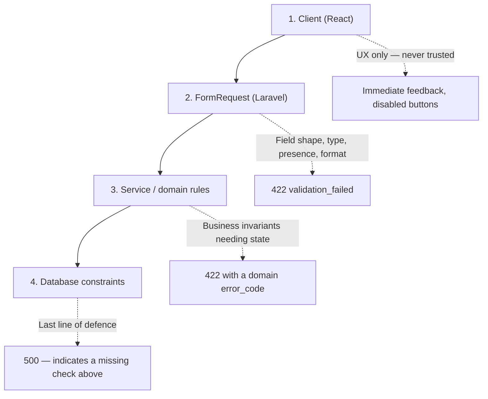

# 20 — Validation Rules

> **Document purpose.** Provide the single, authoritative catalogue of field-level validation for every
> write endpoint. Workflow documents reference this one rather than restating rules, so a rule changes
> in exactly one place.

**Prerequisites:** [05-database-design.md](05-database-design.md) (types and constraints),
[21-error-handling.md](21-error-handling.md) (how failures are returned).

**Status:** 🟡 MVP — Planned.

---

## 1. Validation layers

Validation happens at four levels. Each catches what the ones above cannot.



| Layer | Catches | Example |
|---|---|---|
| **Client** | Typos, obvious omissions | Quantity below 1 |
| **FormRequest** | Type, format, presence, range, existence | `quantity` is not numeric |
| **Service** | Rules requiring other state | Stock is insufficient; the order is already paid |
| **Database** | Anything that slipped through | `CHECK (quantity > 0)` |

**A database constraint firing is a bug**, not a validation strategy. It returns `500`, is logged at
critical severity, and means a service-layer check is missing. The constraint exists so that bug
corrupts nothing.

---

## 2. Conventions

| Notation | Meaning |
|---|---|
| `required` | Must be present and non-null |
| `nullable` | May be null; if present, other rules apply |
| `sometimes` | Validated only when present (used on `PATCH`) |
| `exists:table,col` | Must reference a live (non-soft-deleted) row |
| `in scope` | The referenced record's branch must be in the caller's branch scope |
| `decimal:n` | At most `n` decimal places |
| `money` | Decimal string or minor-unit integer; **never a JSON float** |

### 2.1 Global input rules

Applied to every request before field rules:

| # | Rule |
|---|---|
| G1 | Body must be valid JSON (or `multipart/form-data` for uploads). Malformed ⇒ `400 malformed_request`. |
| G2 | Unknown top-level fields are **rejected**, not ignored ⇒ `422 unexpected_field`. Silently dropping a misspelled field lets a caller believe it applied. |
| G3 | Strings are trimmed of leading and trailing whitespace before validation. |
| G4 | Empty strings on nullable fields are normalised to `null`. |
| G5 | Maximum request body 1 MB, except uploads (10 MB). |
| G6 | Maximum array length 500 for any collection field, unless a tighter limit is stated. |
| G7 | All strings are validated as valid UTF-8; invalid sequences ⇒ `422`. |
| G8 | Money fields reject JSON floats ⇒ `422 invalid_money_format`. |
| G9 | Dates accept ISO 8601 or `Y-m-d`; anything else ⇒ `422`. |
| G10 | Server-derived fields (`status`, `payment_status`, `paid_total`, `grand_total`, `balance_after`) are **never accepted** from a client. Presence ⇒ `422 unexpected_field`. |

### 2.2 Sanitisation

| Field kind | Treatment |
|---|---|
| Names, descriptions, notes | Trimmed; HTML **not** stripped — stored raw and escaped on output. Stripping on input destroys legitimate content such as "Fish & Chips" or "5 < 10". |
| Phone | Trimmed; permitted characters `0-9 + - ( ) space`; normalised to digits and a leading `+` for the uniqueness check |
| Email | Trimmed, lower-cased |
| Slug / code | Trimmed, upper-cased (codes) or lower-cased (slugs); pattern-enforced |
| Money | Parsed to integer minor units immediately; rejected if not exactly representable |
| Free text | Length-capped; control characters other than newline and tab stripped |

> **Escape on output, not on input.** Sanitising HTML at input is lossy and irreversible; the same
> value may be rendered into HTML, a CSV, a receipt and a JSON payload, each needing different
> escaping. See [22-security.md](22-security.md) §8.

---

## 3. Authentication

| Endpoint | Field | Rules |
|---|---|---|
| `POST /auth/login` | `email` | required, email, max 190 |
| | `password` | required, string, min 8, max 128 |
| | `device_name` | required, string, max 100, `regex:^[A-Za-z0-9\-_ ]+$` |
| | `remember` | nullable, boolean |
| `POST /auth/login-pin` | `branch_id` | required, exists, active |
| | `employee_code` | required, string, max 30, exists |
| | `pin` | required, digits, min 4, max 6 |
| | `device_name` | required, max 100 |
| `POST /auth/change-password` | `current_password` | required, must match the stored hash |
| | `password` | required, min 12, max 128, confirmed, uncompromised, different from current |
| `POST /auth/forgot-password` | `email` | required, email |
| `POST /auth/reset-password` | `token` | required, size 64 |
| | `email` | required, email |
| | `password` | required, min 12, confirmed, uncompromised |
| Set PIN | `pin` | required, digits, 4–6, not in the trivial list (`0000`, `1111`, `1234`, `4321`, all-same-digit), not a substring of the employee code |

---

## 4. Users, roles, branches

### 4.1 Users

| Field | Rules |
|---|---|
| `name` | required, string, 2–150 |
| `email` | required, email, max 190, unique on `users` (including soft-deleted — §1.5 of [05](05-database-design.md)) |
| `password` | required on create, min 12, confirmed, uncompromised |
| `phone` | nullable, max 30, phone pattern |
| `branch_id` | nullable, exists, in the assigner's scope; required unless the user holds an all-branch role |
| `is_active` | boolean |
| `role_ids` | required on create, array, min 1; each exists; each rank < assigner's rank (guard G1) |
| `avatar` | nullable file, `jpg,jpeg,png,webp`, ≤ 2 MB, content-sniffed, max 2000×2000 px |

### 4.2 Roles and permissions

| Field | Rules |
|---|---|
| `roles.name` | required, `regex:^[a-z][a-z0-9_]{1,49}$`, unique, immutable for system roles |
| `roles.display_name` | required, 2–100 |
| `roles.rank` | required, integer 1–100, ≤ assigner's rank − 1 |
| `permission_ids` | required, array; each exists; may not include a permission the assigner lacks |
| `permissions.name` | required, `regex:^[a-z_]+\.[a-z_]+$`, unique |
| `permissions.group` | required, must equal the segment before the dot |

### 4.3 Branches

| Field | Rules |
|---|---|
| `code` | required, `regex:^[A-Z0-9\-]{2,20}$`, unique |
| `name` | required, 2–150 |
| `timezone` | required, a valid IANA identifier |
| `currency_code` | required, `size:3`, valid ISO 4217; **immutable once orders exist** |
| `business_day_start` | required, `H:i` |
| `opening_time`, `closing_time` | nullable, `H:i` |
| `country_code` | required, `size:2`, valid ISO 3166-1 alpha-2 |
| `email` | nullable, email, max 190 |
| `phone` | nullable, max 30 |
| `tax_registration_number` | nullable, max 50 |
| `is_active` | boolean |

---

## 5. Catalogue

### 5.1 Categories

| Field | Rules |
|---|---|
| `name` | required, 2–120 |
| `slug` | required, `regex:^[a-z0-9\-]{2,140}$`, unique among live rows |
| `parent_id` | nullable, exists, **must itself have no parent** (depth ≤ 2, C1), may not be self |
| `kitchen_station_id` | nullable, exists, must belong to a branch in scope |
| `sort_order` | integer 0–9999 |
| `image` | nullable file, `jpg,jpeg,png,webp`, ≤ 2 MB |
| `is_active` | boolean |

### 5.2 Products

| Field | Rules |
|---|---|
| `sku` | required, `regex:^[A-Z0-9\-]{2,50}$`, unique among live rows |
| `name` | required, 2–150 |
| `slug` | required, unique among live rows |
| `category_id` | required, exists, active |
| `tax_rate_id` | nullable, exists, active, not expired |
| `base_price` | required, money, `>= 0`, ≤ 999999.99, `decimal:2` |
| `cost_price` | nullable, money, `>= 0`, `decimal:4`; **required when `track_inventory = false`** and no recipe exists |
| `description` | nullable, ≤ 5000 |
| `preparation_minutes` | nullable, integer 0–480 |
| `track_inventory`, `is_active`, `is_available`, `has_variants` | boolean |
| `image` | nullable file, `jpg,jpeg,png,webp`, ≤ 5 MB |

### 5.3 Product variants

| Field | Rules |
|---|---|
| `name` | required, 1–100, unique within the product among live rows |
| `sku` | required, unique among live rows |
| `price_delta` | required, money, `decimal:2`, **signed**; `base_price + price_delta` must be `>= 0` (BR-PRICE-02) |
| `cost_delta` | nullable, money, `decimal:4` |
| `is_default` | boolean; exactly one per product (C4) |
| `is_active` | boolean |

### 5.4 Branch product override

| Field | Rules |
|---|---|
| `price_override` | nullable, money, `>= 0`, `decimal:2` |
| `is_available` | boolean |
| `branch_id` | required, exists, in scope |

---

## 6. POS and orders

### 6.1 Cart calculate and order create

| Field | Rules |
|---|---|
| `Idempotency-Key` (header) | **required on create**, UUID v4 |
| `branch_id` | required, exists, active, in scope |
| `order_type` | required, `in:dine_in,takeaway,delivery` |
| `table_number` | required if `dine_in` **and** `pos.require_table_number`; **prohibited** otherwise; max 20 |
| `customer_id` | nullable, exists, active, not anonymised |
| `items` | required, array, min 1, max 200 |
| `items.*.product_id` | required, exists, active, available at the branch |
| `items.*.product_variant_id` | required if the product has variants; must belong to that product; prohibited otherwise |
| `items.*.quantity` | required, numeric, `> 0`, ≤ 9999, `decimal:3` |
| `items.*.note` | nullable, ≤ 255 |
| `items.*.discount_type` | nullable, `in:none,percentage,fixed` |
| `items.*.discount_value` | required with a discount type; `>= 0`; ≤ 100 if percentage; ≤ line subtotal if fixed |
| `discount_type` | nullable, `in:none,percentage,fixed` |
| `discount_value` | `>= 0`; ≤ 100 if percentage; ≤ subtotal if fixed; ≤ role threshold |
| `discount_reason` | required when `discount_value` > `discount.require_reason_above`; 3–255 |
| `loyalty_points_to_redeem` | nullable, integer `>= 0`, ≤ balance, ≥ minimum, multiple of increment, within cap |
| `note` | nullable, ≤ 500 |
| `auto_accept` | nullable, boolean; requires `orders.accept` |

### 6.2 Order transitions

| Endpoint | Field | Rules |
|---|---|---|
| All | `version` | required, integer `>= 0`, must equal `orders.version` |
| `/cancel` | `reason` | required, 3–255 |
| `/void` | `reason` | required, 3–255 |
| `/complete` | — | `balance_due` must be `0` |
| `PATCH /orders/{id}` | `items` | as §6.1; the result must retain ≥ 1 line |

### 6.3 Cross-field rules

| # | Rule | Error |
|---|---|---|
| X1 | A variant must belong to the named product | `422 variant_product_mismatch` |
| X2 | `table_number` only for `dine_in` | `422` |
| X3 | Line discount ≤ line subtotal | `422` |
| X4 | Total discount ≤ subtotal | `422 discount_exceeds_total` |
| X5 | Loyalty redemption requires a customer | `422 no_customer_attached` |
| X6 | Body `branch_id` must match the resolved active branch | `422 branch_mismatch` |
| X7 | Duplicate (product, variant, note) triples are merged, not rejected | — |

---

## 7. Payments

| Endpoint | Field | Rules |
|---|---|---|
| `POST /orders/{id}/payments` | `Idempotency-Key` | required header, UUID v4 |
| | `method` | required, `in:cash,card,qr,bank_transfer` |
| | `amount` | required, money, `> 0`, `decimal:2`, ≤ `balance_due` |
| | `tendered_amount` | required if `cash`, `>= amount`; **prohibited** otherwise |
| | `reference` | required unless `cash`; 1–100; **must not contain a 13–19 digit sequence** (PAN guard) |
| | `card_last_four` | nullable, `digits:4`, only when `method = card` |
| | `card_brand` | nullable, max 30 |
| | `provider` | nullable, max 50 |
| `POST /payments/{id}/void` | `reason` | required, 3–255 |
| `POST /payments/{id}/refunds` | `Idempotency-Key` | required |
| | `amount` | required, money, `> 0`, ≤ `payment.amount − payment.refunded_total` |
| | `method` | required, `in:cash,card,qr,bank_transfer` |
| | `reason` | required, 3–255 |
| | `restock_inventory` | boolean, default `false` |
| `POST /shifts/open` | `branch_id` | required, exists, in scope |
| | `opening_float` | required, money, `>= 0` |
| `POST /shifts/{id}/close` | `counted_cash` | required, money, `>= 0` |
| | `notes` | required when `ABS(variance) > cash.variance_tolerance`; 3–500 |

**The PAN guard is not decoration.** Cashiers under pressure type the card number into the reference
field. A regex rejecting 13–19 consecutive digits (allowing for spaces and hyphens) prevents card data
entering the database ([22](22-security.md) §10).

---

## 8. Inventory

### 8.1 Ingredients and units

| Field | Rules |
|---|---|
| `ingredients.name` | required, 2–120, unique among live rows |
| `ingredients.code` | nullable, `regex:^[A-Z0-9\-]{2,30}$`, unique among live rows |
| `ingredients.unit_id` | required, exists; **immutable once stock movements exist** |
| `ingredients.default_cost_per_unit` | required, money, `>= 0`, `decimal:4` |
| `ingredients.reorder_level` | required, numeric, `>= 0`, `decimal:4` |
| `ingredients.shelf_life_days` | nullable, integer 1–3650 |
| `units.code` | required, 1–10, unique |
| `units.family` | required, `in:mass,volume,count` |
| `units.conversion_factor` | required, `> 0`, `decimal:6` |

### 8.2 Recipes

| Field | Rules |
|---|---|
| `product_id` | required, exists |
| `product_variant_id` | nullable, exists, belongs to the product |
| `yield_quantity` | required, `> 0`, ≤ 10000, `decimal:3` |
| `items` | required, array, min 1, max 50 |
| `items.*.ingredient_id` | required, exists, active, **unique within the recipe** |
| `items.*.quantity` | required, `> 0`, `decimal:4` |
| `items.*.unit_id` | required, exists, **same family** as the ingredient's stock unit |
| `items.*.wastage_percent` | nullable, `>= 0`, `< 100`, `decimal:2` |
| `items.*.is_optional` | boolean |
| `notes` | nullable, ≤ 5000 |

### 8.3 Stock operations

| Operation | Field | Rules |
|---|---|---|
| Stock in | `quantity` | required, `> 0`, `decimal:4` |
| | `unit_cost` | required, money, `>= 0`, `decimal:4` |
| | `unit_id` | required, same family as the stock unit |
| | `occurred_at` | nullable, not future, within `inventory.max_backdate_days` |
| | `reference` | nullable, ≤ 100 |
| Stock out / wastage | `quantity` | required, `> 0`; ≤ available unless negatives permitted |
| | `reason` | required, 10–255 |
| Adjustment | `adjustment_type` | required, `in:set,increase,decrease` |
| | `quantity` | required; `>= 0` for `set`, `> 0` otherwise; `decimal:4` |
| | `reason` | required, 10–255 |
| Count | `items` | required, min 1, max 500 |
| | `items.*.ingredient_id` | required, exists, must have an `inventories` row at the branch |
| | `items.*.counted_quantity` | required, `>= 0`, `decimal:4` |
| | `items.*.reason` | required when variance exceeds tolerance |

---

## 9. Stock transfers

| Stage | Field | Rules |
|---|---|---|
| Create | `from_branch_id` | required, exists, active, **≠ `to_branch_id`** |
| | `to_branch_id` | required, exists, active, in scope |
| | `items` | required, min 1, max 100 |
| | `items.*.ingredient_id` | required, exists, active, unique within the transfer |
| | `items.*.requested_quantity` | required, `> 0`, `decimal:4` |
| | `items.*.unit_id` | required, same family as the stock unit |
| | `expected_arrival_at` | nullable, not in the past |
| | `note` | nullable, ≤ 500 |
| | `submit` | boolean |
| Approve | `items.*.approved_quantity` | required, `> 0`, ≤ `requested_quantity` |
| Reject | `rejection_reason` | required, 3–255 |
| Dispatch | `items.*.dispatched_quantity` | required, `> 0`, ≤ `approved_quantity`, ≤ source available |
| Receive | `items.*.received_quantity` | required, `>= 0`, `decimal:4` |
| | `items.*.variance_reason` | required when `received ≠ dispatched`; 3–255 |
| All | `version` | required, must match |

---

## 10. Customers and loyalty

| Field | Rules |
|---|---|
| `first_name` | required, 1–80 |
| `last_name` | nullable, ≤ 80 |
| `phone` | nullable, ≤ 30, phone pattern, unique among live rows |
| `email` | nullable, email, ≤ 190, unique among live rows |
| `birth_date` | nullable, valid date, in the past, age ≤ 120 |
| `gender` | nullable, ≤ 20 |
| `notes` | nullable, ≤ 65535 |
| `code` | auto-generated; **rejected if supplied** |
| `loyalty_tier_id` | **rejected if supplied** — assigned by the system |
| `loyalty_points_balance` | **rejected if supplied** — derived from the ledger |
| Redeem `points` | required, integer `> 0`, ≤ balance, ≥ `min_points_to_redeem`, multiple of `redeem_increment` |
| Adjust `points` | required, integer, non-zero; if negative, `ABS ≤ balance` |
| Adjust `reason` | required, 10–255 |
| Tier `name` | required, 2–50, unique |
| Tier `min_lifetime_points` | required, integer `>= 0`, unique |
| Tier `earn_rate_multiplier` | required, `> 0`, ≤ 10, `decimal:3` |
| Tier `discount_percent` | nullable, 0–100, `decimal:2` |
| Rule `earn_points_per_currency_unit` | required, `>= 0`, `decimal:4` |
| Rule `earn_basis` | required, `in:subtotal,net_of_discount,grand_total` |
| Rule `redeem_value_per_point` | required, `>= 0`, `decimal:4` |
| Rule `min_points_to_redeem` | required, integer `>= 0` |
| Rule `redeem_increment` | required, integer `>= 1` |
| Rule `max_redeem_percent_of_subtotal` | nullable, 0–100, `decimal:2` |
| Rule `points_expiry_days` | nullable, integer 1–3650 |

---

## 11. Expenses

| Field | Rules |
|---|---|
| `branch_id` | required, exists, active, in scope |
| `expense_category_id` | required, exists, active |
| `amount` | required, money, `> 0`, ≤ `expense.max_amount`, `decimal:2` |
| `tax_amount` | nullable, money, `>= 0`, ≤ `amount`, `decimal:2` |
| `total_amount` | **server-computed**; rejected if supplied |
| `expense_date` | required, date, ≥ branch creation date, within `expense.max_backdate_days`, ≤ today + `expense.max_future_days` |
| `vendor_name` | nullable, ≤ 150 |
| `vendor_tax_id` | nullable, ≤ 50 |
| `description` | required, 3–500 |
| `payment_method` | nullable, `in:cash,card,bank_transfer,other` |
| `receipt` | nullable file, `pdf,jpg,jpeg,png`, ≤ `expense.receipt_max_mb`, **content-sniffed MIME** |
| `submit` | boolean |
| Reject `reason` | required, 3–255 |
| Category `code` | required, `regex:^[A-Z0-9_]{2,30}$`, unique |
| Category `is_cogs_related` | required, boolean |

---

## 12. Reports

| Field | Rules |
|---|---|
| `branch_id` | nullable; in scope; `all` requires `reports.view_all_branches` |
| `date_from` | required, `Y-m-d`, ≤ `date_to` |
| `date_to` | required, `Y-m-d`, ≤ today's business date |
| Range | ≤ `reports.max_range_days` |
| `group_by` | nullable, `in:hour,day,week,month` |
| `order_type` | nullable, valid enum |
| `payment_method` | nullable, valid enum |
| `category_id`, `product_id`, `ingredient_id`, `user_id` | nullable, exist, in scope |
| `format` | nullable, `in:json,csv` |
| `sort` | nullable, whitelisted column, optional `-` prefix |

---

## 13. File uploads

Applies to product images, category images, avatars and expense receipts.

| # | Rule |
|---|---|
| U1 | Extension allow-list per field. |
| U2 | **MIME verified from file content** (magic bytes), not from the extension or the client header. |
| U3 | Size cap per field, enforced before the file is written to disk. |
| U4 | Images: dimension cap (max 4000×4000); re-encoded server-side, stripping EXIF (which can carry GPS coordinates). |
| U5 | Stored under a random key, never the original filename. |
| U6 | Stored outside the web root; served only via short-lived signed URLs. |
| U7 | SVG is **not** accepted anywhere — it is an executable document format. |
| U8 | Archives, executables and office documents are rejected. |
| U9 | A file whose sniffed type disagrees with its extension is rejected and the attempt is audited. |

---

## 14. Custom validation rules

Rules that need their own implementation because Laravel has no built-in equivalent.

| Rule | Purpose |
|---|---|
| `MoneyString` | Decimal string or minor-unit integer; rejects floats and scientific notation |
| `SameUnitFamily` | Unit and ingredient share a `family` |
| `WithinBranchScope` | The referenced record's branch is in the caller's scope |
| `DiscountWithinRoleLimit` | Compares against the caller's threshold |
| `LoyaltyRedeemable` | Balance, minimum, increment and cap in one rule so errors are coherent |
| `NoCardNumber` | Rejects 13–19 digit sequences in free text |
| `TrivialPin` | Rejects weak PINs |
| `CategoryDepth` | Enforces depth ≤ 2 |
| `UniqueAmongLive` | Uniqueness ignoring soft-deleted rows |
| `SufficientStock` | Recipe explosion feasibility; returns per-ingredient shortfalls |
| `ImmutableAfterUse` | Blocks changes to fields locked once transactional data exists (`ingredients.unit_id`, `branches.currency_code`) |
| `ValidTimezone` | IANA identifier |
| `SniffedMimeType` | Content-based file type check |

---

## 15. Error response shape

Field validation failures always return `422` with `error_code = validation_failed`:

```json
{
  "message": "The given data was invalid.",
  "error_code": "validation_failed",
  "errors": {
    "items.0.quantity": ["The quantity must be greater than 0."],
    "discount_value": ["The discount may not exceed 10% for your role."]
  },
  "meta": { "request_id": "9f1c...", "timestamp": "2026-09-05T14:31:00+07:00" }
}
```

| # | Rule |
|---|---|
| V1 | **All** failing fields are returned, never just the first. A cashier should not fix one error at a time. |
| V2 | Array errors use dot notation with the index, so the UI can highlight the right line. |
| V3 | Messages state what is wrong and what would be right. "Invalid input" is not acceptable. |
| V4 | Messages never leak internals — no table names, no column names, no SQL. |
| V5 | Domain-rule failures use a **specific** `error_code` (`insufficient_stock`, `overpayment`), not `validation_failed`, so the client can react appropriately. |

---

## 16. Testing considerations

| Area | Test |
|---|---|
| Negative coverage | Every rule in this document has at least one failing test. This is the acceptance criterion for the document. |
| Boundaries | For every numeric rule, test min − 1, min, max, max + 1. |
| Type confusion | String where a number is expected, array where a scalar is, `null` where required. |
| Float rejection | `{"amount": 12.50}` (a JSON float) ⇒ `422 invalid_money_format`. |
| Unknown fields | An extra top-level key ⇒ `422 unexpected_field`. |
| Server-derived fields | Sending `status`, `paid_total` or `grand_total` ⇒ `422`. |
| Cross-field | Every rule in §6.3. |
| Uniqueness with soft deletes | Soft-delete then recreate: succeeds where §1.5 of [05](05-database-design.md) permits, fails where it does not. |
| Scope validation | Referencing an out-of-scope record ⇒ `404`, not `422` — existence must not be confirmed. |
| Upload | Each rule U1–U9, including a PHP file renamed `.jpg` and an SVG. |
| PAN guard | `"reference": "4111 1111 1111 1111"` ⇒ `422`. |
| Multiple errors | A request with 5 bad fields returns all 5. |
| Message quality | Automated check that no message contains a table or column name. |
| Immutability | Changing `ingredients.unit_id` after a movement, and `branches.currency_code` after an order ⇒ `422`. |

---

## 17. Related documents

[05-database-design.md](05-database-design.md) §8 ·
[07-api-documentation.md](07-api-documentation.md) ·
[09-business-rules.md](09-business-rules.md) ·
[21-error-handling.md](21-error-handling.md) ·
[22-security.md](22-security.md) ·
[24-qa-test-plan.md](24-qa-test-plan.md) §9
