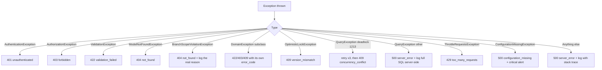

# 21 — Error Handling

> **Document purpose.** Define the single error contract between API and client: the response shape,
> the complete `error_code` catalogue, how each layer converts failures into responses, what is logged,
> and what the user is told. This document is the **authoritative source for `error_code` values**.

**Prerequisites:** [07-api-documentation.md](07-api-documentation.md) §1.3 and §1.6,
[20-validation-rules.md](20-validation-rules.md).

**Status:** 🟡 MVP — Planned.

---

## 1. Principles

| # | Principle |
|---|---|
| E1 | **One envelope.** Every error, from any layer, returns the same JSON shape. |
| E2 | **Machine-readable first.** Clients branch on `error_code`, never on `message`. |
| E3 | **Actionable messages.** The message says what went wrong *and* what to do. "Invalid input" is not acceptable. |
| E4 | **No internal leakage.** No stack traces, SQL, table names, file paths or framework internals reach a client. |
| E5 | **Always correlatable.** Every response carries `request_id`, present in the logs and in audit rows. |
| E6 | **Fail loudly in development, safely in production.** Debug detail is environment-gated. |
| E7 | **Errors are data.** Rejections that indicate misuse (overpayment attempts, denied transitions) are counted and, where meaningful, audited. |

---

## 2. Response shape

```json
{
  "message": "There is not enough stock to fulfil this order.",
  "error_code": "insufficient_stock",
  "errors": {
    "items": [
      {
        "product_id": 15,
        "product_name": "Cappuccino",
        "shortfalls": [
          { "ingredient_id": 4, "ingredient_name": "Milk", "required": "0.4000", "available": "0.3000", "unit": "l" }
        ]
      }
    ]
  },
  "meta": {
    "request_id": "9f1c8a2e-4b7d-4c1a-9f3e-2b8c1d5e7a90",
    "timestamp": "2026-09-05T14:31:00+07:00"
  }
}
```

| Field | Always present | Purpose |
|---|---|---|
| `message` | ✔ | Human-readable, localisable, safe to display |
| `error_code` | ✔ | Stable machine identifier — the client's branching key |
| `errors` | Only when there is structured detail | Field errors, or a domain-specific payload |
| `meta.request_id` | ✔ | Correlation with logs and support |
| `meta.timestamp` | ✔ | Branch-local ISO 8601 with offset |

### 2.1 The `errors` object

Two shapes, distinguished by `error_code`:

**Field validation** (`error_code = validation_failed`) — keys are field paths:

```json
"errors": {
  "items.0.quantity": ["The quantity must be greater than 0."],
  "discount_value": ["The discount may not exceed 10% for your role."]
}
```

**Domain failure** — a structured payload specific to the code, as in the `insufficient_stock` example
above. Each domain code's payload shape is documented in §4 and is part of the API contract.

### 2.2 What is never in a response

| Never returned | Why |
|---|---|
| Stack traces | Reveals framework version, file layout, package versions |
| SQL statements or fragments | Reveals schema; assists injection |
| Table or column names | Same |
| File paths | Reveals server layout |
| Exception class names | Reveals internals |
| Another user's or branch's data | Even in an error message |
| Whether a record exists outside scope | See §5 |

---

## 3. `422` covers two different things

This is the most important distinction in the contract, and the reason `error_code` exists.

| | Field validation | Domain rule violation |
|---|---|---|
| Status | `422` | `422` |
| `error_code` | `validation_failed` | Specific (`insufficient_stock`, `overpayment`, …) |
| Detected by | FormRequest | Service layer, with state loaded |
| `errors` shape | Field paths | Domain payload |
| Client reaction | Highlight the offending inputs | Show a domain-specific dialog with a recovery action |

**Example of why the distinction matters.** `quantity: -1` is a form error — highlight the field.
`insufficient_stock` is not a form error — the input was well-formed and the user must be offered
"reduce quantity", "remove line" or "record a delivery". Returning `validation_failed` for both would
force the client to parse `message` strings.

---

## 4. Error code catalogue

Codes are **stable**. Renaming one is a breaking API change.

### 4.1 Authentication — `401`

| Code | Message | Cause |
|---|---|---|
| `unauthenticated` | "Authentication required." | No or malformed token |
| `invalid_credentials` | "The email or password is incorrect." | Wrong email **or** password — deliberately identical |
| `token_expired` | "Your session has expired. Please sign in again." | Past `expires_at` |
| `token_idle_expired` | "You were signed out due to inactivity." | Past the idle window |
| `token_revoked` | "This session has been signed out." | Token deleted elsewhere |

### 4.2 Authorisation — `403`

| Code | Message | Cause |
|---|---|---|
| `forbidden` | "You do not have permission to perform this action." | Missing permission |
| `account_inactive` | "This account has been deactivated." | `is_active = false` |
| `account_locked` | "This account is temporarily locked. Try again in {minutes} minutes." | Lockout |
| `insufficient_token_ability` | "This device is not permitted to perform that action." | Token ability ceiling |
| `branch_out_of_scope` | "You do not have access to this branch." | `X-Branch-Id` outside scope |
| `privilege_escalation` | "You cannot assign a role at or above your own level." | Guard G1 |
| `self_role_modification` | "You cannot change your own roles." | Guard G2 |
| `insufficient_rank` | "You cannot modify a user at or above your own level." | Guard G4 |
| `discount_limit_exceeded` | "This discount exceeds your limit of {limit}%. Manager approval is required." | Threshold |
| `self_approval_forbidden` | "You cannot approve your own expense." | Guard G8 |
| `approval_limit_exceeded` | "This amount exceeds your approval limit of {limit}." | Guard G9 |
| `not_source_branch_authority` | "Only a manager at the sending branch can approve this transfer." | Guard G6 |
| `adjustment_exceeds_limit` | "This adjustment exceeds {limit}% and requires an administrator." | Threshold |
| `refund_window_expired` | "Refunds are only permitted within {days} days." | Window |
| `void_window_expired` | "This payment can no longer be voided. Issue a refund instead." | Window |
| `shift_not_open` | "Open a cash drawer session before taking cash payments." | No session |
| `payment_captured_cancel_forbidden` | "This order has been paid. A refund is required before cancelling." | Cashier limit |

### 4.3 Not found — `404`

| Code | Message |
|---|---|
| `not_found` | "The requested resource was not found." |

**One code only.** Out-of-scope records return exactly this, indistinguishable from genuinely absent
records (§5).

### 4.4 Conflict — `409` / `410`

| Code | Status | Message |
|---|---|---|
| `version_mismatch` | `409` | "This record was changed by someone else. Refresh and try again." |
| `concurrency_conflict` | `409` | "The system is busy. Please try again." |
| `idempotency_key_conflict` | `410` | "This request key was already used with different data." |

### 4.5 Validation — `422`

| Code | Message |
|---|---|
| `validation_failed` | "The given data was invalid." |
| `unexpected_field` | "The request contained fields that are not accepted." |
| `invalid_money_format` | "Monetary amounts must be sent as a decimal string, not a number." |

### 4.6 Domain rules — `422`

**Orders**

| Code | Message | `errors` payload |
|---|---|---|
| `invalid_state_transition` | "An order cannot go from {from} to {to}." | `{from, to, allowed[]}` |
| `empty_order` | "An order must contain at least one item." | — |
| `order_not_settled` | "This order cannot be completed until the balance of {balance} is paid." | `{grand_total, paid_total, balance_due}` |
| `branch_inactive` | "This branch is not currently active." | `{branch_id}` |
| `product_unavailable` | "{product} is not available at this branch." | `{product_id, reason}` |
| `variant_required` | "Choose a size or option for {product}." | `{product_id, variants[]}` |
| `variant_product_mismatch` | "That option does not belong to this product." | — |
| `discount_exceeds_total` | "The discount cannot be greater than the order total." | `{subtotal, discount}` |
| `branch_mismatch` | "The branch in the request does not match your active branch." | — |
| `already_deducted` | "Stock has already been deducted for this order." | — |
| `recipe_unavailable` | "{product} has no recipe or cost price and cannot be sold." | `{product_id}` |

**Payments**

| Code | Message | `errors` payload |
|---|---|---|
| `overpayment` | "The payment of {amount} exceeds the outstanding balance of {balance}." | `{amount, balance_due}` |
| `order_already_paid` | "This order is already fully paid." | `{paid_total, grand_total}` |
| `order_cancelled` | "This order was cancelled and cannot take payment." | — |
| `tendered_less_than_amount` | "The amount tendered is less than the amount due." | `{amount, tendered}` |
| `reference_required` | "A reference number is required for {method} payments." | `{method}` |
| `refund_exceeds_payment` | "The refund cannot exceed the remaining {remaining} on this payment." | `{amount, remaining}` |
| `order_not_refundable` | "Only completed or cancelled orders can be refunded." | — |
| `shift_already_closed` | "This cash drawer session is already closed." | — |
| `variance_note_required` | "Explain the variance of {variance} before closing." | `{variance, tolerance}` |

**Inventory**

| Code | Message | `errors` payload |
|---|---|---|
| `insufficient_stock` | "There is not enough stock to fulfil this order." | per-product shortfalls (§2) |
| `unit_family_mismatch` | "{unit} cannot be converted to {stock_unit}." | `{unit, stock_unit}` |
| `negative_stock_forbidden` | "This would take {ingredient} below zero." | `{ingredient, available, requested}` |
| `backdate_too_old` | "Entries cannot be backdated more than {days} days." | `{days}` |
| `unit_immutable` | "The stock unit cannot be changed after movements exist." | — |

**Transfers**

| Code | Message |
|---|---|
| `same_branch_transfer` | "The sending and receiving branches must be different." |
| `duplicate_ingredient` | "Each ingredient may appear only once per transfer." |
| `insufficient_source_stock` | "The sending branch does not have enough stock." |
| `approved_exceeds_requested` | "The approved quantity cannot exceed the requested quantity." |
| `variance_reason_required` | "Explain why the received quantity differs from the dispatched quantity." |
| `cannot_cancel_dispatched` | "A dispatched transfer cannot be cancelled. Receive it and record the variance." |

**Loyalty**

| Code | Message |
|---|---|
| `insufficient_points` | "This customer has {balance} points available." |
| `below_minimum_redemption` | "At least {minimum} points are required to redeem." |
| `invalid_redeem_increment` | "Points must be redeemed in multiples of {increment}." |
| `redemption_cap_exceeded` | "Redemption is capped at {cap} for this order." |
| `no_customer_attached` | "Attach a customer before redeeming points." |
| `customer_anonymised` | "This customer record has been erased and cannot be used." |
| `customer_inactive` | "This customer account is inactive." |

**Expenses**

| Code | Message |
|---|---|
| `expense_locked` | "An approved expense cannot be edited. Record a correction instead." |
| `expense_not_deletable` | "Only draft expenses can be deleted." |
| `amount_exceeds_limit` | "The amount exceeds the maximum of {max}." |
| `expense_date_out_of_range` | "The expense date must be between {from} and {to}." |
| `receipt_required` | "A receipt is required for amounts above {threshold}." |

**RBAC / admin**

| Code | Message |
|---|---|
| `last_super_admin` | "The last Super Admin cannot be removed or deactivated." |
| `station_has_active_tickets` | "This station has active tickets and cannot be removed." |
| `currency_immutable` | "The currency cannot be changed once orders exist." |

### 4.7 Other

| Code | Status | Message |
|---|---|---|
| `malformed_request` | `400` | "The request could not be understood." |
| `idempotency_key_required` | `400` | "This request requires an Idempotency-Key header." |
| `invalid_file_type` | `422` | "Only {types} files are accepted." |
| `file_too_large` | `413` | "The file exceeds the {max} limit." |
| `too_many_requests` | `429` | "Too many requests. Try again in {seconds} seconds." |
| `report_rate_limited` | `429` | "Too many report requests. Try again shortly." |
| `date_range_too_large` | `422` | "The date range cannot exceed {days} days." |
| `configuration_missing` | `500` | "The system is not fully configured. Contact your administrator." |
| `data_integrity_error` | `500` | "A data consistency problem was detected. This has been reported." |
| `server_error` | `500` | "Something went wrong. Reference: {request_id}" |
| `service_unavailable` | `503` | "The system is temporarily unavailable." |

---

## 5. Not-found versus forbidden

**Rule.** A record outside the caller's branch scope returns `404 not_found`, **not** `403`.

| Situation | Response |
|---|---|
| Record does not exist | `404 not_found` |
| Record exists, in scope, no permission | `403 forbidden` |
| Record exists, **out of scope** | `404 not_found` |

**Why.** A `403` on an out-of-scope record confirms the record exists. An attacker enumerating
`/orders/1`, `/orders/2`, … would learn how many orders every other branch has and which IDs are real.
The `404` makes out-of-scope records indistinguishable from absent ones.

The cost is a slightly worse message for a legitimate user who mistyped a branch. That is a good trade:
the attempt is still logged with the real reason, so support can explain it.

```text
Client sees:  404 not_found
Log records:  branch_scope_violation  user=7 branch_scope=[1] requested_branch=2 resource=Order:4213
```

---

## 6. Exception mapping

One handler, one table. Each exception type maps to exactly one status and code.



### 6.1 The domain exception base

Every business-rule failure extends one base class carrying its own code and status, so adding a rule
never means touching the handler:

```text
DomainException
├── errorCode(): string        // e.g. 'insufficient_stock'
├── statusCode(): int          // e.g. 422
├── context(): array           // becomes the `errors` payload
└── userMessage(): string      // localisable, safe to display
```

Subclasses: `InsufficientStockException`, `InvalidStateTransitionException`, `OverPaymentException`,
`BranchScopeViolationException`, `LoyaltyRedemptionException`, `SelfApprovalException`, and so on.

---

## 7. Logging

### 7.1 What is logged at which level

| Level | Trigger | Retention |
|---|---|---|
| `debug` | Request/response bodies (local only) | Not retained |
| `info` | Successful writes, state transitions | 7 days |
| `notice` | `401`/`403` — expected in normal operation | 30 days |
| `warning` | Domain rule violations, `409`, `429`, denied transitions | 90 days |
| `error` | `500`, unhandled exceptions, integration failures | 1 year |
| `critical` | `configuration_missing`, `data_integrity_error`, reconciliation drift, negative stock | 2 years |

### 7.2 Log entry shape

Structured JSON, one line per entry, to stdout ([26](26-deployment.md) §8):

```json
{
  "timestamp": "2026-09-05T07:31:00.123Z",
  "level": "warning",
  "message": "Insufficient stock for order creation",
  "error_code": "insufficient_stock",
  "request_id": "9f1c8a2e-...",
  "user_id": 7,
  "branch_id": 1,
  "route": "POST /api/v1/orders",
  "status": 422,
  "duration_ms": 187,
  "context": { "product_ids": [15], "shortfall_ingredients": [4] }
}
```

### 7.3 Redaction

| Field | Treatment |
|---|---|
| `password`, `password_confirmation`, `current_password` | `[REDACTED]` |
| `pin` | `[REDACTED]` |
| `token`, `Authorization` header | `[REDACTED]` |
| `card_last_four` | Retained — it is not sensitive alone |
| Any 13–19 digit sequence | `[REDACTED-PAN]` — defence in depth against a mis-keyed card number |
| `email`, `phone` | Retained in application logs, redacted in logs exported off-platform |

Redaction is applied by a log processor, not by each call site. Relying on developers to remember is
how secrets end up in logs.

---

## 8. Client handling

### 8.1 Reaction table

The SPA's single HTTP interceptor maps codes to behaviour:

| Code family | Behaviour |
|---|---|
| `401 token_expired` / `token_idle_expired` | Show the re-login modal, **preserving in-progress state** (the POS cart survives) |
| `401 unauthenticated` | Redirect to login |
| `403 account_inactive` | Clear the session, show a terminal message |
| `403 forbidden` | Inline "not permitted" message; do not navigate away |
| `403 discount_limit_exceeded` | Open the manager-authorisation modal |
| `404 not_found` | "This item no longer exists"; refresh the list |
| `409 version_mismatch` | Silently refetch, then re-present with a "this changed" note |
| `410 idempotency_key_conflict` | Generate a new key and re-present; never auto-retry |
| `422 validation_failed` | Bind `errors` to form fields |
| `422 <domain code>` | Domain-specific dialog with a recovery action |
| `429` | Automatic backoff using `Retry-After`, with a countdown |
| `500` | "Something went wrong" plus the `request_id`, and a Copy button |
| `503` | Maintenance screen with automatic retry |
| Network failure | Offline banner; retry with the **same** idempotency key |

### 8.2 Retry policy

| Condition | Retry? |
|---|---|
| Network timeout on a `GET` | Yes, 3× exponential backoff |
| Network timeout on a financial `POST` | Yes — **same** `Idempotency-Key** |
| `409 concurrency_conflict` | Yes, once, after a short delay |
| `409 version_mismatch` | No — refetch first |
| `429` | Yes, after `Retry-After` |
| `500` | No automatic retry on writes; the user decides |
| `422`, `403`, `404` | Never — the request will not succeed unchanged |

**Never auto-retry a write without an idempotency key.** That is how customers get charged twice.

---

## 9. Edge cases

| # | Case | Behaviour |
|---|---|---|
| E1 | Error occurs mid-transaction | Transaction rolls back; no partial write; the error reflects the whole operation. |
| E2 | Error while building an error response | A minimal hard-coded `500` envelope is returned; the failure is logged at critical. |
| E3 | Validation error inside a queued job | No HTTP client to answer; the job fails, retries, then lands in `failed_jobs` and raises a notification. |
| E4 | Deadlock retried and then succeeds | No error surfaces; the retry count is logged for tuning. |
| E5 | Multiple domain rules fail at once | The **first** by evaluation order wins. Order is deterministic and documented per endpoint, so the message is stable. |
| E6 | Validation and domain failure together | Validation runs first; the domain check never executes. |
| E7 | Client sends no `Accept: application/json` | Middleware forces JSON so an HTML error page can never be returned by the API. |
| E8 | Error message needs a value the user may not see | The value is omitted and the message generalised. A Cashier is never told a cost figure inside an error. |
| E9 | Debug mode accidentally enabled in production | A startup check refuses to boot when `APP_DEBUG=true` and `APP_ENV=production` ([27](27-environment-configuration.md) §8). |
| E10 | Error in the KDS poll | Screen keeps the last state and shows an offline banner. A blank kitchen screen is worse than a stale one. |

---

## 10. Security considerations

| # | Consideration | Mitigation |
|---|---|---|
| S1 | Information disclosure via error detail | E4; `APP_DEBUG=false` enforced; generic `500`. |
| S2 | Resource enumeration | `404` for out-of-scope records (§5). |
| S3 | User enumeration via login errors | Identical code, message and timing. |
| S4 | User enumeration via password reset | Always `200`, always the same message. |
| S5 | Timing side channels | Constant-time credential comparison; a dummy hash for unknown emails. |
| S6 | Error-message injection | User-supplied values interpolated into messages are escaped and length-capped. |
| S7 | Log injection | Structured JSON logging; newlines in user input are escaped, so a crafted note cannot forge a log line. |
| S8 | Secrets in logs | Automatic redaction (§7.3). |
| S9 | Excessive detail in `errors` payloads | Domain payloads carry only data the caller is already permitted to see. |
| S10 | `request_id` as an oracle | Random UUID v4, carries no encoded information. |

---

## 11. Testing considerations

| Area | Test |
|---|---|
| Envelope conformance | Every error from every endpoint matches §2. Automated across the route list. |
| Code stability | A snapshot test of the §4 catalogue fails if a code is renamed or removed. |
| Status mapping | One test per row of §6. |
| No leakage | Force each exception type with `APP_DEBUG=false`; assert no stack trace, SQL, path or class name in the body. |
| Debug parity | Assert the `error_code` is identical with debug on and off. |
| Scope masking | Out-of-scope record ⇒ `404`, and the log contains the real reason. |
| Login parity | Unknown email and wrong password produce byte-identical bodies; timing within tolerance. |
| Field errors | All failing fields returned, dot-notation paths correct for arrays. |
| Domain payloads | Each domain code returns its documented `errors` shape. |
| Redaction | Log a request containing a password, PIN, token and a 16-digit number; assert all are redacted. |
| Retry safety | Simulate a timeout then retry with the same key ⇒ one record. |
| Rollback | Force a failure after a partial write ⇒ assert nothing persisted. |
| Client mapping | Front-end unit tests for each row of §8.1. |
| Message quality | Automated check that no message contains a table name, column name or the word "exception". |

---

## 12. Related documents

[07-api-documentation.md](07-api-documentation.md) ·
[20-validation-rules.md](20-validation-rules.md) ·
[22-security.md](22-security.md) ·
[24-qa-test-plan.md](24-qa-test-plan.md) ·
[30-troubleshooting.md](30-troubleshooting.md)
