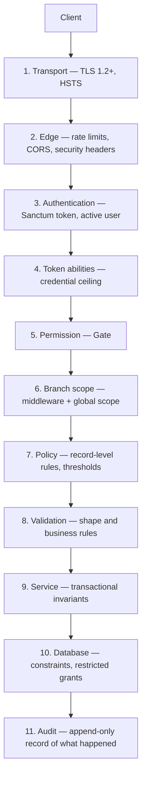

# 22 — Security

> **Document purpose.** Consolidate the security model: threat model, controls per layer, audit
> logging, data protection, and the operational practices that keep them working. Individual documents
> carry their own security sections; this one is the complete picture and the reference for a security
> review.

**Prerequisites:** [04-user-roles-permissions.md](04-user-roles-permissions.md),
[08-authentication-authorization.md](08-authentication-authorization.md).

**Status:** 🟡 MVP — Planned.

---

## 1. Security posture

RestaurantOS handles money, stock and customer data across multiple branches with staff of varying
trust levels on shared devices. The threat model is dominated by **insiders and shared terminals**, not
by anonymous internet attackers — the API is not publicly advertised and every endpoint requires a
token.

| Asset | Value to an attacker | Primary risk |
|---|---|---|
| Cash and payment records | Direct financial | Insider fraud: voids, refunds, discounts, reprints |
| Inventory | Resale value | Theft masked as wastage or transfer variance |
| Cost and margin data | Commercial | Leakage to junior staff or competitors |
| Customer PII | Resale, phishing | Bulk export, unattended screens |
| Credentials | Access to all of the above | Shared logins, weak PINs, unattended terminals |
| Audit logs | Concealment | Tampering to hide the above |

**Design consequence:** the strongest controls in this system are *attribution* and *append-only
records*, not perimeter defence. An insider who can act should never be able to act **anonymously** or
**undetectably**.

---

## 2. Defence in depth



Each layer assumes the ones above it may have failed. Layer 10 exists because layer 9 will one day have
a bug; layer 11 exists because layers 1–10 cannot prove what happened.

---

## 3. Authentication controls

Full mechanics in [08-authentication-authorization.md](08-authentication-authorization.md).

| Control | Implementation |
|---|---|
| Password hashing | bcrypt cost ≥ 12 (or argon2id); ~250 ms on production hardware |
| Password strength | Minimum 12 characters; breach-corpus check; **no composition rules**; no forced rotation |
| Token storage | SHA-256 hash at rest; plaintext shown once |
| Token prefix | `rosat_` so secret scanners detect leaks in commits |
| Token lifetime | Absolute and idle expiry, per client type |
| Revocation | Immediate, per token or all tokens |
| Lockout | 5 failures / 15 min; exponential backoff to 4 h; per account **and** per IP |
| Enumeration resistance | Identical response and timing for unknown email vs wrong password; constant-time comparison plus a dummy hash |
| PIN login | 4–6 digits, hashed, trivial-PIN blocklist, 3 attempts / 10 min, **`pos:*` abilities only** |
| Reset tokens | 64 random characters, hashed at rest, single use, 60 min, revokes all sessions |

### 3.1 The shared-terminal problem

The most realistic credential risk is not brute force — it is six cashiers sharing one login because
typing a password at every handover is impractical. The system's answer:

1. PIN login gives per-user attribution at acceptable friction.
2. PIN tokens are ability-capped, so a shared PIN cannot reach admin functions.
3. Every order, payment, void, discount and reprint records `user_id`.
4. The staff report surfaces per-user anomalies ([18](18-reporting.md) §7.2).

Attribution does not prevent misuse; it makes misuse visible, which is the achievable goal.

---

## 4. Authorisation controls

| Control | Detail |
|---|---|
| Server-side enforcement | Every non-public route declares a permission. **UI hiding is never a control.** |
| Route coverage test | An automated test walks every registered route and asserts each declares a permission and returns `403` for a token lacking it. A new unprotected endpoint fails CI. |
| Additive permissions | No deny rules — effective permissions are a union and are always reasonable about |
| Escalation guards | Rank hierarchy G1–G5 ([04](04-user-roles-permissions.md) §6.1) |
| Separation of duties | G6–G10: transfer approval at source, no self-approval of expenses |
| Threshold rules | Discounts, refunds, adjustments, approvals — all configuration, all server-checked |
| Field-level visibility | Cost, margin and profit fields are **omitted**, not nulled, without permission |
| Permission freshness | Read from the database per request; a revocation takes effect on the next call |

### 4.1 Why fields are omitted rather than nulled

```json
// Wrong — reveals that cost data exists and this user is excluded
{ "id": 15, "name": "Cappuccino", "price": "4.50", "cost_price": null }

// Correct — the field simply is not part of this user's view
{ "id": 15, "name": "Cappuccino", "price": "4.50" }
```

A `null` tells a curious cashier there is a number to be found. It also makes accidental exposure
easier: a later refactor that stops applying the filter produces a value in a field the client already
renders.

---

## 5. Multi-branch isolation (IDOR)

The highest-likelihood data-exposure risk in a multi-branch system.

| Layer | Control |
|---|---|
| Middleware | `ResolveBranchScope` computes scope once; validates `X-Branch-Id` against it |
| Global scope | Every branch-owned model constrains `SELECT` to `branch_id IN (scope)` |
| Policy | Every single-record operation re-verifies the record's branch |
| Response | Out-of-scope ⇒ `404 not_found`, never `403` ([21](21-error-handling.md) §5) |
| Request body | A `branch_id` in the body is validated against the resolved branch; disagreement ⇒ `422`. It is **never** used to select the branch |
| Logging | Every scope violation is logged at warning with the requested and permitted branches |

**The dual-branch exception.** `stock_transfers` is visible when **either** endpoint is in scope. It is
the one model where the simple rule does not apply and therefore needs its own tests
([15](15-stock-transfer.md) §10).

**Test obligation.** For every branch-owned resource: create at Branch A, request as a Branch B user,
assert `404`. This is a per-endpoint test, not a per-model one, because a single forgotten
`withoutGlobalScope()` reopens the hole.

---

## 6. Web application controls

### 6.1 Transport

| Control | Setting |
|---|---|
| TLS | 1.2 minimum, 1.3 preferred; modern cipher suites only |
| HSTS | `max-age=31536000; includeSubDomains; preload` |
| HTTP | Redirect to HTTPS only; no application content over plain HTTP |
| Certificates | Automated renewal; expiry monitored with 30-day alerting |

### 6.2 Response headers

| Header | Value | Purpose |
|---|---|---|
| `Content-Security-Policy` | `default-src 'self'; script-src 'self'; object-src 'none'; frame-ancestors 'none'; base-uri 'self'` | XSS containment |
| `X-Content-Type-Options` | `nosniff` | MIME confusion |
| `X-Frame-Options` | `DENY` | Clickjacking (with `frame-ancestors`) |
| `Referrer-Policy` | `strict-origin-when-cross-origin` | URL leakage |
| `Permissions-Policy` | `camera=(), microphone=(), geolocation=()` | Feature lockdown |
| `Cache-Control` | `no-store` on all authenticated API responses | Prevents caching of financial data on shared devices |

`no-store` matters specifically on shared terminals: a cached order response in a browser back-button
history is readable by the next cashier.

### 6.3 CORS

| Rule | Detail |
|---|---|
| Origins | Explicit allow-list per environment. **Never** `*` |
| Credentials | Not used — token auth needs no cookies |
| Methods and headers | Explicit allow-lists |
| Preflight cache | 1 hour |

### 6.4 Injection

| Vector | Control |
|---|---|
| SQL | Parameterised queries only. `sort`, `group_by` and `filter` map to fixed column names through a whitelist; user input is never interpolated into SQL |
| XSS | React escapes by default; `dangerouslySetInnerHTML` is banned by lint rule; CSP as backstop |
| Command | No shell execution with user input anywhere |
| Path traversal | Uploads stored under generated keys; user-supplied filenames never used in a path |
| Log injection | Structured JSON logging; newlines escaped |
| Open redirect | `action_url` in notifications is a relative path validated against the route list |

### 6.5 Rate limiting

| Bucket | Limit | Purpose |
|---|---|---|
| `auth` | 5 / 15 min per email **and** per IP | Credential stuffing |
| `pos-write` | 120 / min per user | Runaway client, abuse |
| `read` | 300 / min per user | Scraping |
| `report` | 10 / min per user | Database exhaustion |
| `export` | 3 / min per user | Bulk exfiltration |
| Global per IP | 1000 / min | Blunt DoS backstop |

The `export` limit is a data-protection control as much as a performance one: three exports a minute
makes bulk exfiltration slow and noisy.

---

## 7. Audit logging

The system's primary detective control.

### 7.1 Properties

| Property | Implementation |
|---|---|
| Append-only | No application path issues `UPDATE`/`DELETE`; DB grant excludes both; triggers block them |
| Transactional | Written in the **same transaction** as the change; a rollback leaves no orphan row |
| Attributed | `user_id`, plus `impersonator_id` when acting as another user |
| Correlated | `request_id` links to application logs |
| Contextual | `ip_address`, `user_agent`, `route`, `branch_id` |
| Complete | `old_values` and `new_values` for changed attributes only |
| Redacted | Passwords, PINs and tokens never appear, even in `old_values` |
| Retained | 24 months minimum |

### 7.2 What must be audited

| Category | Events |
|---|---|
| **Authentication** | Login success, login failure, lockout, logout, password change, password reset, PIN change |
| **Authorisation** | Role assignment, permission change, privilege-escalation attempt, scope violation |
| **Orders** | Create, edit, every status transition, cancel, void, discount application, discount override, receipt reprint |
| **Payments** | Create, void, refund, refund window override, drawer open, shift open/close, variance |
| **Inventory** | Sale deduction, reversal, stock in/out, wastage, adjustment, count, negative balance, reconciliation drift |
| **Transfers** | Every transition, self-approval, variance |
| **Expenses** | Create, submit, approve, reject, self-approval attempt, COGS-flag change |
| **Loyalty** | Earn, redeem, reverse, manual adjustment, rule change |
| **Customers** | Create, update, export, anonymise |
| **Admin** | Settings change, tax-rate change, user create/deactivate/delete, branch change |

### 7.3 Elevated-severity events

These are the fraud and integrity signals. They are surfaced in a security dashboard, not just stored.

| Event | Why it matters |
|---|---|
| `order.voided` | Void-after-cash is the classic POS fraud |
| `order.receipt_reprinted` | Skimming indicator |
| `order.discount_override` | Authority pressure |
| `payment.refunded` / `refund.method_changed` | Cash extraction |
| `refund.window_override` | Bypassed a control |
| `drawer.opened` outside a sale | Till access without a transaction |
| `shift.variance_exceeded` | Cash discrepancy |
| `inventory.adjusted` / `inventory.wastage` | Stock leaving without a sale |
| `transfer.variance` | Stock lost between branches |
| `expense.self_approval_denied` | Attempted control bypass |
| `customer.exported` / `customer.anonymised` | Bulk PII movement |
| `loyalty.rules_updated` | Changes the value of every outstanding point |
| `*.reconciliation_drift` | Data integrity failure |

**Denied attempts are audited too.** A pattern of `self_approval_denied` or `transition_denied` from
one user is a signal that only exists if failures are recorded.

---

## 8. Data protection

### 8.1 Classification

| Class | Data | Controls |
|---|---|---|
| **Secret** | Passwords, PINs, API tokens, app key, DB credentials | Hashed or in environment; never logged; never in responses |
| **Restricted** | Cost prices, margins, profit, staff performance | Permission-gated; omitted from responses |
| **Confidential** | Customer PII, order history, payment references | Permission-gated; audited access; exportable and erasable |
| **Internal** | Menu, stock levels, order status | Authenticated users within scope |
| **Public** | Branch name, address, opening hours | No restriction |

### 8.2 At rest and in transit

| State | Control |
|---|---|
| In transit | TLS 1.2+ everywhere, including app↔database on separate hosts |
| At rest — database | Full-disk or tablespace encryption; access restricted to the private subnet |
| At rest — backups | Encrypted; separate credentials; restore access logged |
| At rest — uploads | Object storage, private ACL, signed short-lived URLs |
| In logs | Redacted per [21](21-error-handling.md) §7.3 |

### 8.3 Retention

| Data | Retention | Basis |
|---|---|---|
| Orders, payments, refunds | ≥ 7 years | Financial record-keeping |
| Audit logs | 24 months | Dispute window |
| Stock ledger | 3 years hot, then archived | Traceability |
| Customer PII | Until erasure requested | Data-protection principle |
| Application logs | Per level, [21](21-error-handling.md) §7.1 | Operational |
| Read notifications | 90 days | Housekeeping |
| Expired tokens | Pruned daily | Attack surface |

### 8.4 Customer rights

| Right | Implementation |
|---|---|
| Access | `POST /customers/{id}/export` |
| Erasure | `POST /customers/{id}/anonymise` — personal fields cleared, financial records retained ([16](16-customer-loyalty.md) §8.2) |
| Rectification | Standard update, audited |
| Portability | Export is machine-readable |

---

## 9. File upload security

Applies to product images, avatars and expense receipts.

| # | Control |
|---|---|
| U1 | Extension allow-list per field |
| U2 | **MIME verified from content** (magic bytes), never from the extension or client header |
| U3 | Size cap enforced before writing to disk |
| U4 | Images re-encoded server-side, stripping EXIF (which can carry GPS coordinates from a staff phone) |
| U5 | Stored under a random key, never the original filename |
| U6 | Stored outside the web root, in object storage with a private ACL |
| U7 | Served only via short-lived signed URLs; every access audited |
| U8 | `Content-Disposition: attachment` and a restrictive `Content-Type` on delivery |
| U9 | **SVG rejected everywhere** — it is an executable document format that can carry script |
| U10 | Archives, executables and office documents rejected |
| U11 | A sniffed-type/extension mismatch is rejected **and audited** — it indicates a deliberate attempt |

---

## 10. Payment card data

**RestaurantOS is designed to stay out of PCI-DSS cardholder-data scope.**

| Rule | Detail |
|---|---|
| P1 | The system **never** stores a PAN, CVV, expiry date, magnetic-stripe or chip data |
| P2 | The only card data stored is `card_last_four` and `card_brand`, both optional |
| P3 | Card authorisation happens on a **separate physical terminal** that RestaurantOS does not integrate with ([01](01-project-overview.md) A7) |
| P4 | The `reference` field rejects any 13–19 digit sequence (the PAN guard) at validation |
| P5 | The same regex redacts such sequences in logs, as defence in depth |
| P6 | Receipts print only the last four digits |

**The PAN guard is a practical control, not a theoretical one.** Cashiers under pressure type card
numbers into free-text fields. Blocking it at validation and redacting it in logs means a mistake does
not become a compliance incident.

**If gateway integration is added** 🔵, this section must be rewritten: the system would enter PCI
scope, requiring tokenisation, network segmentation and an assessment.

---

## 11. Application security practices

| Practice | Detail |
|---|---|
| Dependency scanning | `composer audit` and `npm audit` in CI; high severity blocks the build |
| Dependency updates | Monthly review; security patches within 7 days of disclosure |
| Static analysis | PHPStan/Larastan level 6+; oxlint on the frontend |
| Secret scanning | Pre-commit hook plus CI scan; the `rosat_` token prefix is a detection pattern |
| Code review | Every change reviewed; security-sensitive paths require a second reviewer ([28](28-git-workflow.md) §6) |
| Environment separation | Separate credentials, databases and keys per environment; production data never copied to development un-anonymised |
| Least privilege (DB) | The application user has no `DROP`, no `ALTER`, and no `UPDATE`/`DELETE` on ledger tables; migrations run as a separate user |
| Least privilege (infra) | Database and Redis on a private subnet, no public ingress |
| Debug lockout | The application refuses to boot with `APP_DEBUG=true` and `APP_ENV=production` |
| Default credentials | The Super Admin seeder **fails** if the password variable is unset — there is no shipped default password |

---

## 12. Threat model

| # | Threat | Likelihood | Impact | Controls |
|---|---|---|---|---|
| T1 | Insider cash theft via voids/refunds | **High** | High | Elevated permissions, mandatory reasons, windows, audit, per-user reporting, drawer reconciliation |
| T2 | Stock theft masked as wastage or transfer variance | **High** | Medium | Mandatory reasons, magnitude guards, dual-branch variance visibility, trend reporting |
| T3 | Shared credentials destroying attribution | **High** | Medium | PIN login, ability caps, per-order attribution, audit |
| T4 | Unattended terminal misuse | Medium | Medium | Idle token expiry, screen lock, ability caps |
| T5 | Cross-branch data access (IDOR) | Medium | High | Three-layer scoping, `404` masking, per-endpoint tests |
| T6 | Cost/margin leakage to junior staff | Medium | Medium | Field omission, separate permissions, automated response scans |
| T7 | Privilege escalation | Low | **Critical** | Rank hierarchy, self-modification block, last-Super-Admin guard, audit |
| T8 | Credential stuffing | Medium | High | Lockout, rate limits, breach-corpus check, enumeration resistance |
| T9 | Token theft via XSS | Low | High | CSP, React escaping, `dangerouslySetInnerHTML` ban, short lifetimes |
| T10 | SQL injection | Low | **Critical** | Parameterised queries, whitelisted sort/filter, static analysis |
| T11 | Malicious file upload | Low | High | §9 |
| T12 | Card data entering the system | Medium | **Critical** | PAN guard at validation and in logs |
| T13 | Audit log tampering | Low | **Critical** | Append-only at three layers |
| T14 | Ledger tampering | Low | **Critical** | Same |
| T15 | Bulk PII exfiltration | Low | High | Export permission, rate limit, audit on every export |
| T16 | Report-driven DoS | Medium | Medium | Range cap, rate limit, caching, async export |
| T17 | Supply-chain compromise | Low | **Critical** | Pinned versions, lockfiles committed, audit scanning |
| T18 | Backup exposure | Low | **Critical** | Encrypted, separate credentials, restore access logged |

---

## 13. Incident response

| Phase | Actions |
|---|---|
| **Detect** | Critical-severity audit events, failed-login spikes, reconciliation drift alerts, error-rate alerts |
| **Contain** | Revoke the affected user's tokens (`logout-all`); deactivate the account; if systemic, enable maintenance mode |
| **Assess** | Query `audit_logs` by `user_id`, `request_id` or entity to establish exactly what was touched and when |
| **Eradicate** | Fix the vulnerability; force password resets if credentials are implicated |
| **Recover** | Restore from backup if data integrity is compromised; rebuild inventory balances from the ledger |
| **Review** | Post-incident write-up; add a regression test for the specific failure |

**The audit log is what makes "assess" possible.** Without an append-only, attributed record, the
answer to "what did they touch?" is guesswork, and the only safe assumption is *everything*.

---

## 14. Security checklist

Used at release and in review. Full procedure in [28-git-workflow.md](28-git-workflow.md) §6.

**Per pull request**

- [ ] Every new endpoint declares a permission
- [ ] Every new branch-owned model has the global scope and a policy
- [ ] No new secret in the repository
- [ ] No raw SQL with interpolated input
- [ ] No new field exposing cost or margin without a permission check
- [ ] Validation added for every new input
- [ ] Audit logging added for every new state change
- [ ] Errors return no internal detail
- [ ] Tests cover the unauthorised and out-of-scope cases

**Per release**

- [ ] `composer audit` and `npm audit` clean of high severity
- [ ] Route-coverage test passing
- [ ] Branch-isolation tests passing
- [ ] `APP_DEBUG=false` in production configuration
- [ ] TLS certificate valid > 30 days
- [ ] Backup restore verified within the last quarter
- [ ] No default or seeded credentials in production

---

## 15. Testing considerations

| Area | Test |
|---|---|
| Route coverage | Automated walk of every route asserting permission declaration and `403` for unprivileged tokens |
| Branch isolation | Per-endpoint cross-branch access ⇒ `404` |
| Escalation guards | One test per guard G1–G10 |
| Field omission | Automated key scan asserting `cost_price`, `margin`, `cogs` absent for unprivileged roles across all responses |
| Token abilities | PIN token ⇒ `403 insufficient_token_ability` on admin routes, even for a Super Admin |
| Enumeration | Login and password-reset response parity, body and timing |
| Injection | Payloads in every string field; assert stored and returned literally, never executed |
| PAN guard | Card-number-shaped strings in `reference`, `note`, `description` ⇒ rejected; and redacted in logs |
| Upload | Each control U1–U11, including a PHP file renamed `.jpg` and an SVG |
| Ledger immutability | `UPDATE`/`DELETE` on `stock_transactions` and `audit_logs` both fail |
| Audit completeness | Every state change writes exactly one audit row, inside the transaction; rollback leaves none |
| Redaction | Passwords, PINs, tokens and card-shaped numbers absent from logs and audit payloads |
| Headers | Assert every header in §6.2 present on API responses |
| Rate limits | Each bucket returns `429` with `Retry-After` at its limit |
| Debug lockout | Booting with `APP_DEBUG=true` and `APP_ENV=production` fails |

Full plan: [24-qa-test-plan.md](24-qa-test-plan.md) §11.

---

## 16. Related documents

[04-user-roles-permissions.md](04-user-roles-permissions.md) ·
[08-authentication-authorization.md](08-authentication-authorization.md) ·
[20-validation-rules.md](20-validation-rules.md) ·
[21-error-handling.md](21-error-handling.md) ·
[26-deployment.md](26-deployment.md) ·
[27-environment-configuration.md](27-environment-configuration.md) ·
[24-qa-test-plan.md](24-qa-test-plan.md) §11
