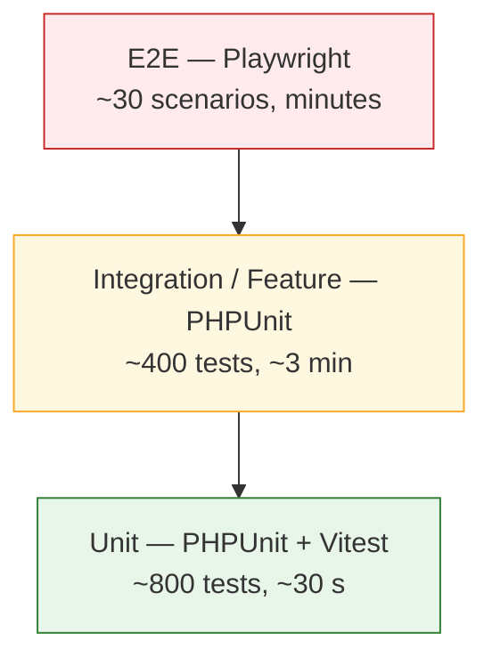

# 23 — Testing Strategy

> **Document purpose.** Define *how* RestaurantOS is tested: the test pyramid, tooling, environments,
> data management, coverage targets and CI gates. The concrete test cases live in
> [24-qa-test-plan.md](24-qa-test-plan.md); this document is the framework they run inside.

**Prerequisites:** [02-system-architecture.md](02-system-architecture.md) §4 (layer structure).

**Status:** 🟡 MVP — Planned. The repository currently contains only the two default example tests
([01](01-project-overview.md) §2).

---

## 1. Philosophy

| # | Principle |
|---|---|
| P1 | **Money and stock are tested to a higher standard than everything else.** Domain calculation classes require ≥ 95 % coverage; the rest of the system ≥ 80 %. |
| P2 | **Test behaviour, not implementation.** A test that breaks when a method is renamed but the behaviour is unchanged is a liability. |
| P3 | **Fast feedback first.** Unit tests run in seconds and gate every commit; slower suites run per pull request. |
| P4 | **Every bug becomes a test.** A fix without a regression test invites the same bug back. |
| P5 | **Tests are documentation.** A test name states the rule: `it_rejects_a_payment_that_exceeds_the_balance`. |
| P6 | **The database in tests must behave like production.** See §4 — this is the single most important environmental decision. |
| P7 | **Determinism is mandatory.** No test depends on wall-clock time, random values or execution order. |

---

## 2. The test pyramid



| Level | What it covers | Count | Runtime | Runs on |
|---|---|---|---|---|
| **Unit** | Pure domain logic: calculators, state machines, converters, allocators | ~800 | < 30 s | Every commit |
| **Integration / Feature** | HTTP endpoints through the full stack against a real MySQL | ~400 | ~3 min | Every push |
| **E2E** | Critical user journeys in a real browser | ~30 | ~8 min | Every PR, nightly |

**Why the pyramid is weighted this way.** The money and inventory logic is where correctness matters
most, and it is pure — no database, no HTTP. Those tests are cheap, so there are many. E2E tests are
expensive and flaky by nature, so they are reserved for journeys where the integration of many parts is
itself the risk.

---

## 3. Tooling

| Layer | Tool | Status |
|---|---|---|
| Backend unit and feature | **PHPUnit 12.5** | ✅ Installed |
| Backend HTTP assertions | Laravel test helpers | ✅ With framework |
| Backend mocking | Mockery | ✅ Installed |
| Backend factories | `fakerphp/faker` + model factories | ✅ Faker installed |
| Backend static analysis | PHPStan / Larastan level 6 | 🟡 |
| Backend formatting | Laravel Pint | ✅ Installed |
| Frontend unit | Vitest | 🟡 |
| Frontend component | React Testing Library | 🟡 |
| Frontend linting | oxlint | ✅ Installed |
| API mocking (frontend) | MSW | 🟡 |
| E2E | Playwright | 🟡 |
| Load | k6 | 🟡 — [25](25-performance-testing.md) |
| Contract | OpenAPI schema validation | 🟡 |
| Coverage | Xdebug/PCOV + `vitest --coverage` | 🟡 |

> **PHPUnit, not Pest.** `composer.json` includes `phpunit/phpunit ^12.5` and the existing tests are
> PHPUnit classes. The `pestphp/pest-plugin` allow-plugin entry is a framework default, not an
> installed dependency. Adding Pest is optional; if adopted, it must be a deliberate decision, not an
> accident.

---

## 4. Test database — the critical decision

**Feature tests must run against MySQL, not SQLite.**

`backend/.env.example` currently sets `DB_CONNECTION=sqlite` ([01](01-project-overview.md) §2). Using
SQLite for tests is tempting because it is fast and needs no service. It is wrong here, because the
following behaviours differ and the system depends on all of them:

| Behaviour | MySQL | SQLite | Depends on it |
|---|---|---|---|
| `CHECK` constraints | Enforced | Ignored before 3.37, differently after | [05](05-database-design.md) §8.1 |
| Generated columns in unique indexes | Supported | Limited | `role_user`, `cash_drawer_sessions` |
| `SELECT ... FOR UPDATE` | Real row locks | **No-op** | Every inventory and payment test |
| Deadlock behaviour | Error 1213 | Database-level locking | Concurrency tests |
| `FULLTEXT` search | Supported | Not supported | Product search |
| `DECIMAL` arithmetic | Exact | Stored as REAL in some paths | **Every money test** |
| Strict mode truncation | Errors | Silently coerces | Data-integrity tests |
| `utf8mb4` collation | Configurable | Fixed | Name comparison |

A concurrency test that passes on SQLite proves nothing, because `FOR UPDATE` did not lock anything.
A money test on SQLite may pass with values that would round differently in production.

| Environment | Database |
|---|---|
| Unit tests | **None** — domain classes take no database connection; a test that tries to connect fails |
| Feature tests (local) | MySQL 8 in Docker, `restaurantos_test` |
| Feature tests (CI) | MySQL 8 service container |
| E2E | MySQL 8, seeded fixture dataset |

### 4.1 Isolation

| Technique | Use |
|---|---|
| `RefreshDatabase` (transaction rollback) | Default for feature tests — fastest |
| `DatabaseMigrations` (full rebuild) | Tests that need committed data, e.g. concurrency tests using separate connections |
| Explicit truncation | Tests that must observe post-commit listeners |

**Concurrency tests cannot use transaction rollback**, because the isolation wrapper itself holds a
transaction and the two connections would never see each other. They use `DatabaseMigrations` with real
commits and clean up explicitly.

---

## 5. Test data

### 5.1 Factories

One factory per model, with states that express intent:

```text
OrderFactory
    ->pending() ->accepted() ->preparing() ->ready() ->completed() ->cancelled()
    ->unpaid() ->partiallyPaid() ->paid()
    ->forBranch($branch) ->byUser($cashier) ->forCustomer($customer)
    ->withItems(int $count) ->withProduct($product, $qty)

ProductFactory
    ->withVariants(int $n) ->withRecipe(array $ingredients) ->trackless() ->unavailableAt($branch)

IngredientFactory
    ->withStock($branch, $qty, $cost) ->lowStock($branch) ->outOfStock($branch)
```

Factory states carry the domain vocabulary, so a test reads as a scenario rather than as setup code.

### 5.2 The golden fixture

A single, deliberately small dataset used by calculation tests so that expected values are stated once:

| Entity | Value |
|---|---|
| Branch | `B1` Riverside, `Asia/Bangkok`, `THB`, business day starts `00:00` |
| Tax rate | `VAT_STD` `0.0700`, exclusive |
| Products | Cappuccino base `4.50` (variants Regular `+0.00`, Large `+1.00`); Croissant `4.00` |
| Recipe | Cappuccino: milk `0.20 l`, coffee `0.02 kg`, 0 % wastage |
| Ingredients | Milk stock unit `l` @ `1.30`; Coffee `kg` @ `18.00` |
| Golden order | Cappuccino Large × 2 + Croissant × 1, 10 % discount |
| Expected | subtotal `15.00`, discount `1.50`, tax `0.94`, **grand total `14.44`** |

These figures come from [09-business-rules.md](09-business-rules.md) §2.4 and appear in tests,
documentation and API examples identically. **Changing them requires a documented decision**, because a
change means the rounding policy changed.

### 5.3 Rules

| # | Rule |
|---|---|
| D1 | Every test creates its own data. No test depends on another's leftovers. |
| D2 | No shared mutable fixture between tests. |
| D3 | Production data is **never** used, even anonymised, in automated tests. |
| D4 | Seeders used by tests are the same seeders used in production for reference data (roles, permissions, units), so a seeder bug is caught. |
| D5 | Time is frozen with `travelTo()` in any test whose outcome depends on it. |
| D6 | Randomness is seeded, so a property-test failure is reproducible from the seed in the output. |

---

## 6. Backend test structure

```text
tests/
├── Unit/
│   ├── Domain/
│   │   ├── Pricing/{MoneyTest,OrderCalculatorTest,DiscountAllocatorTest,TaxCalculatorTest}.php
│   │   ├── Inventory/{RecipeExploderTest,UnitConverterTest,AverageCostCalculatorTest}.php
│   │   ├── Loyalty/{PointsEarnerTest,PointsRedeemerTest}.php
│   │   └── Orders/{OrderStateMachineTest,OrderNumberGeneratorTest}.php
│   └── Support/{BusinessDayTest,ApiResponseTest}.php
├── Feature/
│   ├── Auth/{LoginTest,PinLoginTest,TokenLifecycleTest,PasswordResetTest}.php
│   ├── Authorization/{RouteCoverageTest,BranchScopeTest,EscalationGuardTest,FieldVisibilityTest}.php
│   ├── Pos/{ProductBrowseTest,CartCalculateTest}.php
│   ├── Orders/{CreateOrderTest,OrderTransitionTest,CancelOrderTest,IdempotencyTest}.php
│   ├── Payments/{TakePaymentTest,SplitPaymentTest,VoidTest,RefundTest,ShiftTest}.php
│   ├── Kitchen/{TicketRoutingTest,TicketTransitionTest,StatusAggregationTest}.php
│   ├── Inventory/{DeductionTest,AdjustmentTest,CountTest,LowStockTest}.php
│   ├── Transfers/TransferLifecycleTest.php
│   ├── Loyalty/{EarnTest,RedeemTest,ReversalTest}.php
│   ├── Expenses/{ExpenseLifecycleTest,SelfApprovalTest}.php
│   ├── Reports/{SalesReportTest,ProfitReportTest,ReconciliationTest}.php
│   └── Notifications/{RecipientResolutionTest,DeduplicationTest}.php
├── Integrity/
│   ├── LedgerImmutabilityTest.php
│   ├── InventoryReconciliationTest.php
│   ├── LoyaltyReconciliationTest.php
│   └── PaymentTotalsTest.php
├── Concurrency/
│   ├── ConcurrentOrderCreationTest.php
│   ├── ConcurrentStockDeductionTest.php
│   ├── ConcurrentPaymentTest.php
│   └── ConcurrentTransitionTest.php
└── Contract/
    └── OpenApiConformanceTest.php
```

`Integrity/` and `Concurrency/` are separate suites because they are slow and need real commits. They
run on every PR but not on every commit.

---

## 7. Frontend test structure

```text
src/
├── shared/lib/__tests__/{money.test.ts,format.test.ts,date.test.ts}
├── features/pos/
│   ├── hooks/__tests__/{useCart.test.ts,useCartTotals.test.ts}
│   └── components/__tests__/{Cart.test.tsx,DiscountDialog.test.tsx}
└── shared/api/__tests__/{client.test.ts,errors.test.ts}

e2e/
├── pos-sale.spec.ts
├── split-payment.spec.ts
├── kitchen-flow.spec.ts
├── stock-transfer.spec.ts
├── permissions.spec.ts
└── reports.spec.ts
```

### 7.1 Frontend rules

| # | Rule |
|---|---|
| F1 | Money helpers are unit tested against the same golden figures as the backend, so client and server agree. |
| F2 | API responses are mocked with MSW using **real captured payloads**, not hand-written approximations that drift. |
| F3 | Components are tested through user interactions (`getByRole`, `userEvent`), never by inspecting internal state. |
| F4 | Permission-driven rendering is tested for both granted and denied cases. |
| F5 | No snapshot tests of large trees — they fail on cosmetic change and teach people to accept diffs blindly. |

---

## 8. What each level tests

### 8.1 Unit — the highest-value tests

| Class | Focus |
|---|---|
| `Money` | Construction from string and minor units; rejection of floats; arithmetic exactness; half-up rounding |
| `OrderCalculator` | Line subtotals, discount application order, tax, service charge, rounding, grand total. **The golden example is a test.** |
| `DiscountAllocator` | Pro-rata allocation sums exactly to the discount; deterministic remainder assignment |
| `TaxCalculator` | Inclusive and exclusive decomposition; zero-rate; mixed rates |
| `RecipeExploder` | Quantity × recipe ÷ yield, wastage, conversion, aggregation across lines |
| `UnitConverter` | Within-family conversion; cross-family rejection |
| `AverageCostCalculator` | Weighted average across the [14](14-inventory-workflow.md) §6 sequence; zero and negative balance cases |
| `PointsEarner` / `PointsRedeemer` | Floor behaviour, multipliers, minimums, increments, caps |
| `OrderStateMachine` | All 36 (from, to) pairs |
| `BusinessDay` | Branch-local day boundaries with a non-midnight start |

These run with **no database connection available**. A domain class that tries to query fails the test
suite, which is how the purity rule in [02](02-system-architecture.md) §4.1 is enforced.

### 8.2 Feature — the full stack

Every feature test asserts four things at minimum:

1. The **response** — status, `error_code`, and payload shape.
2. The **database** — the rows that should exist, and the rows that should not.
3. The **audit trail** — exactly one audit row with the right event and actor.
4. The **side effects** — queued jobs and notifications dispatched (or not) after commit.

```text
public function test_accepting_an_order_deducts_stock_and_creates_kitchen_tickets(): void
{
    // Arrange: branch, product with recipe, stocked ingredients, pending order
    // Act:     POST /api/v1/orders/{id}/accept
    // Assert:  200; status accepted
    //          stock_transactions has exactly 2 sale_deduction rows with the exact quantities
    //          inventories balances reduced by exactly those amounts
    //          kitchen_tickets created, one per station
    //          audit_logs has exactly one order.accepted row
    //          OrderAccepted event dispatched after commit
}
```

### 8.3 E2E — critical journeys only

| # | Journey |
|---|---|
| 1 | Complete cash sale from login to receipt |
| 2 | Split payment across two methods |
| 3 | Order through the kitchen: accept → preparing → ready → complete |
| 4 | Insufficient stock blocks a sale and shows the shortfall |
| 5 | Discount above cap triggers manager authorisation |
| 6 | Stock transfer request → approve → dispatch → receive |
| 7 | Expense submit → approve, and self-approval denied |
| 8 | Cashier cannot see cost, margin or the admin area |
| 9 | Daily sales report reconciles to the sales just made |
| 10 | Loyalty earn and redeem across two orders |

E2E tests exist to prove the parts connect. Every edge case belongs one level down, where it is cheap
and stable.

---

## 9. Coverage targets

| Area | Line coverage | Rationale |
|---|---|---|
| `app/Domain/**` | **≥ 95 %** | Money and stock arithmetic |
| `app/Services/**` | ≥ 90 % | Transactional orchestration |
| `app/Policies/**` | **100 %** | Every authorisation branch is a security boundary |
| `app/Http/Requests/**` | ≥ 90 % | Every validation rule has a negative test |
| `app/Http/Controllers/**` | ≥ 80 % | Thin by design |
| Overall backend | **≥ 80 %** | NFR-MNT-001 |
| Frontend `lib/` | ≥ 90 % | Money formatting |
| Frontend components | ≥ 70 % | Diminishing returns above this |

**Coverage is a floor, not a goal.** A hundred-percent-covered `OrderCalculator` with no assertion on
the rounding order is worthless. The golden-value and property tests are what actually establish
correctness; coverage only tells us which code was never executed.

---

## 10. CI pipeline

```mermaid
flowchart LR
    A["Push"] --> B["Lint<br/>Pint + oxlint<br/>~20 s"]
    B --> C["Static analysis<br/>PHPStan L6<br/>~40 s"]
    C --> D["Unit<br/>PHPUnit + Vitest<br/>~30 s"]
    D --> E["Feature<br/>MySQL service<br/>~3 min"]
    E --> F["Integrity + Concurrency<br/>~2 min"]
    F --> G["Contract<br/>OpenAPI<br/>~20 s"]
    G --> H["Build<br/>vite build<br/>~40 s"]
    H --> I["E2E<br/>Playwright<br/>~8 min"]
    I --> J["Security audit<br/>composer + npm<br/>~30 s"]
    J --> K["Coverage gate"]
    K --> L["Merge allowed"]
```



### 10.1 Gates

| Gate | Blocks merge | Notes |
|---|---|---|
| Pint / oxlint | ✔ | Zero warnings (NFR-MNT-002) |
| PHPStan level 6 | ✔ | |
| Unit tests | ✔ | |
| Feature tests | ✔ | |
| Integrity tests | ✔ | Ledger invariants |
| Concurrency tests | ✔ | |
| Contract conformance | ✔ | Responses validate against the OpenAPI schema |
| Migration up + rollback | ✔ | On MySQL, not SQLite |
| E2E | ✔ | Retry once for flake; a second failure blocks |
| `composer audit` / `npm audit` | ✔ | High severity only |
| Coverage thresholds | ✔ | Per §9 |
| Query-count assertions | ✔ | No endpoint above 20 queries (NFR-PERF-006) |
| Route-coverage test | ✔ | Every route declares a permission |
| Rate-literal lint | ✔ | No hard-coded financial rates in `app/Domain` ([09](09-business-rules.md) §1) |
| Load tests | ✘ | Nightly, not per PR |

### 10.2 Flake policy

A test that fails intermittently is **quarantined within 24 hours**, not re-run until it passes. A
tolerated flaky test trains the team to ignore red builds, which is worse than having no test. The
quarantine has an owner and a deadline.

---

## 11. Environments

| Environment | Purpose | Data | Who |
|---|---|---|---|
| **Local** | Development | `DemoDataSeeder` | Developers |
| **CI** | Automated gates | Factories, ephemeral | Pipeline |
| **Staging** | UAT, integration, load testing | Anonymised or synthetic; production-like volumes | QA, stakeholders |
| **Production** | Live | Real | Operations |

Configuration per environment: [27-environment-configuration.md](27-environment-configuration.md).

**Production data is never copied to a lower environment un-anonymised.** If realistic volume is needed
for load testing, it is generated, not copied ([25](25-performance-testing.md) §3).

---

## 12. Manual testing

Automation cannot cover everything. These are checklisted per release
([24](24-qa-test-plan.md) §13):

| Area | Why manual |
|---|---|
| Receipt printing | Physical thermal printer, paper width, cut behaviour |
| Touch usability | Gloved hands on a real KDS screen at real distance |
| Card terminal reconciliation | An external device the system does not integrate with |
| Cash drawer hardware | Physical opening |
| Screen legibility | Kitchen lighting and viewing distance |
| Exploratory testing | Finding what nobody thought to specify |
| Accessibility | Screen reader on back-office screens |

---

## 13. Roles and responsibilities

| Role | Responsibility |
|---|---|
| Developer | Unit and feature tests with the change; fixes broken tests before anything else |
| Reviewer | Verifies tests exist, are meaningful, and cover the negative cases |
| QA engineer | Owns [24](24-qa-test-plan.md); exploratory testing; E2E maintenance; release sign-off |
| Tech lead | Owns coverage targets, flake policy, pipeline health |

**A pull request without tests is not reviewed.** It is returned.

---

## 14. Testing anti-patterns to avoid

| Anti-pattern | Why it is harmful |
|---|---|
| Testing framework behaviour | Laravel's validator is already tested. Test *your rules*. |
| Asserting implementation details | Breaks on refactor without catching a real defect |
| Over-mocking | A service test that mocks the repository proves the mock works |
| Shared mutable fixtures | Order-dependent failures that nobody can reproduce |
| Time-dependent tests | Fails at midnight, or in a different timezone |
| Sleeping to await async work | Slow and still flaky; assert on the queue instead |
| One assertion per test taken to extremes | Twenty tests re-running the same expensive setup |
| Snapshot tests of large trees | Diffs get approved without reading |
| Testing only the happy path | Every failure path in the workflow documents is a required test |
| SQLite for feature tests | §4 — proves the wrong thing |

---

## 15. Related documents

[24-qa-test-plan.md](24-qa-test-plan.md) ·
[25-performance-testing.md](25-performance-testing.md) ·
[09-business-rules.md](09-business-rules.md) ·
[20-validation-rules.md](20-validation-rules.md) ·
[28-git-workflow.md](28-git-workflow.md) ·
[29-coding-standards.md](29-coding-standards.md)
