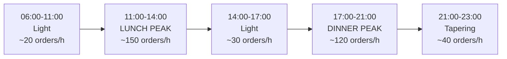

# 25 — Performance Testing

> **Document purpose.** Define the performance targets, the load profiles that represent real
> restaurant service, the test scenarios that measure them, and the bottlenecks expected in this
> particular system. Targets originate in [01](01-project-overview.md) §10 and
> [03](03-requirements.md) §3.1; this document makes them measurable.

**Status:** 🟡 MVP — Planned.

---

## 1. Why performance matters here specifically

The POS is the only screen in the system where latency has a direct commercial cost: a cashier waiting
on a spinner is a queue growing behind a paying customer. The performance requirements are therefore
asymmetric — the sell path is tightly bounded, while a month-end report may take seconds.

| Path | Tolerance | Why |
|---|---|---|
| POS interactions | **Very low** | A customer is standing there |
| KDS polling | Low, but at high frequency | Every screen, every 5 s |
| Back-office CRUD | Moderate | One person, no queue |
| Reports | High | Run occasionally, by one person |
| Exports | Very high (async) | Fire and forget |

---

## 2. Targets

| ID | Operation | Target | Measured as |
|---|---|---|---|
| NFR-PERF-001 | POS product browse, 2 000 products | p95 < 250 ms | Server response time |
| NFR-PERF-002 | `POST /orders`, 10 concurrent terminals | p95 < 400 ms | Server response time |
| NFR-PERF-003 | `POST /payments` | p95 < 500 ms | Server response time |
| NFR-PERF-004 | KDS poll | p95 < 250 ms | Server response time |
| NFR-PERF-005 | Monthly report, 1 branch | < 3 s | Server response time |
| NFR-PERF-006 | Any endpoint | ≤ 20 SQL queries | Query counter |
| NFR-PERF-007 | SPA first contentful paint | < 1.5 s on a mid-range tablet over 4G | Lighthouse |
| NFR-PERF-008 | Sustained throughput | 150 orders/hour/branch × 15 branches | Soak test |
| — | Add to cart (perceived) | < 100 ms | Client-side, optimistic |
| — | Error rate under target load | < 0.1 % | Non-2xx excluding expected 4xx |
| — | Database CPU under target load | < 60 % | Host metric |

**Percentiles, not averages.** An average of 200 ms with a p99 of 4 s means one cashier in a hundred
waits four seconds — which is the one who complains. p95 and p99 are reported for every scenario.

---

## 3. Test environment

| Aspect | Requirement |
|---|---|
| Environment | **Staging**, sized identically to production |
| Database | MySQL 8, same instance class, same configuration, same indexes |
| Cache | Redis, same configuration |
| Network | Realistic latency between tiers; not all-on-one-host |
| Data volume | **Production-scale**, generated (§3.1) |
| Warm-up | 2 minutes discarded before measurement |
| Isolation | No other load on the environment during a run |
| Repeatability | 3 runs; the median reported; variance > 15 % invalidates the run |

**Never load-test production.** And never copy production data to staging un-anonymised
([23](23-testing-strategy.md) §11).

### 3.1 Synthetic data volumes

Generated to represent one year of operation at target scale:

| Table | Rows |
|---|---|
| `branches` | 15 |
| `users` | 200 |
| `products` | 2 000 |
| `product_variants` | 4 000 |
| `ingredients` | 500 |
| `recipes` / `recipe_items` | 2 500 / 10 000 |
| `customers` | 50 000 |
| `orders` | 800 000 |
| `order_items` | 3 000 000 |
| `payments` | 900 000 |
| `stock_transactions` | **8 000 000** |
| `loyalty_transactions` | 400 000 |
| `audit_logs` | **6 000 000** |

The two eight-figure tables are the ones that determine whether reporting and inventory queries hold
up. Testing against 10 000 rows proves nothing about a system that will hold eight million.

---

## 4. Load profiles

Real restaurant traffic is not uniform — it is two sharp peaks with a long quiet tail.



| Profile | Purpose | Duration | Load |
|---|---|---|---|
| **Smoke** | Sanity check before a longer run | 2 min | 1 terminal |
| **Baseline** | Normal trading | 30 min | 3 terminals/branch, 40 orders/h |
| **Peak** | Lunch rush | 30 min | 10 terminals/branch, 150 orders/h |
| **Stress** | Find the breaking point | Ramp to failure | Increase until errors > 1 % |
| **Soak** | Leaks and degradation | 8 h | Baseline load |
| **Spike** | Sudden burst (coach party) | 5 min | 0 → 300 orders/h in 30 s |
| **Multi-branch** | Full production scale | 30 min | 15 branches × peak |

### 4.1 Concurrent-user model per branch at peak

| Actor | Count | Behaviour |
|---|---|---|
| POS terminals | 10 | Browse, calculate, create, pay, complete |
| KDS screens | 4 | Poll every 5 s |
| Back office | 2 | Occasional CRUD and reports |

**Request mix at peak, per branch:**

| Endpoint | Requests/min | Share |
|---|---|---|
| `GET /kitchen/tickets` | 48 | 36 % |
| `GET /pos/products` | 25 | 19 % |
| `POST /pos/cart/calculate` | 30 | 23 % |
| `POST /orders` | 2.5 | 2 % |
| `POST /orders/{id}/accept` | 2.5 | 2 % |
| `POST /payments` | 3 | 2 % |
| Other reads | 20 | 15 % |

> **The KDS poll is the single largest source of requests in the system** — more than every write
> combined. Any inefficiency there multiplies by 720 requests/minute across 15 branches. It is the
> first thing to profile.

---

## 5. Scenarios

### 5.1 Product browse — NFR-PERF-001

```text
Setup:   2 000 products, 60 categories, 15 branches, warm cache
Load:    50 VUs, 30 s think time between category switches
Steps:   GET /pos/categories
         GET /pos/products?category_id=X   (random category)
         GET /pos/products?search=<term>   (30 % of iterations)
Assert:  p95 < 250 ms, p99 < 500 ms, error rate < 0.1 %
Watch:   cache hit ratio > 90 %, no full table scans
```

### 5.2 Order creation — NFR-PERF-002

The most complex write in the system: price resolution, tax, recipe explosion, stock check, sequence
allocation, and audit — all in one transaction.

```text
Setup:   10 VUs per branch, ample stock
Steps:   POST /pos/cart/calculate  (2-5 random lines)
         POST /orders              (with Idempotency-Key)
         POST /orders/{id}/accept
Assert:  create p95 < 400 ms; accept p95 < 400 ms
         zero duplicate order numbers
         zero deadlock escapes to 5xx
Watch:   lock wait time, transaction duration < 100 ms, deadlock retry count
```

**Contention design.** Two variants are run:

| Variant | Stock setup | Purpose |
|---|---|---|
| Low contention | Every terminal sells a different product | Baseline throughput |
| **High contention** | All terminals sell the same product sharing one ingredient | Row-lock behaviour — the realistic lunch case |

The high-contention variant is the one that matters: at lunch, everyone orders the same three things.

### 5.3 Payment — NFR-PERF-003

```text
Steps:   POST /orders/{id}/payments  (70 % single, 30 % split into two)
Assert:  p95 < 500 ms; zero overpayments accepted; paid_total always reconciles
Watch:   order row lock duration
```

### 5.4 KDS polling — NFR-PERF-004

The highest-frequency scenario.

```text
Setup:   15 branches × 4 screens = 60 pollers, 200 active tickets per branch
Load:    every 5 s per screen, sustained 30 min
Assert:  p95 < 250 ms, p99 < 400 ms
         payload < 20 kB with `since` delta
         zero writes on the poll path
Watch:   idx_kt_branch_status_queued used; query count == 2 per request
```

### 5.5 Reports — NFR-PERF-005

```text
Setup:   full 1-year dataset
Cases:   daily sales, 1 day, 1 branch          -> < 500 ms
         daily sales, 1 month, 1 branch        -> < 3 s
         profit, 1 month, 1 branch             -> < 3 s
         stock movement, 1 month, 1 ingredient -> < 2 s
         product performance, 1 month          -> < 3 s
         daily sales, 1 month, 15 branches     -> < 8 s
Assert:  targets met cold (cache cleared) and warm
Watch:   rows examined vs rows returned; no filesort on large tables
```

### 5.6 Soak — 8 hours

```text
Load:    baseline, 8 h continuous
Assert:  p95 at hour 8 within 20 % of hour 1
         PHP-FPM memory flat
         no connection-pool growth
         queue depth returns to zero between peaks
         zero INV-1 violations at the end
Watch:   memory leaks, connection leaks, cache growth, log volume
```

The final INV-1 check is the important one: eight hours of concurrent selling is the most realistic
test of whether the inventory ledger stays consistent under sustained load.

### 5.7 Stress — to failure

```text
Ramp:    increase VUs until error rate > 1 % or p95 > 2 s
Record:  the breaking point, the first component to saturate, and the failure mode
Assert:  failure is graceful — 429/503 with Retry-After, never data corruption
         after load is removed, the system recovers without intervention
         INV-1 holds even at the breaking point
```

**How a system fails matters more than when.** Shedding load with `429` is acceptable; corrupting a
stock balance is not.

---

## 6. Expected bottlenecks

Ranked by likelihood, based on the architecture.

| # | Bottleneck | Symptom | Mitigation |
|---|---|---|---|
| 1 | **KDS poll volume** | High baseline DB load with no writes | Covering index, `since` delta, server-controlled interval, short-TTL cache |
| 2 | **Inventory row locks at peak** | Lock waits, deadlocks, slow accepts | Consistent lock ordering, aggregation before locking, short transactions |
| 3 | **`stock_transactions` growth** | Slow movement reports | `idx_st_branch_ingredient_occurred`, `balance_after` avoiding aggregation, partitioning 🔵 |
| 4 | **Report aggregation** | Slow month-end queries | `business_date` index, caching, range cap, async export, read replica 🔵 |
| 5 | **N+1 in list endpoints** | Query count explodes with page size | Eager loading, CI query-count assertions |
| 6 | **Recipe explosion per line** | Slow accepts on large orders | Aggregate by ingredient before locking; cache recipes per request |
| 7 | **`audit_logs` write volume** | Write amplification on every mutation | Single insert per operation; partitioning 🔵 |
| 8 | **Permission resolution** | Extra queries on every request | Redis cache keyed by a version counter |
| 9 | **`daily_sequences` contention** | Serialisation at order creation | Single-statement atomic increment, held for microseconds |
| 10 | **Product search** | Slow `LIKE` scans | FULLTEXT index, minimum term length |

### 6.1 The two that will actually bite

**KDS polling**, because it is 36 % of all traffic and grows linearly with screens rather than with
sales. Doubling branches doubles it regardless of how busy they are.

**Inventory locking**, because peak service is precisely the high-contention case: ten terminals
selling the same popular item, all needing the same milk row. This is why §5.2 runs a dedicated
high-contention variant rather than assuming random product distribution.

---

## 7. Tooling and metrics

| Purpose | Tool |
|---|---|
| Load generation | k6 (scripted scenarios, thresholds as pass/fail) |
| Frontend | Lighthouse CI, Web Vitals |
| Query analysis | MySQL slow query log, `EXPLAIN ANALYZE`, `performance_schema` |
| APM | Laravel Telescope (staging only), or an APM agent |
| Infrastructure | CPU, memory, disk I/O, connections, Redis hit ratio |

### 7.1 Metrics captured per run

| Category | Metrics |
|---|---|
| Response | p50, p95, p99, max, per endpoint |
| Throughput | Requests/s, orders/min |
| Errors | Rate by status code, distinguishing expected 4xx from 5xx |
| Database | QPS, slow queries, lock waits, deadlocks, connections, buffer-pool hit ratio |
| Cache | Hit ratio, evictions, memory |
| Queue | Depth, processing time, failures |
| Host | CPU, memory, disk I/O, network |
| **Integrity** | INV-1, C6, C7 verified before and after every run |

The integrity row is unusual for a performance suite and deliberate: a load test that meets its latency
target while corrupting stock has failed.

### 7.2 k6 thresholds as gates

```text
thresholds: {
  'http_req_duration{endpoint:pos_products}':  ['p(95)<250'],
  'http_req_duration{endpoint:order_create}':  ['p(95)<400'],
  'http_req_duration{endpoint:payment}':       ['p(95)<500'],
  'http_req_duration{endpoint:kds_poll}':      ['p(95)<250'],
  'http_req_failed':                           ['rate<0.001'],
  'checks':                                    ['rate>0.999'],
}
```

Encoding targets as thresholds makes the run pass or fail objectively, rather than producing a graph
someone has to interpret.

---

## 8. Frontend performance

| Metric | Target | Notes |
|---|---|---|
| First Contentful Paint | < 1.5 s | Mid-range tablet, 4G |
| Largest Contentful Paint | < 2.5 s | |
| Time to Interactive | < 3 s | |
| Cumulative Layout Shift | < 0.1 | A shifting POS grid causes mis-taps |
| Initial JS bundle | < 300 kB gzipped | Route-based code splitting |
| Add to cart (perceived) | < 100 ms | Optimistic local update |
| Cart recalculation debounce | 250 ms | Holding `+` must not fire 20 requests |

**CLS matters more than usual here.** A cashier taps by muscle memory; a grid that reflows after load
causes wrong items to be added, which is a correctness problem disguised as a cosmetic one.

---

## 9. Cadence

| Test | When |
|---|---|
| Smoke | Every deployment to staging |
| Baseline | Weekly, and before every release |
| Peak | Before every release |
| Stress | Before a major release, or after an architectural change |
| Soak | Monthly, and before a major release |
| Spike | Before a major release |
| Frontend (Lighthouse) | Every PR |
| Query-count assertions | Every PR |

Load tests do **not** gate individual pull requests — they are too slow and too noisy. Query-count
assertions do, because an N+1 introduced in a PR is cheap to catch there and expensive to find later.

---

## 10. Results and regression tracking

Every run records: date, commit SHA, environment, data volume, profile, and the full metric set. Results
are stored so trends are visible across releases.

**Performance regression policy**

| Change vs the last release | Action |
|---|---|
| p95 worse by > 20 % on any target endpoint | **Blocks release** until explained or fixed |
| p95 worse by 10–20 % | Investigate; may ship with a recorded justification |
| Query count increased on any endpoint | Investigate — usually an accidental N+1 |
| Error rate above target | Blocks release |
| Any integrity violation | **Blocks release unconditionally** |

---

## 11. Related documents

[01-project-overview.md](01-project-overview.md) §10 ·
[02-system-architecture.md](02-system-architecture.md) §7 ·
[03-requirements.md](03-requirements.md) §3.1 ·
[05-database-design.md](05-database-design.md) §7 ·
[13-kitchen-workflow.md](13-kitchen-workflow.md) §15 ·
[18-reporting.md](18-reporting.md) §8 ·
[26-deployment.md](26-deployment.md)
