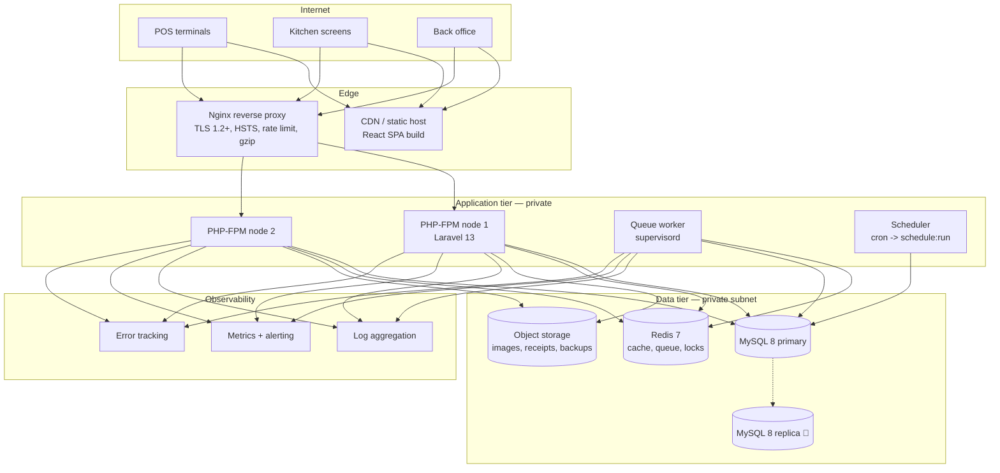
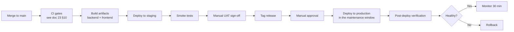
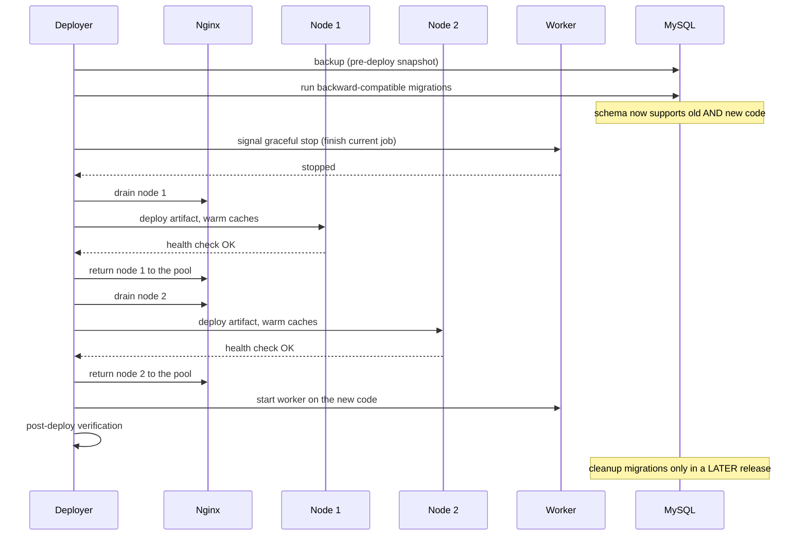

# 26 — Deployment

> **Document purpose.** Define how RestaurantOS is built, released and operated: infrastructure
> topology, the deployment pipeline, migration safety, monitoring, backup and rollback. Environment
> variables and configuration values live in
> [27-environment-configuration.md](27-environment-configuration.md).

**Status:** 🟡 MVP — Planned. Nothing described here is provisioned yet.

---

## 1. Deployment constraints unique to this system

| Constraint | Consequence |
|---|---|
| **The POS is revenue-critical during service hours** | Deployments happen outside service hours. A failed deploy at 12:30 stops the business taking money. |
| **Restaurants trade late** | The maintenance window is narrow: typically 02:00–05:00 branch-local. |
| **Multiple timezones** | A single global window may be mid-service for one branch. Deployments are scheduled against the **latest** closing branch. |
| **Kitchen screens are unattended** | A deploy that logs the KDS out mid-service is an outage even if the API is healthy. |
| **Money is in flight** | A deploy must never interrupt an open transaction. Graceful worker shutdown is mandatory. |

---

## 2. Topology



### 2.1 Component sizing (15 branches)

| Component | MVP | Notes |
|---|---|---|
| Nginx | 1 node, 2 vCPU / 2 GB | TLS termination, static caching |
| PHP-FPM | 2 nodes, 4 vCPU / 8 GB | Horizontally scalable — the API is stateless |
| Queue worker | 1 node, 2 vCPU / 4 GB | Notifications, exports, reconciliation |
| Scheduler | Co-located with the worker | Single instance only — see §7.1 |
| MySQL | 1 primary, 4 vCPU / 16 GB, SSD | Buffer pool ≈ 70 % of RAM |
| Redis | 1 node, 2 vCPU / 4 GB | `maxmemory-policy allkeys-lru` for cache; a **separate database index** for queues, which must not be evicted |
| Object storage | Managed | Versioning on |

> **Redis separation matters.** If queue jobs share an LRU-evicting keyspace with the cache, a cache
> spike silently discards queued notifications. Cache and queue use different Redis databases with
> different eviction policies.

### 2.2 Statelessness

The API holds no session state ([02](02-system-architecture.md) §1), so:

- any node can serve any request — no sticky sessions;
- nodes can be added or removed without draining sessions;
- a node failure loses only in-flight requests, which clients retry with their idempotency keys.

**Nothing may be written to a node's local disk** except logs (which go to stdout). Uploads go to object
storage; cache and queues to Redis; sessions do not exist.

---

## 3. Environments

| Environment | Purpose | Data | Access |
|---|---|---|---|
| **Local** | Development | Demo seed | Developer |
| **CI** | Automated gates | Factories, ephemeral | Pipeline |
| **Staging** | UAT, load testing, migration rehearsal | Anonymised or synthetic, production-scale | Team + stakeholders |
| **Production** | Live | Real | Operations only |

Staging must match production in version, configuration shape and data volume. A migration that has not
run against production-scale data on staging has not been tested ([25](25-performance-testing.md) §3).

---

## 4. Build

### 4.1 Backend

```bash
composer install --no-dev --optimize-autoloader --no-interaction
php artisan config:cache
php artisan route:cache
php artisan event:cache
php artisan view:cache
```

`config:cache` means **`env()` returns null outside config files** in production. Every environment
variable must be read through a config file, never via `env()` in application code
([27](27-environment-configuration.md) §3). This is the single most common Laravel production bug.

### 4.2 Frontend

```bash
cd Frontend
npm ci
npm run build          # tsc -b && vite build
```

Output is static and deployed to the CDN. Assets are content-hashed and cached immutably; `index.html`
is never cached, so a new build is picked up on the next load.

**Prerequisite** ([02](02-system-architecture.md) §5.2): Tailwind must be moved from the repository-root
`package.json` into `Frontend/package.json` and registered in `Frontend/vite.config.ts` before the
build produces styled output.

### 4.3 Artifacts

One immutable artifact per commit, promoted unchanged through environments. **The same artifact tested
on staging is the artifact deployed to production** — rebuilding for production means deploying
something that was never tested.

---

## 5. Pipeline



**Production deployment requires explicit human approval.** No automatic promotion — the window
matters too much.

---

## 6. Zero-downtime deployment



### 6.1 Migration safety

**Rule M-DEPLOY:** a migration in release *N* must be compatible with the code of release *N−1*, because
during a rolling deploy both versions run simultaneously.

| Change | Safe in one release? | Procedure |
|---|---|---|
| Add a nullable column | ✔ | Single release |
| Add a table | ✔ | Single release |
| Add an index | ✔ | `ALGORITHM=INPLACE, LOCK=NONE` |
| Add a non-nullable column | ✘ | Three steps: add nullable → backfill → set not-null |
| Rename a column | ✘ | Add new → dual-write → backfill → switch reads → drop old |
| Drop a column | ✘ | Stop writing (release N) → drop (release N+1) |
| Change a column type | ✘ | Add new → migrate → switch → drop |
| Add a foreign key | ⚠ | Verify no orphans first; may lock |
| Add a `CHECK` | ⚠ | Verify existing rows satisfy it first |

**Long-running migrations are run separately from the deploy**, in the maintenance window, with the
application in maintenance mode if necessary. A migration that locks `orders` for 90 seconds during
service is an outage.

### 6.2 Graceful worker shutdown

Workers must finish the current job, not be killed mid-flight:

```bash
php artisan queue:work --stop-when-empty --max-time=3600 --tries=3
# deployment sends SIGTERM; the worker completes its current job and exits
```

A worker killed mid-job leaves the job to retry, which is safe for idempotent jobs and dangerous for
any that are not. All jobs in RestaurantOS are written to be idempotent for exactly this reason.

---

## 7. Scheduled tasks

```bash
* * * * * cd /var/www/restaurantos && php artisan schedule:run >> /dev/null 2>&1
```

| Task | Schedule | Purpose |
|---|---|---|
| `CheckLowStock` | Every 15 min | Catch threshold crossings missed by events |
| `ExpireLoyaltyPoints` 🔵 | Daily 02:00 | Write `expire` ledger rows |
| `ReconcileInventoryBalances` | Daily 03:00 | INV-1 verification |
| `ReconcileLoyaltyBalances` | Daily 03:15 | C7 verification |
| `ReconcileOrderTotals` | Daily 03:30 | C5 verification |
| `ReconcileOrderPaymentTotals` | Hourly | C6 verification |
| `CloseStaleDrawerSessions` | Daily 04:00 | Notify on sessions open > 24 h |
| `FlagStaleOrders` | Hourly | Orders open beyond threshold |
| `FlagOverdueTransfers` | Daily 06:00 | In transit past expected arrival |
| `PruneExpiredTokens` | Daily 04:30 | Attack-surface reduction |
| `PruneReadNotifications` | Weekly | Rows older than 90 days |
| `GenerateDailySnapshots` 🔵 | Daily 04:00 | Report pre-aggregation |
| `DatabaseBackup` | Daily 01:00 + hourly incremental | §9 |

### 7.1 Single-scheduler rule

The scheduler must run on **exactly one** node. Two nodes running `schedule:run` produce two
reconciliation reports, two backup jobs and duplicate notifications. Enforced with
`->onOneServer()` (which requires a shared cache lock) **and** by only installing the cron entry on one
host.

---

## 8. Observability

### 8.1 Logging

| Rule | Detail |
|---|---|
| Format | Structured JSON, one line per entry |
| Destination | stdout, collected by the platform |
| Correlation | `request_id` on every line ([21](21-error-handling.md) §7.2) |
| Redaction | Applied by a log processor, not per call site |
| Retention | By level, [21](21-error-handling.md) §7.1 |
| **Never** | Passwords, PINs, tokens, card-shaped numbers |

### 8.2 Health endpoints

| Endpoint | Checks | Used by |
|---|---|---|
| `GET /api/health` | Process alive. No dependencies. | Load balancer |
| `GET /api/health/ready` | Database, Redis, storage reachable; migrations current | Deployment gate |
| `GET /api/health/detailed` | Queue depth, failed jobs, last reconciliation, disk | Monitoring (`system.view_health`) |

`/api/health` deliberately checks nothing else: if the database is briefly unreachable, removing every
node from the pool makes the outage total rather than partial.

### 8.3 Alerts

| Alert | Threshold | Severity |
|---|---|---|
| API 5xx rate | > 1 % over 5 min | Critical |
| p95 response time | > 1 s over 5 min | Warning |
| Database connections | > 80 % of max | Warning |
| Database replication lag 🔵 | > 30 s | Warning |
| Redis memory | > 85 % | Warning |
| Queue depth | > 1 000 | Warning |
| Failed jobs | > 10 in 1 h | Critical |
| Disk usage | > 80 % | Warning |
| TLS certificate expiry | < 30 days | Warning |
| **Reconciliation drift** | Any | **Critical** |
| **Negative stock** | Any | **Critical** |
| `configuration_missing` | Any | **Critical** |
| Failed logins | > 50 in 5 min | Warning (security) |
| Backup failure | Any | **Critical** |

The three integrity alerts are the ones that page a human at night. Latency degrades service; a
reconciliation drift means the numbers are wrong.

---

## 9. Backup and recovery

| Aspect | Policy |
|---|---|
| Full backup | Daily 01:00, retained 30 days |
| Incremental | Hourly (binlog), retained 7 days |
| **RPO** | ≤ 15 minutes |
| **RTO** | ≤ 1 hour |
| Storage | Object storage, encrypted, separate credentials from the application |
| Off-site | Replicated to a second region |
| Monthly archive | Retained 7 years (financial records, NFR-CMP-001) |
| **Restore drill** | **Quarterly**, to a scratch environment, timed and recorded |

**A backup that has never been restored is not a backup.** The quarterly drill measures actual RTO
against the target and is a release-checklist item.

### 9.1 Recovery scenarios

| Scenario | Procedure |
|---|---|
| Single node failure | Load balancer removes it; capacity reduced; replace |
| Database failure | Restore from the latest full + binlogs; verify INV-1, C6, C7 before reopening |
| Corrupted inventory balances | **Rebuild from the ledger** — `stock_transactions` is the source of truth, so balances are always recoverable without a restore |
| Corrupted loyalty balances | Same, from `loyalty_transactions` |
| Bad deployment | Rollback, §10 |
| Data loss from a bad migration | Restore to a point in time before it |
| Ransomware / total loss | Restore from off-site; rotate every credential |

The third and fourth rows are why the ledgers are append-only. Losing a derived balance is an
inconvenience; losing the ledger is unrecoverable.

---

## 10. Rollback

| Trigger | Action |
|---|---|
| Health check fails post-deploy | Automatic rollback |
| 5xx rate > 5 % within 15 min | Automatic rollback |
| Data integrity alert | **Immediate rollback + investigation** |
| Functional defect found in UAT | Rollback, fix, redeploy |

### 10.1 Procedure

```text
1. Redeploy the previous artifact to all nodes
2. Restart workers on the previous code
3. Verify health and error rate
4. Assess the schema:
     - backward-compatible migration  -> leave in place (old code tolerates it)
     - incompatible migration         -> run the down migration, having verified data safety
5. Verify INV-1, C6, C7
6. Post-incident review
```

**Schema rollback is the dangerous part.** It is avoided by rule M-DEPLOY: because every migration is
backward-compatible with the previous release, a code rollback almost never requires a schema rollback.

### 10.2 Maintenance mode

```bash
php artisan down --render="errors::503" --retry=60 --secret=<token>
# ... work ...
php artisan up
```

Used only for incompatible migrations or emergency work. The secret token allows the operator through
for verification while the public sees a maintenance page.

---

## 11. First deployment checklist

For the initial production release, in order.

**Infrastructure**

- [ ] MySQL 8 provisioned, `utf8mb4`, strict SQL mode, private subnet
- [ ] Redis provisioned, separate databases for cache and queue
- [ ] Object storage with private ACL and versioning
- [ ] TLS certificate installed, auto-renewal verified
- [ ] Firewall: only the proxy is publicly reachable

**Application**

- [ ] `.env` populated from [27](27-environment-configuration.md); **`DB_CONNECTION=mysql`**, not the sqlite default
- [ ] `APP_KEY` generated
- [ ] `APP_DEBUG=false`, `APP_ENV=production`
- [ ] Laravel Sanctum installed and configured
- [ ] Config, route and event caches built
- [ ] Migrations run
- [ ] `PermissionSeeder`, `RoleSeeder`, `UnitSeeder` run
- [ ] Super Admin created from environment variables (**no default password**)
- [ ] **Tax rates configured** — the system will not price orders without them
- [ ] Loyalty rules configured, or loyalty deliberately left disabled
- [ ] Branches, categories, products, ingredients, recipes loaded
- [ ] `DemoDataSeeder` **not** run

**Operations**

- [ ] Queue worker running under supervisord with graceful shutdown
- [ ] Scheduler cron on exactly one node
- [ ] Log aggregation receiving structured logs
- [ ] All alerts in §8.3 configured
- [ ] Backup job verified by an actual restore
- [ ] Health endpoints responding

**Verification**

- [ ] Log in as Super Admin
- [ ] Complete one real sale end to end
- [ ] Confirm stock deducted correctly
- [ ] Confirm the receipt prints
- [ ] Confirm the KDS receives the ticket
- [ ] Confirm the daily sales report reconciles
- [ ] Confirm an audit row exists for the sale

---

## 12. Security in deployment

| Control | Detail |
|---|---|
| Secrets | Environment or a secret manager; **never** in the repository ([27](27-environment-configuration.md) §7) |
| Least privilege | Application DB user has no `DROP`/`ALTER`, and no `UPDATE`/`DELETE` on ledger tables; migrations run as a separate user |
| Network | Database and Redis unreachable from the internet |
| SSH | Key-only, bastion host, no root login |
| Debug lockout | Application refuses to boot with `APP_DEBUG=true` and `APP_ENV=production` |
| Immutable artifacts | Deploy the tested artifact; no in-place edits on servers |
| Audit | Every deployment recorded: who, when, which commit |
| Dependency scanning | `composer audit` and `npm audit` gate the build |

---

## 13. Testing considerations

| Area | Test |
|---|---|
| Migration safety | `migrate` then `migrate:rollback` on MySQL at production scale |
| Backward compatibility | Run release N−1 code against release N schema; assert no errors |
| Zero downtime | Deploy under load; assert zero failed requests |
| Graceful shutdown | Send SIGTERM mid-job; assert completion, not loss |
| Health endpoints | Each returns correctly with dependencies up and down |
| Rollback | Full rehearsal on staging, timed |
| Restore | Quarterly drill; measure against RTO |
| Balance rebuild | Corrupt a balance deliberately; rebuild from the ledger; assert exact recovery |
| Scheduler singleton | Two nodes running `schedule:run`; assert each task executes once |
| Config cache | Assert no `env()` call outside config files (static check) |
| Debug lockout | Boot with the forbidden combination; assert failure |

---

## 14. Related documents

[02-system-architecture.md](02-system-architecture.md) §11 ·
[05-database-design.md](05-database-design.md) §10 ·
[22-security.md](22-security.md) ·
[25-performance-testing.md](25-performance-testing.md) ·
[27-environment-configuration.md](27-environment-configuration.md) ·
[30-troubleshooting.md](30-troubleshooting.md)
