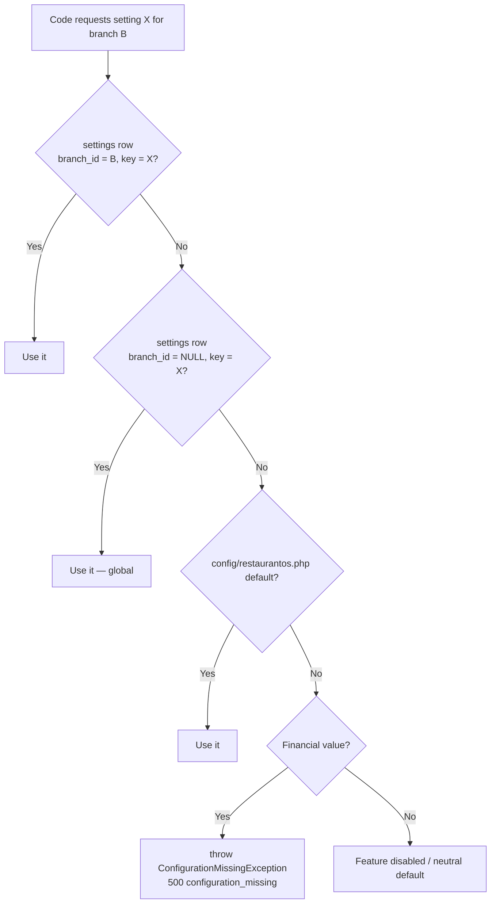

# 27 — Environment Configuration

> **Document purpose.** Catalogue every environment variable and database-backed setting, define the
> resolution order between them, and state which values must be set per deployment. This document is
> the **authoritative source for configuration keys**.

**Prerequisites:** [09-business-rules.md](09-business-rules.md) §1 (no hard-coded rates),
[26-deployment.md](26-deployment.md).

**Status:** 🟡 MVP — Planned. `backend/.env.example` currently contains only the Laravel defaults and
targets SQLite ([01](01-project-overview.md) §2).

---

## 1. Two kinds of configuration

| | Environment variables | Database settings |
|---|---|---|
| **Stored in** | `.env` / secret manager | `settings` table |
| **Changed by** | Deployment | Admin, at runtime |
| **Scope** | Whole instance | Global or per branch |
| **Examples** | DB credentials, app key, mail host | Tax rate, discount caps, loyalty rates |
| **Requires restart** | Yes (config cache) | No |
| **Audited** | Deployment record | `audit_logs` |

**The dividing line:** if a *business user* should be able to change it without a deployment, it is a
database setting. If it is infrastructure or a secret, it is an environment variable.

Tax rates, discount thresholds and loyalty rates are **database settings** — a restaurant group must be
able to change a tax rate on the day the law changes, without a release.

---

## 2. Environment variables

### 2.1 Application

| Variable | Local | Staging | Production | Notes |
|---|---|---|---|---|
| `APP_NAME` | `RestaurantOS` | `RestaurantOS` | `RestaurantOS` | Appears on receipts |
| `APP_ENV` | `local` | `staging` | `production` | |
| `APP_KEY` | generated | generated | generated | **Unique per environment.** Rotating it invalidates encrypted data |
| `APP_DEBUG` | `true` | `false` | **`false`** | Boot fails if `true` in production |
| `APP_URL` | `http://localhost:8000` | staging URL | production URL | Used in signed URLs |
| `APP_TIMEZONE` | `UTC` | `UTC` | **`UTC`** | Always UTC ([01](01-project-overview.md) A10); branch timezones are per-branch data |
| `APP_LOCALE` | `en` | `en` | `en` | |

### 2.2 Database

| Variable | Local | Production | Notes |
|---|---|---|---|
| `DB_CONNECTION` | `mysql` | `mysql` | ⚠️ **`.env.example` currently says `sqlite` and must be changed** |
| `DB_HOST` | `127.0.0.1` | private host | Never a public address |
| `DB_PORT` | `3306` | `3306` | |
| `DB_DATABASE` | `restaurantos` | `restaurantos` | |
| `DB_USERNAME` | `restaurantos` | `restaurantos_app` | **Not** `root` |
| `DB_PASSWORD` | — | secret | Never in the repository |
| `DB_CHARSET` | `utf8mb4` | `utf8mb4` | |
| `DB_COLLATION` | `utf8mb4_unicode_ci` | `utf8mb4_unicode_ci` | |
| `DB_STRICT_MODE` | `true` | `true` | Silent truncation of a money column is unacceptable |
| `DB_TEST_DATABASE` | `restaurantos_test` | — | **MySQL, not SQLite** ([23](23-testing-strategy.md) §4) |

### 2.3 Cache, queue, session

| Variable | Local | Production | Notes |
|---|---|---|---|
| `CACHE_STORE` | `redis` | `redis` | Framework default is `database` |
| `QUEUE_CONNECTION` | `redis` | `redis` | |
| `SESSION_DRIVER` | `array` | `array` | API is stateless — no sessions |
| `REDIS_HOST` | `127.0.0.1` | private host | |
| `REDIS_PASSWORD` | — | secret | Required in production |
| `REDIS_CACHE_DB` | `1` | `1` | LRU eviction |
| `REDIS_QUEUE_DB` | `2` | `2` | **No eviction** — jobs must not be discarded |

### 2.4 Authentication

| Variable | Default | Notes |
|---|---|---|
| `SANCTUM_EXPIRATION` | `720` | Minutes. Absolute token lifetime |
| `SANCTUM_TOKEN_PREFIX` | `rosat_` | Enables secret scanners |
| `AUTH_IDLE_TIMEOUT_POS` | `30` | Minutes |
| `AUTH_IDLE_TIMEOUT_KDS` | `0` | `0` = no idle expiry ([08](08-authentication-authorization.md) §3.2) |
| `AUTH_IDLE_TIMEOUT_OFFICE` | `60` | Minutes |
| `AUTH_MAX_TOKENS_PER_USER` | `10` | Oldest pruned at login |
| `AUTH_LOCKOUT_ATTEMPTS` | `5` | |
| `AUTH_LOCKOUT_MINUTES` | `15` | Doubles on repeat, capped at 4 h |
| `BCRYPT_ROUNDS` | `12` | Minimum 12 (NFR-SEC-002) |
| `PASSWORD_MIN_LENGTH` | `12` | |
| `PASSWORD_CHECK_COMPROMISED` | `true` | Breach-corpus check |

### 2.5 Bootstrap credentials

| Variable | Notes |
|---|---|
| `SUPER_ADMIN_NAME` | Required by `SuperAdminSeeder` |
| `SUPER_ADMIN_EMAIL` | Required |
| `SUPER_ADMIN_PASSWORD` | **Required. The seeder fails if unset.** There is no shipped default password |

> **Why the seeder fails rather than defaulting.** A default admin password that reaches production is
> the most common way a system of this kind is compromised. Failing the seed is loud; a default is
> silent.

### 2.6 Storage and mail

| Variable | Local | Production |
|---|---|---|
| `FILESYSTEM_DISK` | `local` | `s3` |
| `AWS_ACCESS_KEY_ID` / `AWS_SECRET_ACCESS_KEY` | — | secret |
| `AWS_BUCKET` / `AWS_DEFAULT_REGION` | — | set |
| `SIGNED_URL_TTL_MINUTES` | `15` | `15` |
| `MAIL_MAILER` | `log` | `smtp` |
| `MAIL_HOST` / `MAIL_PORT` / `MAIL_USERNAME` / `MAIL_PASSWORD` | — | set |
| `MAIL_FROM_ADDRESS` / `MAIL_FROM_NAME` | set | set |

### 2.7 Application behaviour

Instance-wide switches. Business rates are **not** here — they are database settings (§4).

| Variable | Default | Notes |
|---|---|---|
| `API_RATE_LIMIT_AUTH` | `5,15` | Attempts, minutes |
| `API_RATE_LIMIT_POS_WRITE` | `120` | Per minute per user |
| `API_RATE_LIMIT_READ` | `300` | Per minute per user |
| `API_RATE_LIMIT_REPORT` | `10` | Per minute per user |
| `API_RATE_LIMIT_EXPORT` | `3` | Per minute per user |
| `KDS_POLL_INTERVAL_SECONDS` | `5` | Returned to clients; server can raise under load |
| `REPORTS_MAX_RANGE_DAYS` | `366` | |
| `IDEMPOTENCY_TTL_HOURS` | `24` | |
| `UPLOAD_MAX_MB_IMAGE` | `5` | |
| `UPLOAD_MAX_MB_RECEIPT` | `5` | |
| `AUDIT_RETENTION_MONTHS` | `24` | |
| `CORS_ALLOWED_ORIGINS` | `http://localhost:5173` | Comma-separated. **Never `*`** |

### 2.8 Observability

| Variable | Local | Production |
|---|---|---|
| `LOG_CHANNEL` | `stack` | `stderr` |
| `LOG_LEVEL` | `debug` | `info` |
| `LOG_FORMAT` | `line` | `json` |
| `SENTRY_DSN` (or equivalent) | — | set |
| `SENTRY_TRACES_SAMPLE_RATE` | `0` | `0.1` |

---

## 3. The `env()` rule

**`env()` may only be called inside `config/` files.**

```php
// config/restaurantos.php  — CORRECT
return [
    'kds' => ['poll_interval' => (int) env('KDS_POLL_INTERVAL_SECONDS', 5)],
];

// app/Services/KitchenService.php  — WRONG
$interval = env('KDS_POLL_INTERVAL_SECONDS', 5);   // returns null in production
```

Once `php artisan config:cache` has run — which it always has in production
([26](26-deployment.md) §4.1) — `env()` outside a config file returns `null`, silently falling back to
the default. This is Laravel's most common production bug, and it is caught by a static check in CI
([29](29-coding-standards.md) §9).

### 3.1 `config/restaurantos.php`

All application-specific configuration lives in one file rather than being scattered:

```php
return [
    'kds'         => ['poll_interval' => ..., 'default_sla_minutes' => ...],
    'orders'      => ['stale_after_hours' => ..., 'allow_direct_completion' => ...],
    'pos'         => ['require_table_number' => ..., 'staff_can_create_orders' => ...],
    'inventory'   => ['deduction_point' => ..., 'allow_negative_stock' => ..., 'max_backdate_days' => ...],
    'payments'    => ['require_shift' => ..., 'max_per_order' => ..., 'void_window_minutes' => ...],
    'reports'     => ['max_range_days' => ..., 'cache_ttl_minutes' => ...],
    'uploads'     => ['max_mb' => ..., 'allowed_mimes' => ...],
    'idempotency' => ['ttl_hours' => ...],
];
```

---

## 4. Database settings

Stored in `settings` ([05](05-database-design.md) §5.3), editable at runtime by an Admin.

### 4.1 Financial — no shipped defaults

**These are the values [09](09-business-rules.md) §1 forbids hard-coding.** The seeder does not create
them; the system raises `configuration_missing` until they are set.

| Key | Type | Shipped default | Used by |
|---|---|---|---|
| `tax.default_rate_id` | integer | **none** | Tax resolution |
| `tax.apply_before_discount` | boolean | `false` | Ordering |
| `tax.service_charge_is_taxable` | boolean | `false` ⚠️ | |
| `service_charge.enabled` | boolean | `false` | |
| `service_charge.rate` | decimal | **none** | |
| `service_charge.base` | string | `net_of_discount` ⚠️ | |
| `service_charge.applies_to` | json | `["dine_in"]` ⚠️ | |
| `rounding.enabled` | boolean | `false` | |
| `rounding.increment` | decimal | **none** | |
| `rounding.cash_only` | boolean | `true` | |
| `loyalty.earn_points_per_currency_unit` | decimal | **none** | |
| `loyalty.earn_basis` | string | `net_of_discount` ⚠️ | |
| `loyalty.redeem_value_per_point` | decimal | **none** | |
| `loyalty.min_points_to_redeem` | integer | **none** | |
| `loyalty.redeem_increment` | integer | `1` | |
| `loyalty.max_redeem_percent_of_subtotal` | decimal | **none** | |
| `loyalty.points_expiry_days` | integer | `null` | |

**Loyalty is the exception to fail-loud** ([16](16-customer-loyalty.md) F11): a missing loyalty rule
disables the feature silently, because running without a loyalty programme is a legitimate business
choice. A missing tax rate is always a misconfiguration.

### 4.2 Thresholds

| Key | Type | Default ⚠️ |
|---|---|---|
| `discount.max_percent.cashier` | decimal | `10.00` |
| `discount.max_percent.manager` | decimal | `50.00` |
| `discount.max_amount.cashier` | decimal | unset |
| `discount.require_reason_above` | decimal | `0.00` |
| `expense.approval_threshold.manager` | decimal | unset |
| `expense.auto_approve_below_threshold` | boolean | `false` |
| `expense.max_amount` | decimal | unset |
| `expense.max_backdate_days` | integer | `90` |
| `expense.max_future_days` | integer | `7` |
| `expense.receipt_required_above` | decimal | unset |
| `expense.receipt_max_mb` | integer | `5` |
| `receipt.max_reprints` | integer | `2` |
| `refund.max_days_after_completion` | integer | `7` |
| `inventory.adjust.max_percent_without_admin` | decimal | `20.00` |
| `inventory.count.variance_tolerance_percent` | decimal | `5.00` |
| `cash.variance_tolerance` | decimal | `1.00` |
| `transfer.allow_self_approval` | boolean | `false` |
| `transfer.variance_alert_percent` | decimal | `5.00` |
| `notifications.low_stock_cooldown_hours` | integer | `6` |
| `pos.require_table_number` | boolean | `false` |
| `pos.staff_can_create_orders` | boolean | `false` |
| `orders.allow_direct_completion` | boolean | `false` |
| `orders.stale_after_hours` | integer | `4` |
| `inventory.deduction_point` | string | `on_accept` |
| `inventory.allow_negative_stock` | boolean | `false` |
| `payments.require_shift` | boolean | `false` |
| `payments.max_per_order` | integer | `10` |
| `payment.void_window_minutes` | integer | `120` |

Every ⚠️ default is a placeholder pending the decisions in [03](03-requirements.md) §5.

---

## 5. Resolution order

Settings resolve most-specific-first:



| # | Rule |
|---|---|
| C1 | Branch settings override global settings. |
| C2 | A branch may only override keys on the branch-overridable list — a branch manager cannot change `system.*`. |
| C3 | Financial values with no resolution **throw**, never default to zero. |
| C4 | Resolved values are cached per request; a settings write clears the cache. |
| C5 | Every settings change is audited with before/after. |
| C6 | Rates in use are **snapshotted onto transactions**, so a change never rewrites history. |

### 5.1 Branch-overridable keys

Branch managers with `branches.manage_settings` may override only:

```text
tax.default_rate_id
service_charge.*
rounding.*
pos.require_table_number
orders.stale_after_hours
notifications.low_stock_cooldown_hours
cash.variance_tolerance
```

Discount caps, approval thresholds and inventory guards are **global only**. Allowing a branch manager
to raise their own discount cap would defeat the control.

---

## 6. Required setup by environment

### 6.1 Local

```bash
cd backend
cp .env.example .env
# EDIT: DB_CONNECTION=mysql, CACHE_STORE=redis, QUEUE_CONNECTION=redis
composer install
php artisan key:generate
php artisan migrate
php artisan db:seed --class=PermissionSeeder
php artisan db:seed --class=RoleSeeder
php artisan db:seed --class=UnitSeeder
php artisan db:seed --class=SuperAdminSeeder     # requires SUPER_ADMIN_* variables
php artisan db:seed --class=DemoDataSeeder       # local and staging only
php artisan serve

cd ../Frontend
npm install
npm run dev
```

### 6.2 Production — minimum viable configuration

The system will not function until **all** of these are set:

| # | Item | Consequence if missing |
|---|---|---|
| 1 | `APP_KEY` | Application will not boot |
| 2 | `DB_*` with `DB_CONNECTION=mysql` | No database |
| 3 | `APP_DEBUG=false` | **Boot refused** |
| 4 | `SUPER_ADMIN_*` | Seeder fails; no way in |
| 5 | Permissions, roles, units seeded | Nobody can do anything |
| 6 | At least one `tax_rates` row | **Every order fails** `configuration_missing` |
| 7 | `tax.default_rate_id` | Same, for products without an explicit rate |
| 8 | At least one branch | No selling |
| 9 | Categories and products | Empty POS |
| 10 | Ingredients and recipes | Orders fail `recipe_unavailable` for tracked products |
| 11 | Opening stock | Every order fails `insufficient_stock` |
| 12 | Discount thresholds | Defaults apply (10 % / 50 %) — verify they are intended |
| 13 | Loyalty rules | Loyalty silently disabled — acceptable if intended |
| 14 | `CORS_ALLOWED_ORIGINS` | SPA cannot call the API |

> **Items 6, 10 and 11 are the ones that get missed.** A correctly deployed system with no tax rate, no
> recipes or no opening stock looks healthy and cannot take a single order. All three fail loudly with
> a specific `error_code`, which is deliberate.

---

## 7. Secrets

| Rule | Detail |
|---|---|
| S1 | `.env` is git-ignored. `.env.example` contains **placeholders only**, never real values |
| S2 | Production secrets live in a secret manager, injected at deploy time |
| S3 | Each environment has distinct credentials. A staging leak must not reach production |
| S4 | Rotation: quarterly, and immediately on suspicion or on staff departure |
| S5 | `APP_KEY` rotation requires re-encrypting any encrypted data — plan it |
| S6 | Secrets are never logged; the log processor redacts them |
| S7 | Pre-commit and CI secret scanning; the `rosat_` prefix is a detection pattern |
| S8 | Database credentials are per-environment and least-privilege ([22](22-security.md) §11) |

---

## 8. Configuration validation at boot

The application validates its own configuration at startup and **refuses to boot** on a fatal
misconfiguration, rather than failing later on a customer's order.

| Check | Severity |
|---|---|
| `APP_KEY` set | Fatal |
| `APP_DEBUG=false` when `APP_ENV=production` | **Fatal** |
| `DB_CONNECTION=mysql` in production | Fatal |
| Database reachable | Fatal |
| Redis reachable when `CACHE_STORE=redis` | Fatal |
| Migrations current | Fatal |
| `CORS_ALLOWED_ORIGINS` not `*` in production | Fatal |
| `BCRYPT_ROUNDS >= 12` | Fatal |
| At least one active `tax_rates` row | **Warning at boot, fatal at first order** |
| Loyalty rules present | Info — feature disabled |
| Mail configured | Warning |
| Storage writable | Fatal |

Tax is a boot warning rather than a boot failure so that a fresh deployment can be configured through
the UI; it becomes a hard failure the moment someone tries to price an order.

---

## 9. Testing considerations

| Area | Test |
|---|---|
| `env()` discipline | Static check: no `env()` outside `config/`. Fails CI |
| Config cache parity | Behaviour identical with and without `config:cache` |
| Debug lockout | Boot with `APP_DEBUG=true` + `APP_ENV=production` ⇒ refuses |
| Missing tax rate | Order creation ⇒ `500 configuration_missing`, **not** zero tax |
| Missing loyalty rules | Feature disabled, no error |
| Resolution order | Branch override wins; falls back to global, then to file default |
| Non-overridable keys | Branch attempt to set `discount.max_percent.cashier` ⇒ `403` |
| Settings cache | Change a setting; next request reflects it |
| Settings audit | Every change writes a before/after audit row |
| Rate snapshotting | Change tax rate after an order; assert the order is unchanged |
| Seeder idempotency | Run twice ⇒ no duplicates, no errors |
| Super Admin seeder | Unset `SUPER_ADMIN_PASSWORD` ⇒ seeder fails |
| Secret scanning | A committed dummy key is detected by the hook |
| Boot validation | Each fatal check triggers correctly |

---

## 10. Related documents

[05-database-design.md](05-database-design.md) §5.3 ·
[09-business-rules.md](09-business-rules.md) §15 ·
[22-security.md](22-security.md) ·
[26-deployment.md](26-deployment.md) ·
[29-coding-standards.md](29-coding-standards.md) ·
[30-troubleshooting.md](30-troubleshooting.md)
