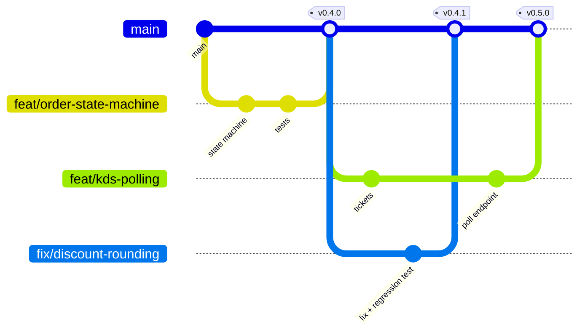
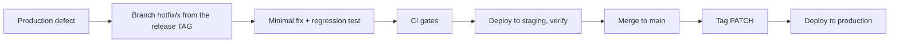

# 28 — Git Workflow

> **Document purpose.** Define how work moves from an idea to production through version control:
> branching model, commit conventions, pull request process, review standards, release tagging and
> hotfix procedure.

**Prerequisites:** [23-testing-strategy.md](23-testing-strategy.md) §10 (CI gates),
[26-deployment.md](26-deployment.md) §5 (pipeline).

**Status:** 🟡 MVP — Planned. The repository is initialised on `main`
([01](01-project-overview.md) §2), but the branching model below is not yet in use — recent history
is a flat series of direct commits to `main`.

---

## 1. Repository

### 1.1 Structure

```text
RestaurantOS/
├── backend/          Laravel 13 API
├── Frontend/         React 19 + TypeScript SPA
├── docs/             This documentation set
├── .github/
│   ├── workflows/    CI pipelines
│   └── PULL_REQUEST_TEMPLATE.md
└── package.json      Tailwind (to be moved into Frontend/ — doc 02 §5.2)
```

**Monorepo, deliberately.** Backend and frontend change together — a new endpoint and the component
that calls it belong in one pull request, reviewed and tested as one unit. Two repositories would mean
coordinating two PRs and two CI runs for one logical change.

### 1.2 What is never committed

| Never | Why |
|---|---|
| `.env` | Secrets |
| `vendor/`, `node_modules/` | Restorable from lockfiles |
| `storage/logs/*`, `storage/framework/cache/*` | Runtime state |
| `Frontend/dist/` | Build output |
| `*.sqlite`, `*.sql` dumps | May contain real data |
| Real customer or payment data | Even in fixtures |
| IDE directories | Personal preference |

**Always committed:** `composer.lock` and `package-lock.json`. Reproducible builds require them, and a
supply-chain audit is impossible without them.

---

## 2. Branching model

Trunk-based development with short-lived feature branches.



| Branch | Purpose | Lifetime |
|---|---|---|
| `main` | Always deployable. Protected. | Permanent |
| `feat/<slug>` | New capability | ≤ 3 days |
| `fix/<slug>` | Defect fix | ≤ 1 day |
| `refactor/<slug>` | No behaviour change | ≤ 2 days |
| `docs/<slug>` | Documentation only | ≤ 1 day |
| `chore/<slug>` | Dependencies, tooling | ≤ 1 day |
| `hotfix/<slug>` | Emergency production fix | Hours |
| `release/<version>` | Release stabilisation (only if needed) | ≤ 2 days |

**Why not GitFlow.** A permanent `develop` branch adds a merge step and a divergence risk for no gain
at this team size. `main` is always deployable; features are behind flags if they need to land
incomplete.

### 2.1 Branch naming

```text
feat/pos-cart-calculation
fix/discount-allocation-rounding
docs/inventory-workflow
chore/bump-phpunit
hotfix/payment-overpayment-check
```

Lower kebab-case, descriptive, no ticket number alone (`feat/RES-142` tells a reviewer nothing six
months later).

### 2.2 Branch lifetime rule

**A branch older than three days is a problem, not a feature.** Long branches diverge, conflict, and
arrive as a review nobody can hold in their head. Split the work: a state machine, then the endpoints
that use it, then the UI.

---

## 3. Commit conventions

Conventional Commits.

```text
<type>(<scope>): <subject>

<body — why, not what>

<footer — refs, breaking changes>
```

| Type | Use |
|---|---|
| `feat` | New capability |
| `fix` | Defect fix |
| `docs` | Documentation |
| `refactor` | No behaviour change |
| `test` | Tests only |
| `perf` | Performance |
| `chore` | Tooling, dependencies |
| `build` | Build system |
| `ci` | Pipeline |

Scopes mirror modules: `pos`, `orders`, `payments`, `kitchen`, `inventory`, `transfers`, `loyalty`,
`expenses`, `reports`, `auth`, `rbac`, `db`, `api`, `docs`.

### 3.1 Examples

```text
feat(inventory): deduct ingredients via recipe explosion on order acceptance

Explodes each order line through its active recipe, aggregates by ingredient,
converts to the stock unit, and writes one sale_deduction ledger row per
ingredient inside the acceptance transaction.

Aggregation happens before locking so a 200-line order takes one lock per
ingredient rather than one per line.

Refs: FR-INV-005, FR-INV-006
```

```text
fix(orders): allocate order discount so line shares sum exactly

Rounding each line's pro-rata share independently could leave the sum one
minor unit short of the order discount. The remainder is now assigned to the
largest line by subtotal, which is deterministic regardless of the order in
which the cashier added items.

Refs: BR-DISC-01
Fixes: #142
```

```text
feat(auth)!: require Idempotency-Key on financial POST endpoints

BREAKING CHANGE: POST /orders, /payments and /refunds now return 400 without
an Idempotency-Key header. Clients must generate a UUID v4 per user action.
```

### 3.2 Rules

| # | Rule |
|---|---|
| C1 | Subject in the imperative mood: "add", not "added" or "adds" |
| C2 | Subject ≤ 72 characters, no trailing full stop |
| C3 | Body explains **why**; the diff already shows what |
| C4 | One logical change per commit |
| C5 | `!` after the type, and a `BREAKING CHANGE:` footer, for breaking changes |
| C6 | Reference requirement IDs (`FR-`, `BR-`, `NFR-`) — this is the traceability link |
| C7 | Never commit commented-out code or debug statements |
| C8 | Co-authorship trailers preserved on pairing |

---

## 4. Daily workflow

```bash
git checkout main && git pull origin main
git checkout -b feat/kitchen-ticket-routing

# work, committing in logical steps
git add -p
git commit -m "feat(kitchen): route order lines to stations by category"

# stay current — rebase, do not merge main into your branch
git fetch origin && git rebase origin/main

# run the gates locally before pushing
cd backend && ./vendor/bin/pint --test && php artisan test
cd ../Frontend && npm run lint && npm run build

git push -u origin feat/kitchen-ticket-routing
gh pr create --fill
```

### 4.1 Rebase, not merge

Feature branches are kept current by **rebasing** onto `main`. Merging `main` into a feature branch
produces a history full of "Merge branch 'main' into…" commits that obscure what the branch actually
did.

**Rebase only unpushed or personal branches.** Once someone else has based work on your branch, rebasing
rewrites history under them — merge in that case.

---

## 5. Pull requests

### 5.1 Requirements

| # | Requirement |
|---|---|
| PR1 | Title follows Conventional Commits |
| PR2 | Description explains why, what changed, and how it was verified |
| PR3 | Linked to requirement IDs |
| PR4 | All CI gates green ([23](23-testing-strategy.md) §10.1) |
| PR5 | Tests included — a PR without tests is returned unreviewed |
| PR6 | Documentation updated when behaviour, schema or API changed |
| PR7 | At least one approval; two for security-sensitive paths (§6.2) |
| PR8 | No merge conflicts |
| PR9 | Under ~400 lines of diff where practical |

### 5.2 Template

```markdown
## What
One paragraph.

## Why
The problem or requirement. Link requirement IDs.

## How
Notable decisions and trade-offs. Anything a reviewer would otherwise have to reverse-engineer.

## Testing
- [ ] Unit tests
- [ ] Feature tests
- [ ] Negative cases
- [ ] Manual verification (describe)

## Checklist
- [ ] Permission declared on every new endpoint
- [ ] Branch scope enforced on every branch-owned model
- [ ] Validation for every new input
- [ ] Audit logging for every new state change
- [ ] No hard-coded financial rates
- [ ] No secrets
- [ ] Money handled in minor units, never floats
- [ ] Migrations reversible and backward-compatible
- [ ] Documentation updated

## Requirements
Refs: FR-XXX-000
```

### 5.3 Merge strategy

| Strategy | When |
|---|---|
| **Squash and merge** | Default. One clean commit on `main` per PR |
| Rebase and merge | When individual commits are independently meaningful and each passes CI |
| Merge commit | Release branches only |

Squashing is the default because a feature branch's intermediate commits ("wip", "fix test") are noise
in `main`'s history. The PR retains the detail.

---

## 6. Code review

### 6.1 What reviewers check

| Area | Questions |
|---|---|
| Correctness | Does it do what the requirement says? Are edge cases handled? |
| **Money** | Minor units? Correct rounding? Any float? |
| **Stock** | Ledger row written? Balance updated in the same transaction? Idempotent? |
| **Security** | Permission declared? Branch scope enforced? Input validated? Output escaped? |
| **Transactions** | One use case, one transaction? Anything dispatched inside it that should be after commit? |
| **Concurrency** | Locks taken in the standard order? Guarded against double submission? |
| Tests | Do they test behaviour? Are the negative cases covered? |
| Layering | Business logic in a service, not a controller? Domain classes free of I/O? |
| Performance | N+1? Missing index? Unbounded query? |
| Readability | Would a new maintainer understand this in six months? |

### 6.2 Two-reviewer paths

A second approval is required for changes touching:

- authentication or authorisation
- money calculation (`app/Domain/Pricing`)
- the stock ledger (`app/Domain/Inventory`, `StockTransactionService`)
- audit logging
- database migrations on existing tables
- deployment or CI configuration

These are the areas where a mistake is expensive and not obvious from the diff.

### 6.3 Review etiquette

| Guideline | Detail |
|---|---|
| Review within one working day | A blocked PR blocks a person |
| Comment on the code, not the coder | "This can produce a negative balance when…" |
| Distinguish blocking from optional | Prefix non-blocking suggestions with `nit:` |
| Explain the reasoning | A review that says "change this" teaches nothing |
| Approve when it is good enough | Perfect is the enemy of shipped; file a follow-up instead |
| Author responds to every comment | Fixed, or explained |

---

## 7. Branch protection on `main`

| Rule | Setting |
|---|---|
| Direct pushes | **Blocked**, including for administrators |
| Force pushes | **Blocked** |
| Deletion | Blocked |
| Required approvals | 1 (2 on the §6.2 paths) |
| Stale approvals dismissed on new commits | Yes |
| Required status checks | All CI gates |
| Branch up to date before merge | Required |
| Conversation resolution | Required |
| Signed commits | Recommended 🔵 |

---

## 8. Releases

### 8.1 Versioning

Semantic versioning: `MAJOR.MINOR.PATCH`.

| Increment | When |
|---|---|
| MAJOR | Breaking API change (a new `/api/v2`) |
| MINOR | New functionality, backward compatible |
| PATCH | Backward-compatible fixes |

Pre-1.0 (MVP development), `MINOR` may contain breaking changes; this is stated in the release notes.

### 8.2 Release procedure

```bash
git checkout main && git pull
# verify CI green, staging verified, UAT signed off

git tag -a v0.5.0 -m "Release v0.5.0 — KDS polling and station routing"
git push origin v0.5.0
# tag triggers the production deployment pipeline (manual approval gate)
```

Release notes are generated from Conventional Commit messages — which is the practical reason the
convention is enforced.

### 8.3 Hotfix



| # | Rule |
|---|---|
| H1 | Branch from the **deployed tag**, not from `main` — `main` may contain unreleased work |
| H2 | Minimal scope. Fix the defect and nothing else |
| H3 | A regression test is mandatory ([23](23-testing-strategy.md) P4) |
| H4 | CI gates still apply. "Urgent" is not a reason to skip tests |
| H5 | Must merge back into `main`, or the next release reintroduces the bug |
| H6 | Post-incident review within 48 h |

---

## 9. GitHub authentication ⚠️

**Push to this repository as the GitHub user `OdomCH`.**

A cached credential for a different account (`it03-Dom`) has previously caused `403` errors on push.
If a push fails with `403 Permission denied`:

```bash
# Confirm which identity Git is presenting
git config user.name
git config user.email
gh auth status

# Windows: clear the stale cached credential
cmdkey /list | findstr github
cmdkey /delete:LegacyGeneric:target=git:https://github.com

# Re-authenticate as the correct account
gh auth login
```

Verify `gh auth status` reports `OdomCH` before retrying. This is a workstation credential problem, not
a repository permission problem — changing repository settings will not fix it.

---

## 10. Documentation in version control

This documentation set is versioned alongside the code, deliberately.

| # | Rule |
|---|---|
| D1 | A PR that changes behaviour updates the affected document in the **same** PR |
| D2 | A PR that changes the schema updates [05](05-database-design.md) and [06](06-erd.md) |
| D3 | A PR that adds an endpoint updates [07](07-api-documentation.md) |
| D4 | A PR that changes a calculation updates [09](09-business-rules.md) **and its golden values** |
| D5 | Status markers (✅ 🟡 🔵) are updated as features are implemented |
| D6 | [INDEX.md](INDEX.md) status board is updated at each release |

**D5 is what keeps this documentation honest.** Every document currently marked 🟡 becomes ✅ only when
the code exists — and the PR that writes the code is the PR that changes the marker.

---

## 11. Common situations

| Situation | Action |
|---|---|
| Committed to `main` by mistake | `git reset --soft HEAD~1`, branch, re-commit. If already pushed, revert — never force-push `main` |
| Committed a secret | Rotate the secret **first**, then purge history with `git filter-repo`, then force-push the branch. Assume the secret is compromised |
| Branch has conflicts | `git fetch && git rebase origin/main`, resolve, `git rebase --continue` |
| Wrong commit message | `git commit --amend` before push; after push, leave it |
| Need to split a large PR | Branch from the current branch, cherry-pick, open a smaller PR first |
| CI fails only in CI | Check the MySQL-vs-SQLite difference first ([23](23-testing-strategy.md) §4) |
| Need to land incomplete work | Behind a feature flag, disabled by default, with tests for both states |

---

## 12. Testing considerations

| Area | Check |
|---|---|
| Branch protection | Direct push to `main` is rejected |
| CI gates | Every gate blocks a merge when failing |
| Commit lint | A non-conventional message is rejected |
| Secret scanning | A dummy key in a commit is caught pre-commit and in CI |
| Lockfiles | `composer.lock` and `package-lock.json` present and current |
| Documentation drift | A PR changing an endpoint without touching `docs/07` is flagged in review |
| Release notes | Generated notes match the merged commits |
| Hotfix path | Rehearsed on staging at least once |

---

## 13. Related documents

[03-requirements.md](03-requirements.md) (requirement IDs for traceability) ·
[23-testing-strategy.md](23-testing-strategy.md) §10 ·
[26-deployment.md](26-deployment.md) ·
[29-coding-standards.md](29-coding-standards.md) ·
[31-development-roadmap.md](31-development-roadmap.md)
