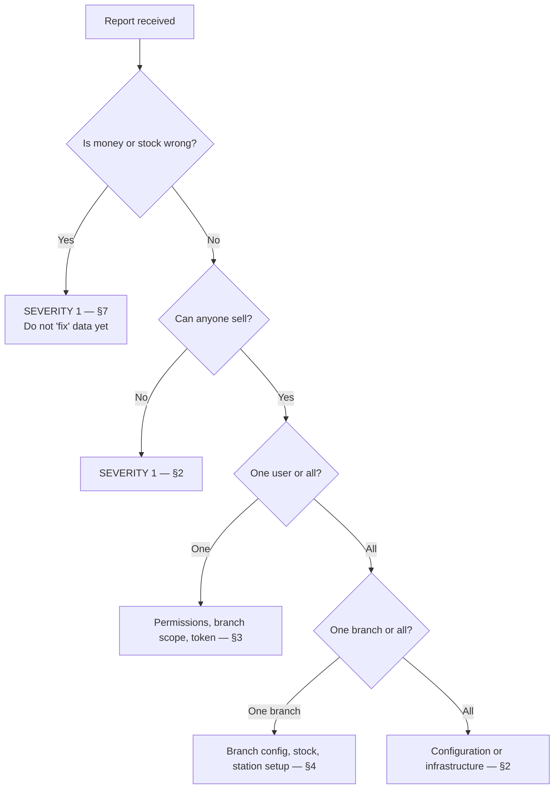
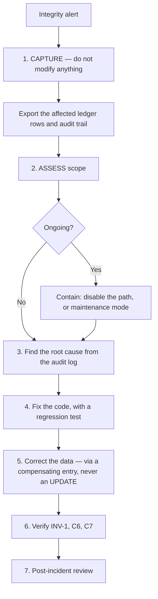

# 30 — Troubleshooting

> **Document purpose.** A diagnostic guide for developers and operators: symptoms, likely causes, and
> resolution steps, ordered by how often each problem actually occurs. Written to be usable at 22:00
> during service by someone who did not write the code.

**Prerequisites:** [21-error-handling.md](21-error-handling.md) (error codes),
[27-environment-configuration.md](27-environment-configuration.md) (configuration).

**Status:** 🟡 MVP — Planned. Symptoms are derived from the design; this document will be revised with
real incidents once the system runs.

---

## 1. First response

Before diagnosing anything, gather these four things:

| # | Item | How |
|---|---|---|
| 1 | **`request_id`** | In the error response `meta.request_id`, and on the user's screen for a `500` |
| 2 | Exact time and timezone | Branch-local **and** UTC |
| 3 | Who and where | User, role, branch, device |
| 4 | Exact `error_code` | Not the message — the code |

With a `request_id`, every log line and audit row for that request is one query away. Without it,
diagnosis is guesswork.

```bash
# Everything that happened in one request
grep '"request_id":"9f1c8a2e-..."' /var/log/restaurantos/app.log | jq .
```

```sql
SELECT * FROM audit_logs WHERE request_id = '9f1c8a2e-...' ORDER BY created_at;
```

### 1.1 Triage



> **Rule for Severity 1 data problems: do not correct the data first.** Capture the evidence — the
> ledger rows, the audit trail — before anything changes. A "helpful" manual correction destroys the
> only record of what went wrong.

---

## 2. Nobody can sell

### 2.1 Every order fails with `configuration_missing`

**Most likely cause on a fresh deployment.**

| Check | Command |
|---|---|
| Is a tax rate configured? | `SELECT * FROM tax_rates WHERE is_active = 1;` |
| Is the default set? | `SELECT * FROM settings WHERE key = 'tax.default_rate_id';` |

**Resolution:** create a `tax_rates` row and set `tax.default_rate_id`
([27](27-environment-configuration.md) §6.2, item 6).

**Why it fails rather than defaulting to zero:** a silent zero tax under-collects, and the error is
discovered by an auditor rather than by a test ([09](09-business-rules.md) §1).

### 2.2 Every order fails with `insufficient_stock`

| Check | Query |
|---|---|
| Does the branch have any stock? | `SELECT * FROM inventories WHERE branch_id = ?;` |
| Has opening stock ever been recorded? | `SELECT COUNT(*) FROM stock_transactions WHERE branch_id = ?;` |

**Most common cause:** the branch was created but opening stock was never entered
([27](27-environment-configuration.md) §6.2, item 11). Record stock-in for each ingredient.

### 2.3 Every order fails with `recipe_unavailable`

The product has `track_inventory = true`, no active recipe, and no `cost_price`.

```sql
SELECT p.id, p.name, p.track_inventory, p.cost_price, r.id AS recipe_id
FROM products p
LEFT JOIN recipes r ON r.product_id = p.id AND r.is_active = 1 AND r.deleted_at IS NULL
WHERE p.is_active = 1 AND p.track_inventory = 1 AND r.id IS NULL;
```

**Resolution:** create the recipe, or set `track_inventory = false` and a `cost_price` for items that
are bought ready to sell.

### 2.4 API returns 500 on every request

| Check | Command |
|---|---|
| Application key set? | `php artisan tinker --execute="echo config('app.key');"` |
| Database reachable? | `php artisan db:show` |
| Migrations current? | `php artisan migrate:status` |
| Health | `curl -s localhost/api/health/ready \| jq` |
| Recent errors | `tail -100 storage/logs/laravel.log` or the aggregator |

### 2.5 Application will not boot

| Symptom | Cause | Fix |
|---|---|---|
| "Refusing to boot: APP_DEBUG is true in production" | Deliberate guard | Set `APP_DEBUG=false` |
| "No application encryption key" | `APP_KEY` unset | `php artisan key:generate` |
| Driver not found | `DB_CONNECTION` still `sqlite` or the PHP extension is missing | Set `mysql`; install `pdo_mysql` |
| Class not found after deploy | Stale caches | `php artisan optimize:clear` then rebuild caches |

---

## 3. One user has a problem

### 3.1 "It says not found, but I can see it exists"

**This is usually correct behaviour, not a bug.** An out-of-scope record returns `404` by design
([21](21-error-handling.md) §5).

```sql
-- What is this user's scope?
SELECT u.id, u.branch_id AS home_branch, ru.role_id, ru.branch_id AS scoped_branch, r.name
FROM users u
LEFT JOIN role_user ru ON ru.user_id = u.id
LEFT JOIN roles r ON r.id = ru.role_id
WHERE u.id = ?;

-- Which branch does the record belong to?
SELECT id, branch_id, order_number FROM orders WHERE id = ?;
```

The log line confirms it:

```text
"message":"branch_scope_violation","user_id":7,"branch_scope":[1],"requested_branch":2
```

**Resolution:** assign the user a role scoped to that branch, or direct them to the correct branch.

### 3.2 "I get 403 but I should have permission"

```sql
SELECT DISTINCT p.name
FROM users u
JOIN role_user ru ON ru.user_id = u.id
JOIN role_permission rp ON rp.role_id = ru.role_id
JOIN permissions p ON p.id = rp.permission_id
WHERE u.id = ? ORDER BY p.name;
```

| Cause | Check |
|---|---|
| Permission genuinely not granted | The query above |
| Stale permission cache | `php artisan cache:forget "perms:user:{id}:*"` or bump the version counter |
| **Token ability ceiling** | A PIN token has `pos:*` only — `403 insufficient_token_ability` even for a Super Admin ([08](08-authentication-authorization.md) §8) |
| Threshold, not permission | `discount_limit_exceeded` is a threshold; the permission is present |
| Record-level policy | Cashier cancelling a **paid** order is blocked regardless of `orders.cancel` |

**Read the `error_code`.** `forbidden`, `insufficient_token_ability`, `discount_limit_exceeded` and
`self_approval_forbidden` have four different causes and four different fixes.

### 3.3 User is locked out

```sql
SELECT id, email, is_active, failed_login_attempts, locked_until FROM users WHERE email = ?;
```

| State | Fix |
|---|---|
| `locked_until` in the future | Wait, or a user with `users.reset_password` unlocks |
| `is_active = false` | Reactivate (`users.activate`) |
| `deleted_at` not null | The account was deleted; create a new one |
| Correct password rejected with `429` | Rate limit — wait for `Retry-After` |

### 3.4 Session keeps expiring

| Client | Idle timeout |
|---|---|
| POS | 30 min |
| KDS | **None** |
| Back office | 60 min |

If a POS terminal logs out during service, the terminal was idle — or the token was issued with the
wrong `device_name`, so it received the wrong idle policy. Check `personal_access_tokens.name`.

---

## 4. One branch has a problem

| Symptom | Check | Fix |
|---|---|---|
| Cannot create orders, `branch_inactive` | `SELECT is_active FROM branches WHERE id = ?` | Reactivate |
| Products missing from POS | `branch_product.is_available`, `products.is_active`, `is_available` | Enable |
| Wrong prices | `branch_product.price_override` | Correct or remove the override |
| No kitchen tickets | `SELECT * FROM kitchen_stations WHERE branch_id = ?` | Without stations a default ticket should still appear — if none does, check that acceptance succeeded |
| Reports show the wrong day | `branches.timezone`, `business_day_start` | Correct them — note historical `business_date` values do not change |
| Wrong currency on receipts | `branches.currency_code` | **Immutable once orders exist** — this needs a data migration, not an edit |

---

## 5. Inventory problems

### 5.1 Stock balance looks wrong

**Do not correct it yet.** Diagnose first.

```sql
-- What the ledger says
SELECT SUM(quantity_change) AS ledger_sum
FROM stock_transactions WHERE branch_id = ? AND ingredient_id = ?;

-- What the balance says
SELECT quantity_on_hand FROM inventories WHERE branch_id = ? AND ingredient_id = ?;
```

| Result | Meaning | Action |
|---|---|---|
| **Equal** | INV-1 holds. The ledger is right; the expectation is wrong | Review the movements below |
| **Different** | **Data integrity failure** | Severity 1 — §7 |

If they match, the balance is explicable — find the movement that surprises:

```sql
SELECT occurred_at, type, quantity_change, balance_after, reason, reference_type, reference_id, performed_by
FROM stock_transactions
WHERE branch_id = ? AND ingredient_id = ?
ORDER BY occurred_at DESC LIMIT 50;
```

Common findings: an adjustment nobody remembers, wastage recorded twice, or a transfer dispatched but
never received.

### 5.2 Stock not deducted after a sale

```sql
SELECT id, status, inventory_deducted_at FROM orders WHERE id = ?;
```

| `inventory_deducted_at` | Meaning |
|---|---|
| `NULL`, status `pending` | **Correct** — deduction happens at Accepted ([01](01-project-overview.md) A4) |
| `NULL`, status `accepted` | **Bug.** Acceptance did not run the explosion — investigate |
| Set | Deduction ran; check the ledger by reference |

```sql
SELECT * FROM stock_transactions WHERE reference_type = 'App\\Models\\Order' AND reference_id = ?;
```

If there are no rows and the product is recipe-backed, check `products.track_inventory` and whether an
active recipe exists.

### 5.3 Deducted the wrong quantity

Work through the calculation in [14](14-inventory-workflow.md) §4:

```text
recipe_item.quantity × order_item.quantity ÷ recipe.yield_quantity
  × (1 + wastage_percent / 100)
  × unit conversion to the stock unit
```

| Common cause | Symptom |
|---|---|
| Wrong `yield_quantity` | Consumption off by a whole factor (10×, 4×) |
| Unit confusion (g vs kg) | Off by 1000× |
| Wastage applied unexpectedly | Slightly higher than the recipe states |
| A variant-specific recipe in effect | Different from the generic recipe |

A 1000× discrepancy is always a unit problem.

### 5.4 Low-stock alerts not arriving

| Check | Query |
|---|---|
| Is the condition true? | `quantity_on_hand <= reorder_level` |
| Cool-down active? | `SELECT low_stock_notified_at FROM inventories WHERE ...` |
| Recipients exist? | Any user with `inventory.view` at that branch |
| Queue running? | `php artisan queue:monitor` / check `failed_jobs` |

Most often it is the cool-down working as designed — one notification per 6 h per ingredient
([19](19-notifications.md) §4).

---

## 6. Payment and order problems

| Symptom | `error_code` | Cause | Fix |
|---|---|---|---|
| Cannot complete an order | `order_not_settled` | Balance outstanding | Take payment |
| Payment rejected | `overpayment` | `amount` > balance. Cashier entered the **tendered** amount as `amount` | `amount` = balance; put 20.00 in `tendered_amount` |
| Cash payment rejected | `shift_not_open` | `payments.require_shift` on, no session | Open a drawer session |
| Cannot void | `void_window_expired` | Past the window | Refund instead |
| Cannot refund | `refund_window_expired` | Past `refund.max_days_after_completion` | Admin override |
| Duplicate order created | — | Retry with a **new** idempotency key | Void one; check the client's key generation |
| Order stuck in `preparing` | — | Kitchen never bumped the ticket | Bump from the KDS or the back office |
| Drawer never balances | — | Change being double-counted | Verify against [12](12-payment-workflow.md) §8.2 |

### 6.1 The overpayment confusion

By far the most common cashier-reported "bug":

```text
Balance 14.44, customer hands over 20.00

WRONG:   { "amount": "20.00" }                              -> 422 overpayment
RIGHT:   { "amount": "14.44", "tendered_amount": "20.00" }  -> 201, change 5.56
```

`amount` is what is applied to the order; `tendered_amount` is what was handed over. If cashiers hit
this repeatedly, the UI is at fault, not the API.

---

## 7. Severity 1 — data integrity

**Symptoms:** reconciliation drift alert, negative stock, `paid_total` mismatch, ledger sum ≠ balance.



| Step | Detail |
|---|---|
| **Capture** | `SELECT` the ledger rows, audit rows and order into a file **before** anything changes. This is the evidence |
| **Assess** | One ingredient or many? One branch or all? Since when? |
| **Contain** | If it is ongoing, stop the bleeding before fixing |
| **Root cause** | The audit log holds who did what, in order, with a `request_id` linking to the application logs |
| **Correct** | A compensating ledger entry with a clear reason. **Never** `UPDATE stock_transactions` — it is append-only for exactly this reason |
| **Verify** | Re-run the reconciliation |

### 7.1 Rebuilding a corrupted balance

Because the ledger is the source of truth, a derived balance is always recoverable:

```sql
-- Diagnose
SELECT i.branch_id, i.ingredient_id, i.quantity_on_hand,
       COALESCE(SUM(st.quantity_change), 0) AS ledger_sum,
       i.quantity_on_hand - COALESCE(SUM(st.quantity_change), 0) AS drift
FROM inventories i
LEFT JOIN stock_transactions st
       ON st.branch_id = i.branch_id AND st.ingredient_id = i.ingredient_id
GROUP BY i.branch_id, i.ingredient_id, i.quantity_on_hand
HAVING drift <> 0;
```

```bash
# Rebuild after the root cause is fixed
php artisan inventory:rebuild-balances --branch=1 --dry-run
php artisan inventory:rebuild-balances --branch=1
```

The same applies to loyalty balances from `loyalty_transactions`.

---

## 8. Performance problems

| Symptom | First check | Likely cause |
|---|---|---|
| POS slow to load products | Cache hit ratio | Cache not warm, or invalidated too aggressively |
| Order creation slow | Transaction duration, lock waits | Inventory contention at peak ([25](25-performance-testing.md) §6) |
| KDS laggy | Poll response time, payload size | `since` not being sent; missing index |
| Reports time out | `EXPLAIN` on the query | Range too large, or a missing index |
| Everything slow | DB CPU, connections, slow query log | Saturation, or a missing index after a migration |

```sql
-- Slowest recent queries
SELECT DIGEST_TEXT, COUNT_STAR, AVG_TIMER_WAIT/1e9 AS avg_ms, SUM_ROWS_EXAMINED/COUNT_STAR AS avg_rows
FROM performance_schema.events_statements_summary_by_digest
ORDER BY AVG_TIMER_WAIT DESC LIMIT 10;

-- Lock waits
SELECT * FROM performance_schema.data_lock_waits;
```

**Rows examined per row returned** is the most useful single metric. A ratio above ~100 means a missing
or unused index.

---

## 9. Development environment problems

| Symptom | Cause | Fix |
|---|---|---|
| Tests pass locally, fail in CI | **SQLite locally, MySQL in CI** | Run tests against MySQL locally ([23](23-testing-strategy.md) §4) |
| Concurrency tests always pass | `SELECT ... FOR UPDATE` is a no-op on SQLite | Same |
| `CHECK` constraint tests pass wrongly | SQLite ignores them | Same |
| Config change has no effect | Config cached | `php artisan config:clear` |
| Route 404 after adding it | Route cached | `php artisan route:clear` |
| `env()` returns null | Called outside `config/` | Move it into a config file ([27](27-environment-configuration.md) §3) |
| Frontend has no styling | Tailwind is in the **root** `package.json`, not `Frontend/` | Move it ([02](02-system-architecture.md) §5.2) |
| CORS errors in dev | No Vite proxy configured | Add an `/api` proxy to `Frontend/vite.config.ts` |
| Class not found after adding a file | Autoload stale | `composer dump-autoload` |
| Migration fails on rollback | Irreversible `down()` | Fix it, or document why ([05](05-database-design.md) §10.2) |

### 9.1 Git push returns 403

A cached credential for a different GitHub account causes this. Push as **`OdomCH`**:

```bash
gh auth status
cmdkey /list | findstr github
cmdkey /delete:LegacyGeneric:target=git:https://github.com
gh auth login
```

This is a workstation credential problem, not a repository permission problem
([28](28-git-workflow.md) §9).

---

## 10. Diagnostic commands

```bash
# State
php artisan about
php artisan migrate:status
php artisan queue:monitor
php artisan schedule:list
curl -s localhost/api/health/detailed | jq

# Caches
php artisan optimize:clear        # clear all
php artisan config:cache          # rebuild for production

# Queues
php artisan queue:failed
php artisan queue:retry all

# Integrity (read-only)
php artisan inventory:verify-balances
php artisan loyalty:verify-balances
php artisan orders:verify-totals

# Inspect a request end to end
grep '"request_id":"<id>"' app.log | jq .
```

```sql
-- Order with everything attached
SELECT o.*, u.name AS cashier, b.code AS branch
FROM orders o JOIN users u ON u.id = o.user_id JOIN branches b ON b.id = o.branch_id
WHERE o.order_number = ?;

-- Its full audit trail
SELECT created_at, event, user_id, description
FROM audit_logs
WHERE auditable_type = 'App\\Models\\Order' AND auditable_id = ?
ORDER BY created_at;

-- Payment reconciliation for an order
SELECT o.grand_total, o.paid_total,
       (SELECT COALESCE(SUM(amount),0) FROM payments WHERE order_id = o.id AND status = 'captured') AS actual
FROM orders o WHERE o.id = ?;
```

---

## 11. Escalation

| Severity | Definition | Response | Escalate to |
|---|---|---|---|
| **S1** | Money or stock wrong; cannot sell; security breach | Immediate | Tech lead + operations manager |
| **S2** | Major function broken, workaround exists | Same day | Tech lead |
| **S3** | Minor, low impact | Next sprint | Backlog |
| **S4** | Cosmetic | Backlog | — |

An escalation must include: `request_id`, timestamps (branch-local and UTC), user and branch,
`error_code`, steps to reproduce, and **what has already been changed** — the last one matters most,
because a well-meaning manual correction changes the diagnosis entirely.

---

## 12. Related documents

[21-error-handling.md](21-error-handling.md) ·
[14-inventory-workflow.md](14-inventory-workflow.md) ·
[12-payment-workflow.md](12-payment-workflow.md) ·
[26-deployment.md](26-deployment.md) ·
[27-environment-configuration.md](27-environment-configuration.md) ·
[28-git-workflow.md](28-git-workflow.md) §9
