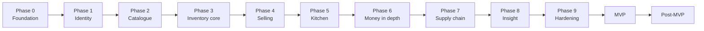

# 31 — Development Roadmap

> **Document purpose.** Sequence the work: what gets built, in what order, why that order, and what is
> deliberately deferred. Phases are ordered by **dependency and risk**, not by visible feature value —
> the foundations that are expensive to change late come first.

**Prerequisites:** [01-project-overview.md](01-project-overview.md) §2 (current state),
[03-requirements.md](03-requirements.md) (requirement IDs).

**Status:** 🟡 Planning. No phase has started.

---

## 1. Starting position

Verified 2026-09-08 ([01](01-project-overview.md) §2):

| Component | State |
|---|---|
| `backend/` | Laravel 13 skeleton, 3 default migrations, `User` model only, no `routes/api.php` |
| Sanctum | **Not installed** |
| Database | `.env.example` targets SQLite; MySQL not configured |
| `Frontend/` | Vite + React 19 scaffold, default `App.tsx` |
| Tailwind | Declared at repository root, **not** wired into `Frontend/` |
| Git | Initialised on `main`; branching model not yet in use |
| Tests | Two framework examples |
| Documentation | This set — complete design, zero implementation |

**Everything below is greenfield.** There is no legacy to migrate and no code to refactor, which is the
one significant advantage of the current position.

---

## 2. Sequencing principle

| # | Ordering rule | Consequence |
|---|---|---|
| R1 | **The money and stock engine before the UI that uses it** | `OrderCalculator` and `RecipeExploder` are pure and testable; building the POS first would mean building it twice |
| R2 | **Authorisation before any feature** | Retrofitting branch scope onto twenty endpoints is far more expensive than starting with it |
| R3 | **The schema early, but not all at once** | Per-phase migrations, each backward compatible |
| R4 | **Inventory before selling** | A sale deducts stock; there must be stock to deduct |
| R5 | **Reporting last** | Reports read everything else; building them early means rebuilding them |
| R6 | **Hardening is a phase, not an afterthought** | Performance and security work needs its own budget |

**The critical path is Phase 3 → 4.** Recipe explosion is the highest-risk piece of logic in the
system: it is where correctness, concurrency and performance intersect.

---

## 3. Phase 0 — Foundation

**Goal:** a repository a team can work in.

| # | Task | Notes |
|---|---|---|
| 0.1 | Switch to MySQL 8 | `.env.example`, `docker-compose.yml`, `utf8mb4`, strict mode |
| 0.2 | Move Tailwind into `Frontend/` | From the root `package.json`; register the Vite plugin |
| 0.3 | Vite dev proxy for `/api` | Removes CORS friction in development |
| 0.4 | Adopt the branching model | Branch protection, PR template, CI required checks ([28](28-git-workflow.md)) |
| 0.5 | CI pipeline | Pint, oxlint, PHPStan, PHPUnit, Vitest, build |
| 0.6 | `config/restaurantos.php` | Single application config file |
| 0.7 | `Money` value object + `MoneyCast` | **Before any money code exists anywhere** |
| 0.8 | API envelope, exception handler, `error_code` catalogue | [21](21-error-handling.md) |
| 0.9 | Request ID middleware, structured JSON logging | |
| 0.10 | Custom lint rules L1–L3 | No hard-coded rates, no `env()` outside config, no float money |
| 0.11 | Frontend shell: router, query client, HTTP client, error interceptor | |

**Exit criteria:** CI green on an empty feature set; `Money` has 100 % coverage; a deliberate `0.07`
literal in `app/Domain` fails the build.

> **0.7 and 0.10 are deliberately first.** Once fifty files handle money, retrofitting a value object
> is a rewrite. Once a rate literal exists, the lint rule that would have caught it can no longer be
> switched on.

---

## 4. Phase 1 — Identity and access

**Goal:** authentication and authorisation working end to end, before any business feature exists.

| # | Task | Requirements |
|---|---|---|
| 1.1 | Install and configure Sanctum | CON-010 |
| 1.2 | Migrations: `branches`, extended `users`, `roles`, `permissions`, pivots | FR-BRN, FR-RBAC |
| 1.3 | Permission catalogue + role seeders | FR-RBAC-001/002 |
| 1.4 | Login, logout, `/auth/me`, token lifecycle | FR-AUTH-001..004, 009 |
| 1.5 | Lockout, rate limiting, enumeration resistance | FR-AUTH-002 |
| 1.6 | PIN login with ability capping | FR-AUTH-011 |
| 1.7 | `ResolveBranchScope` middleware + global scope | FR-RBAC-005 |
| 1.8 | Policies, escalation guards G1–G5 | FR-RBAC-008/011 |
| 1.9 | Audit log infrastructure | FR-AUD-001..006 |
| 1.10 | **Route coverage test** | FR-RBAC-004 |
| 1.11 | Branch and user CRUD | FR-BRN-001..005 |
| 1.12 | Frontend: login, permission guards, branch selector | |
| 1.13 | **ERD drift check in CI** | [06](06-erd.md) §13 |

**Exit criteria:** all of [24](24-qa-test-plan.md) §5 and §6 passing; cross-branch access returns
`404` on every existing endpoint; every audited event writes exactly one row.

---

## 5. Phase 2 — Catalogue

**Goal:** a menu exists.

| # | Task | Requirements |
|---|---|---|
| 2.1 | Migrations: `categories`, `products`, `product_variants`, `branch_product`, `tax_rates` | FR-CAT |
| 2.2 | Category CRUD with depth guard | FR-CAT-001/002 |
| 2.3 | Product CRUD, image upload with content sniffing | FR-CAT-003 |
| 2.4 | Variants | FR-CAT-004 |
| 2.5 | Branch price override and availability | FR-CAT-005/008 |
| 2.6 | Tax rate management | FR-CAT-010 |
| 2.7 | **Price resolution** (`branch_product` → base → variant delta) | BR-PRICE-01 |
| 2.8 | Cost-field omission for unprivileged roles | G11 |
| 2.9 | `settings` table and resolution order | FR-BRN-005 |
| 2.10 | Frontend: catalogue admin | |

**Exit criteria:** price resolution unit-tested across every combination; a Cashier token receives no
`cost_price` field anywhere.

---

## 6. Phase 3 — Inventory core 🔴 highest risk

**Goal:** the recipe engine, tested to exhaustion, before anything depends on it.

| # | Task | Requirements |
|---|---|---|
| 3.1 | Migrations: `units`, `ingredients`, `recipes`, `recipe_items`, `inventories`, `stock_transactions` | FR-INV |
| 3.2 | `UnitConverter` with family enforcement | FR-INV-002/003 |
| 3.3 | Ingredient CRUD; immutable unit after movements | FR-INV-001 |
| 3.4 | Recipe CRUD with versioning | FR-INV-004 |
| 3.5 | **`RecipeExploder`** — quantity, yield, wastage, conversion, aggregation | FR-INV-005 |
| 3.6 | `StockTransactionService` — append-only ledger | FR-INV-006 |
| 3.7 | Ledger immutability at all three layers | INV-2 |
| 3.8 | `AverageCostCalculator` | FR-INV-011 |
| 3.9 | Stock in / out / wastage / adjustment / count | FR-INV-007/008/013 |
| 3.10 | Low-stock detection with cool-down | FR-INV-010 |
| 3.11 | Balance rebuild command | FR-INV-015 |
| 3.12 | Reconciliation jobs (INV-1) | C8 |
| 3.13 | Frontend: inventory admin | |

**Exit criteria:** [24](24-qa-test-plan.md) §8 passing in full; INV-1 holds after 1 000 randomised
movements; `UPDATE`/`DELETE` on the ledger fail; the Cappuccino × 2 golden case produces exactly
`−0.4000 l` and `−0.0400 kg`.

> **Do not start Phase 4 until INV-1 is proven.** Every subsequent phase writes to this ledger. A
> defect here corrupts data that later phases will build on.

---

## 7. Phase 4 — Selling

**Goal:** a cashier can complete a sale.

| # | Task | Requirements |
|---|---|---|
| 4.1 | Migrations: `orders`, `order_items`, `order_status_histories`, `daily_sequences` | FR-ORD |
| 4.2 | `OrderCalculator`, `DiscountAllocator`, `TaxCalculator` | [09](09-business-rules.md) §4–§6 |
| 4.3 | **Golden-value test fixture** | [23](23-testing-strategy.md) §5.2 |
| 4.4 | `OrderNumberGenerator` via `daily_sequences` | FR-ORD-002 |
| 4.5 | `POST /pos/cart/calculate` | FR-POS-006 |
| 4.6 | `POST /orders` with idempotency and stock check | FR-ORD-001, FR-POS-009 |
| 4.7 | `OrderStateMachine` + all transitions | FR-ORD-001 |
| 4.8 | **Accept → recipe explosion** in one transaction | FR-INV-005 |
| 4.9 | Cancel with ledger-based reversal | FR-ORD-005 |
| 4.10 | Discount thresholds and manager authorisation | FR-POS-005 |
| 4.11 | Simple payment (single tender) | FR-PAY-001 |
| 4.12 | Receipt payload and printing | FR-POS-011 |
| 4.13 | Frontend: POS terminal | FR-POS-001..011 |

**Exit criteria:** a full cash sale end to end; golden totals exact to the minor unit; concurrency test
TC-CONC-001 passing (ten terminals, one portion, one winner).

---

## 8. Phase 5 — Kitchen

| # | Task | Requirements |
|---|---|---|
| 5.1 | Migrations: `kitchen_stations`, `kitchen_tickets`, `kitchen_ticket_items` | FR-KDS |
| 5.2 | Ticket generation and station routing at acceptance | FR-KDS-001/004 |
| 5.3 | Ticket transitions with optimistic locking | FR-KDS-002 |
| 5.4 | **Status aggregation** ticket → order | FR-KDS-003 |
| 5.5 | Poll endpoint with `since` delta and covering index | NFR-PERF-004 |
| 5.6 | Reduced KDS projection — no money, no PII | G13 |
| 5.7 | SLA and late flagging | FR-KDS-005 |
| 5.8 | Frontend: KDS screen, touch-first | FR-KDS-006 |

**Exit criteria:** order Ready only when every ticket is; poll p95 < 250 ms with 60 pollers; automated
scan confirms no money or contact field in the KDS payload.

---

## 9. Phase 6 — Money in depth

| # | Task | Requirements |
|---|---|---|
| 6.1 | Migrations: `payments`, `refunds`, `cash_drawer_sessions` | FR-PAY |
| 6.2 | Split payment, all four methods | FR-PAY-001/002 |
| 6.3 | Overpayment guard under lock | FR-PAY-003 |
| 6.4 | Change calculation | FR-PAY-004 |
| 6.5 | PAN guard in validation and logging | [22](22-security.md) §10 |
| 6.6 | Void and refund with windows | FR-PAY-007/008 |
| 6.7 | Cash drawer sessions and reconciliation | FR-PAY-010 |
| 6.8 | Migrations: `customers`, `loyalty_*` | FR-CUS |
| 6.9 | Customer CRUD and POS lookup | FR-CUS-001/002 |
| 6.10 | Loyalty earn, redeem, reverse | FR-CUS-003..006 |
| 6.11 | Tiers | FR-CUS-007 |
| 6.12 | Export and anonymisation | FR-CUS-009 |
| 6.13 | Service charge and cash rounding | [09](09-business-rules.md) §7–§8 |
| 6.14 | Frontend: payment dialog, customer panel, shift screens | |

**Exit criteria:** [24](24-qa-test-plan.md) §7.2 and §7.4 passing; C6 and C7 hold under a randomised
sequence of payments, voids and refunds.

---

## 10. Phase 7 — Supply chain and finance

| # | Task | Requirements |
|---|---|---|
| 7.1 | Migrations: `stock_transfers`, `stock_transfer_items` | FR-TRF |
| 7.2 | Transfer lifecycle with source-branch approval | FR-TRF-002/003 |
| 7.3 | Dispatch and receipt with in-transit tracking | FR-TRF-004/006 |
| 7.4 | Variance handling and cost transfer | FR-TRF-005/007 |
| 7.5 | Dual-branch visibility rule | [04](04-user-roles-permissions.md) §5.2 |
| 7.6 | Migrations: `expense_categories`, `expenses` | FR-EXP |
| 7.7 | Expense lifecycle and approval chain | FR-EXP-002/003 |
| 7.8 | **Self-approval guard G8** | FR-EXP-004 |
| 7.9 | Receipt upload | FR-EXP-005 |
| 7.10 | Notification system with dedupe | FR-NTF |
| 7.11 | Frontend: transfers, expenses, notification centre | |

**Exit criteria:** [24](24-qa-test-plan.md) §8.4 and §4.5 passing; self-approval denied and audited;
both branch ledgers reconcile after a transfer with variance.

---

## 11. Phase 8 — Insight

| # | Task | Requirements |
|---|---|---|
| 8.1 | `BusinessDay` service | BR-RPT-01 |
| 8.2 | Daily sales report with both reconciliation checks | FR-RPT-001 |
| 8.3 | Product performance with permission-gated cost columns | FR-RPT-002 |
| 8.4 | **Profit report** | FR-RPT-005 |
| 8.5 | Inventory valuation and stock movement | FR-RPT-003/004 |
| 8.6 | Expense and staff reports | FR-RPT-006 |
| 8.7 | Kitchen performance | — |
| 8.8 | CSV export, asynchronous | FR-RPT-007 |
| 8.9 | Report caching and invalidation | [18](18-reporting.md) §8 |
| 8.10 | Frontend: dashboards | |

**Exit criteria:** every report reconciles to its ledger; tax excluded from revenue; monthly report
< 3 s at full data volume.

---

## 12. Phase 9 — Hardening

**Not optional, and not compressible.**

| # | Task |
|---|---|
| 9.1 | Full load-test suite ([25](25-performance-testing.md)) |
| 9.2 | Index tuning from measured `EXPLAIN` output |
| 9.3 | Security review against the [22](22-security.md) §14 checklist |
| 9.4 | Penetration test on staging |
| 9.5 | 8-hour soak with a final INV-1 check |
| 9.6 | Backup and restore drill, timed against RTO |
| 9.7 | Rollback rehearsal |
| 9.8 | Accessibility audit |
| 9.9 | Documentation status markers 🟡 → ✅ |
| 9.10 | Operational runbooks from [30](30-troubleshooting.md) |
| 9.11 | UAT with real staff at a pilot branch |
| 9.12 | Production provisioning and first-deployment checklist |

**Exit criteria:** all [03](03-requirements.md) `M`-priority requirements met; zero open S1/S2 defects;
performance targets met; security checklist complete; a restore actually performed.

---

## 13. Post-MVP 🔵

Ordered by expected value.

| Priority | Item | Rationale |
|---|---|---|
| 1 | WebSocket KDS | Removes 36 % of all requests and improves kitchen latency |
| 2 | Read replica for reports | Isolates heavy queries from the sell path |
| 3 | Recurring expenses | Rent and utilities are re-keyed monthly today |
| 4 | Purchase orders and suppliers | Closes the loop from ordering to stock-in |
| 5 | Table and floor management | The largest gap for full-service restaurants |
| 6 | Usage variance report | Theoretical vs actual consumption — the strongest theft signal |
| 7 | Loyalty point expiry | Designed; deferred for MVP simplicity |
| 8 | Two-factor authentication | Admin and Super Admin |
| 9 | Modifier groups | Variants cover most cases today |
| 10 | Batch and expiry tracking | Food-safety traceability |
| 11 | Customer merge | Duplicates accumulate |
| 12 | Credit notes for expenses | Corrections are awkward today ([17](17-expense-management.md) E10) |
| 13 | Scheduled report email | Convenience |
| 14 | Impersonation | Support tooling |
| 15 | Payment gateway integration | **Changes the PCI position — needs its own assessment** |
| 16 | Offline POS | Major architectural change ([01](01-project-overview.md) A6) |
| 17 | Multi-currency | Touches every money column |
| 18 | Multi-tenant / franchise | Touches every table |

**Items 15–18 are not features; they are new projects.** Each invalidates one of the core assumptions
in [01](01-project-overview.md) §9 and requires the affected documents to be rewritten before work
starts.

---

## 14. Risk register

| # | Risk | Likelihood | Impact | Mitigation |
|---|---|---|---|---|
| R1 | Recipe explosion incorrect | Medium | **Critical** | Phase 3 gated on exhaustive tests before anything depends on it |
| R2 | Rounding discrepancies in money | Medium | **Critical** | `Money` object first; golden values; property tests |
| R3 | Inventory contention at peak | **High** | High | Lock ordering, aggregation before locking, dedicated high-contention load test |
| R4 | Branch isolation hole | Medium | **Critical** | Three-layer scoping; per-endpoint tests from Phase 1 |
| R5 | Unconfirmed assumptions (§15) invalidate design | **High** | Medium–High | Each is flagged ⚠️; resolve before the dependent phase |
| R6 | SQLite-vs-MySQL test divergence | **High** | High | MySQL mandated for tests from Phase 0 |
| R7 | Scope creep from stakeholders | High | Medium | [03](03-requirements.md) §4.2 out-of-scope list is explicit |
| R8 | Documentation drifts from code | **High** | Medium | Same-PR rule ([28](28-git-workflow.md) §10); ERD drift check in CI |
| R9 | Performance discovered late | Medium | High | Query-count assertions from Phase 0; load tests from Phase 4 |
| R10 | Insider fraud not detectable | Low | High | Audit and attribution built in Phase 1, not bolted on |

---

## 15. Open decisions ⚠️

Each blocks the phase named. These are the questions from [03](03-requirements.md) §5, with the phase
that needs them.

| # | Question | Blocks | Interim assumption |
|---|---|---|---|
| Q1 | Tax jurisdiction; inclusive or exclusive pricing | **Phase 2** | Both supported; no default rate shipped |
| Q2 | Service charge, and is it taxable | Phase 6 | Supported, disabled |
| Q3 | Cash rounding rule | Phase 6 | Configurable, off |
| Q4 | Discount authority thresholds | **Phase 4** | Cashier 10 %, Manager 50 % |
| Q5 | Loyalty earn and redemption rates | Phase 6 | Configurable, no default |
| Q6 | Deduct at Accepted or Completed | **Phase 3** | Accepted |
| Q7 | Fiscal receipt numbering required | Phase 4 | Not required |
| Q8 | Driver assignment for delivery | Phase 4 | Order type only |
| Q9 | Is negative stock ever permitted | **Phase 3** | No, configurable |
| Q10 | Expense approval threshold | Phase 7 | Configurable, no default |

**Q1, Q4, Q6 and Q9 are the urgent ones** — they gate Phases 2, 3 and 4, which are the critical path.

---

## 16. Definition of done — MVP

The MVP ships when a manager can, without leaving the application
([01](01-project-overview.md) §11):

1. Sell a recipe-backed product and see the correct ingredients deducted at the correct branch
2. Settle an order with two payment methods and reach a zero balance
3. Watch that order traverse Pending → Accepted → Preparing → Ready → Completed on the KDS
4. Transfer stock between two branches with approval and receipt, both ledgers moving
5. Record and approve an expense — and be refused when approving their own
6. Produce daily sales and profit reports that reconcile to the ledgers
7. Show, for any of the above, who did it and when
8. Be denied every one of these when their role lacks the permission

Plus:

- All `M`-priority requirements met
- Zero open S1/S2 defects
- Performance targets met at full data volume
- Security checklist complete
- Backup restore verified
- Documentation status markers updated to ✅

---

## 17. Related documents

[01-project-overview.md](01-project-overview.md) §2, §9, §11 ·
[03-requirements.md](03-requirements.md) ·
[23-testing-strategy.md](23-testing-strategy.md) ·
[25-performance-testing.md](25-performance-testing.md) ·
[26-deployment.md](26-deployment.md) ·
[28-git-workflow.md](28-git-workflow.md) ·
[INDEX.md](INDEX.md)
